# 华为云PaaS微服务治理技术：P92：16.学成在线项目接入CSE-搜索服务接入CSE问题处理和总结 🔍

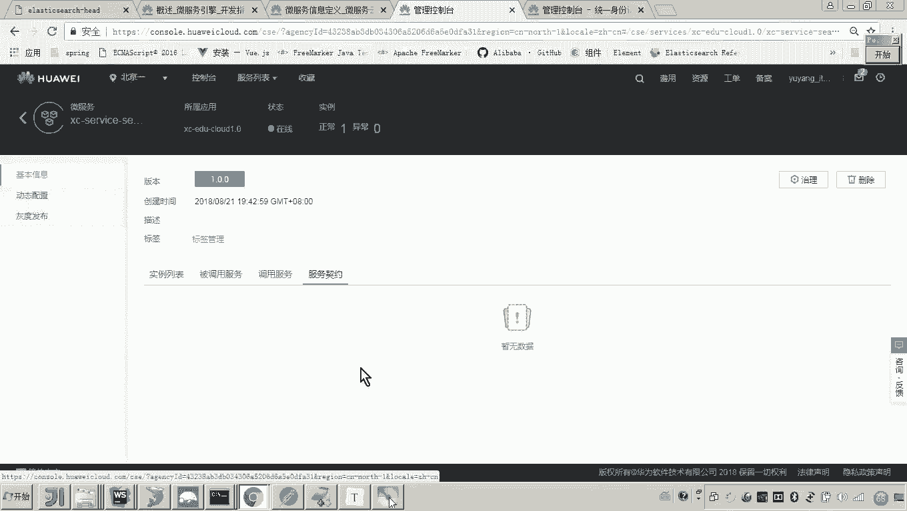

在本节课中，我们将学习如何解决学成在线项目搜索服务接入华为云CSE（微服务引擎）后遇到的服务契约缺失问题，并完成整个接入流程的验证与总结。

上一节我们完成了搜索服务接入CSE的基本配置，但在服务注册后，我们发现服务契约（即接口文档）并未在CSE控制台显示。本节中我们来看看如何排查并解决这个问题。

## 问题排查：服务契约为何缺失？ 🤔

服务契约缺失，通常意味着接口定义或相关注解存在问题。由于本项目采用ServiceComb框架进行开发，因此我们需要检查Controller层的接口定义。

以下是排查步骤：

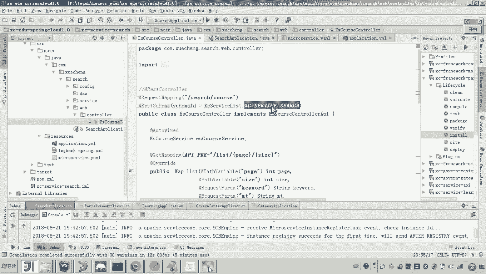

1.  **定位接口定义**：首先，找到搜索服务的Controller类，检查其上的注解。
2.  **检查ServiceComb注解**：ServiceComb框架要求使用其特定的注解来定义REST接口。关键注解包括：
    *   类级别：`@RequestMapping`
    *   方法级别：`@RestSchema(schemaId = “接口标识”)`

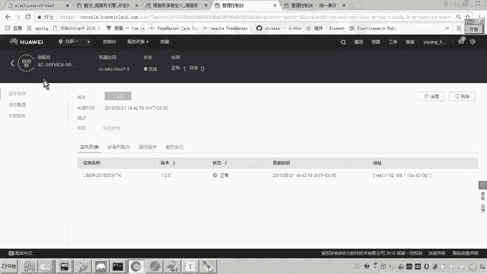

## 问题解决：添加缺失的注解 🔧

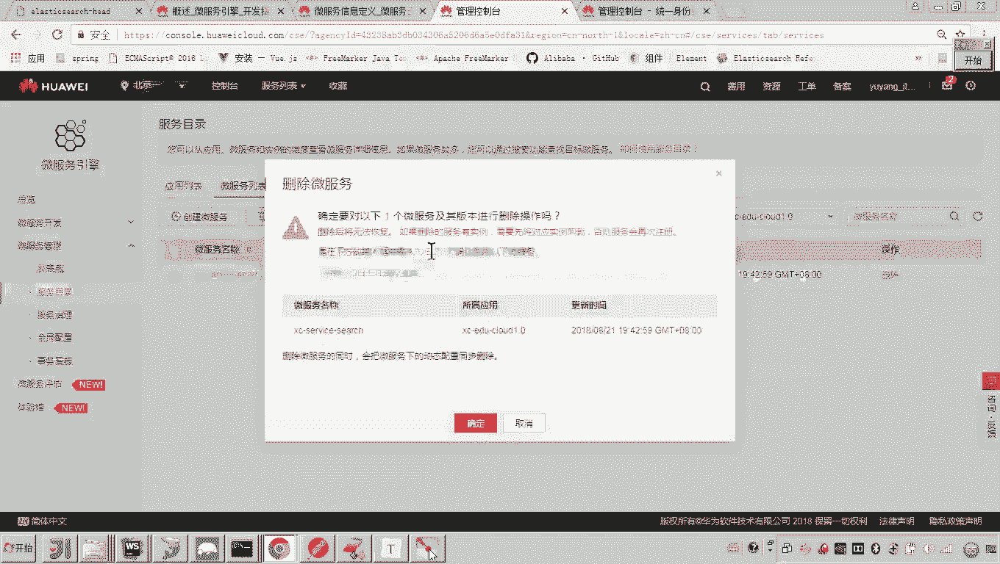

在检查Controller后，我们发现虽然存在Spring MVC的`@RequestMapping`等注解，但缺少了ServiceComb的核心注解`@RestSchema`。

我们需要进行以下修改：

1.  在Controller类上添加`@RequestMapping`注解（如果已存在则无需重复添加）。
2.  在Controller类上添加`@RestSchema`注解，并指定`schemaId`。`schemaId`通常与类名保持一致即可。
    ```java
    @RestSchema(schemaId = “SearchCourseController”)
    ```
3.  由于接口定义发生了变更，按照最佳实践，我们需要在CSE服务目录中删除旧的服务实例，然后重启应用，以便重新注册并生成正确的服务契约。

重启应用后，我们遇到了一个新的错误。

## 新问题：Swagger文档生成报错 🚨

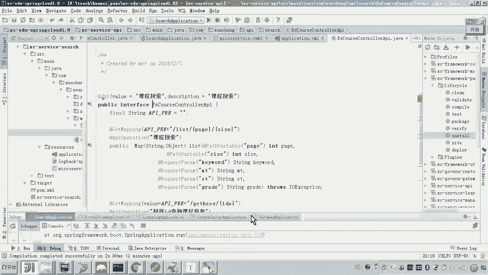

应用启动时，控制台报错：`type of key in map must be string`。这表明在生成Swagger接口文档时，某个接口的返回类型`Map`的键（Key）类型不符合要求。

以下是排查与解决过程：

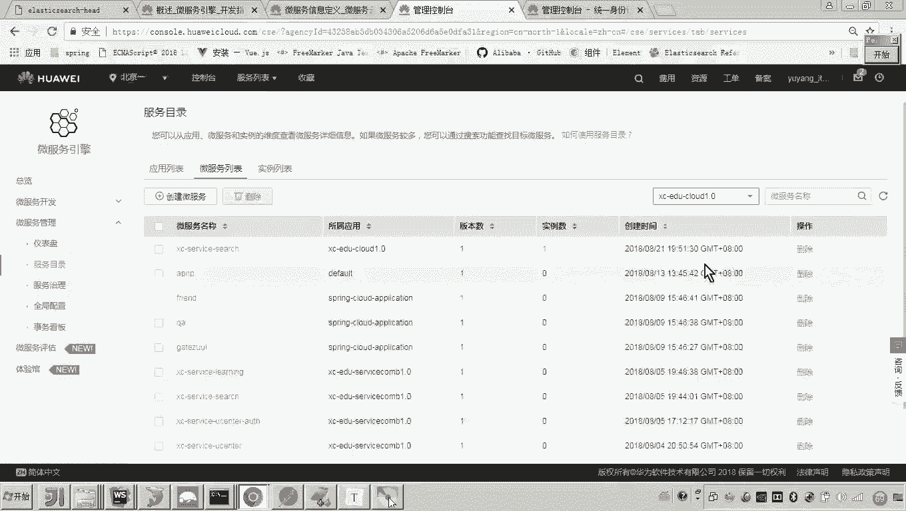

1.  **定位问题接口**：根据错误信息，我们检查所有返回`Map`类型的方法。
2.  **分析代码**：发现某个搜索方法将Elasticsearch返回的JSON字符串转换成了`Map<String, Object>`类型并返回。问题在于，Swagger/ServiceComb要求`Map`的键必须是`String`类型，而值可以是`Object`。
3.  **修正返回类型**：将方法的返回类型从`Map`明确声明为`Map<String, Object>`。
    ```java
    public Map<String, Object> searchCourse(...) { ... }
    ```
4.  修正代码后，再次重启应用。

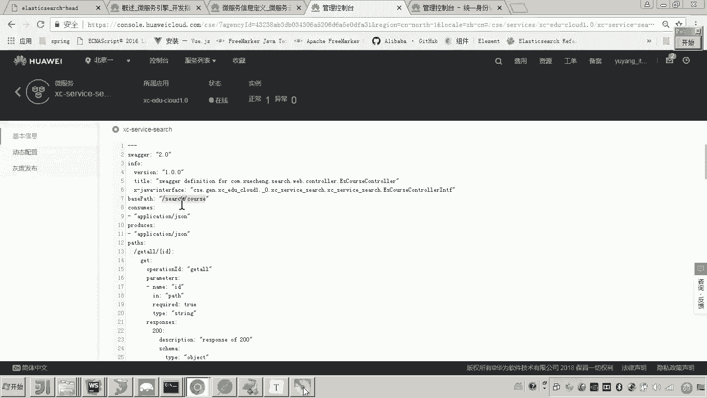

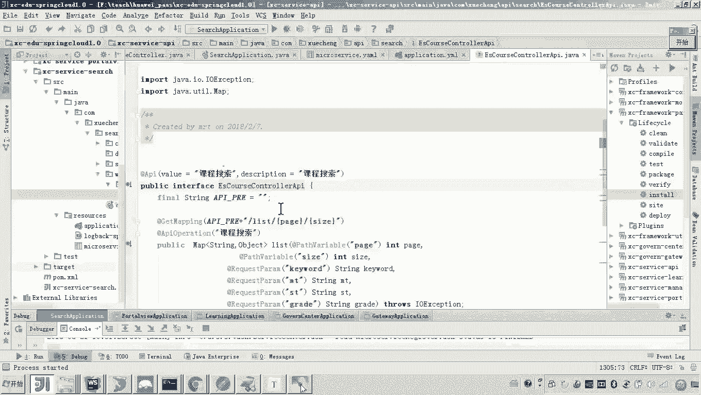

## 验证与测试 ✅

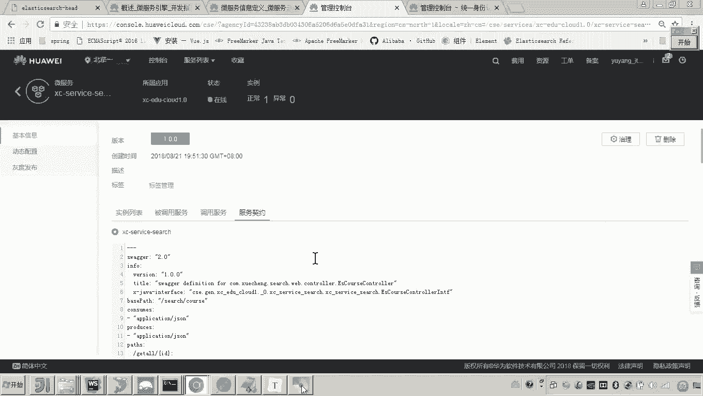

应用成功启动后，我们刷新CSE控制台，可以看到搜索服务的服务契约已经正常生成。契约中包含了我们在Controller中定义的所有接口路径和参数信息。

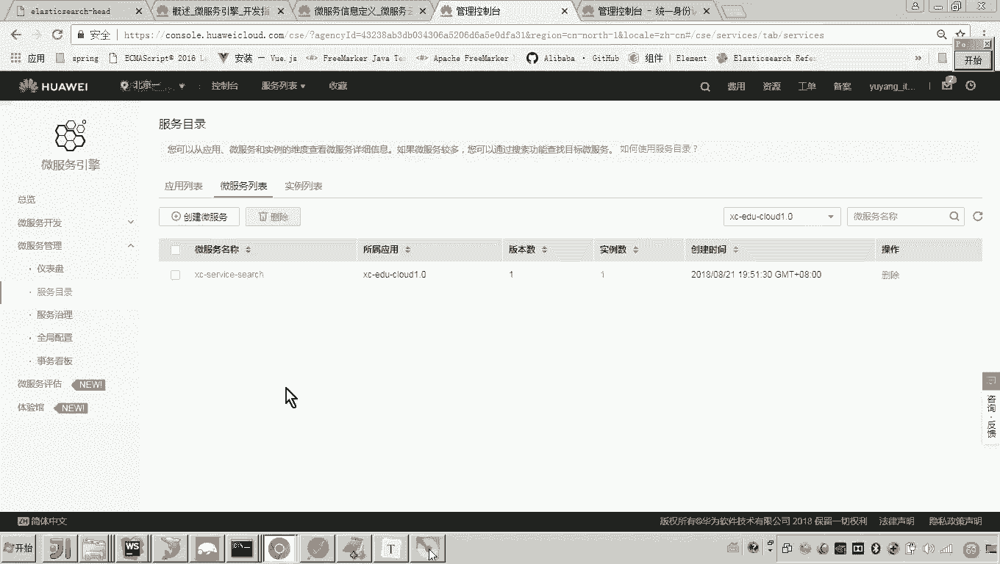

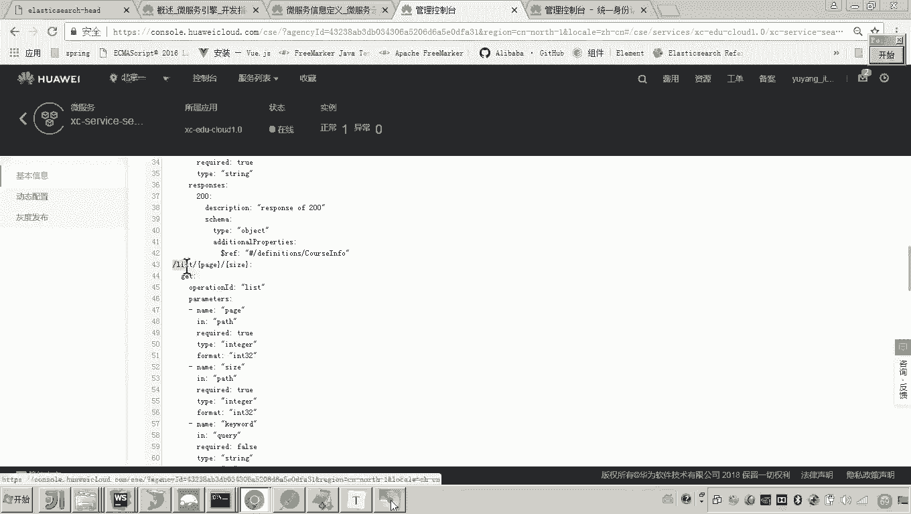

为了进一步验证服务接入成功且接口可用，我们选择一个接口进行测试。

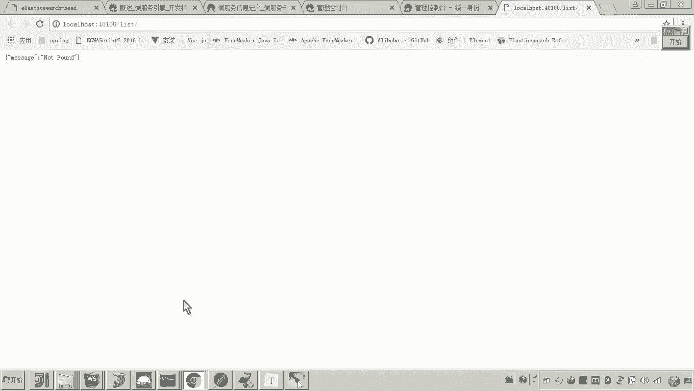

以下是测试步骤：

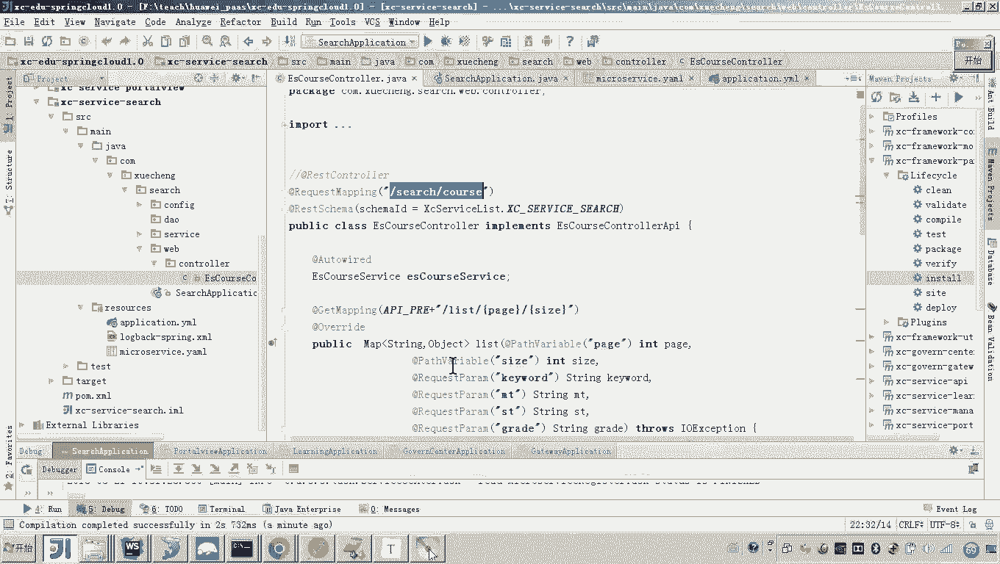

1.  我们选择课程列表查询接口进行测试。
2.  该接口是一个GET请求，路径为`/search/course/list/{page}/{size}`。
3.  在浏览器中访问：`http://localhost:40100/search/course/list/1/2`
4.  页面成功返回了JSON格式的课程数据，证明服务接入成功，接口运行正常。

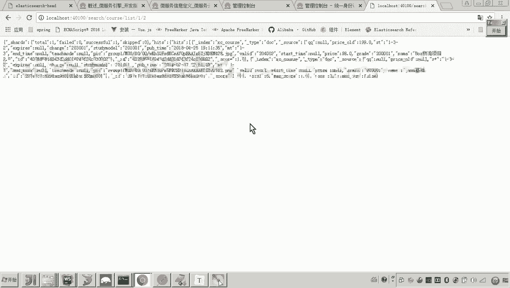

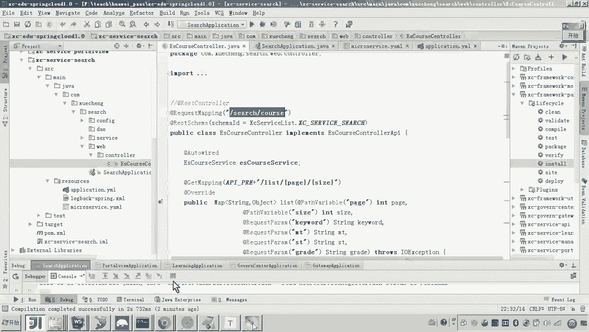

## 接入流程总结 📝

本节课中我们一起学习了搜索服务接入CSE的完整流程和问题处理方法。现在我们来回顾一下核心步骤：

1.  **引入依赖**：在`pom.xml`中添加ServiceComb和CSE相关的依赖。
2.  **移除冲突配置**：由于ServiceComb会自行管理Swagger文档生成，因此需要移除项目中原有的、可能与之冲突的Swagger扫描配置（如`@EnableSwagger2`）。
3.  **定义接口**：在Controller中正确使用ServiceComb的注解（`@RestSchema`）来定义REST接口。特别注意，对于GET请求，应使用基本类型（如`int`, `String`）作为参数。
4.  **服务配置**：在`application.yml`或`microservice.yaml`中正确配置服务名、注册中心地址等信息。
5.  **应用入口**：在Spring Boot启动类上，将原来的`@EnableDiscoveryClient`等注解替换为ServiceComb的`@EnableServiceComb`。
6.  **问题处理**：遇到服务契约不显示、Swagger生成错误等问题时，应检查接口注解的完整性和返回类型的规范性（如`Map`的键需为`String`）。

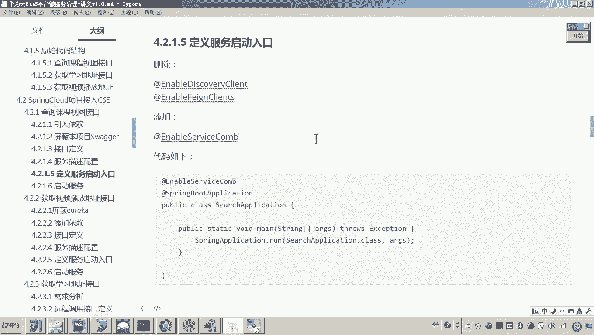

通过以上步骤，我们成功地将一个基于Spring Cloud的微服务改造并接入到了华为云CSE平台，实现了服务的注册、发现和契约化管理。