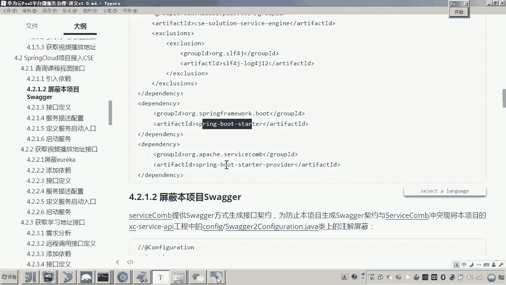
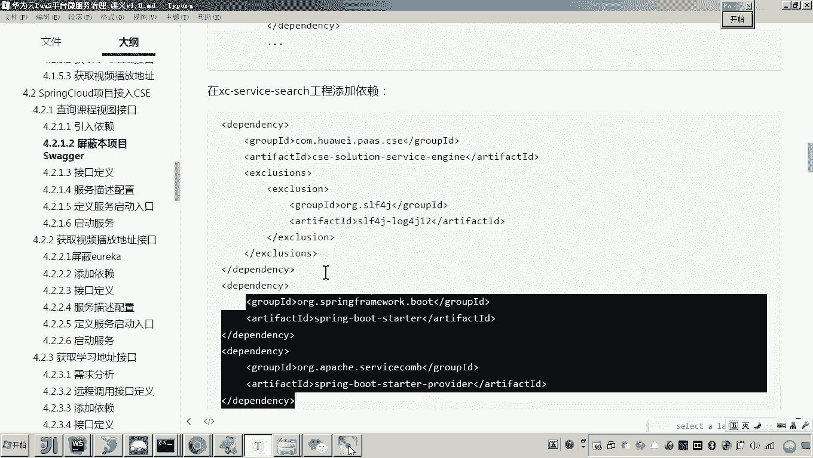
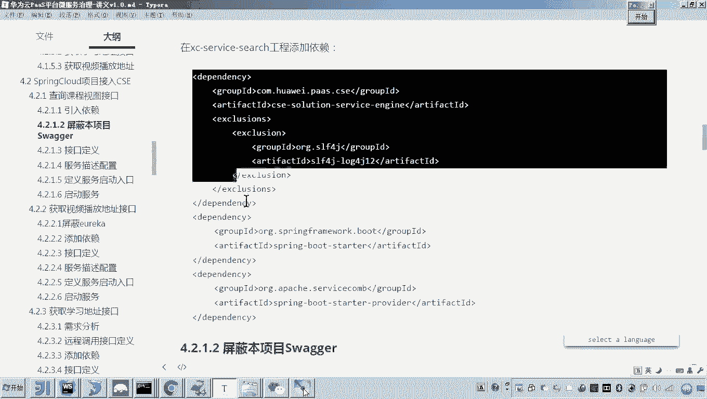
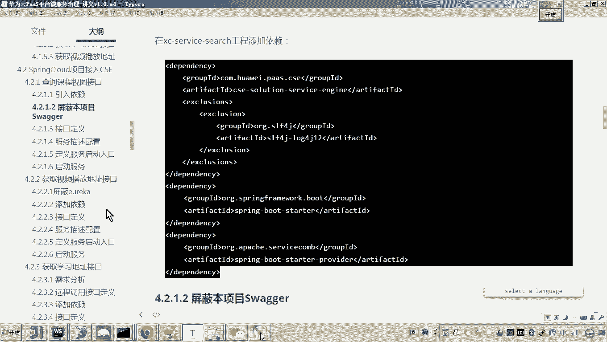
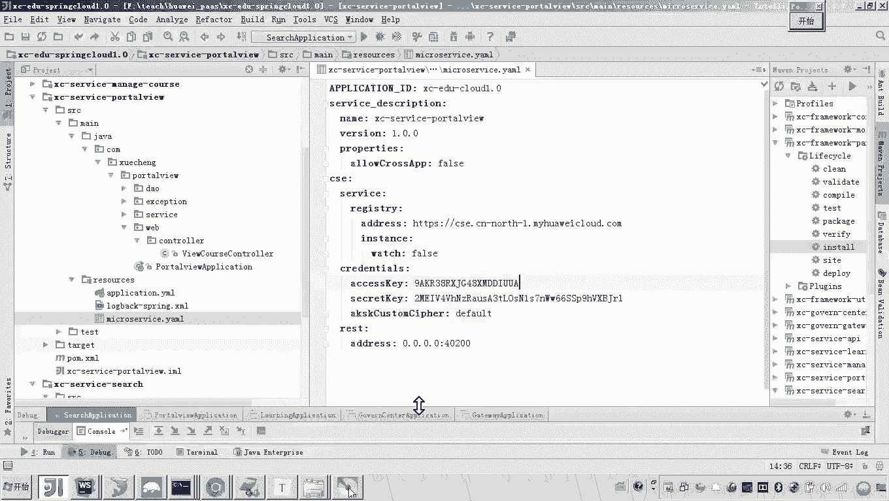
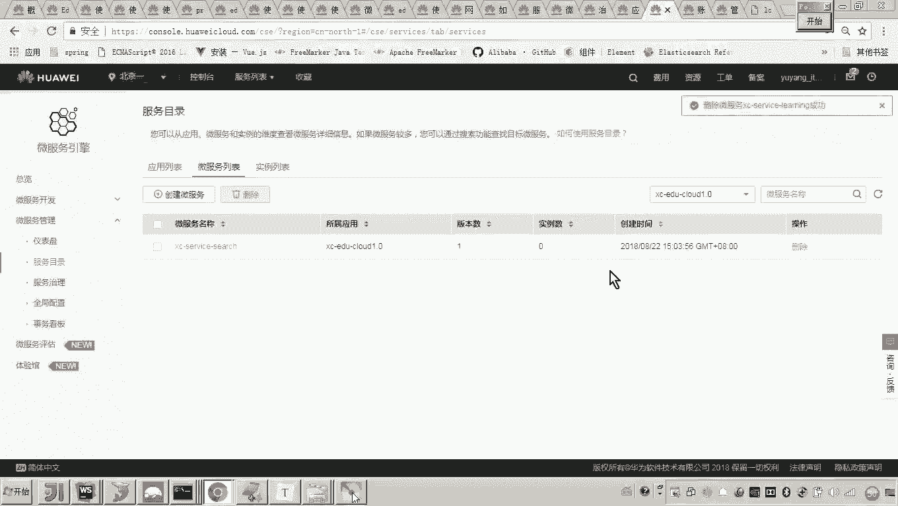
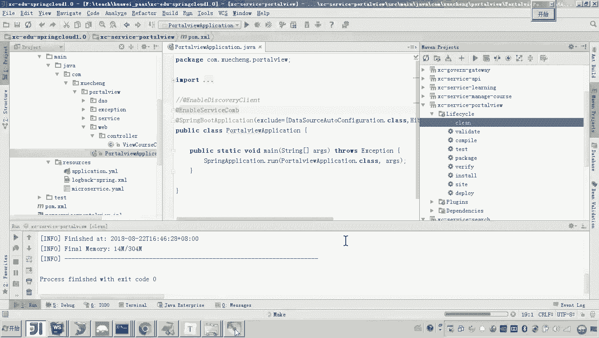
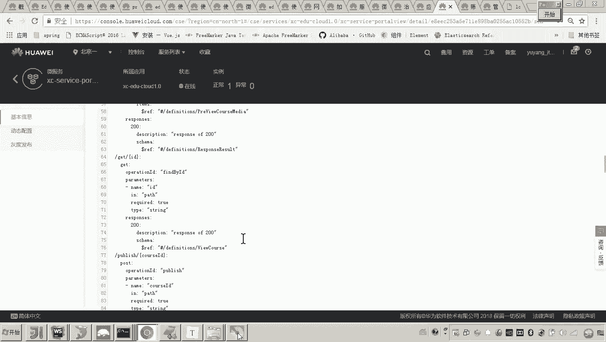
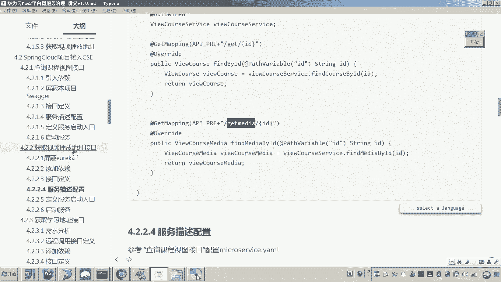

# 华为云PaaS微服务治理技术 - P93：01-学成在线项目接入CSE-数据视图服务接入CSE - 开源之家 - BV1wm4y1M7m5

好，那么前边呢我们完成了搜索服务接入呃CSE。那么当时我们在接入CSE呢，我是通过这个接口的呃，通过这个接口的顺序呢来接入。应该说呃在前面的课程，我们是不是完成了这个查询课程视图接口啊，这个改造对吧？

啊，好，那么接下来呢我们把其他的微服务呢也改造一下，让它接入CSE嗯，那改造的方式呢，其实和第一个接口的改造方法类似呃，我们是需要先引入这个CSE的依赖啊，然后呢在呃改我们的这个接口啊。

改接口的过程当中呢，其实我们就要把原来的这个rest controllertroll注解屏蔽啊，然后我们要添加在类上边要添加request mapping然后还要添加res。😊，好啊。

最后呢我们再配置这个呃服务的这个呃配置文件啊，基本上呢就可以了。😊，最后启动类上面，我们一定要去加上enable serviceicecom这个注解啊。

那么这个注解的作用呢呃其实就是去呃加载啊servicecom它的核心功能。好，那么我接下来要怎么去做这个改造呢？因为现在我们说我们说他现在这个接口是不是还有两个，对吧？啊。

这两个接口的各位这两个接口的顺序，我们是先改造哪一个呢？😊，有说老师，那你就按照这个顺序嘛，先改造这个获取学习地址。哎，好，其实我们可以看一下这个获取学习地址。呃，当初我们在介绍这个代码的时候。

我们说到这个获取学习地址，这个应该是learning这个学习服务说提供的这个接口，那前端呢调用学习服务啊，要获取视频的地址，而学习服务是不是要远程调用port view啊。

这个服务啊来查询到这个视频的地址，对吧？所以这里边要注意啊，就是这个呃获取学习地址接口呢，其实它会调用这个呃获取视频播放地址的这个接口啊，远程调用。所以呢呃接下来我准备这么做啊。

我先把这个获取视频播放地址的接口呢哎把它改造一下哎让他接入CSE然后我把这个接口完成之后，我们再来做这个获取学习地址。这样做的原因就是说呃当你先把获取视频播放地址呃接入。😊，CSE之后呢。

我们再去啊这个接入获取学习地址这个接口。那么这个接口是不是就可以去远程调用这个什么呀？获取视频播放地址的这个接口了，对吧？所以我们先去做这个获取视频播放地址这个接口。😊，好，那么大家来看文档。

那这个接口呢，这个接口是不是呃是哪哪里提供呀？是不是就是port view这个服务提供，对吧？所以呢我们现在要打开这个port view。哎，我们要对这个呃port view啊这个服务呢来来做手术。

来把它改造成什么这个servicecom这种方式啊，然后呢最终去顺利的实现接入CSE。😊，好，那按照刚才我回顾的这个接入的方法怎么做呢？首先这个依赖我们是不是可以把它给加进去，对吧？嗯，好。

那由于呃当时我们spring cloud用的是优瑞卡这个注册中心，对吧？所以这里边你是不是就可以把它给屏蔽了？😊，屏蔽完了之后呢，我们要加入依赖啊，加入哪些依赖呢？啊，在我们接入第一个呃接口的时候。

我们回顾啊，我们当时接入了什么，我们我们当时是引入了什么依赖，还有印象吗？😊，是不是有一个叫CSEservice引擎的这个东西，对吧？包括哎包括这个spring boot的启动包。

还有这个servicecom给我们提供了一个基于spring boot一个proder。哎，这个包。所以这三个包一定要引进去好。😊。

然后把这三个依赖呢，我们我们引进来。

嗯，好，那现在呢我们说引进来了之后，其实你就可以去加载一下这个什么的这个mave的po文件了。好，那现在这个依赖呢我就已经做完了吧，然后呢屏蔽E瑞卡引入依赖，然后接下来做什么呢？是不是就开始来改接口了？

😊。

对，好，那我们来看这个接口怎么改呢？按照上一次这个呃搜索服务改造的方法怎么做呢？😊，首先我们说这里边呃，当初学生在线在这个接口里边都是采用这种前缀呃，这种前缀的方式来做的。我们可以这么玩吧。

是不是可以要在类上边。首先把这个res controllertroll给它屏蔽，对吧？然后呢，要在类上边是不是加一个request mapping的这个注解。😊，嗯，好，还除了这个注解，还要加什么注解？

😊，还有rest。呃，Smer。而r里边是不是要配这个的 ID啊？哎，好，那这个mer ID当时老师说过是不是和这个类保持一一对应的关系就可以了。并且同一个微服务这个smer的 IDD是不要重复的对吧？

所以这里边呢我们就找一个字符串。哎，当初我们这个呃微服务的名字我是不是都定义在这个常量当中了，所以这里面我们就找一个字符串就行了。😊，嗯。当然，因为我这个port view。

你可以看到我是不是只有一个controller嘛，所以我这个skimer ID我就用这个微服务的名字也可以吧，没问题啊。那有时候老师我觉得是不是容于混淆，你是不是可以自己的去。😊，定义一个呀哎。

这是不是也可以定义这么一个字符串？哎，没问题。所以这个我们就把这个rest schememer呢加上了。然后再接下来我们还要改改什么呀？😊。

是不当初学程在线在这个接口的里边是不是加了这些这个URL的这些注解呀，包括post mapping啊，看 mapping。现在你要把这些注解干嘛呀，全部的移到哎，我们说的这个类里边。😊，还移过去。好。

那么接下来再看呃，这个是呃，你看那有几个这个方法还不少了，我们也有一啊，不着急啊，来看一下，这是get，这是不是一个get pre。然后这个方法我们看看嗯，应该是在这。😊，好，一个一个的一还有还有啥？

😊，还有一个叫做fin by IDD这个方法。好，来这。好，然后呢，还有这个方法嗯。好。对，然后呢，还有1个ADDmedia。就是这些方法，有人说老师我都不知道这些方法是干啥的。😡，啊，没关系啊。

回头我们用到了这些方法呢，我就会告诉大家啊啊，因为现在我们在原来这个在线学习的这个流程当中，我们是不是用到这个方法呀，查询这个。😊，啊，我们是不是查询这个什么呢这个这个梅字的信息，对吧？

所以这里边呢啊我们来看一下。😊，哎，我们把这个最后一个给他配一下。嗯，好。这样的话，我们是不是就把这个。😊，呃，这个类这个controlller的这个呃这个类就改造完了吧。好，然后这一步改造完了之后。

各位我们再回忆接下来我要做什么事啊。😊，有人说是启动类对吧？可以，然后我们可以做来。我们把启动类加上。是不是这个呀哎。还有什么？😡，还有的话是不是就是。这个配置文件了啊。

这里边我们是不是要配一个配置文件，叫什么呀？叫my哎my service啊，YAML对吧？然后这个配置文件的内容，你是不是可以用可以从这个搜索当中去拷贝了？😊，哎，我们在这个里头呢。

我们来拷贝一下贴进去。然后这里边注意这个这个项目名称我们不要变，因为这个项目名称所有的微服务是属于一个项目啊。然后呢，我们把这个变一下，这个变一下，就是这个微服务的名字嘛。

这个微服务的名字我们叫做X serviceportal view。😊，好，这些都不用改变，然后这个地址也不用改变啊，这个密钥也不用变，但这个端口是不是要便便，这个端口是不是变变成这个40200就可以了。

😊，因为上次我说过啊，我们用的这个呃改造成这个CSE之后呢，哎我们说这个原来spring boot application点YML里边的这个端口其实基本上就没有作用了。哎。

因为我们这里边你看这个res的这个端口是在这配的啊。好，那这样的话，我们就改造完成。😊，好，那这样的话，我们把这个改造完成之后呢，接下来我们要做什么事呢？是不是就可以去重启了。嗯，好。

那么我们现在要如果重启的话，重启起来，我们是不是就可以去云平台来观察来观察我们说的这个服务目录里边是不是有这个服务了，对吧？好，那现在呢我进入云平台。😊。

好，那我进到云平台之后呢，我要进到这个微服务引擎。然后呢，微服务管理服务目录。好，那么找到我们说的这个项目。嗯，好，那在在在这个里边有一些这个服务呢，我们暂时用不到的，我可以把它给呃删掉啊。好。

注意这里边原来我们注册过这个port view，我也把它给删掉。好，目前来说，其实我们已经我们光注册了一个叫什么service search，这个是吧？哎。😊，好。

那现在呢我们说这里边就是我们原来注册的这个服务。那接下来我们要做什么呢？😊。

就是启动了吧。好，那么在启之前呢，我之前也给大家说了一个经验，就是说呃你因为你依赖改了，对吧？所以我建议你呀把之前的这个呃服务啊，我们把它给清理一下。😊，好，清理完了之后呢，我们再来启动。

好，那这样的话我们来看一下。最后启动的结果。好，这样的话我们来看到这个finished的话，就是这个这个这个服务已经干嘛呀？已经注册成功了。好，那这样的话我们来看到这个管理控制台刷新。😊。

你看他是不是就有了，然后然后刚才显示是不是你可以看到是不是有一个实例呀？哎，好，那这样的话，我们来看一下它的这个接口的呃契约。各位看一下这个接口的契约是不是可以是不是正确的，对吧嗯？😊，好。

那么这样的话，我们是不是也可以来测试一下吧？😊。

嗯，没问题。好，可以测试一下。我本地测一下吧。它的这个端口号，刚才我们是不是配的叫40200呀？好，然后呢，我们这里边怎么怎么怎么测呢？就local host。😊，40200对吧？然后后边跟什么呢？😊。

后边的话你是不是就要看你的这个。来看你的接口了，这里边是不是有一个叫portal view course。对，然后再后边我们是不是要做什么呀，看测哪个接口了。😊，那这里边我们看一下吧。

我们测一个get的对吧？来get查询。那查询什么呢？这也是一看就是查询课程，对吧？课程的话呃，这个port view呢是要查这个mgodb数据库，然后我们找到这个vi course啊，这个这个集合。

那里边呢我们说这里边有很多的这个课程。😊，我们随便找一个课程，我们来看一下他能不能把这个信息，这个是ID啊，根据ID来查询课程。大家可以看到这是不是就出来了。那这样的话，这个改造呢我们就完成了。好。

这是针对这个呃哪个接口啊，叫做获取视频播放地址的这个接口。😊，那这个接口呢，我们应该测一下吧。我刚才测的是那个get课程，我们应该测这个看见吗？叫get media是吧？那么我们来测一下这个接口。

get media。😊，嗯，ge media的这个这个这个这个接口在哪里啊？在这对吧？那他这里面要传什么ID呀？😊，这个从哪个表查？有人说老师这个这个我我不太清楚，为啥？因为这个学生在线当时没学过。

对吧？没关系，我们一点点来看啊，因为在现在这个是课程的，这个是课程梅资的，打开课程梅资信息。然后这里边呢我们找一个，比如说这个组件好，然后我们放进去。😊，哎，这个。你看一下这是不是就把这个。😊，呃。

这个这个什么呀，这个课程计划的这个呃视频播放地址给查到了。大家可以看到。好，那这个接口啊到这里呢，我们就改造完成。

