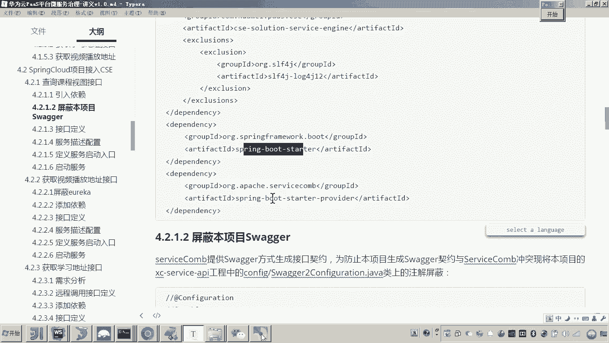
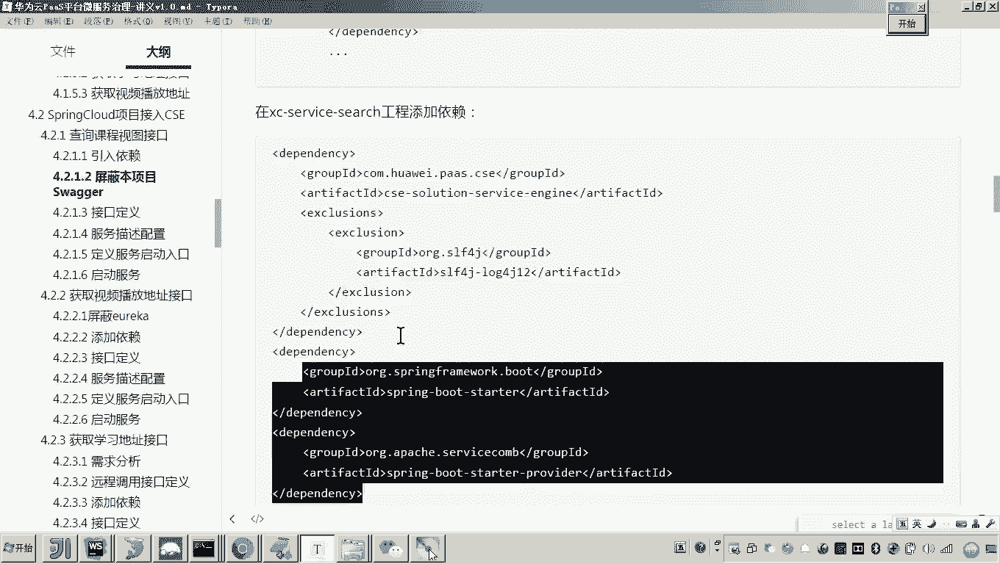
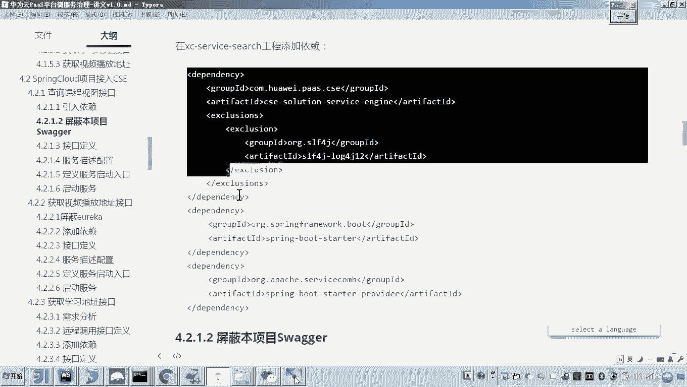
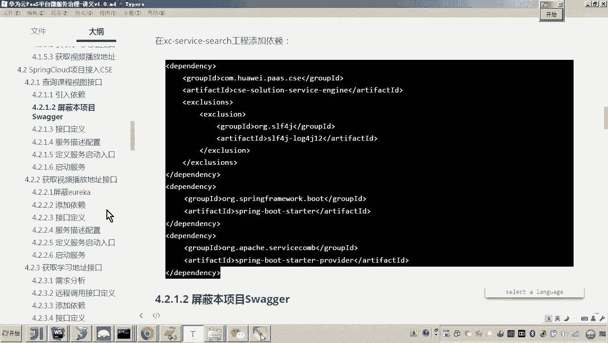
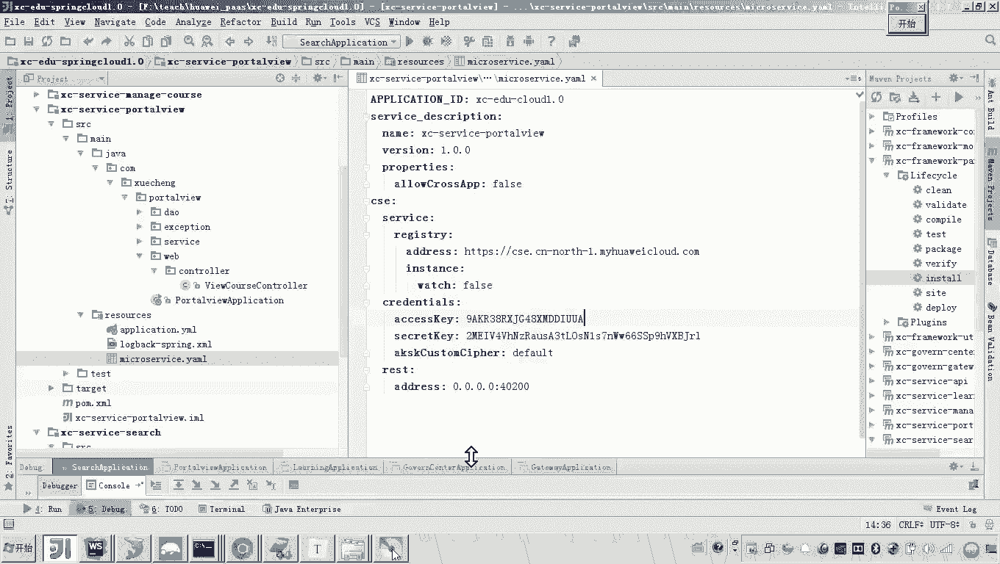
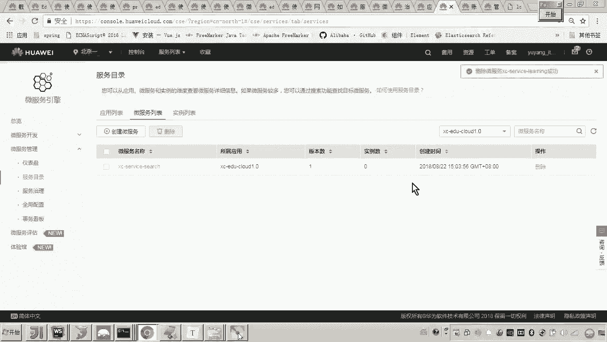
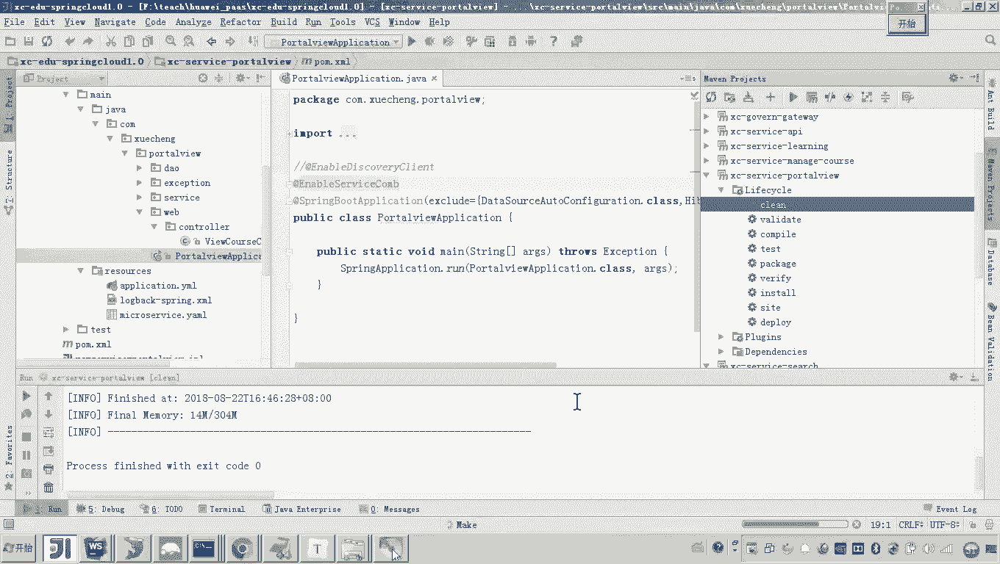
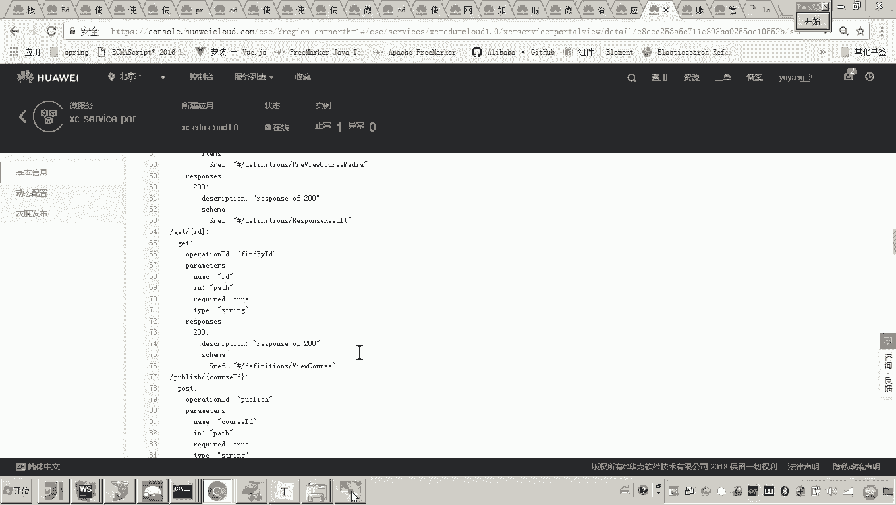
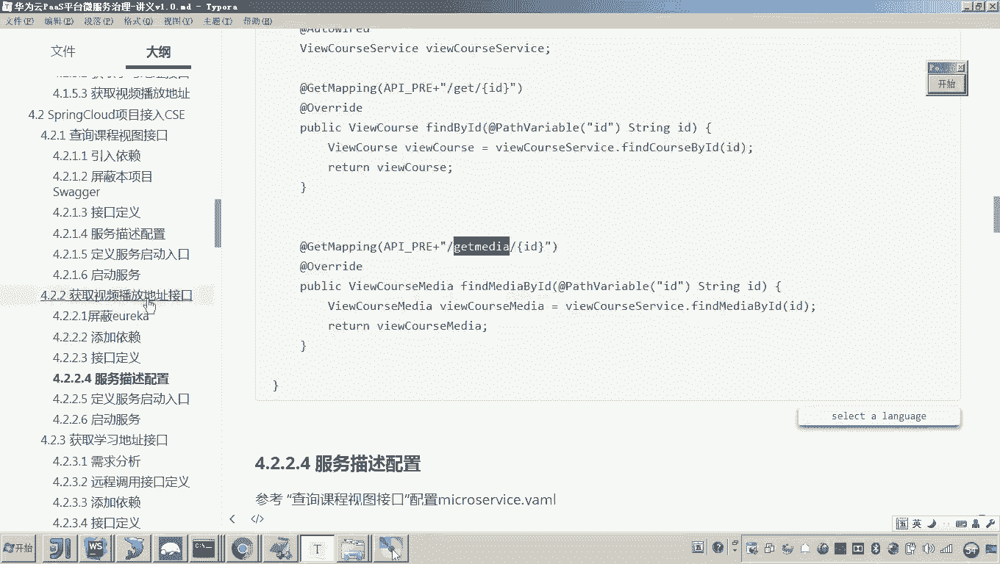

# 华为云PaaS微服务治理技术 - P93：01-学成在线项目接入CSE-数据视图服务接入CSE 🚀

## 概述
在本节课程中，我们将学习如何将学成在线项目中的“数据视图服务”接入华为云CSE微服务治理平台。我们将遵循与之前“搜索服务”接入CSE类似的步骤，完成服务改造。

---

## 改造思路回顾
上一节我们完成了搜索服务接入CSE。改造的核心步骤是：引入CSE依赖、修改接口注解、配置服务文件、在启动类添加特定注解。

本节中，我们将对“数据视图服务”进行同样的改造。该服务包含多个接口，我们将首先改造“获取视频播放地址”接口。

---





## 改造步骤详解





### 第一步：引入CSE依赖
首先，我们需要在`portview`服务的`pom.xml`文件中引入必要的CSE依赖。由于原项目使用Eureka注册中心，需要先屏蔽相关依赖。

以下是需要添加的核心依赖：
```xml
<!-- CSE ServiceComb 引擎 -->
<dependency>
    <groupId>org.apache.servicecomb</groupId>
    <artifactId>spring-boot-starter-provider</artifactId>
</dependency>
<!-- Spring Boot 启动器 -->
<dependency>
    <groupId>org.springframework.boot</groupId>
    <artifactId>spring-boot-starter</artifactId>
</dependency>
<!-- ServiceComb 基础包 -->
<dependency>
    <groupId>org.apache.servicecomb</groupId>
    <artifactId>foundation-auth</artifactId>
</dependency>
```
引入依赖后，加载Maven项目。

---

### 第二步：修改接口控制器
接下来，我们需要修改服务中的Controller类，将其从Spring MVC的`@RestController`模式改为ServiceComb的REST模式。

具体操作如下：
1.  屏蔽类上的`@RestController`注解。
2.  在类上添加`@RequestMapping`注解，定义基础路径。
3.  添加`@RestSchema`注解，并指定`schemaId`。`schemaId`需在微服务内保持唯一，通常可使用微服务名称。
4.  将方法上的HTTP注解（如`@GetMapping`, `@PostMapping`）全部保留，它们将自动集成到新的REST架构中。

以`PortViewController`为例，改造后的类注解大致如下：
```java
// @RestController // 屏蔽原注解
@RequestMapping("/portalview")
@RestSchema(schemaId = "xuecheng-portalview") // 添加ServiceComb注解
public class PortViewController {
    // ... 方法体保持不变
}
```

---

### 第三步：配置服务文件
我们需要创建一个ServiceComb的配置文件`microservice.yaml`，用于配置服务的基本信息。



配置文件内容可以从已改造的搜索服务中拷贝，主要修改项为服务名和端口号：
```yaml
APPLICATION_ID: xuecheng-online # 项目ID，保持不变
service_description:
  name: xuecheng-portalview # 修改为当前微服务名称
  version: 1.0.0
servicecomb:
  service:
    registry:
      address: https://cse.cn-north-1.myhuaweicloud.com # CSE注册中心地址
  rest:
    address: 0.0.0.0:40200 # 修改为当前服务的端口
  credentials:
    accessKey: your_access_key # 您的AK
    secretKey: your_secret_key # 您的SK
```
**注意**：配置中的端口（`40200`）将成为服务的主要访问端口，原`application.yml`中的端口配置将失效。

---





### 第四步：修改启动类
最后，在服务的启动类上添加`@EnableServiceComb`注解，以启用ServiceComb的核心功能。
```java
@SpringBootApplication
@EnableServiceComb // 启用ServiceComb
public class PortalviewApplication {
    public static void main(String[] args) {
        SpringApplication.run(PortalviewApplication.class, args);
    }
}
```

---



## 验证与测试
完成以上步骤后，可以启动`portview`服务进行验证。

以下是验证流程：
1.  清理并重新启动服务。
2.  登录**华为云CSE控制台**，进入“微服务引擎” > “服务目录”。
3.  在服务列表中查找名为`xuecheng-portalview`的服务，确认其注册成功且实例数为1。
4.  可以点击服务查看其接口契约，确认接口信息已正确上报。
5.  在本地使用工具（如浏览器或Postman）测试接口是否可用。例如，测试“根据ID查询课程信息”接口：
    ```
    GET http://localhost:40200/portalview/course/{courseId}
    ```
    或测试“获取视频播放地址”接口：
    ```
    GET http://localhost:40200/portalview/media/{mediaId}
    ```
    若接口能正常返回数据，则表明改造成功。

---



## 总结
本节课我们一起学习了将“数据视图服务”接入华为云CSE的完整过程。我们回顾了改造的四步核心操作：**引入依赖**、**修改Controller**、**配置`microservice.yaml`**、**启用`@EnableServiceComb`**。通过本次实践，我们进一步掌握了将传统Spring Cloud微服务平滑迁移至CSE平台的标准方法。接下来，我们可以用同样的方式改造项目中的其他服务接口。