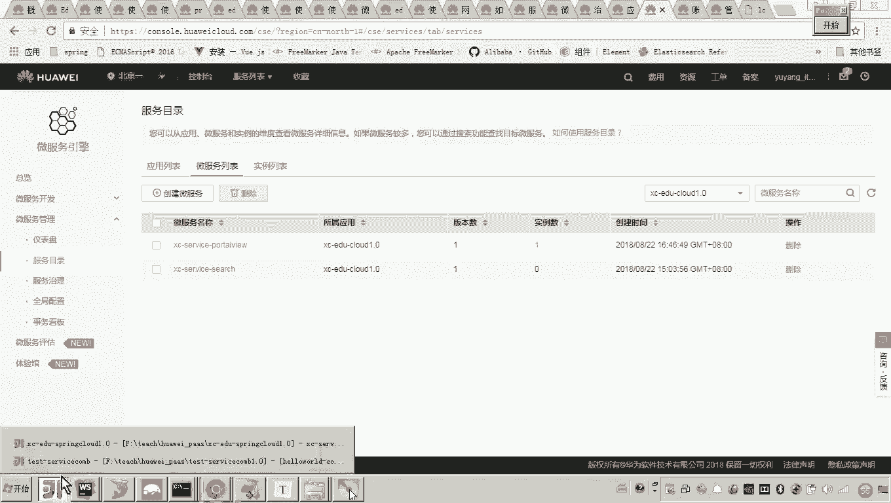

# 华为云PaaS微服务治理技术 - P94：02-学成在线项目接入CSE-学习服务接入CSE - 开源之家 - BV1wm4y1M7m5

好，那么接下来呢我们就把最后一个接口呃，也就是学习服务哎改造成servicecom，然后接入CSE。好，那这个获取学习地址呢，它的这个需求是呃学习服务呢要去请求呃数据视图服务来获取视频播放地址。好。

那这样的话，我们先来打开这个学习的这个服务啊来。叫做这个service learning这个服务。好，那这个服务里边呢，我们来看那怎么改造呢？嗯，应该我我们已经改造了两个微服务了。

所以现在呢我们来看一下，首先我们是不是可以把这个呃依赖呢给它改一下。😊，嗯，那这个依赖呢，我们随便从这个啊前两个改造的微服务里面，我们拷一下啊，把这个CSE的这个service引擎。

然后一直拷到这个provider。然后这三个依赖呢把它拷到这个学习服务里头。😊，好。然后呢，接下来还要做一件事儿是什么呢？呃，接下来的话是不是就可以改接口了呀？😊，好，那我们来看啊改造接口。

这接口怎么改呢？😊，注意啊，那这这里边呢注意看啊，这里边的话呃，我们说这些这个request mapping啊，包括get mapping啊，这些全部的移到这个呃哪里啊，这个类类上边啊移到类上面。😊。

然后呢，原来的这个就可以干掉了啊，这个res controltl了。好，然后再接下来呢还有什么呢？还有一个就是呃rest。😊，呃sver。Ha。那这个呢我们来起一个名字啊，X service哪个呀？啊。

这个是learning。好。啊，那这样的话，我们还得哎这里边有几个有有两三个啊，应该不太多。好，来，我们把这个全部的给他。把接口当中的这个注解呢，我们把它移到这个类当中。因为你会发现啊。

这这个这个有人说老师这个原来你这有钱率，怎么现没有了啊，因为这个当时学生在线这个代码，他不是一个人写的啊，这个这个这个工程师写的话。

你会发现他前面他是不是在这个类上面加了一个request mapping啊这个接口上面，对吧？所以他就没有用这个前缀的方式啊。好好好，那现在呢我们来看啊，那这里边我们还是需要继续啊，还有这个。😊。

这里边是什么呀？这个这个po这个对吧？好。嗯，最后一个。那现在我把这个注解呢都已经改造完成，都加到类里头了。呃，那么在这个接口与其他前两个接口不一样的地方，因为它有远程调用了。😊。

对吧他要调用数据视图服务。那你先找到这个远程调用的地方啊，先找到远程调用的地方。😡，呃，哪里呢？就在这个get media里头啊，在这个service里边，我们来看一下啊，在这儿是不是就是一个远程调用。

当时我们是不是还回顾的，还这个复习过这个代码，你看这里边是不是用到了一个叫做port view client这个这个这个这个接口啊，那这个在哪里定义了，是不是是不是在这个cle这个包下边定义。

大家看到了吗？所以这里边你要注意。😊，呃，我们说原来spring cloud用的是这个fin client的方式来生成呃接口代理对象，来后进行远程调用。现在呢我们就不用这个注解了。哎。

现在我们是不是使用scom给我们提供的远程调用方法，所以你把这些东西全部给它给它平掉。😊，看懂了吧？对，其实这些东西应该干嘛呀？删掉就可以了。但是由于我我因为我这个改造是逐一进行的，你要删掉的话。

其他地方是不是该报错了，对吧？所以你把这个注解平掉啊，不让它起作用就可以了。然后我们再回到这个service里头，我们来看。😊，由于你那个fin client的注解屏掉了。

所以这个autoware是不是就就就就不用加了吧，因为肯定就不会生成接口代理对象，所以你这里面也注入不进去了，所以这都这都要评了。😊，好，那现在各位来看他这一步是不是要远程调用。

我肯定要把这一行代码是不是要换掉了？😊，对吧那怎么换掉呢？这个servicecom方式怎么来进行远程调用呢？大家还有印象吗？😊，对，当初嗯回忆一下，当初我在做这个servicecom这个回顾的时候。

我应该呃写了一个hellow world的工程，有印象吗？hellow world对吧？哎，我们打开这个servicecom的这个工程啊，大家来看一下，当初我是不是写了两个一个消费者，一个提供方，对吧？

那这个消费者是不是要远程调用，提供方呀，那现在我就想查一下，当初我是怎么去远程调用这个代码从哪查，是提供方还是消费方。😊，啊，对，一定是消费方。因为消费方要远程调用提供方，对吧？

我们看这个消费方你当时是怎么写的，各位，你来看当时是不是写了一个叫做RPC所哎这个RPC这个re这个注解，对吧？这个注解的目的是不是就是来指定哪一个调用哪一个服务的哎，调用哪一个服务哎。

包括他的这个 IDD也要指定好看见了吗？😊，所以现在我的做法其实很简单。你只要。😡，你只要这么做就可以了。来看看啊，哎，你把这个复制过来。😊，复制过来。对。那现在你想调用哪一个接口呢？😡。

我想调用的就是什么呀？就是哎我想调用的就是这个这个接口。😡，这个接口是不是就是port view的接口？对我就想调用port view的哎，这个叫做get media这个方法。😡，怎么做呢？😡，很简单。

来。找到你这个学习服务的这个service这个这个这个地方啊，然后你把它改成接口。😊，因为原来我写hellow world，这是不是就是一个接口啊？所以看好这个接口是放在这儿了。

然后这个注解的作用就是就是什么意思啊？就相当于原来的这个fin client干嘛呀？生层接口代理对象。哎，然后呢哎调用这个微服务下边的这个skimer下边的这个什么呀哎这个方法，某一个方法。😊。

所以现在各位这个微服务你要指定对啊，这是hello world的工程。现在我要调用哪个微服务呢？我要调用portal view这个服务。😡，调用portto view这个服务。

调用那他这个port view的服务名字，你是不是得写正确？😡，然后我调用port view这个服务，那这个服务它的它的这个接口所属的smer ID是什么呢？那你得找到port view了。

你调用port view，你就找到port view了。这个port view的这个smer ID当初哎我是不是写成是是写了这么一个常量，看见了吗？所以你把这个什么这个常量。😡，你把它拿过来。对。

拿到刚才我写的这个代码的这个位置。看懂了吗？对，所以这儿我就可以我就可以把它改了。看见吗？大家看懂啥意思了吧嗯，就这么做。😊，但是我这样做完的话，各位我觉得有点麻烦，为啥呢？

因为我每次调这个port view，我都要知道port view的服务名，包括port view的这个接口所属的s ID的名称。然后我再用这个注解写这么一一大长串。

所以我现在想这个本身这个微服务都是互相调用的。port view这个可能会被很多服务调用。而很多服务都要做我这样写这两行代码就感觉太麻烦。那怎么做呢。😡，这么做，我单独写一个什么一个哎。

我单独写一个接口。😡，我单独写一个类。哎，到底是接口还是类呢？大家看我的讲义上我是这么写的啊，我准备单独定一个叫做portto view API for such，这个叫什么意思呀？

这是不是就是portto view的一个接口门面，这是个类，对吧？而我定义这个类里头，我把这两行代码写进去。😊，并且这个类你没发现我用这个sspring的这个注解已经标识了，所以谁将来用谁都扫描这个类。

然后注入进去。那直接你就可以干嘛呀，取出这个成员变量，是不是可以用来可以可以可以可以来调来调这个po wheel的接口了。😡，好，我我给你我给你演示一下，注意看啊，我的做法很简单。😊。

我就准备想把这两行代码封一下，封到一个类当中。而这个类呢是spring的一个B。将来谁用谁在这注入。哎，那不用谁去用，都定义这两行代码，那都太麻烦。好。

那你找到这个portto这个view它的接口的位置，是不是在XC service APII。😊，因为每一个微服务是不是都要依赖这个杠API呀，都要依赖它呀。😡，因为依赖它的话，是不是就可以拿到接口了？

所以呀这个接口工程当中，我准备我准备在这个port view这哎，在这儿哎，我我定义一个类。😊，看见了吧？好，我定义这个类呢呃我我用这个spring component这个注解标识一下，它是个B。

然后我再用这个什么呀？我再用哎有一个注解叫做get long book提供了一个get这个这个这个注解大家之前玩过吗？是不是这里边我只要定一个成员变量，它自动会给我生成get set的方法，对吧？好。

那这里边呢我就定义嗯叫做view controllert这个API这个成员变量。😊，对。哎，其实说白了，我就是想把这两行代码封到这个类中，各位这能看懂吧？😊，对不对？哎他报报报错了，是啥意思啊？😡。

报错的话，是不是因为我现在是在这个API当中来写这个注解，这个注解是不是没有依赖呀？所以你在泡沫当中，我们加一下这个注解所属的这个依赖。😊，这个注解所属的依赖加哪个依赖呢？

肯定是加这个servicecom的，因为那个注解属于servservicecom嘛，所以你把这个servfacecom的这个核心的这个依赖呢，你把它加过去。😊，OK然后我们加过来之后。

然后我们再回过来看。嗯，他是不是就可以解决看好。这样的话，各位我是不是把这两行代码封装到这个类里头了？好，那封装到这个类里头的话，那么在这儿我就不用这么麻烦了。哎，有人说老师，那怎怎么不麻烦。

我就可以你谁用我这个portto view的接口，谁来注入我这个portto view的接口门面这个对象，然后在这个在这个里边我就可以get。😊，拿到大家看到看到啥意思了吗？对。😊，就这么做。好。

那现在的话我们说你要想，因为我要启动这个什么呀，启动这个learning这个工程。😡，啊，注意看啊，我要启动runarning的工程，我现在要撤了。😊，哎，我启动learning的工程，再启动类上边。

然后把把这都屏蔽了啊，这都不要了。然后呢加一个enable。😊，Enable a service co。好，那这里边大家可以看到它是不是扫描这个这个这个com学程点API这包下边。

而这个包下边是不是有你刚才定义的那个接口门面的类啊，所以说这个接口门面的类是不是就会被spring扫描到哎，扫描到之后呢。

那你是不是就可以在这个learning这个工程的service里边注入这个门面的这个对象。然后这个里边是不是就有这个呃接口的这个呃RPC reference这个标记的哎这个接口的代理对象。

所以你就可以拿到这个接口的代理对象，get拿到接口代理对象，然后通过接口代理对象来调用远程调用它的方法。😊，大家理解这个过程了吗？好，那现在的话我们来运行一下试试吧，看一下。😊，我们把这个。呃。

来我们看一下啊，我现在要运行是不是running啊。😊，然后把这个learning。清理一下。然后我们运行它的这个启动类。这个runarning的微服务改造呢就有一个不同点。

就是和其他的两个服务的不同点，就是它有这个什么呀。😊，啊，他有远程调用，来看一下它是啥意思哦，这里边说有这个什么这个这个这个类型找不到，对不对？好，那这个类型找不到的话，我们是不是就就需要加一个什么呀？

😊，需要加一个这个依赖吧。对，在泡沫当中，我们来加一个依赖啊。好，注意看我找一下。这个GDBC的这个它的这个依赖在哪里呢？注意看我的讲义上面，我应该写的有在添加依赖当中，这里边要注意啊，呃。

因为我们要最终要去连接数据库，连接mel。所以这里边呃在前两个微服务我们改造的时候，我们是不是引入了这三个依赖呀？而现在这个微服是不是要连接me我们需要把这个GDBC的这个依赖引进去这个呢。

我们说它会用到所以我们来。😊。

把这四个依赖呢把它拿过去。

这四个依赖，其实我们应该说在前几个依赖是不是已经有了？😊，所以我们把它复制一下来，这样的话，我们主要是不是引入这个依赖呀？好。然后我们再把它启动。好，这个注意这里边要注意啊，我们把它拷进去了之后呢。

刷一下这个碰文件。😊，好，大家来看啊，他这个最终呢我们来看一下它启动。成功启动不良。嗯，这个怎么这么慢呢？好像是出问题了，对吧？看一下。说什么，你看这个看这个。这是不是已经失败了，看见了吗？对呃。

这个现在呢这个注册呢是不是就出现了问题了？😊，对，那我们来看他是哪里的问题呢？那我们得排查一下吧。首先来看这个先看服务目录啊。😊，好，这还没有注册进去。然后呢，我们再回过来看接口。

因为这个一般来说这个呃注册失败的话，你来看哎，你看这个这个配置文件我们是不是还没有配呀？好，你把这个配置文件呢拿过来。因为这里里边来看一下，它有这个注册中心的地址啊来找到我们把这个呃微服务的名字。😊。

考一下。啊，这些东西都不用变吧。好，然后这个端口要变吗，叫40600。😊，OK那现在呢这个就搞定了吧，这些东西还要吗？优瑞卡这些东西是原来spring cloud的，这个你留着也没没没关系啊。

他也用不到。所以这里面我们就把它屏蔽了啊，不用了。😊，嗯，好，其他的就留着啊。像rait Mq啊，包括这个mesq的连接都留着。好，现在我们再启动。😊，看这个微服务改造的多了，你没发现吗？

你都麻木了是吧？啊，添加依赖接口定义。然后这个配置文件我们刚才是不是落了？😊。

好，再来。好，这样的话我们来看到这个fin的话，我们发现这个服务是不是就注册成功了。然后我们刷新。😊，看到这个learning是不是就成功了。然后我们看服务契约。😊。

注意大家来看这个这个是不是就是那个大家知道什么吗？这个就是那个smer的ID哎，这个就是我们在定接口的smer的ID了。😊，因为这当前是一个嘛，如果你再有一个接口的类。

你再定一个其他的sma ID这里边你会发现它就有多一个smer。好，因为这个接口它属于这个命名空间，就是s的 ID。然后我们来看一下它的这个base pass这都对吧。好，这个接口呢，我们得测一下啊。

现在我们测一下。😊，怎么测试呢？现在我们要请求哪个接口呢？😡，哎，我们现在要请求的接口是不是这个叫做呃lening，然后呢，get呃叫做get meeting，是不是他，所以我们来做来。😊，在这写吧。

叫logo house的。😊，啊，他这是叫40600吧这个端口，然后后边跟什么看一下是不ge media。对。哎哎哎。那那这个get mid media后边跟两个参数啊，一个是课程ID，一个是怎么呀？

😊，啊，这个课程计划的ID。啊，那这个呢我们从哪里拿呢啊，课程的ID课程的ID。😊，啊，这里边是不是有一个课程ID因为你最终是不是取这个课程教学计划所属的这个呃视频播放地址啊。

所以你就从这个这个表当中找数据就可以了啊。来我们。😊，在这儿。来看一下，你看是不是就操作成功。对，如果现在我们打上断点的话，我们也可以来看一下哎，打断点怎么做呢？😊，各位就这一步是远程调用。

是不是非常关键的？你在这呢。😡，在这打的话，我们来看这一步是不是就开始远程调用，拿到这个数据，对吧？而这一步远程调用，远程调用是不是就调到了这个portal view的这个工程。😊，没错吧。

我在portal view当中也打一段点。好，大家来看。刷新。首先这个进来了，是不是就是这个port头 view？然后走这是不是就远程调用结束，拿到了这个数据，可以看看这个数据是不是又拿到了。

然后再走返回啊，最终他这个这个数据是不是就响应成功？😊，对，这样的话就是我们说的呃叫做最后一个接口，有获取学习地址。这个接口呢就。😊，改造成功了。当然我的讲义里边写的。

你看这个这个测试的过程是不是也是要先看这个服务注册啊，没有注册成功。然后呢，在这里边浏览器请求。嗯，那这里边请求的这里边我写的是不是通过一个域名啊？对，这个这个这个域名如果你通过这个域名的话。

是不是要走这个了。而现在我我写我这么写的话，各位他是不是就直接走我的这个微服务是不是就可以。嗯，好，你也可以去这么写啊。这个这个域名的这个这个测试方式呢啊，我们可以啊不用我们用这种这样的话比较简单。

这样的话我们一测试的话，你会发现是不是就可以拿到这个数据了。对，这就是我们测试的一个结果。😊，好。那到这儿来说，我们这个三个微服务的改造哎，是不是就完成了啊。然后接下来这个测试你会发现他说是什么呀？

叫启动port view。然后呢，还有learning，还有search取三个服务。然后呢啊在这个学习的页面呢，你可以整合测试一下。好，那么呃稍后呢，我们来整合测试一下，到这儿最后一个服务呢。

我们就改造完成。😊。

