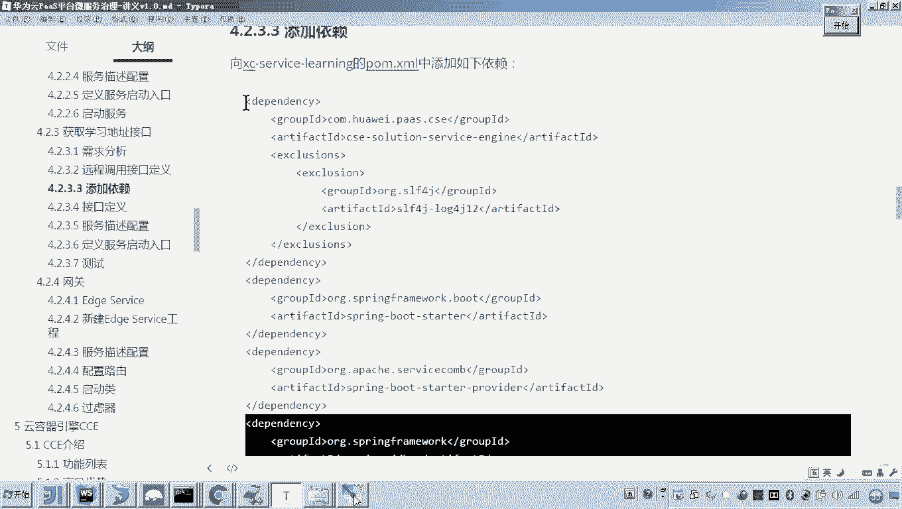
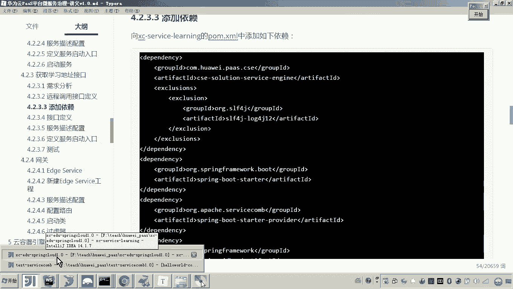
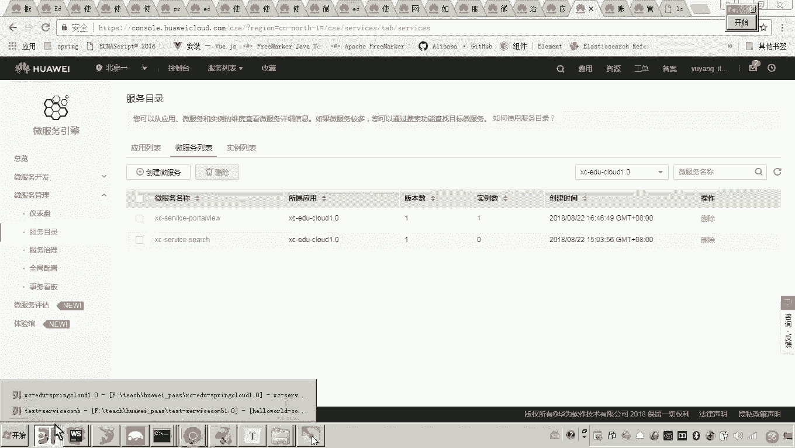
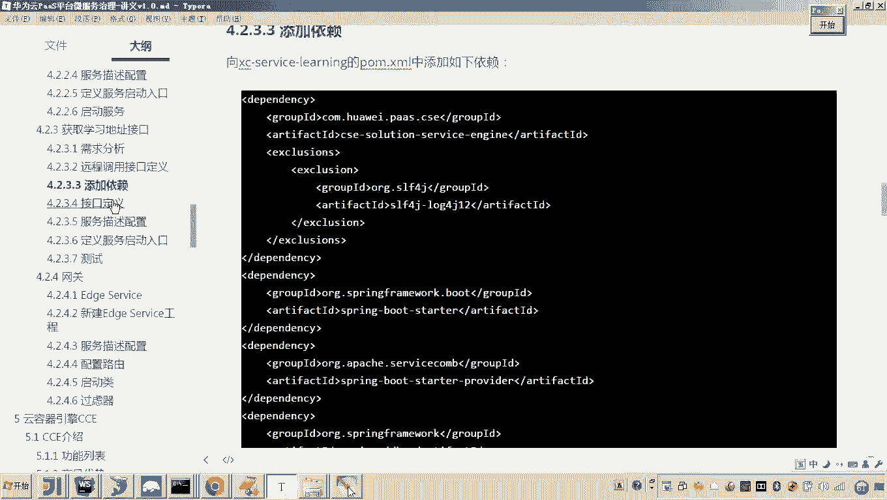
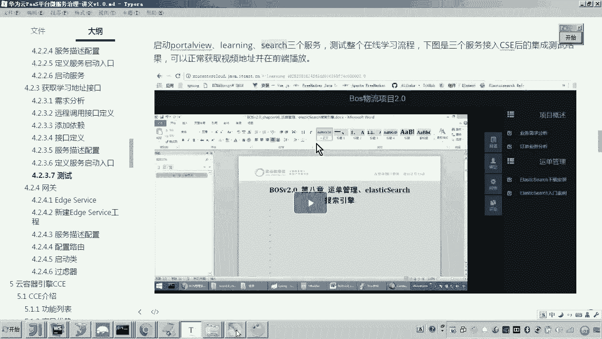

# 华为云PaaS微服务治理技术 - P94：02-学成在线项目接入CSE-学习服务接入CSE

## 概述
在本节课程中，我们将完成学成在线项目的最后一个微服务——学习服务的改造，使其接入华为云CSE（Cloud Service Engine）微服务治理框架。我们将重点学习如何改造包含远程调用的接口，并使用CSE提供的RPC方式进行服务间通信。

## 服务改造步骤

上一节我们介绍了门户视图服务的改造，本节中我们来看看如何改造包含远程调用的学习服务。

### 1. 添加CSE相关依赖
首先，我们需要在学习服务的`pom.xml`文件中添加CSE的核心依赖。这些依赖是服务接入CSE并正常运行的基础。

以下是需要添加的依赖项：
```xml
<!-- CSE ServiceComb 核心依赖 -->
<dependency>
    <groupId>org.apache.servicecomb</groupId>
    <artifactId>spring-boot-starter-provider</artifactId>
</dependency>
<!-- 其他必要依赖，如JDBC等 -->
```
添加依赖后，请刷新Maven项目以确保依赖生效。

### 2. 改造Controller接口
接下来，我们需要改造学习服务的Controller层。与之前的服务改造类似，核心是将Spring MVC的注解替换为CSE的注解。

具体操作如下：
*   将类上的`@RestController`注解移除。
*   将方法上的`@RequestMapping`、`@GetMapping`等Spring MVC注解，统一移动到类级别，并替换为CSE的`@RestSchema`注解。
*   为`@RestSchema`注解指定`schemaId`，例如：`@RestSchema(schemaId = "learning-service")`。

### 3. 处理远程调用（核心改造点）
学习服务有一个特殊需求：需要远程调用门户视图服务以获取视频播放地址。这是本次改造的关键部分。

在Spring Cloud架构下，我们使用`@FeignClient`来声明和调用远程服务。在CSE架构下，我们需要改用其提供的RPC调用方式。

**首先，找到远程调用的代码位置。** 在学习服务的`MediaFileService`中，存在一个`portviewClient`的成员变量，它原本通过`@FeignClient`注解注入，用于调用门户视图服务。

**然后，创建远程调用的门面类（Facade）。** 为了简化调用并提高代码复用性，我们在公共API模块中创建一个门面类`PortalViewApiFacade`。

```java
@Component
@Getter
public class PortalViewApiFacade {
    @RpcReference(microserviceName = "portalview-service", schemaId = "portalview-controller")
    private PortalviewController portalviewController;
}
```
这段代码的含义是：
*   `@Component`：将该类声明为Spring管理的Bean。
*   `@RpcReference`：这是CSE的注解，用于声明一个远程服务引用。`microserviceName`指定要调用的目标服务名，`schemaId`指定目标服务的接口ID。
*   这样，任何需要调用`portalview-service`的服务，只需注入这个`PortalViewApiFacade`，即可通过`getPortalviewController()`方法获得远程接口的代理对象。

**最后，修改学习服务的调用代码。** 在学习服务中，我们注入`PortalViewApiFacade`，并替换原有的`@Autowired`注入的Feign客户端。
```java
// 替换前
// @Autowired
// private PortalviewClient portviewClient;

// 替换后
@Autowired
private PortalViewApiFacade portalViewApiFacade;





// 在方法中调用
CoursePublish publish = portalViewApiFacade.getPortalviewController().getCoursepublish(teachplanId);
```



### 4. 修改启动类与配置文件
服务改造的最后一步是配置的调整。



**启动类**：在启动类上添加`@EnableServiceComb`注解，以启用CSE功能。
```java
@SpringBootApplication
@EnableServiceComb
public class LearningApplication {
    public static void main(String[] args) {
        SpringApplication.run(LearningApplication.class, args);
    }
}
```

**配置文件**：在`application.yml`中，需要配置CSE相关的注册中心地址、服务名等信息。
```yaml
servicecomb:
  service:
    name: learning-service
    version: 0.0.1
  rest:
    address: 0.0.0.0:40600
  registry:
    address: http://127.0.0.1:30100
```
请确保端口`40600`未被占用，并根据实际环境修改注册中心地址。

## 服务测试与验证
完成以上改造后，我们可以启动服务并进行测试。

1.  **启动服务**：依次启动门户视图服务（portalview-service）和学习服务（learning-service）。
2.  **检查注册**：在CSE服务注册中心（ServiceCenter）的控制台，查看`learning-service`是否成功注册。
3.  **接口测试**：使用浏览器或API测试工具（如Postman），调用学习服务的获取媒体地址接口。
    *   请求示例：`GET http://localhost:40600/learning/getmedia/{courseId}/{teachplanId}`
    *   如果接口返回正确的视频播放地址信息，则表明远程调用成功，服务改造完成。



## 总结
本节课中我们一起学习了如何将学成在线项目的学习服务接入华为云CSE。我们回顾了添加依赖、改造接口注解等通用步骤，并重点掌握了在CSE框架下如何进行服务间的远程调用——通过创建`@RpcReference`注解的门面类来替代原有的`@FeignClient`方式。至此，学成在线项目的三个核心微服务已全部成功接入CSE微服务治理框架。