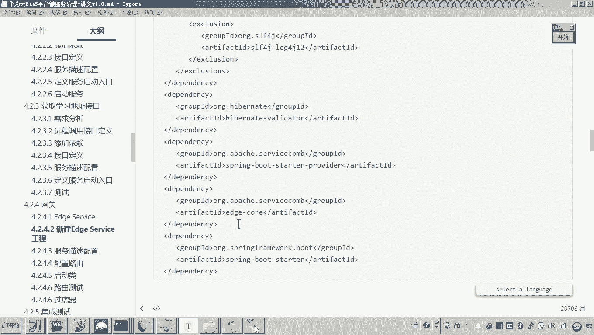
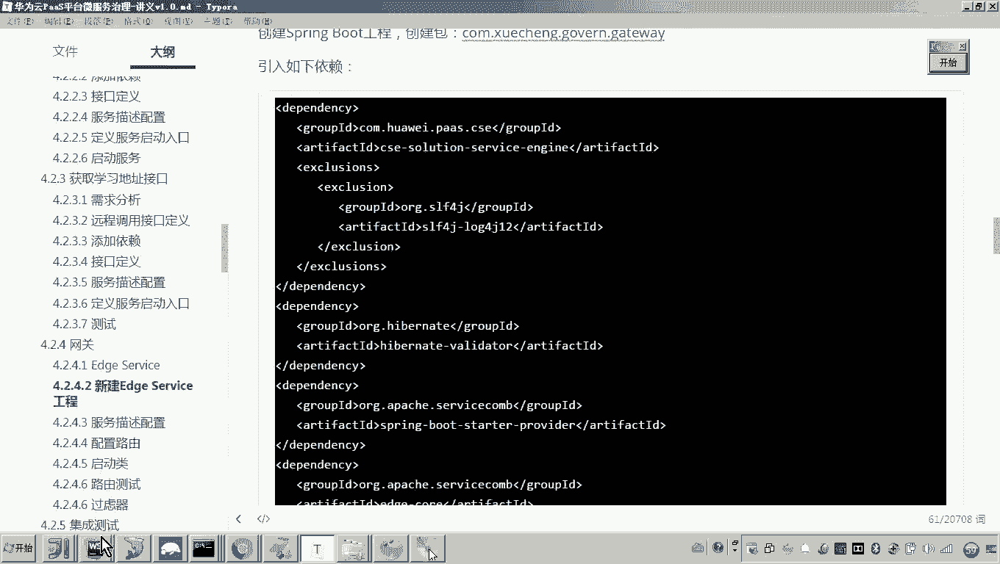
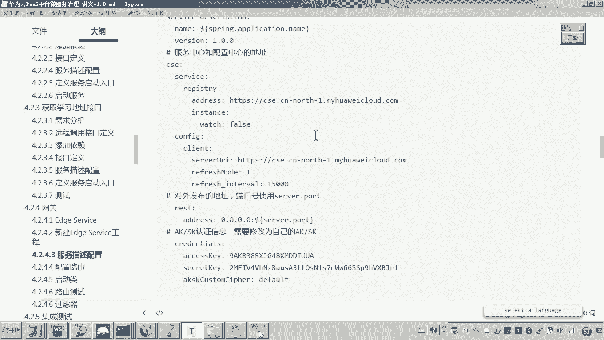

# 华为云PaaS微服务治理技术 - P95：03-学成在线项目接入CSE-网关-创建EdgeService工程 - 开源之家 - BV1wm4y1M7m5

好，那么下面呢哎我们来接入最后一个部分呢，就是学生在线的网关。嗯，好，那谈到网关呢，我们先来看一下啊，之前我们介绍的学生在线的微服务技术站，这里边呢这个网关各位可以看到它是在最前端啊。

前端请求网关是不是要把请求转发给各个微服务，对吧？啊，网关呢有路由的功能，还有什么功能呢？哎，就是过滤，对吧？好，那现在呢我们就来把这个网关呢也接入这个CSE。😊，好，那这个网关怎么介入CSE呢？

在spring cloud当中呢，入作为网关啊，大家可以看到我们现在的这个网关的代码呢在这儿哎，有一个叫X govern gate way。然后在这个里边呢，大家可以看到呃。

它就是采用呃spring cloud提供的这个入。嗯，好，那其实我们说CSE平台呢也也是支持这个采用入作为网关的啊。但是这个官方呢啊更推荐使用servicecom所提供的一个叫age service啊。

它呢来作为java网关服务。😊，所以对于我们java项目来说，我们推荐采用呃servicecom所提供的一个叫A service来做。那就说老师，那你这个A serviceice和入有啥区别吗？

他们都可以实现网关的功能。嗯，但是据华为内部测试呢，这个A级 service的这个性能要比入呢好一些。所以这里边呢我们呃并且啊我们说这个啊为了更好的使用云平台啊啊里边所提供的一些服务治理的功能。

所以这里边我也是推荐你用这个A级serv。😊，好，那现在呢我们就准备把这个网关呢采用Aservice呢来构建一下。😊，那怎么做呢？

其实这个AG service和当初我们采用入的方式来开发网关呢都差不多啊，也是通过配置的方式啊，就可以来实现这个路由。你看当初我们用入的方式，这里边是不是就可以实现路由的方式。

另外我们是不是也可以去自定义自己的怎么样过滤器，对吧？哎，没错，好，那这个我们啊来新建一个工程。😊，因为原来的这个网关呢是采用入啊，现在我们完全采用另外一个技术，所以我们不在原来的这个工程上改了啊。好。

我们新建一个工程。😊，好，那这里边呢我们选择负工程。好，那这个工程的名字叫什么呢？😊，呃，它是网关，所以我们来看一下啊呃原来的这个工程名字大家可以看到它是不是叫做呃呃呃这个盖住了，叫做XC呃。

g getway对吧？那现在呢我们我们把它换个名，哎，我们把它叫做X govern edge service。😊，嗯，好，我们叫这个名。好，那么这样的话，我们把这个工程呢，各位来看一下。

我都创建成功了吧。然后呢，在这个工程里头嗯，我现在要做什么呢？😊，啊，我我先把包建一下啊，这个包哎这个包其实可以和原来的这个gatet away的这个包保持一致的。我们来看原来的包啊。

叫com学层gaget way。好，这里边我们也这么做。😊，com学成，然后呢呃叫gn，还有什么get way。好，这样的话，我们把这个包是不是就建起来了？😊，对吧然后呢。

应个sspring boot的功能嘛。所以这里边呢我们把这个。😊，启动类也重建一下吧，这个启动类我们叫做嗯agserv。😊，嗯，好，这这些这些东西都干掉了，这个注解留着，因为现在我这个依赖没有加啊。好。

那现在呢我们来添加依赖啊，添加依赖。😊，这个age service啊，我们要添加什么依赖呢？其实我们添加还是CSE的这些依赖都要加。😊，啊。

另外啊另外还要加一个呃servfacecom提供的一个叫A级com啊，A级的一个核心包。好，我们把这几个依赖加进去。😊。

所以这几个依赖呢，各位其实很熟悉的啊呃唯一变了一个就是这个A级扣看见了吗？好，然后这里面我们刷新一下。😊，好，那大家来看啊，刷新完了之后嗯。😊，对以刷新刷新完了之后，各位他是不是就不报错了吧。好。

那这样的话我们来看一下这个这个启动类其实也是有问题的。我们要把这个东西加进去哪个东西啊，叫enable什么呀？😊，Enableable servicecom。好。

这样的话我们发现这个呃工程是不是创建好了。另外还有一个配置文件啊，spring布的工程嘛，还有一个配置文件叫application。😊，对吧哎呃，另外呢，应该还有什么呀，还有标配嘛。

什么标配这个日志日志也拷过去。😊，看懂吧？好，这样的话，我们把这个工程到这儿，我们是不是就创建好了？对。😊，那么创建好了这个工程之后呢。

接下来我们就可以去采用呃Aserv给我们提供的要求呢啊来配置了来配置。好。怎么做呢？我先把这个最基础的配置配上去啊。😊，嗯，好，这个这个名变一下这个名是不是叫做什么呀？A姐。😊。

servervicice。啊，可以吧。好。😊，那现在现在的话，我们就准备来。呃，先配置我们的这个配置文件了哎，配置配置文件。好，那这个配置文件呢，刚才我是不是已经配好了这一部分呢。

也一个是ser server，就是配置了一个端口，对吧？啊，一个是这个呃，我的这个服务名。😊，啊，这个服务名。这个配置是用于什么呀？是不是spring boot对吧？那其实我们要配呃。

我们要我们要这个使用servicecom的方式啊，这个servicecom框架来开发我们的微服务的话，我们是不是还需要配置一个怎么呀？😊，大家有印象吗？是不是还要配置一个配置文件，叫做micro。😊。

miccro service YAML是不是这个配置文件。对，那其实我们啊把那个配置文件的内容放到application当中也可以啊。所以我这里边就不再配那个miccroserv YAML了。

那我这里边直接往里边放了啊，放什么？大家可以看到这个配置你应该很熟悉吧，是不是就是应用的名称，然后微服务的版本号，这是什么？😊，这个是不是就是我们说的那个注册中心的地址是吧？对。

那这个呢这是一个配置中心的地址，他俩地址一样啊，嗯都是指的这个公网的云平台的那个地址啊。😊，好，我把我把这一堆配置呢给他拿过去。😊，拿过来。因为这里边的这些配置。

各位这些配置是不是就来源于我们之前写的这个微服务里边的这个呃叫做miccro呃microserv YML各位跟那个配置是不是一样？😊，哎，无非这里边呢，各位我是把这个配置信息是不是放在哪里了？

放在了这个application。😊，YML里面了。啊，好，那到这了来说的话，我这个配置是不是就配好了吧？对。😊，好，那那这个配置配好了之后呢，那这个这个这个这个工程呢，其实我我现在启动了。

它就应该是可以去加入到这个呃服务的注册中心了。😊，因为这里边我这个公网的地址是不是已经配过了嗯，所以现在呢其实我们就可以来测试一下。😊，嗯，来我们把这个依赖的包刷新一下。然后现在呢我们就启动这个启动类。

那我们启动完了之后呢，大家一定注意要观察的是什么呢？就是看他哎是否在注册中心成功注册。😊，那可以看到是不是就提示了finish的。😊，然后呢，我们就找到我们的注册中心来我们登录云平台。

然后找到微服务引擎，然后找这个服务目录，然后看这里头各位是不是就有这个啊A级service。对。😊，好，那现在我们把这个A serviceice呢就啊发布成功了。

但是现在这个A serviceice现在还不能用。哎，为什么呢？因为现在我还没有配置它的路由网关的作用就是通过路由哎，将请求转发到微服务，对吧？好，那现在呢我们先告一段落。哎。

就是整个服务工程我已经创建成功，可以成功注册了。😊。

