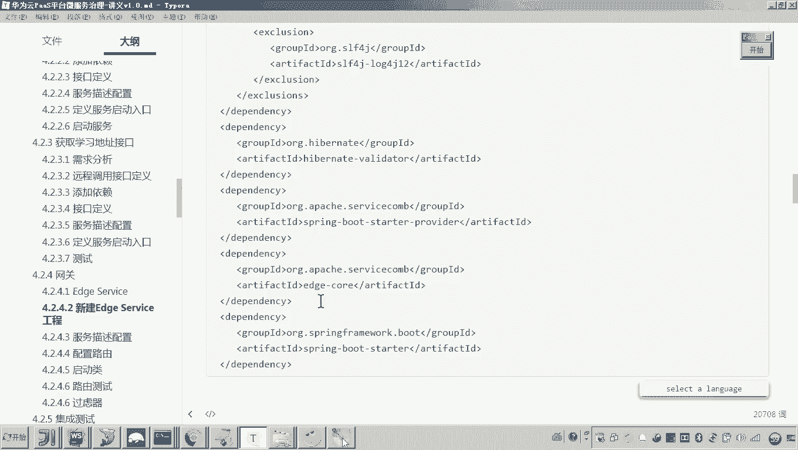
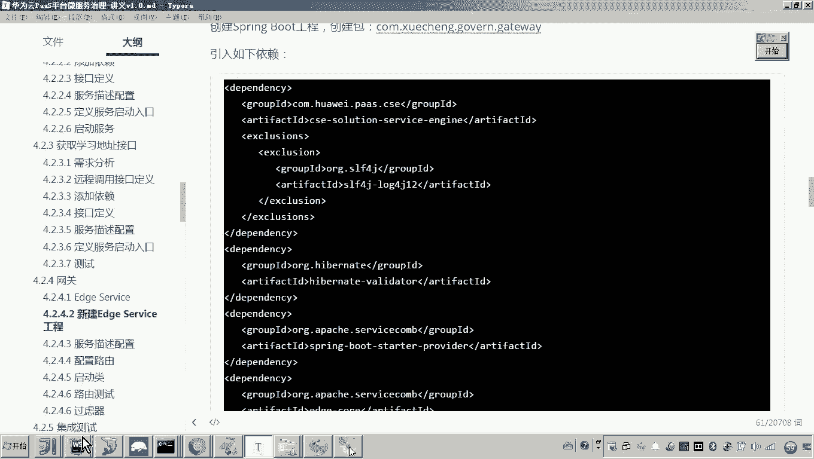
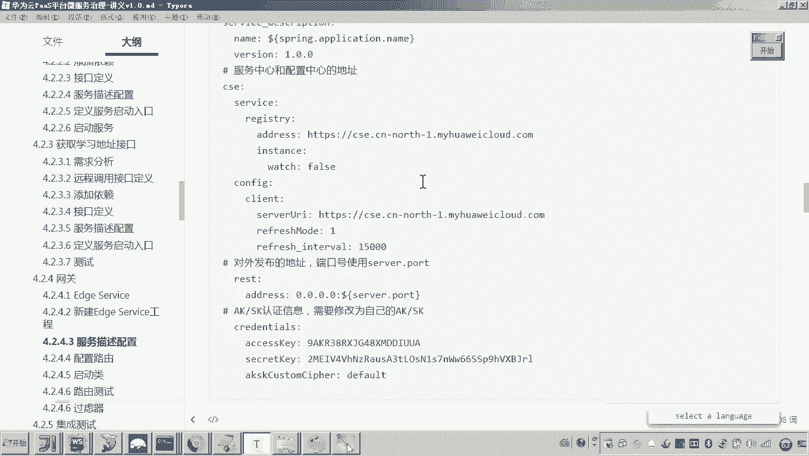

# 华为云PaaS微服务治理技术 - P95：03-学成在线项目接入CSE-网关-创建EdgeService工程 🚪

在本节课中，我们将学习如何为“学成在线”项目创建一个新的网关服务，并将其接入华为云CSE微服务治理平台。我们将使用ServiceComb提供的EdgeService来替代原有的Spring Cloud Gateway，以实现网关功能。

## 概述

上一节我们介绍了微服务的基本接入。本节中，我们来看看如何将网关服务接入CSE。网关位于微服务架构的最前端，负责接收所有外部请求，并将其路由到相应的后端微服务。它主要承担**路由**和**过滤**两大核心功能。

## 创建EdgeService工程

由于官方推荐使用ServiceComb提供的`EdgeService`作为Java网关服务，并且其性能优于Zuul，我们将新建一个独立的工程，而不是修改原有的`xuecheng-gateway`工程。

以下是创建新工程的步骤：

1.  **新建Maven工程**：创建一个新的Maven父工程，命名为`xuecheng-edge-service`。
2.  **创建包结构**：在`src/main/java`目录下，创建与原有网关一致的包结构：`com.xuecheng.gateway`。
3.  **创建启动类**：在包内创建启动类`EdgeServiceApplication`，并添加`@SpringBootApplication`注解。
4.  **添加项目依赖**：在`pom.xml`文件中添加必要的依赖，包括CSE核心依赖和EdgeService专用依赖。



```xml
<!-- CSE 核心依赖 -->
<dependency>
    <groupId>com.huaweicloud</groupId>
    <artifactId>spring-boot-starter-huaweicloud-servicecomb</artifactId>
</dependency>
<!-- EdgeService 核心包 -->
<dependency>
    <groupId>org.apache.servicecomb</groupId>
    <artifactId>edge-core</artifactId>
</dependency>
```



5.  **完善启动类**：在启动类上添加`@EnableServiceComb`注解，以启用ServiceComb框架。
6.  **复制配置文件**：创建`application.yml`配置文件，并复制项目通用的日志配置文件。
7.  **配置服务信息**：在`application.yml`中配置Spring Boot应用端口、服务名，以及CSE所需的微服务注册与配置中心地址。

```yaml
server:
  port: 63010

spring:
  application:
    name: edge-service

# CSE 配置
servicecomb:
  service:
    application: xuecheng-online
    name: ${spring.application.name}
    version: 0.0.1
  config:
    client:
      serverUri: https://cse.cn-north-4.myhuaweicloud.com:443
  registry:
    address: https://cse.cn-north-4.myhuaweicloud.com:443
```

## 验证服务注册

完成上述配置后，我们可以启动`EdgeServiceApplication`来验证服务是否能成功注册到CSE服务中心。

1.  启动工程，观察控制台日志，确认出现类似“Finish init microservice...”的提示。
2.  登录**华为云控制台**，进入**微服务引擎** > **服务目录**。
3.  在服务列表中查找名为`edge-service`的服务。若能找到，则证明网关服务已成功注册到CSE平台。

至此，我们已成功创建了EdgeService工程并将其接入CSE。目前，该网关服务已具备服务注册与发现的能力，但尚未配置具体的路由规则，因此还无法转发请求。路由配置将是下一节的重点内容。

## 总结



本节课中我们一起学习了如何从零开始创建一个基于ServiceComb EdgeService的网关工程，并将其成功注册到华为云CSE微服务治理平台。我们完成了工程搭建、依赖配置、服务注册等关键步骤，为后续实现网关的路由和过滤功能打下了基础。