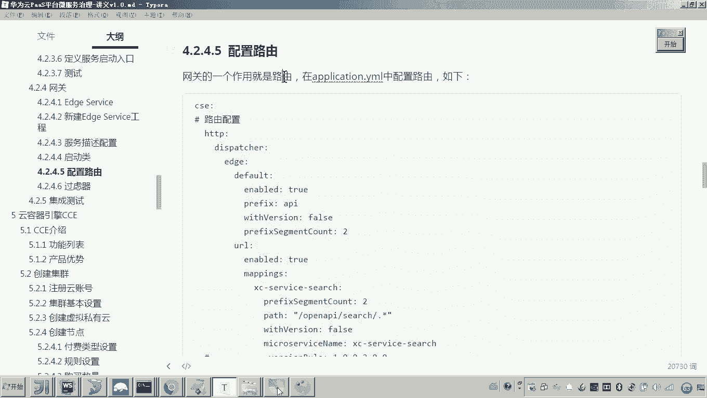
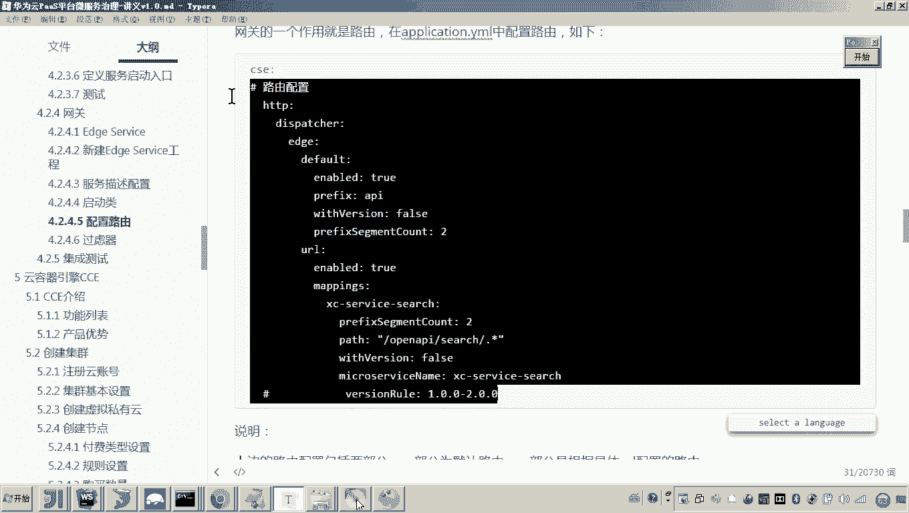
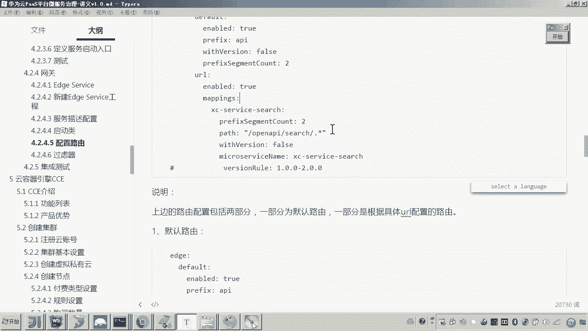

# 华为云PaaS微服务治理技术 - P96：04-学成在线项目接入CSE-网关-配置路由 - 开源之家 - BV1wm4y1M7m5

好，那么接下来呢我们就来实现网关的路由。好，那这个网关路由怎么实现呢？大家来看到这里边有一堆的配置，对吧？好，呃这里呢我们把这一堆配置呢先配一下，配完了之后呢，我给大家解释，然后呢再进行测试。😊。

找到这个application YML这个文件。然后我们在最下面来，我们把这一堆配置加上，注意这个HTTB的这个标签是基于这个CSE的啊。然后这前面是要有空格的啊。好。😊，那这个配好了之后呢。

这个路由呢，我准备讲两个部分啊，一个部分是这个默认路由，就是这一块的代码。另外一个部分就是基于URL来配置的这个路由方式。好，那现在我们先说第一部分啊，这个默认的路由，这是什么意思呢？😊。

注意这个默认路由是在这一块啊，在这一块这个enable呢处就表示我们来激活默认路由。然后这个前缀呢就表示这个这个是什么呢？这表示我们说的这个呃，请求URL的前缀。😊，这个前缀是不是统一都以API打头。

对吧？嗯。😊，还有一个使用这个wa version，这个叫force啊，这是什么意思呢？还有包括这个有个叫prefi，哎，这个是什么意思呢？叫是前缀的断的数量。哎，是2。好，我来解释一下这个默认路由啊。

它怎么个默认方式呢？它是这么个意思。😊，啊，他他用准备是根据这一种方式来啊来请求我们的网关。什么方式呢？就是杠前缀。杠微服务的名称，然后后边是微服务的具体地址。

然后呢哎如果你这个with version哎写成te的话，那么你这个请求的地址就变成了就是哎杠前缀这个前缀是不是就是API了是吧？是就是杠API然后杠微服务的名称。嗯，然后呢版本号哎，举个例子啊。

我举个例子你就知道了。假如说我现在准备请求搜索服务，对吧？通过网关请求搜索服务，那你要请求的地址就是杠API这个API各位是不是在这是个前缀我是不是定好了，然后杠呃X service search。

这是不是就是搜索服务的微服务名称，然后再杠哎杠 course后边这一堆各位后边这一堆是不是就是搜索服务的那个具体的UIL了，对吧？所以前边是固定的。😊，嗯，这就是默认路由的访访问方式。然后呢。

我们说这个呃网关呢就会根据你请求的这个地址啊，根据这个规则呢，由于你这个第二部分是不是叫做XZ service search，他就会知道这哎从这个服务注册中心找到这个微服务。

然后把请求把后边的这个URL呢转发到这个微服务上，它是这样一个流程。😊，好。那比如说老师这个with version是啥意思呀？哎，with version其实刚才我已经解释过了。

就是如果你这个with version哎写成t的话，那么你再来请求这个网关哎，通过网关请求微服务的话，那这个格式就变成了什么呀？

就变成了叫做杠API哎XCserv杠设去然后后边杠不要是UL然后加一个版本号，这个这个是就是这个表示的是使是否使用版本号嗯。😊，好，那么再有一个这个呃，这是什么？哎，这就叫做前缀的这个断的数量。

啥意思呀？那么是写个二是啥意思呀？各位各位你来看，就是说我们准备去请求这么一个地址。😊，在这个地址的前边，这。都是前缀部分，而后边的这一堆是不是才是我们说的微服务的，就是搜索服务的具体的UIL了，对吧？

哎，所以你来看这个前缀的包括几段呢？哎，是不是就是两段？😊，比如说啥啥两段呢？各位，你来看这个杠API就是一段，然后杠X service就是一段，这就是第一段，这就是第二段看懂了吗？所以这里边我要配2。

😊，明白吗？好了，我现在给你出一道题啊。如果我现在把这个啊with version写成 true。😡，这个时候你要来请求我的微服务的话，你就不能这么请求了。😡，你说那咋请求呀，你就要这么请求了。哎。

在后边你要加什么呀？加1。0。0。假如说我的版本号是1。0。0啊，你要这么讲，你要这么写。😡，这样的话，我问你这个前缀就变成几段了。😡，这是不是一段？😡，后边这个呃这这是不是另外一段，后边这是个版本。

是不是第三段，所以这儿就应该配什么呀？3。😊，看懂了吧？哎，好，那这样的话，我们说这就是一个默认哎默认这个路由的这个配置。😊，好，那现在默认路由我说完了之后呢，我们啊就来测试一下。

来看一下它到底能不能给我们转发。好，注意看啊，注意看呃，先不看URL了。我现在先讲的是不是前面这一段呀？好，那现在呢我们把它重启一下。😊，好。重启之后呢，我们现在要来访问哎，我们的搜索服务。

我这里边以搜索服务为例。哎，有人说老师，那你除了访问搜索服务，还能访问啥服务？你注意就是现在这个age service是不是已经注册到我的服务中心了？😡，大家可以看到。

现在服务中心是不是已经有这个A serviceice了。对，那在服务中心当中，我问你现在是不是有这三个服务？😊，所以通过这个网关，你可以访问这三个服务。都可以访问这三个服务。什么意思啊？

就是注册中心当中的服务呢，通过网关都可以访问。😊，好，那现在呢你光把这个Aservice起来还不行，因为你要访问搜索嘛，所以你现在还要启动一个搜索服务。对，搜索服务你得起起来。😡，有人说老师。

你咋知道没起来的嘛？你看嘛，看字儿，他这个服他这个服务后边是不是这个实力是零啊？😊，这时又表示这个服务没有起来呀。😊，好，那现在呢我们把这个呃服务就提起来了。😊，提起来之后呢，我们现在来看啊呃。

这里边各位来看一下啊，我现在就准备访问了啊，那怎么访问呢？😊，那你看我这个A service，它的端口对外暴露的端口是啥端口啊？😡，因为你要通过网关嘛，你肯定是访问网关嘛，这个网关是不是叫50201啊？

来看一下啊，我现在准备访问了。😡，呃，来叫做HTTP杠杠local host50201。我问你这个地址是不是我们说的这个网关的地址，对吧？哎，通过网关，刚才咱们是不是说他有个前缀叫API。

然后后边是不是跟我们说的这个微服务的名字？😡，来再再打一遍啊。叫50什么呀？对，50。201是不是这个地址？😡，那大家来看。这个杠API就是我们这个默认路由所要求的它的前缀。😡，是不是就是杠API？对。

然后哎后边跟什么呢？是不是跟这个。😊，这个这个微服的名字。这后边是不是就是搜索里边的那个URL了？对，那你现在访问的是不是访问我们说的这个搜索服务啊。

你找到这个URL这个s杠s去杠course是不是就这前缀了，list似的是不是就这个URL，你再打一段点，你试试。😊，看一下啊。哎，首先。现在我请求的各位，我是请求搜索吗？我不是请求搜索吧。

我是不是请求网关的，我是不是要通过网关来请求搜索，所以你刷新，现在网关已经把这个请求转发给搜索了，看见了吗？然后这因为这个这个类是不是就是搜索服务的类啊？好，然后放心。😡。

各位可以看一下这个数据是不是就已经出来了，这就是哎网关的这个路由功能。看懂了吗？哎。😊，好，这种方式是默认的这个路由方式。那现在还有其他方式呀，还有一个叫做根据URL来匹配路由。😊。

那应该说是呃两种方式呢都可以啊啊那现在呃你会发现的话啊来看一下我们打开这个serv啊在这个里边呢呃我们来看这个默认路由呢，你只能配这一段你要注意。而这个URL呢你就可以配很多段什么意思啊？

我我讲一下这个配置啊，这个Enable呢也要打成处啊，就表示使用这个URL的这个路由方式啊，然后固定的啊从这开始这就是一部分了。对，那这个名字啊，这个名字就表示其中一个URL的这个匹配规则啊。

这这个这个名字，如果当初你学过这个入的话，那各位其实这个名字就和当初我们学习的这个入网关的这个这个这个名字是一样的，叫路由名称名称任意保持所有路由名称唯一就可以了。那这个也一样。😊，打开这个A啊。

就这个名称就是一个URL匹配规则的名称啊，这个这个名称你ABC什么东西都可以，但是你要保证这个名称啊，不同的这个什么呀，不同的这个这个这个这个名称是不一样的。好，然后这个各位你知道吧？

这是不是就是前缀段的这个数量，对吧？然后这个pass是啥意思？是不是以杠open杠打头的。那么就要把这个请求转发给这个微服务了，后边这个是不是一个正则表达式啊，这表示匹配后边多级目录，对不对？

星表示多级目录嘛。哎，好，那现在呢我们来看现在我把这个呃这个URL配置讲完了之后，各位我现在是不是就可以来测试一下？😊，比如说老师那怎么测试呀，各位我现在只要变动一下就可以了，怎么变动。看好看好。

原来我是不是访问这么，我我现在这种方式是不是用使用默认路由啊？哎，我准备这么做，看好啊。😊，然后我准备在这配一个叫open APII。看懂吗？然后后边是不是叫s去？😡。

我问你这一段东西匹配的是不是就是我们看到的这个pass的前边。但是你说他要转发，他是不是把后边这一部分URL转给这个微服务了，是吧？所以你后边的哎后边的那个什么呀？😡，这一部分。😡。

就是搜索服务的UIL看懂吗？回侧。😡，大家来看这个数据是不是照样可以出来。所以这个过程走的是不是就是我们说的URL的这种路由方式嗯。那你说老师，你你这个是1个URL，我想配多个咋配，很简单，各位看一下。

😡，我给你配一下。比比如说我现在再给你配一个什么呢？😡，嗯，我给你配一个叫做呃port头 view。可以吧？好，然后这个这个就是port view。😡，没问题吧。

那这个这个port view的微服务的名字是什么呢？微服务的名字，你得找到工程啊，找工程看好这工程在这配的有，你看微服务的名字，你复制。😡，然后把它附到这个A service里头。各位。这我就配好了。

看懂了吗？哎，那现在我我配好了之后呢。😡，各位，那我现在是不是就可以测试了？你别着急啊，我们得把它启动一下。😊，哎呀那怎么测试呀？😡，那你得找这个port view的接口了，你看你想测哪个接口。😡，啊。

它有很多接口嘛，这里边是不是有一个叫做哪个呀？😊，哎，有一个叫做。是不是有一个get看见吗？我就我就测这个接头可以吧。😊，哎，那后边是不是要跟这个杠post view，然后杠 cross。

然后get可以吧？好，那现在呢我们测这个接口。😊，怎么测呀？就前面这一部分还不变，看好。😡，给你打开来，在这儿啊，这是不是就变成抛头 bill了？😡，然后后边前边是前缀。

是不是匹配的那个URL的那个前缀啊，后边看好，后边就是port view的这个UL了，叫port view course，然后get后边后边是干嘛，是不是要跟这个ID了，对不对？跟ID好。

那怎么怎么跟ID啊？😊，你找1个ID呀。😡，找一个。然后在这个view course当中，我们找一个课程。看好啊，你把它拿过来。行不行？再行不行，各位。😊，数据是不是又出来了？哎，你换一个课程。😊，啊。

再换一颗子。😊，还这个。看到了吗？对，所以我以上讲的这就是根据URL哎来匹配这个来进行路由哎，路由转发嗯。好，那么在这个URL匹配里边，还有一个参数，我没有说到哎，叫做version room。哎。

这是什么意思呢？😡，这叫做版本规则。哎，你说这是啥意思呀？这个常用于灰度发布啊，这个灰度发布又是什么意思啊？我举个例子啊，灰度发布就是说当我现在微服务的版本想升级了。😊，那你升级，你想平滑升级。

就说我有10个微服务，对吧？哎，我我先升5个啊，先升一个，我先看看这个效果。所以各位哎那这个请求，如果你把这个V哎，这个入打开，它就表示什么呀？表示哎，1。0后边你配个1。0-2。0是吧？就表示1。

0到2。0版本之间，那这个请求有效。也就是说这个请求会转发给那些1。0到2。0的这个微服务。😊，懂这意思吧？哎，就比如说将来我们说我我我要升级了，我要升怎么样，我要升1个2。0版本。好。

那现在呢我们我们就可以定一个路由。好，这个路由呢转发给2。0，我们看看效果。😊，看懂这意思了吧？哎，好，这就是一个灰度发布的一个配置啊。好，那么以上呢我们就讲完了这个路由的配置啊。

路由这里边我们是不是讲了两种，一种是默认路由，一种是基于URL哎来定义的这种路由好。😊。

