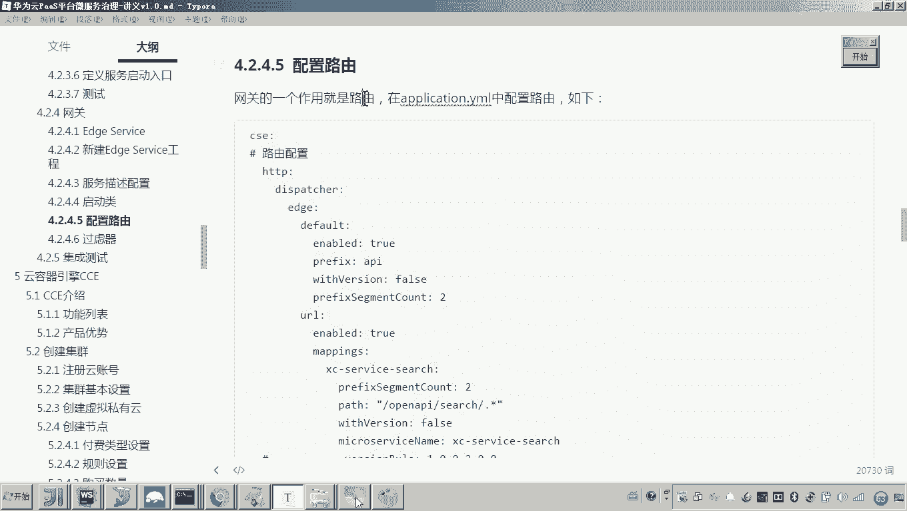
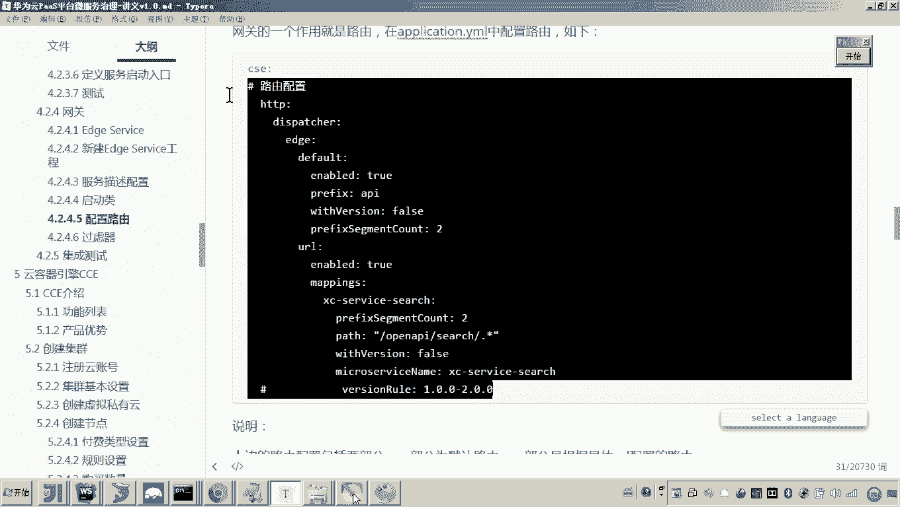
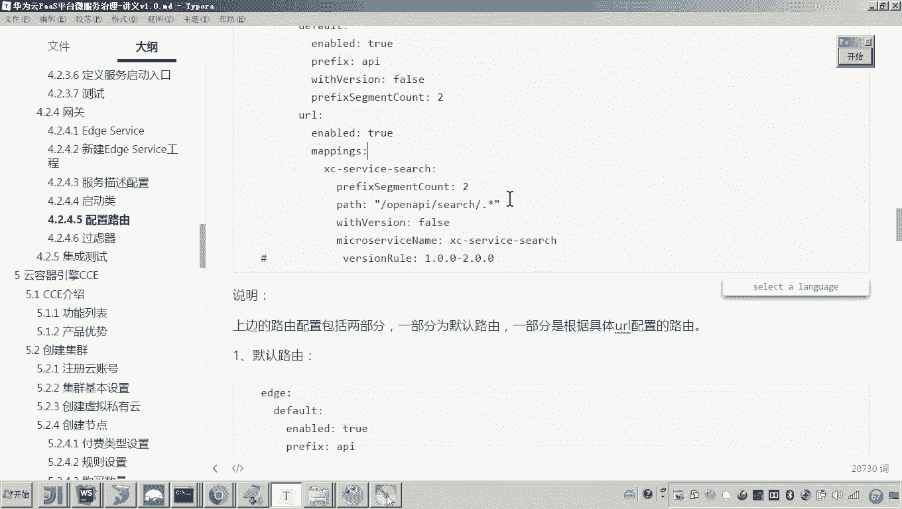

# 华为云PaaS微服务治理技术：P96：04-学成在线项目接入CSE-网关-配置路由 🚪





在本节课中，我们将学习如何为华为云CSE微服务网关配置路由规则。路由是网关的核心功能，它决定了外部请求如何被转发到内部不同的微服务。我们将重点介绍两种配置方式：默认路由和基于URL模式的路由。

---

## 概述

网关作为微服务架构的入口，其路由配置至关重要。本节我们将通过配置`application.yml`文件，实现两种路由转发策略，并解释其工作原理，最后通过实际请求测试验证配置的正确性。

---

## 配置网关路由

首先，我们需要在网关服务的`application.yml`配置文件中添加路由相关的配置。以下是需要添加的配置内容，请注意缩进格式。

```yaml
cse:
  http:
    dispatcher:
      default:
        enabled: true
        prefix: api
        withVersion: false
        prefixSegmentCount: 2
      url:
        enabled: true
        rules:
          search:
            patternSegmentCount: 2
            path: /open/**
            microserviceName: xc-service-search
          portview:
            patternSegmentCount: 2
            path: /portview/**
            microserviceName: xc-service-portview
```

配置完成后，我们分别来解释默认路由和基于URL的路由。

---

## 默认路由详解

上一节我们完成了基础配置，本节中我们来看看默认路由的具体含义。默认路由的配置块位于`cse.http.dispatcher.default`下。

*   `enabled: true`：表示启用默认路由功能。
*   `prefix: api`：定义了请求URL的统一前缀。这意味着所有通过默认路由的请求，其路径都必须以`/api`开头。
*   `withVersion: false`：表示是否在请求路径中包含微服务版本号。如果设置为`true`，则请求格式会发生变化。
*   `prefixSegmentCount: 2`：定义了“前缀”部分由几段路径组成。

**默认路由的工作流程如下：**
当网关收到一个形如 `/api/微服务名称/具体接口路径` 的请求时，它会提取路径中的“微服务名称”部分（即`/api`之后的第一个路径段），然后去服务注册中心查找同名微服务，最后将“具体接口路径”转发给该微服务实例。

**举个例子：**
假设我们要请求搜索服务（`xc-service-search`）的课程列表接口（`/search/course/list`），通过网关的完整请求地址将是：
`http://localhost:50201/api/xc-service-search/search/course/list`
*   `/api` 是固定的前缀。
*   `/xc-service-search` 是微服务名称，网关据此找到目标服务。
*   `/search/course/list` 是搜索服务内部的真实接口路径，由网关转发过去。

**关于 `prefixSegmentCount` 和 `withVersion`：**
`prefixSegmentCount` 用于告诉网关，URL中哪几段属于“前缀”，不应转发给后端服务。在上面的例子中，前缀是 `/api/xc-service-search`，共两段，因此配置为 `2`。
如果 `withVersion` 设置为 `true`，则请求格式会变为 `/api/微服务名称/版本号/具体接口路径`。此时，前缀就变成了三段（例如 `/api/xc-service-search/1.0.0`），`prefixSegmentCount` 就需要相应地改为 `3`。

---

## 测试默认路由

理论解释完毕，现在我们来实际测试默认路由是否生效。测试前，请确保网关服务（`gateway-service`）和搜索服务（`xc-service-search`）均已启动并在服务注册中心可见。

以下是测试步骤：
1.  在浏览器或API测试工具中，构造请求URL。
2.  使用网关的端口（例如`50201`）和配置的默认路由前缀。
3.  访问搜索服务的课程列表接口。

我们使用浏览器访问以下地址进行测试：
`http://localhost:50201/api/xc-service-search/search/course/list`

如果配置正确，网关会接收该请求，将其转发给`xc-service-search`微服务，并返回课程列表数据，这证明默认路由配置成功。

---

## 基于URL模式的路由

除了默认路由，CSE网关还支持更灵活的基于URL模式（Path）的路由配置。这种方式允许我们为不同的URL路径模式指定不同的后端微服务。

配置位于 `cse.http.dispatcher.url.rules` 下，我们可以定义多个规则。每个规则需要以下属性：
*   **规则名称**：例如 `search`，`portview`，名称需唯一。
*   `patternSegmentCount`：与此规则匹配的路径前缀段数。
*   `path`：定义URL匹配模式，支持通配符`**`。
*   `microserviceName`：匹配该模式的请求将被转发到的目标微服务名称。

例如，我们配置了这样一条规则：
```yaml
search:
  patternSegmentCount: 2
  path: /open/**
  microserviceName: xc-service-search
```
它的含义是：所有以 `/open/` 开头的请求（`**`代表匹配多级目录），都将被转发给名为 `xc-service-search` 的微服务。网关会剥离前两段路径（即 `/open/search`），将剩余部分转发给后端。

---

## 测试URL模式路由

现在，我们来测试基于URL模式的路由。我们配置了两条规则，分别将请求转发到搜索服务和门户视图服务。

**测试搜索服务路由：**
根据配置，以 `/open/search` 开头的请求会转发给搜索服务。我们访问以下地址：
`http://localhost:50201/open/search/course/list`
访问成功并返回数据，说明URL路由规则生效。

**测试门户视图服务路由：**
我们配置了另一条规则，将以 `/portview/` 开头的请求转发给门户视图服务（`xc-service-portview`）。我们测试其课程查询接口：
`http://localhost:50201/portview/course/get/4028e581617f945f01617f9dabc40000`
同样，网关成功将请求路由到了正确的服务并返回了课程详情数据。

---

## 高级特性：版本规则与灰度发布

在基于URL的路由配置中，还有一个可选参数 `versionRule`，它用于实现**灰度发布**场景。

**什么是灰度发布？**
灰度发布是一种平滑的系统升级策略。例如，当我们需要将微服务从版本`1.0.0`升级到`2.0.0`时，不是一次性替换所有实例，而是先让一小部分实例（比如10%的服务器）升级到新版本，并将一部分用户流量导入新版本进行测试。待验证无误后，再逐步扩大范围，直至全量升级。

**`versionRule` 的作用：**
`versionRule` 参数可以指定一个版本范围（如 `1.0.0-2.0.0`）。配置了此规则的路由，只会将请求转发给版本号在此范围内的微服务实例。
例如，你可以为新版`2.0.0`的服务单独配置一条路由规则，并将测试流量导入该规则，从而实现流量的可控切换，这就是灰度发布的核心实践之一。

---

## 总结

本节课中我们一起学习了华为云CSE微服务网关的路由配置。
*   我们首先在 `application.yml` 文件中完成了路由的基础配置。
*   接着，我们深入探讨了**默认路由**的工作原理，它通过固定的URL前缀格式（`/api/微服务名/接口路径`）来转发请求。
*   然后，我们学习了更灵活的**基于URL模式的路由**，它可以为不同的路径模式指定不同的后端服务，配置方式直观且强大。
*   最后，我们了解了 `versionRule` 参数在**灰度发布**场景下的应用，这是实现服务平滑升级的重要功能。



通过本课的学习，你应该能够根据实际需求，为微服务网关配置合适的路由策略，从而有效地管理服务间的请求流量。