# 华为云PaaS微服务治理技术 - P97：05-学成在线项目接入CSE-网关-过虑器 - 开源之家 - BV1wm4y1M7m5

好，那下边呢我们来学习网关的最后一部分知识叫过滤器的定义。好呃，过滤器呢，当初我们在用这个入的方式呢，其实入这个网关呃也是支持来使用过滤器定义过滤器的对吧？

那我们可以看一下当初它是不是可以继承这个入 filterter啊。然后这里头呢，它有几个方法，我们就可以去定义自己的这个方法的内容。😊。

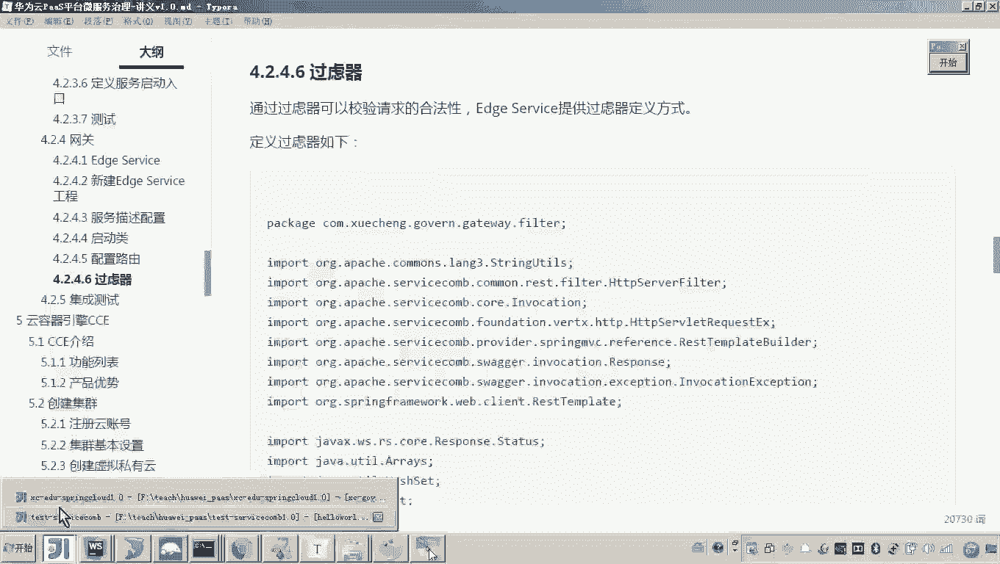

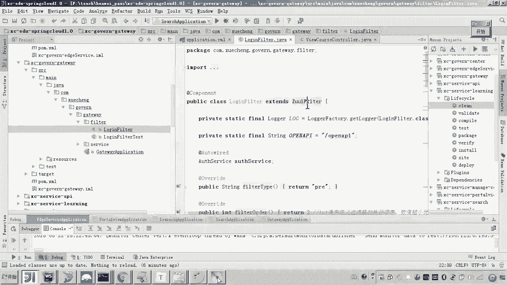

而这个H service呢，它也支持这个自定义过滤器的方式啊。那现在呢我们来看一下啊，我们来看一下那它是怎么定义过滤器呢？我们先明确我们的需求吧。呃，当初这个入的这个网关呢。

这个他的过滤器的内容是呃当这个用户啊嗯就是请求到网关。😊。

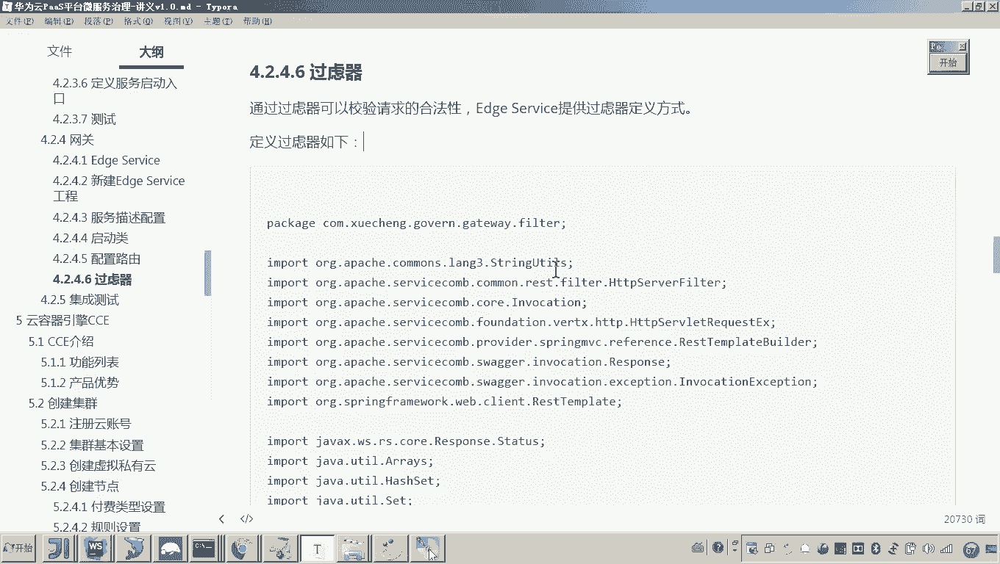

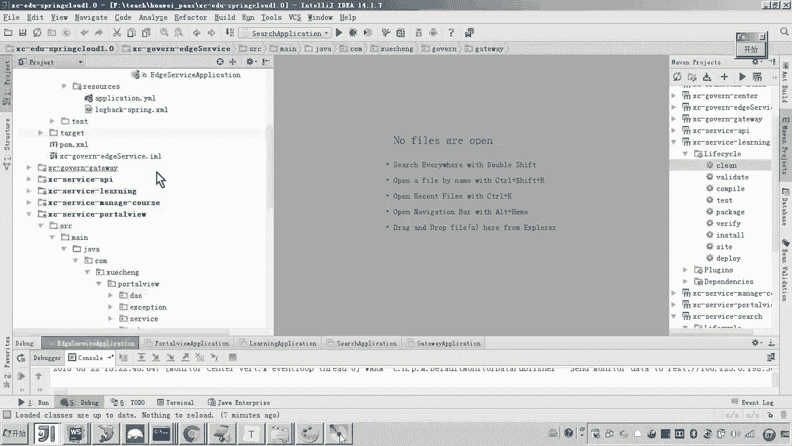

啊，对于这种需要去校验用户身份的这个请求呢，他要啊看一下你有没有taken这个令牌。如果没有的话，他会让你登录。哎哎，如果有taken令牌呢，就校验taken令牌。对。

当嗯不需要去校验去登录的这种请求呢，啊，它就会放行，所以大概就是这么过这个过滤器的一个作用吧。好，那这个过滤器的功能呢，我就说完了，接下来呢我们来定义过滤器。嗯，然后我们这么做看好我一边定义一边讲了啊。

在这个getway里边我建一个包叫filter。😊。

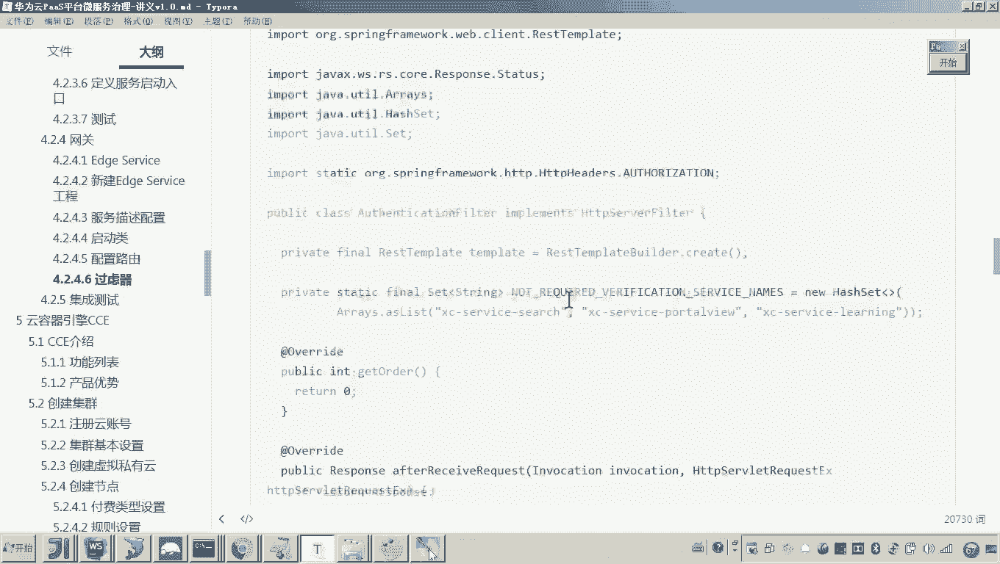

然后在这个里边呢，我定一个类啊，叫authentation filter。😊。

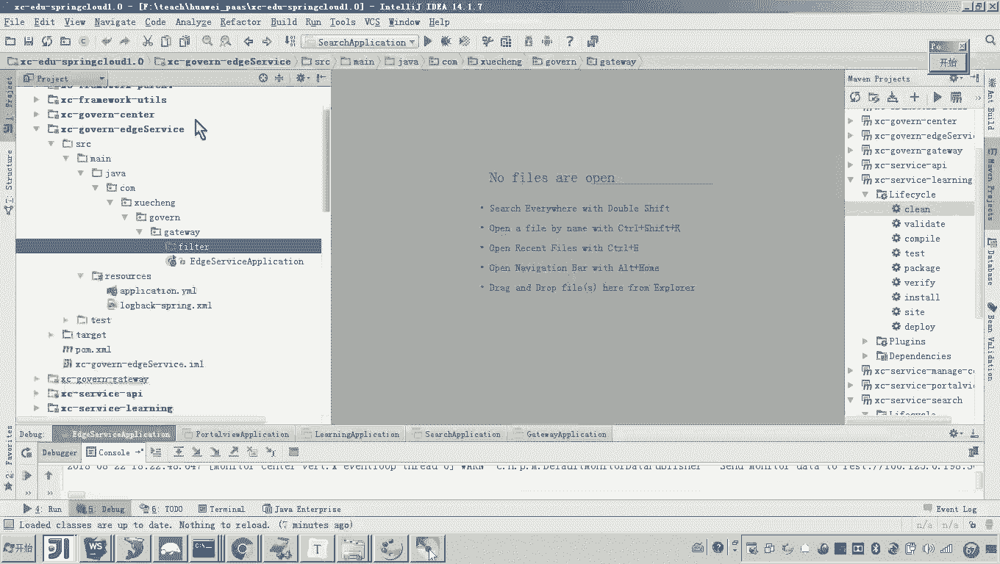

所以这就是一个过滤器啊，这个过滤器呢我们让它实现一个接口，哎，叫做HTTP server filter。😊，然后这个接口呢，它会有两个方法呢需要你来实现。好，大家看第一个方法。那这个方法呢。

是不是就是怎么呀？😊，这个是不是和当初我们定义入的方法，那个里边那个orer差不多呀，这个也就是说它会返回一个这个过滤器的一个这个这个什么呢？一个序号。哎，我们说返回过滤器。他执行的什么顺序号哎。

越小则越优先。月优先执行。啊，大概是这样一个意思，也就是我现在是不是零啊，哎，这个这个零的话应该是。😊，我是最先去执行这个物理器。好，那在这个过滤器里边呢，它的这个功能描述，刚才我是不是说过了？😊。

什么描述啊，他就会说呃，针对那些需要去校验用户。身份的请求哎UL那么他呃他会干嘛呀，会去校验是否呃。是否携带？talk。对。那呃如果如果无需。校验。这个身份。的UL则放行。啊，这个是它的功能描述。好。

那现在呢我们来写吧，怎么怎么弄啊。😊，那我这里边肯定要判断了吧，我这么判断吧，因为毕竟这个呃无需校验身份的UIL呢非常少。就这个这个无需校验身份的UIL呢，我们可以给他起个名字叫做公开UIL。😊，哎。

或者叫哎就公开哎，公开地址公开地址。那针对这种公开地址呢很少。哎，但是大部分的这个URL呢都需要去校验这个用户是否登录。啊呃，所以说这里边呢我我这么写啊，如果呃如果哎无需。😊，如果。需要呃校验用户身份。

则。😊，来判断是否携带ta。那有说老师，那这这咋校验呀？😡，我我准备这么做，我在这儿。我定义一个怎么呀，定义一个公开地址的列表。我这个列表呢，我使用set来存储啊，因为它这个地址是不重复的嘛。哎。

所以我我定一个列表。😊，然后我把这个列表定义出来之后呢。😡，呃，我是不是就可以每每次过来请求呀，我是不是就可以去判断一下啊，这个请求地址是不是在我这个这个这个这个这个列表里头啊，哎判断一下。嗯。

一会儿呢我判断我我我不判断这个请求地址啊，我判断什么呢？其实在这个里边它可以得到这个什么可以得到一个这个这个这个微服务的名称，看见吗？对，这就是。😊，请求微服务的名称。那我就判断吧。

这个使用这个set存储的这个公开微服务的名称。行不行？哎，是呃，定义公开。微服务列表，这个公开微服务列表是啥意思呀？😡，就是无需登录，无需。无需携带token。即可访问。知道吧。啊。

这这就是相当于我刚才说的这个公开地址了是吧？哎，公开地址就不用交原身份。好，那这里面我就配置一下吧。😊，配置一下。嗯，好，那这里面我配一个set啊，那这个名字呢我们叫做呃无需呃。

叫notote required。😊。

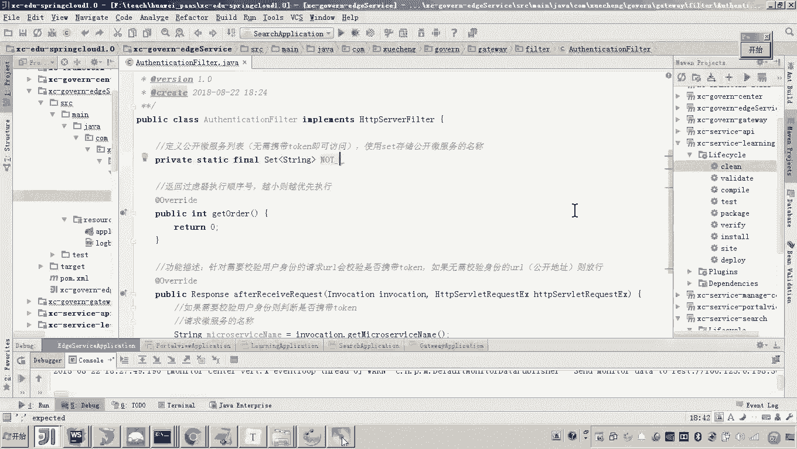

啊，requid哎叫叫叫我看下这个这个名字好长，我看我记得我讲一场，大家看就是么无需呃校验service的这个内幕是吧？哎，就是这个这个名字。😊。

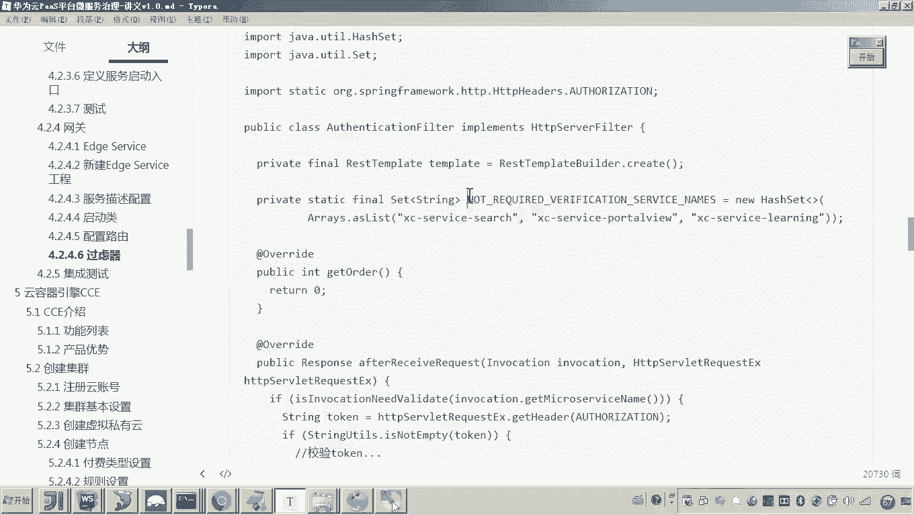

好，那现在呢我们是不是就可以怎么弄？😊，来，定义这个set了吧。😡，对吧。哎，好，那这个s怎么定义呢？这个赛。😊，这个赛的话，因为它是个常量嘛，所以这里边。我是不是可以直接把东西给他写进去了？写什么呀？

这里边比如说我有一个叫search。😡，对，还有一个叫。呃，port头 bill。这两个都不用登录。😡，可以吧嗯。诶，这是啥意思？6哈西萨。没问题吧。哎，好，那现在呢我就把这个就写好了。哎。

这这个列表定义好了之后，接下来怎么弄啊？接下来在这儿你是不是就要判断一下得到这个微服务的名字，你要判断判断判断。😡，这个微服务的名称是否在这个公开服务的列表中存在？对，如果不存在哎，则说明需要校验逃看。

是这意思吧，那所以说怎么弄啊？😡，我再写一个方法吧。😊，这就是校验这个服务是否是公开服务。可以吧。好，那这个校验的话，就让它返回这个布尔类型。I is invocation。哎，是否需要什么呀校验？

valid date可以吧。然后呢，那你给我传进来的肯定是一个service name吧。😡，啊，那我那我怎么做啊，传进来这个service内是不是就是每次你请求哪个service的话嗯。

这个这个微服务，然后我来我来拿了这个名字，从这个列表当中去找呀。如果找到说明是不是就是公开服务，找不到，说明是不是就是需要校验ta，理解吧，所以嗯这里边呢我们来看那我怎么做啊？我肯定得便利了。😊。

就是便利刚才我定义的那个列表。😡，哎，我写一个哎，这叫service。😊，内幕。啊，便利便利这个。然后然后编历完了之后呢，我这里边是不是就可以来判断。😊，怎么判断？如果它等于这个列表里边的名称服务名称。

那说明什么呀？😡，啊，说明我是不是就可以返回forrsse了。因为我这个方法表示是否哎我你看啊。😊，是否需要校验token？😡，对不对？😡，哎，那是否是需要校验讨款？

那你在这个公开服务里头是不是不用校验？对，如果不在的话，各位是不是就要校验？😡，所以我这里边有非常简单，我就判断一下。😊，怎么做呀？那这里边我是不是就是if付，然后。😊，把这个服务名填进去。对啊。

如果他需要校验，这里边我是不是就开始校验什么呀？tken吧？哎，那你校验token，你是不是得取出token？😡，那咋取头感，从这个头头上边去取吧。😡，一般来说，我们的这个tken是不是都在这个头里面。

对吧？好，那这个头怎么取呀？😊，啊，这里边是不是可以我我这个头的名字是不是就叫做authorization，是不是它？😊，啊，这这里边是不是提供了一个spring给我们提供了所有的这个常用的一些投信息。

你看见吗？然后呢，我们说那这里边是不是就得到了这个taken？😊，看见吗？好，那这里面就可以判断吗。😡，如果说这个taken有。😡，哎，is not empty有这个taken。

那这里面肯定我们是要干嘛校验taken。😡，看到吧？如果说你没有token。😡，没有逃款怎么弄？你没有逃款，你这个时候就要返回什么呀？校验失败的信息了。😡，看懂了吧。

这个校验token这里边我先省略号啊，因为回头我们需要在校验呃，做这个用户认证，校需要校验taken呢，我这里边再加。😡，那返回失败的这个信息怎么返回呢？这里边就要用到这个什么呀？

swagger给我们提供的哎这个类型了。哎，我们返回返回的时候呢，我们啊去这个一个什么呀，这个异常抛出一个异常类型，大看可以可以可以看到啊。

我们说之前我们可不可能没有用过这个API这个是不是就是swagger给我们提供的，看见吗？然后呢里边有一个啊叫做返回失败信息。然后这里边各位可以看到这里头是不是有一个叫invoexception。

就是一个异常类型啊，异常类型。😊，好，这个异常类型第一个字段呢应该是一个。😊，状态满。状态码呃，这个这个这个状态码呢，这个这个状态码这里边是不是有一个叫做N author，就表示没有认证嘛。哎。

所以这里边呢我们来看一下，我们把它。😊，我们把它导进去吧。来，我们在这倒一下。好，我们导进去了之后呢，这里边呢后边这儿是不是就可以提示了？😊，这咋提示呀，这这提示的话，是不是就表示认证什么呀？

认证失败吧。哎，认证all森all森哎。😡，tcation还废的。是这意思吧，哎，废。😊，然后现在各位我们说这个过滤器我是不是就写完了？😊，好复杂呀，是不是啊？

那本来我们自定义过滤器都是有一些逻辑在的对吧？好，我再来总结一下这个过滤器啊。😊，这个过滤器的逻辑是什么呢？就是每次请求过来呢？我会判断哎这个所请求的这个微服务啊，它是否是这个公共的服务。

公共服务表示无需校验taken就能访问的。哎，这个这个判断的方法呢，就是看一下这个服务呢在不在这个公共列表当中存在。😊，如果不存在说明他需要校验嗯，说明他需要校验。你看这里边说是如果在这里边存在的话。

我是不是返回forse呀？如果返回处是不是表示表示什么？表示需要校验吗？哎，那需要校验的话，我要从头里边取出这个这个这个令牌的这个名字。然后呢，我得到这个令牌。然后我这里边开始校验。哎，如果没有令牌。

这里边我要直接返回哎，校验认证失败。😊。

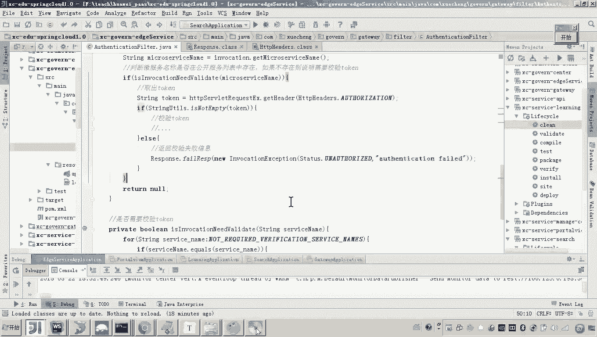

好，这个过滤器我们写完了。现在呢我们这个过滤器怎么配置一下呢？这是一个难事儿。😊，有时候老师在这加这个component吧，不是。😊，这个servicecom这里面呢它的呃很多的这个这个这个bin呢。

它都采用一种方式来进行配置。什么方式呢？嗯它采用了java sPI什么是java sI应该有有同学了解过吧？叫service provider interface哎。

它是这个GDK当中使用这个service load来加载就类似于spring这个加载B一样的方式。但是它加载的方式是这么做的啊，它是在这个呃这个这个这个class pass下边建一个目录叫。

然后里边有一个service，然后在这个service里边它会建很多的这个文件，哎，建这个文件。而这个文件里边的内容你会发现这是不就是我们刚刚写的那个过滤器的权限定名啊，然后他就开始对它实例化。

所以这个过程其实类似于spring的那个bin的定义的过程，对吧？好，那么我们呢就来配置一下吧，怎么配。😊，在这个resource下边，我们建一个什么呀目录。😊，这个目录叫做mate info。😊。

然后在这个里边呢，我们再建一个目录。啊，这个目录叫service。好，那么这个service这个这个呃目录建好了之后呢，我们准备往里面建这个文件。这个这个文件的名称怎么这么长呢？😊。

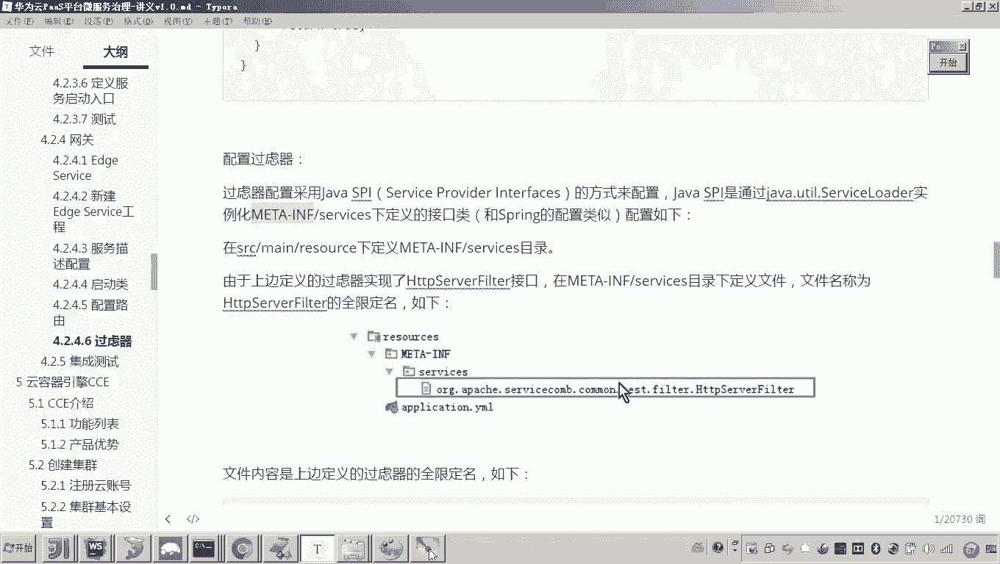

这个文件的名称注意就是这个接口的什么接口的名字。😡，所以这里面你新建一个文件，哎，这个名称就存就成了。那么这个文件的呃，名称里面的这个内容啊，这个文件的里面内容是什么呢？

就是你的这个哎定义过滤器的权限定名。😊，大家可以看一下是吧，但如果你这写错，你没发现这个ide是不是还给你报错了是吧？哎，所以这里边你可以可以看一下，它还能点击，这不是就进来了。

这样的话我们就把这个过滤器就配置好了。😊。

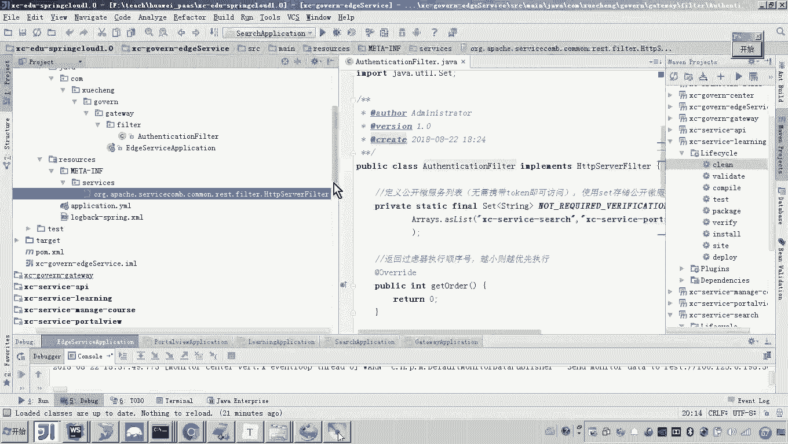

看懂了？好，那现在我配置好了之后，接下来我就要测试这个过滤器了。你要把这个age service呢给它启一下。😊，那怎么测试呢？很简单啊，我们就在这个过滤器这儿啊，我们打断脸。😊，啊，就在这打断点。😡。

可以吧，然后现在刚才我们是不是测了很多呀，然后我这儿就开始访问。😊。

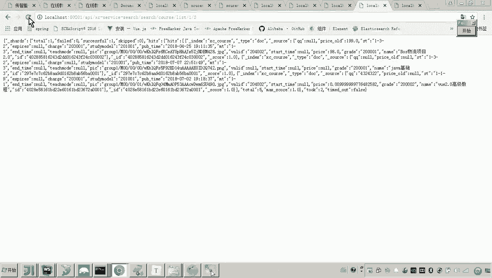

嗯，然后各位你来看他是不是就进来了。说每次访问他是不是就开始去访问这里边得到这个微服的名字是不是叫做IC serviceice searcharch？😊，然后现在判断它是一个公共的吗？哎，他是。

所以这里边无需校验，就直接返回。😊。

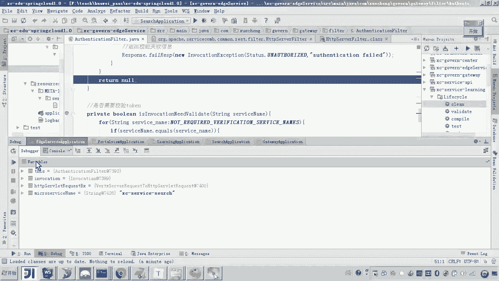

大家看懂了吗？哎。好了，那现在他那我们再来看一下吧，他他想访问什么呢？我们看这里头是不是有s区有这个port view啊？对，那我们访问一下port view试试。😊，来看一下啊，来，访问刷线。

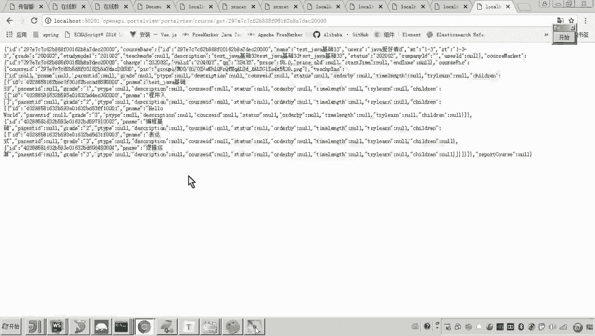

各位是不是正常？那现在我们说就说老师我想测一下什么呢？我我想测一下他怎么去返回这个错误异常，怎么弄？那很简单嘛，你在这儿你把它干掉。😡，各位，这样的话。

我这个公共的服务列表当中是不是只有一个sry searcharch？😊。

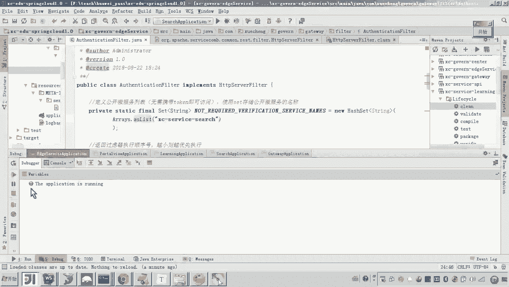

那如果我此时再访问port6，port6是不是不在这个公共服务列表，那么他是不是就开始去校验talk了？😡，对不对？😡，好，那你再来看，那我这里边呢打一断点啊，再这打一断点了。😊，好。然后呢，刷线。

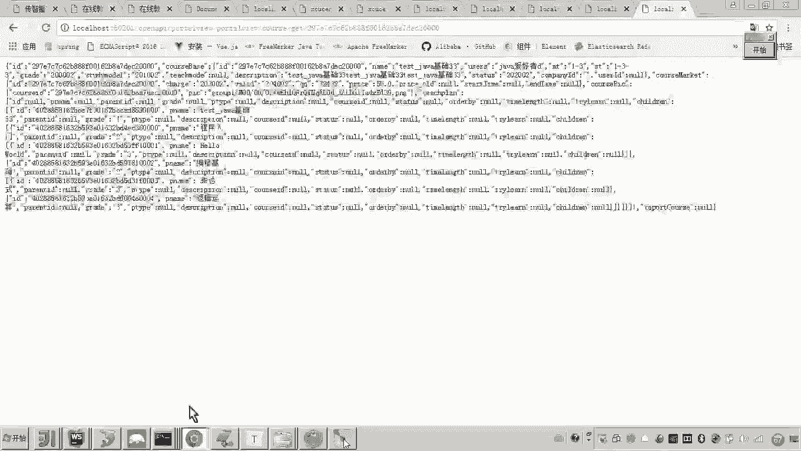

他是不是就进到了这个过滤器？😊，然后开始说哎，他需要吗？需要。好，你看taken什么闹，当天他肯定没有携带token嘛，然后他就返回了什么错误信息。😡。

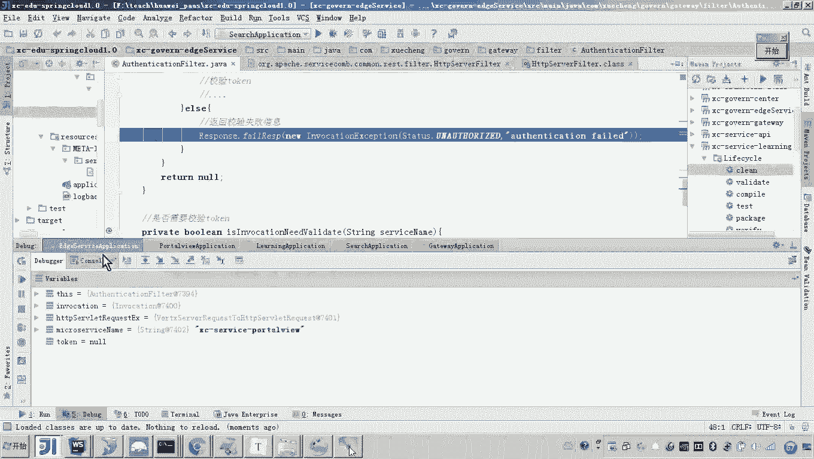

对这个错误信息来注意看啊。

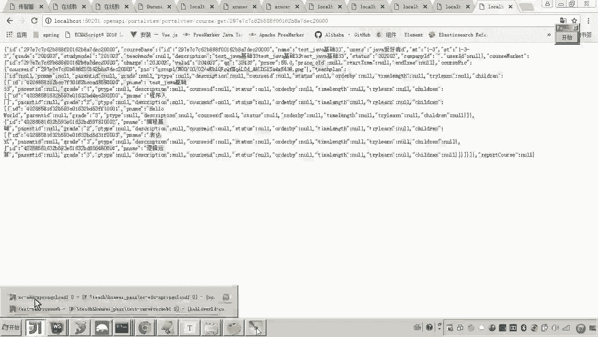

来来来这个这个这个错误信息raten。还少一re。然后再来启动一下。

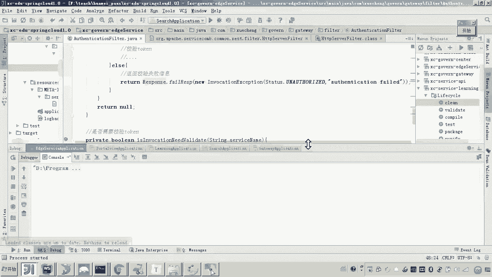

好，那现在呢我们把它再重新启一下。那这个时候因为这个公共的服务列表是不是没有这个portview啊，所以这里边我们去访问portview应该是需要去干嘛呀，登录的，行吧？

是不是就表示authentation field是认证失败嗯。😊，OK好，那现在呢我们就完成了这个过滤器的这个编写啊和这个配置以及测试。好，那么我们简单总结一下啊。

这个service co哎它提供了一个叫做呃什么呀？呃叫做age service的这个网关，而这个网关它是支持过滤器的定义定义的方式呢就是去实现HTTP server filter。

然后来自定义我们的过滤器。这个顺序呢越小优先级越高。然后在这个方法当中，哎这个方法表示接收到请求之后所要执行的这个代码。好，那在这个里边呢，我们去写我们的过滤的这个代码的内容。而这个内容呢。

刚才这个需求我是不是给大家说过了，叫校验这个请求是否携带token。那对于这种公共服务的，它就无需去校验这个taken了。嗯，好，那以上呢就是这个过滤器的定义方法。😊。

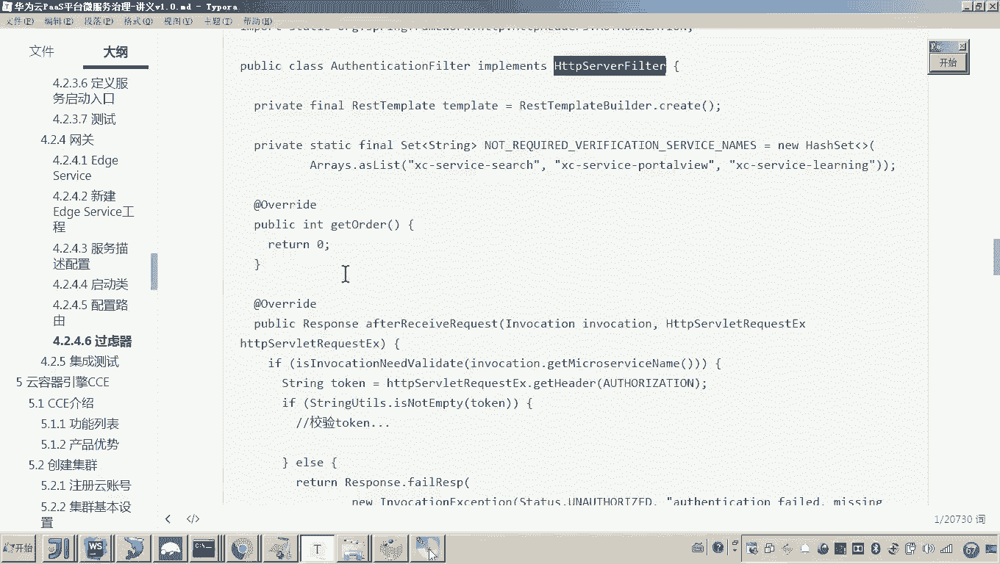

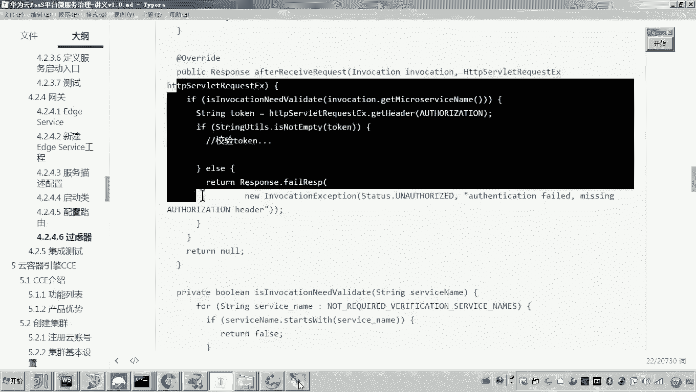

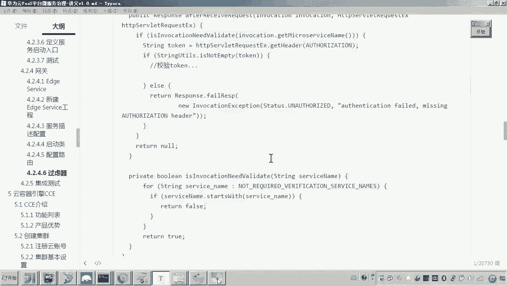