# 华为云PaaS微服务治理技术：P97：05-学成在线项目接入CSE-网关-过滤器 📥

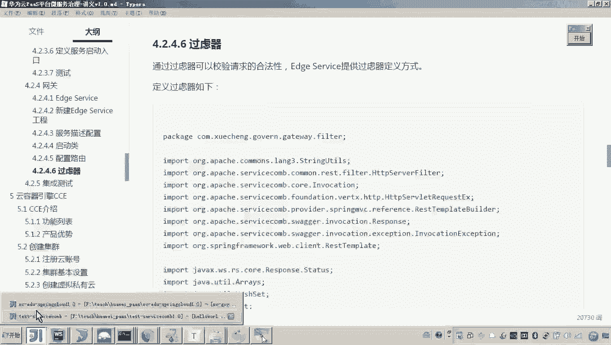

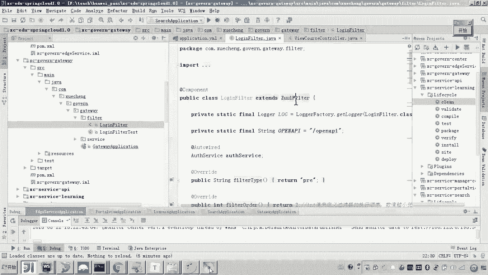

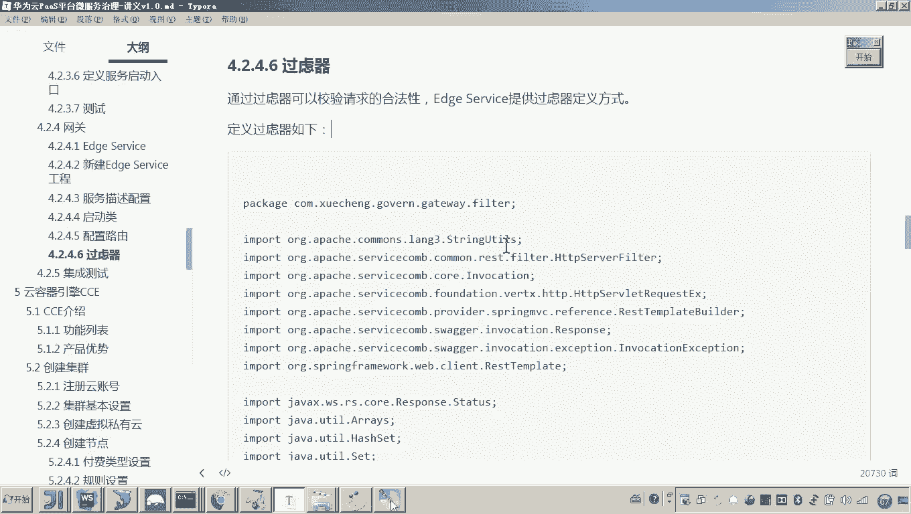

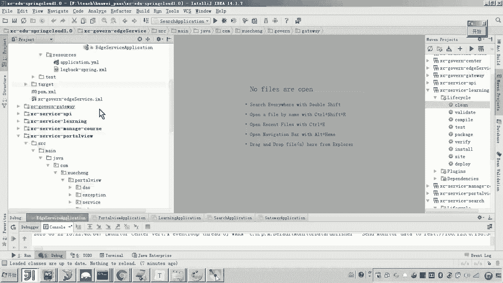

在本节课中，我们将学习如何在华为云CSE的网关中定义和使用自定义过滤器。我们将创建一个用于校验用户身份令牌的过滤器，并学习其配置与测试方法。

上一节我们介绍了网关的基本路由配置，本节中我们来看看如何通过过滤器对请求进行更精细的控制。

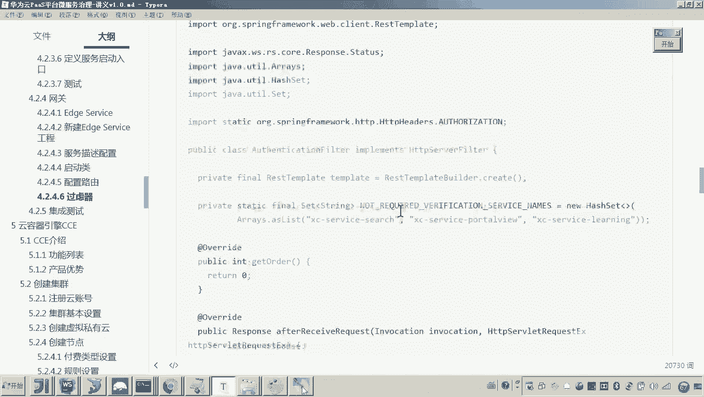

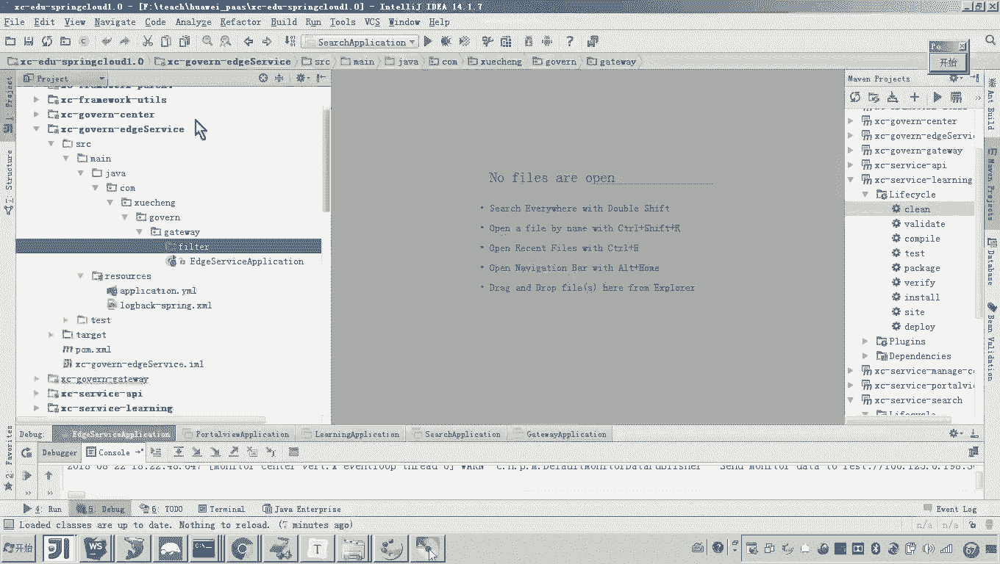

## 过滤器概述 🔍

网关过滤器用于在请求到达目标微服务之前或之后执行特定逻辑，例如身份验证、日志记录等。华为云CSE的网关支持自定义过滤器，其实现方式与Spring Cloud Gateway类似，但配置机制有所不同。

## 定义过滤器类 🛠️

首先，我们需要在网关项目中创建一个过滤器类。这个类将实现`HttpServerFilter`接口，并包含校验请求是否需要携带令牌的逻辑。

以下是创建过滤器的步骤：

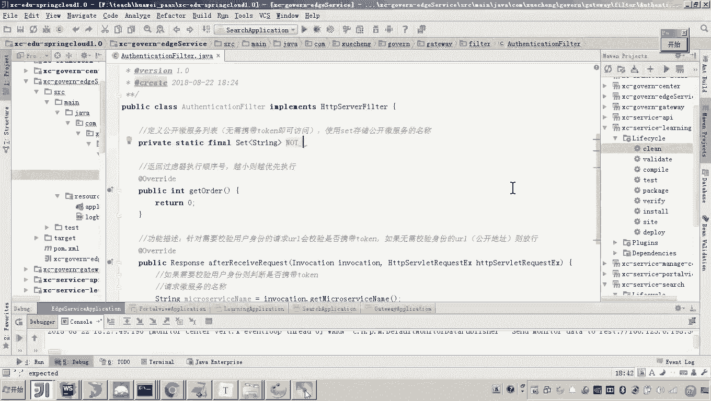

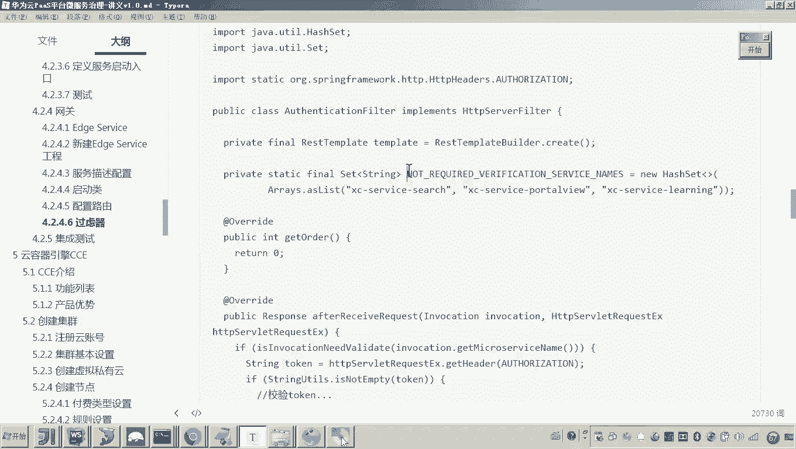

1.  在网关项目中创建`filter`包。
2.  在该包下创建名为`AuthenticationFilter`的类。
3.  让该类实现`HttpServerFilter`接口。

```java
package com.xuecheng.getway.filter;

import org.apache.servicecomb.common.rest.filter.HttpServerFilter;
import org.apache.servicecomb.core.Invocation;
import org.apache.servicecomb.foundation.vertx.http.HttpServletRequestEx;
import org.apache.servicecomb.swagger.invocation.exception.InvocationException;
import javax.ws.rs.core.Response.Status;
import java.util.HashSet;
import java.util.Set;

public class AuthenticationFilter implements HttpServerFilter {
    // 定义无需校验Token即可访问的公开微服务列表
    private static final Set<String> NOT_AUTH_REQUIRED_SERVICES = new HashSet<>();

    static {
        NOT_AUTH_REQUIRED_SERVICES.add("search-service");
        NOT_AUTH_REQUIRED_SERVICES.add("portal-view");
    }

    @Override
    public int getOrder() {
        // 过滤器执行顺序，数值越小优先级越高
        return 0;
    }

    @Override
    public void afterReceiveRequest(Invocation invocation, HttpServletRequestEx requestEx) {
        // 获取当前请求的目标微服务名称
        String serviceName = invocation.getMicroserviceName();

        // 判断该服务是否需要校验Token
        if (isAuthRequired(serviceName)) {
            // 从请求头中获取Token
            String token = requestEx.getHeader("Authorization");

            // 校验Token
            if (token == null || token.isEmpty()) {
                // 若未携带Token，则抛出认证失败异常
                throw new InvocationException(Status.UNAUTHORIZED, "Authentication failed");
            }
            // 此处可添加具体的Token校验逻辑（例如JWT解析与验证）
            // validateToken(token);
        }
        // 若为公开服务或Token校验通过，则放行请求
    }

    /**
     * 判断请求的微服务是否需要身份校验
     * @param serviceName 微服务名称
     * @return true表示需要校验，false表示无需校验（公开服务）
     */
    private boolean isAuthRequired(String serviceName) {
        // 如果服务名不在公开列表内，则需要校验
        return !NOT_AUTH_REQUIRED_SERVICES.contains(serviceName);
    }
}
```

**代码解析：**
*   `getOrder()`: 决定过滤器的执行顺序。
*   `afterReceiveRequest()`: 接收请求后执行的核心方法，在此编写校验逻辑。
*   `NOT_AUTH_REQUIRED_SERVICES`: 一个`Set`集合，用于存储无需认证的公开微服务名称。
*   `isAuthRequired()`: 辅助方法，用于判断当前请求的服务是否需要认证。

## 配置过滤器 ⚙️

华为云CSE采用Java SPI机制来加载自定义过滤器，而非直接使用`@Component`注解。

以下是配置过滤器的步骤：

1.  在项目的`resources`目录下，创建`META-INF/services`文件夹。
2.  在该文件夹内，创建一个文件，文件名必须为过滤器所实现接口的全限定名：`org.apache.servicecomb.common.rest.filter.HttpServerFilter`。
3.  在该文件内，写入自定义过滤器类的全限定名。

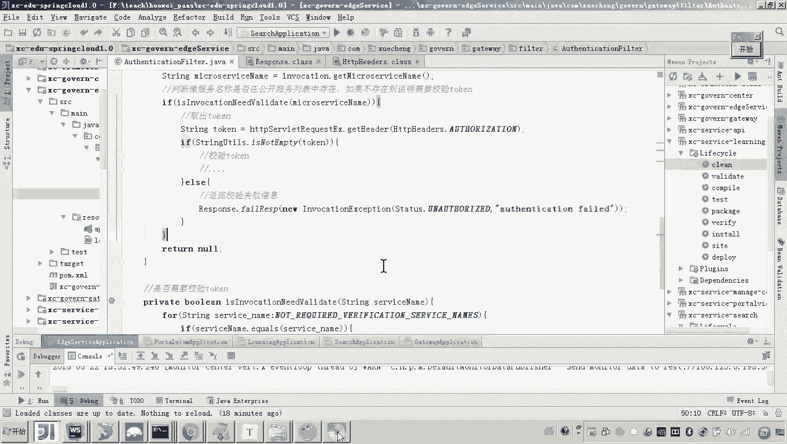

**文件路径示例：**
```
src/main/resources/META-INF/services/org.apache.servicecomb.common.rest.filter.HttpServerFilter
```

**文件内容示例：**
```
com.xuecheng.getway.filter.AuthenticationFilter
```

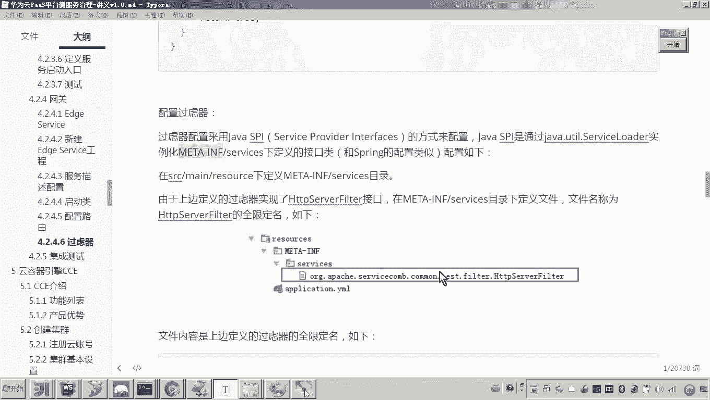

## 测试过滤器 🧪

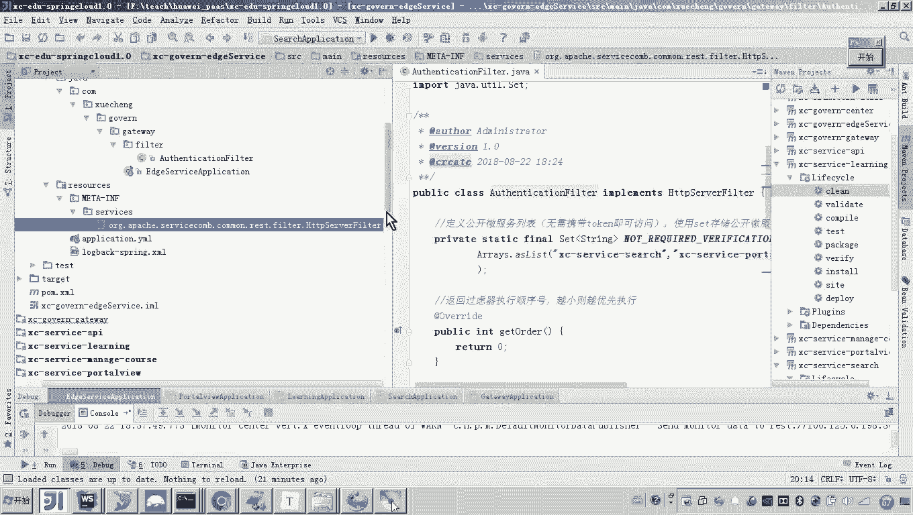

配置完成后，启动网关服务进行测试。

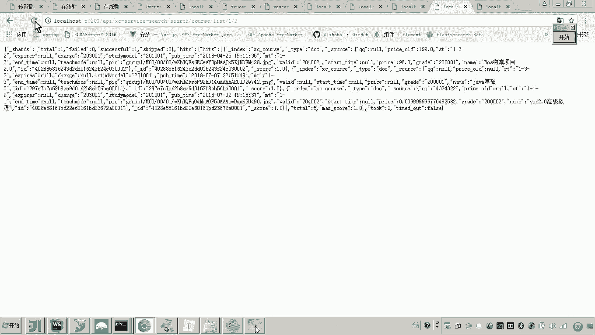

**测试公开服务：**
访问被定义为公开服务的接口（如`search-service`或`portal-view`），过滤器会判断其为公开服务并直接放行，请求可以正常到达。

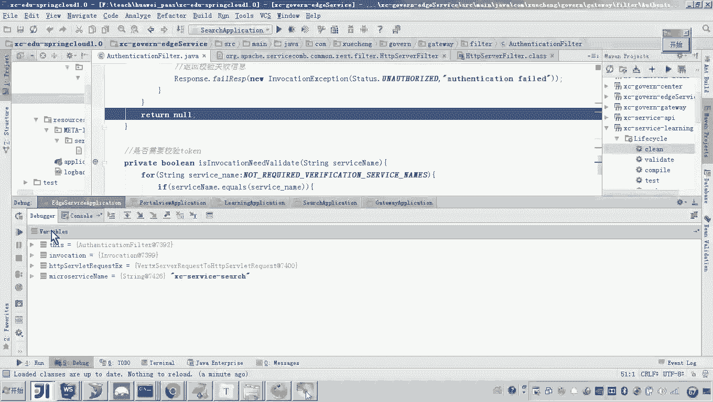

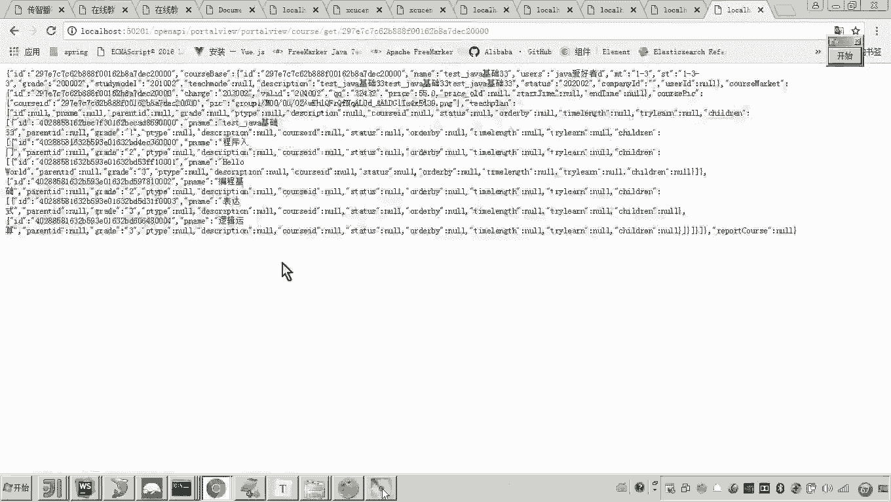

**测试需认证服务：**
1.  从公开服务列表中移除某个服务（例如注释掉`portal-view`）。
2.  访问该服务的接口。
3.  由于请求头中未携带`Authorization`令牌，过滤器将抛出`InvocationException`异常，并返回`401 UNAUTHORIZED`状态码，提示“Authentication failed”。

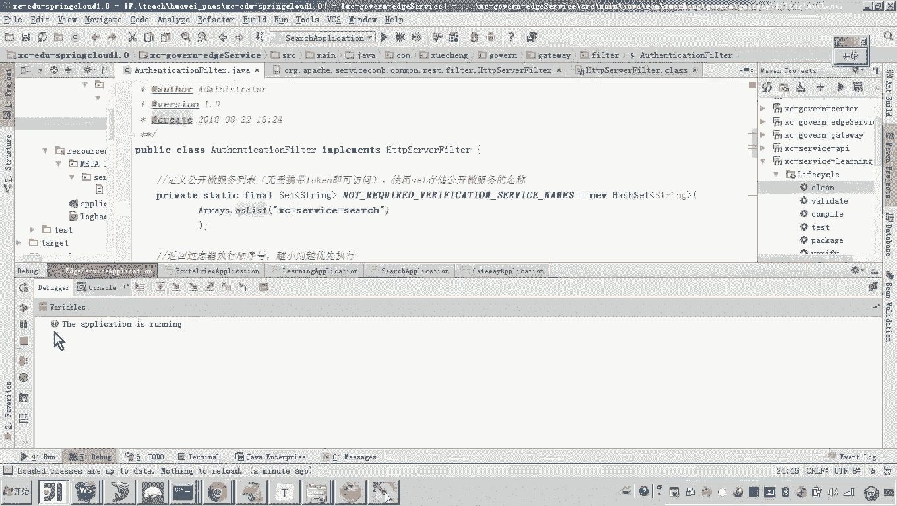

可以通过在过滤器代码中设置断点，观察请求的处理流程和逻辑判断结果。

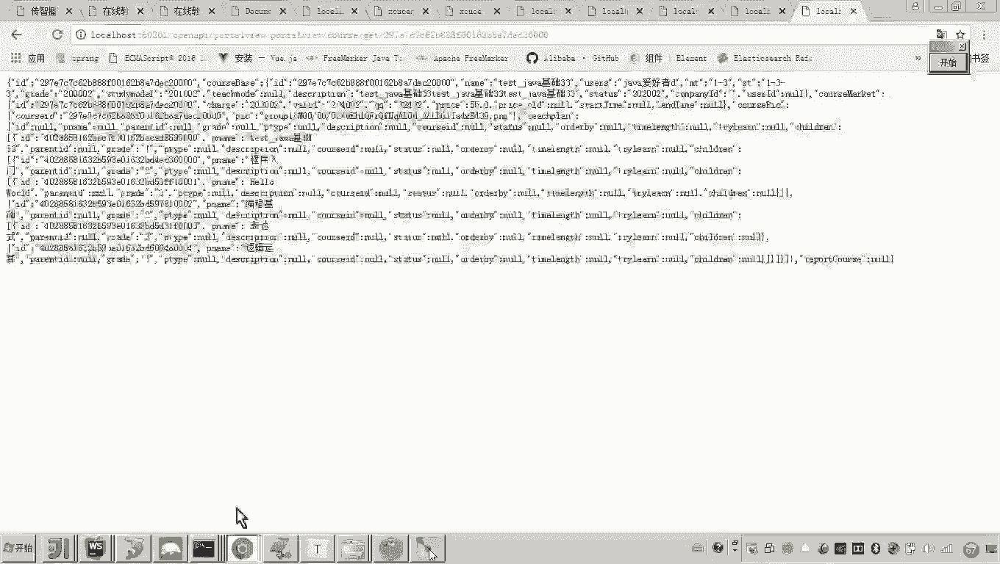

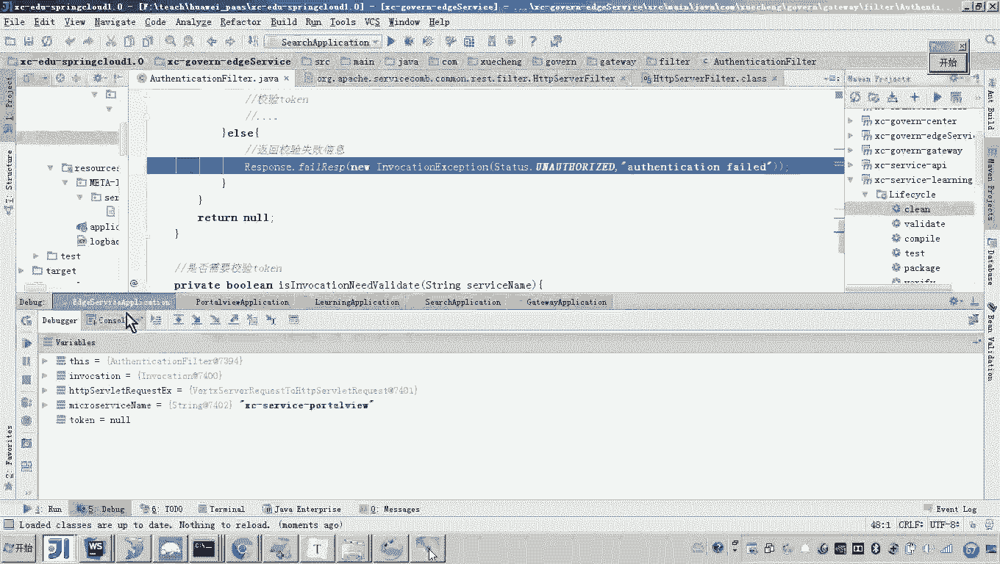

## 总结 📝

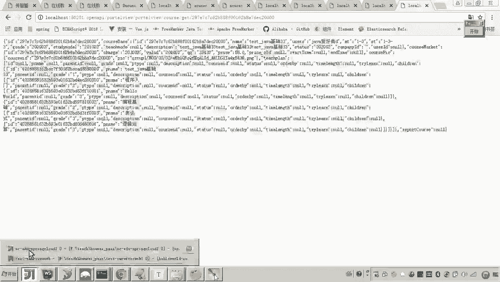

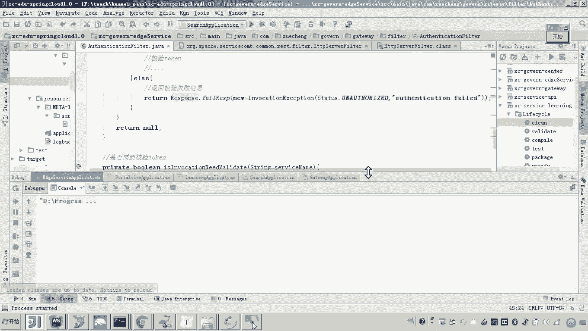

本节课中我们一起学习了华为云CSE网关过滤器的定义与使用。

*   **核心概念**：通过实现`HttpServerFilter`接口，在`afterReceiveRequest`方法中编写请求处理逻辑。
*   **配置方式**：使用Java SPI机制，在`META-INF/services`目录下创建配置文件进行注册。
*   **实现功能**：我们实现了一个简单的身份认证过滤器，它能根据预定义的公开服务列表，决定是否校验请求中的令牌（Token）。
*   **执行顺序**：通过`getOrder()`方法控制多个过滤器的执行优先级。

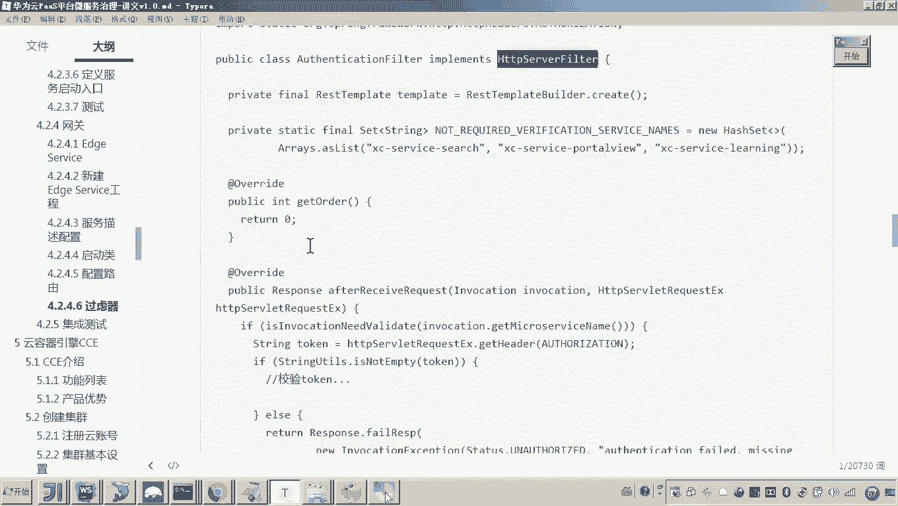

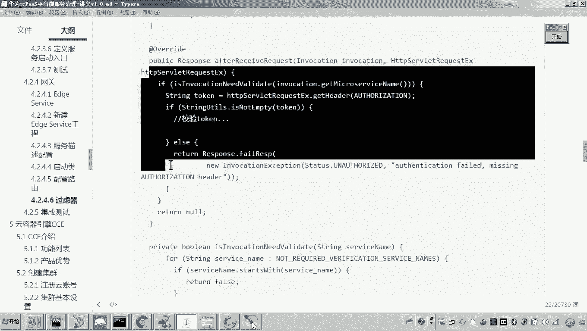

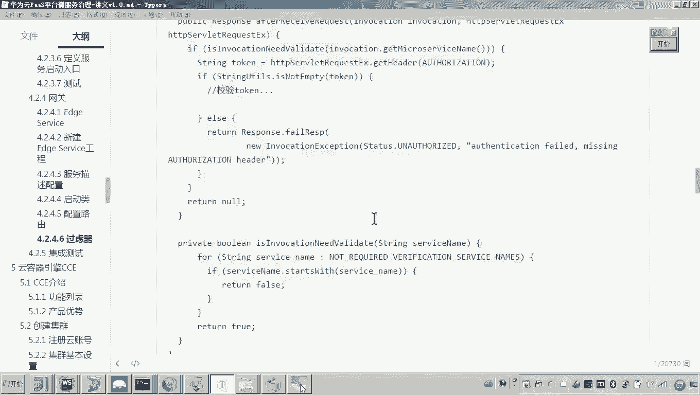

通过自定义过滤器，我们可以为网关添加诸如身份验证、流量控制、请求改写等强大功能，从而更好地管理和保护微服务集群。