# 华为云PaaS微服务治理技术 - P98：06-学成在线项目接入CSE-集成测试 - 开源之家 - BV1wm4y1M7m5

好，那下边呢我们到这儿为止呀，就已经完成了呃学生在线所有核心微服务接入CSE平台。那现在我们是不是就可以来测试一下，集成测试一下，对吧？那好呃，在测试之前呢。

我们是不是就可以把我们所有的微服务呢给它起起来。

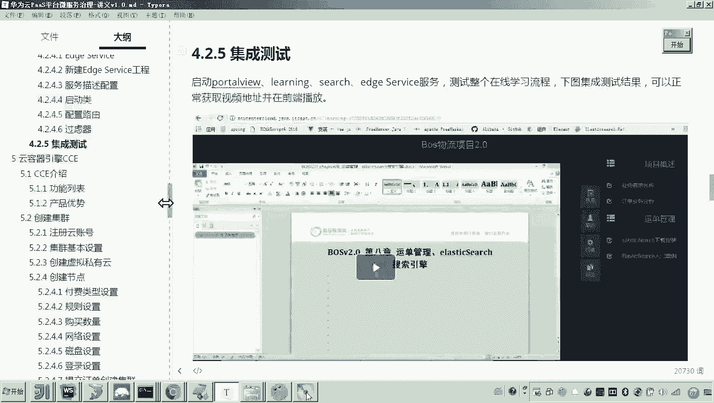

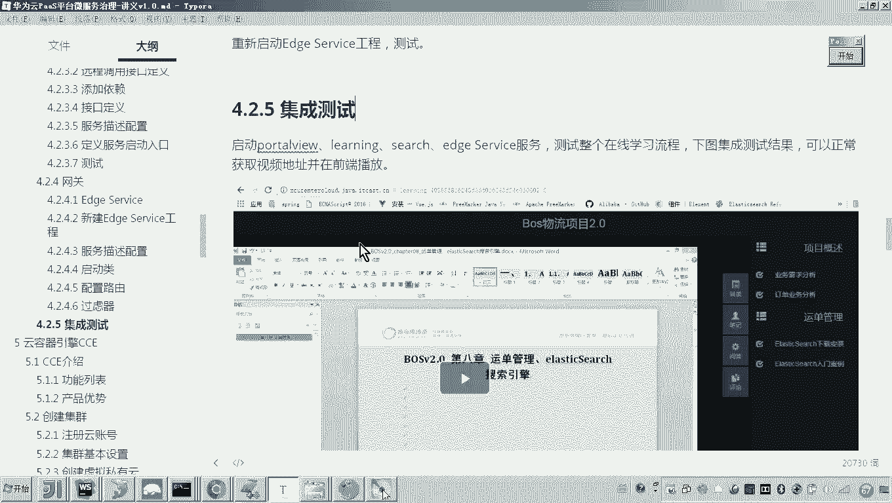

好，这个port view啊，这个网关，还有这个学习服务，还有搜索服务是不是都起来了？好，那都起来之后呢，此时我们是不是就可以来观察我们的服务目录的这个情况了，来看一下。

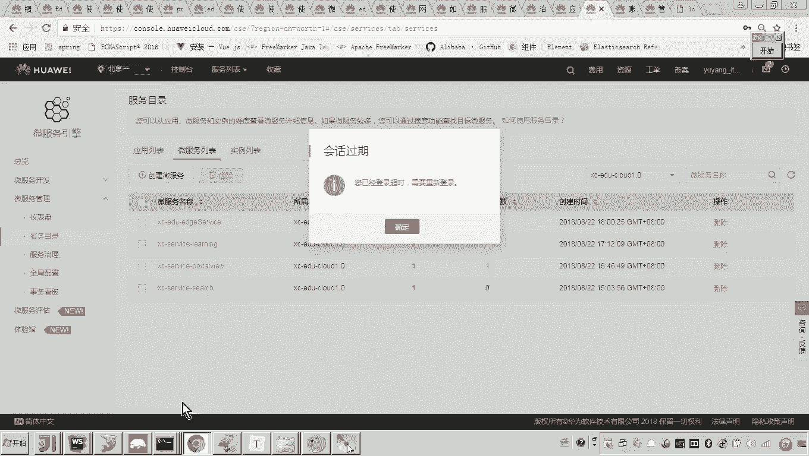

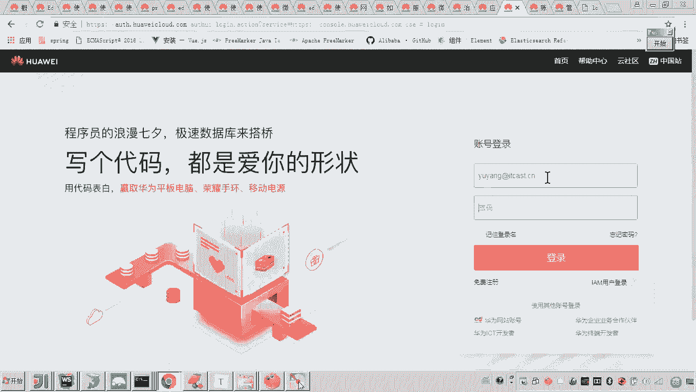

啊，必须是这个服务目录里边的各服务实力是都有的啊。啊，选择我这个应用。大家可以看到，现在我这四个服务都已经齐了吧。好，那现在这个服务都有了，那我们准备怎么弄啊，我们把前端工程也齐起来。😊。

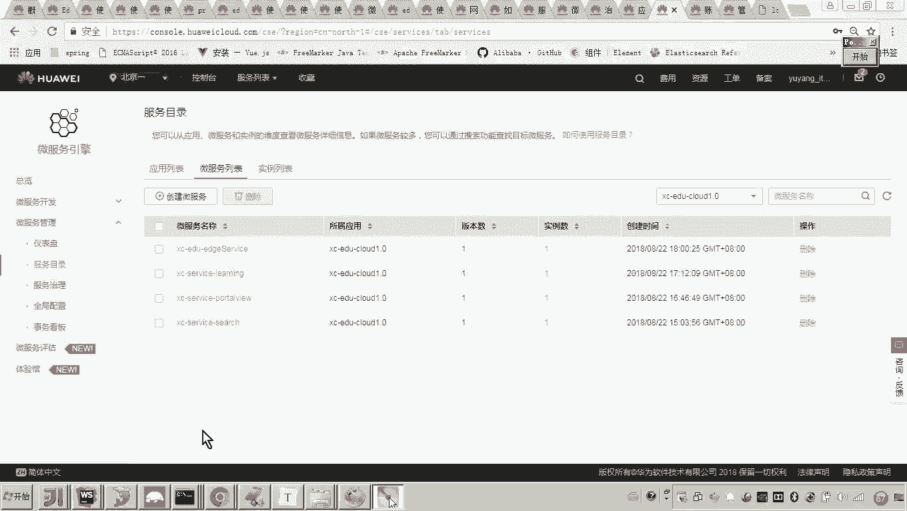

哎，也提起来。好。然后现在呢我们是不是就可以来访问访问试试了啊，因为我刚才接了这个网关啊，所以我们现在去访问的话，他肯定会会报错吧。对我们报错，跟着错误来来来排除来排除啊，这样的话效率还高一些。来。

我们先来看搜索。😊。

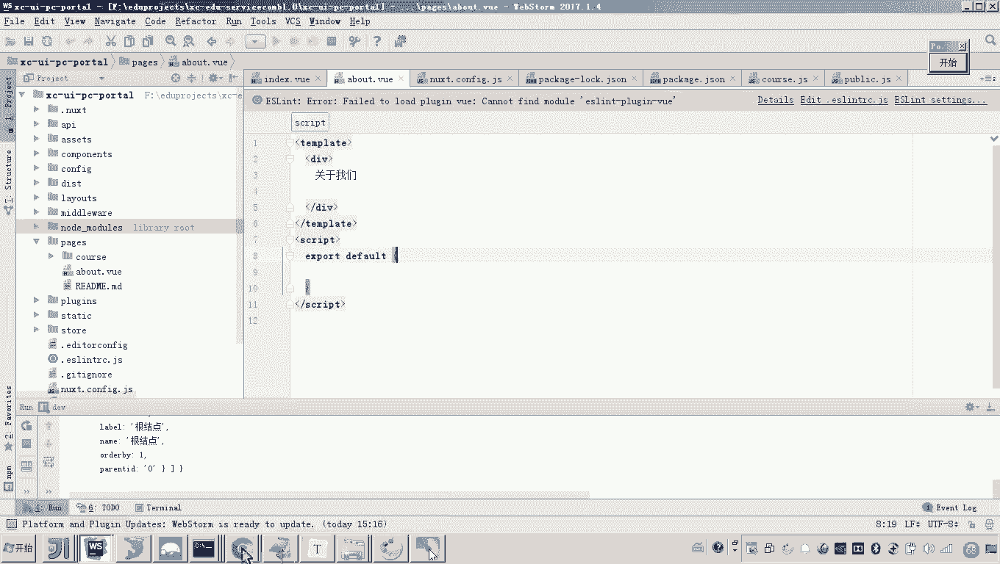

得看一下这个搜索是不是可以啊，这个搜索好，那搜索可以的话，我们点开点开。然后呢，我们看这个在线的学习嗯。

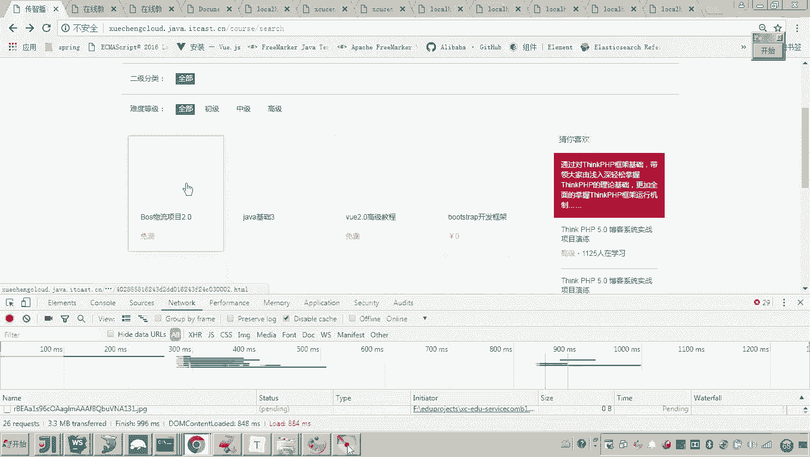

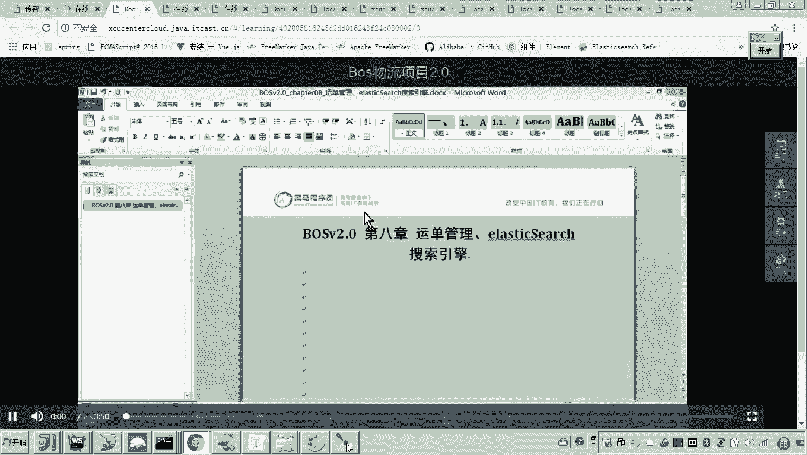

这么顺对吧？那我们看一下吧，看一下这个这个这个这个里头。

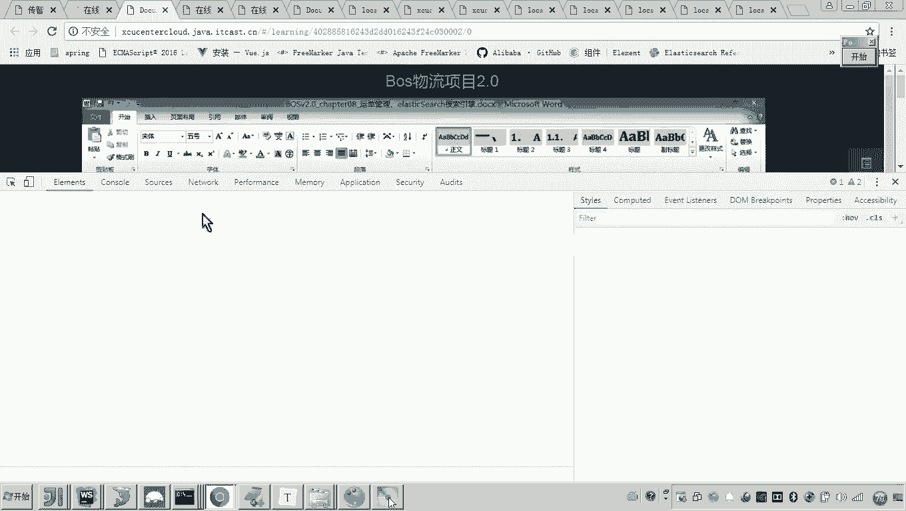

看一下这个里头什么样。这个。

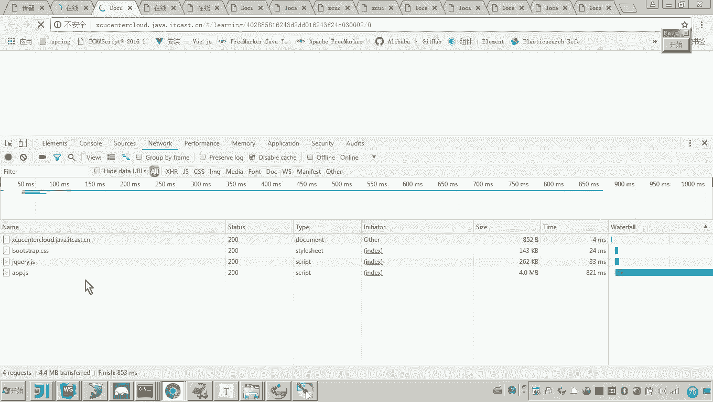

这个这个这个URL啊，看一下。因为这是挂域名的啊，这是挂域名的来看一下这个这个UIL，我们把它拿出来。😊。

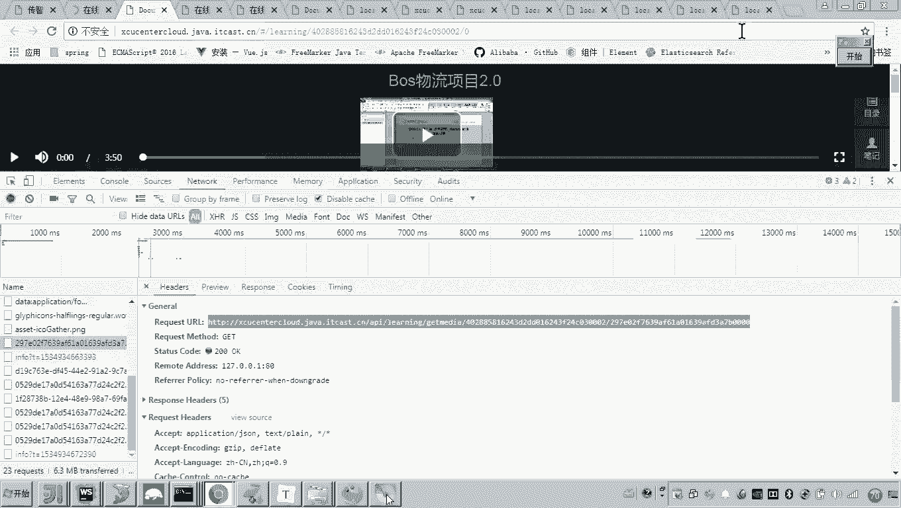

大家可以看一下啊，这个呃这个域名你找到enin的这个配置。找到一个虚拟主机。好。😔，这个虚拟主这是不是就是我们说的这个虚拟主机了？那这个虚拟主机这里边各位我们来看啊。

它访问的是哪个是不是叫做呃杠API看见了吗？杠API嗯，然后杠API杠learning啊，杠API杠2杠learning好，那现在呢我们找。😊，各位看一下是不是在这儿看懂吗？😊，嗯，但是在这儿的话。

我们继续接着找啊，他这儿转发到了这个地址，看见吗？但这个地址好像不太对，为什么你看这个地址啊，你把它拷贝一下，往上找。😮，他是不是直接转到了40600上？😡，有人说老师40600是啥意思呀？

40600是我们说这个learning的这个微服务的端口吧。😊，你看。对不对？有人说老师这个效果都出来了，这有啥问题呀？😡，我跟你说，真有问题。因为我按照我们的要求啊，这个请求是不是要通过网关来请求？

😡，懂我的意思吧？所以你现在并不是通过网关吧，你这个学习服务它是通过了什么呀？直接走的学习服务并没有通过网关。😡，对不对？😡，所以你现在要让他通过网关。那我们来看这个网关。

他能够受理这个学习服务的请求吗？😡，网关嘛，只要服务注册中心当中有的服务网关都能通过网关来访问。😡，只是说刚才我们写的那么一个过滤器，你需要注意一下，就是说公共服务无需校验的，你要配在这儿。😡。

对吧所以因为现在我们这个校验的逻辑，各位我们是不是没有写。所以哎我们把这个哎公共服务我们都配全了啊。因为现在你也看到了我访问的这个这个这个这个功能啊，其实都是不用登录的。😡。

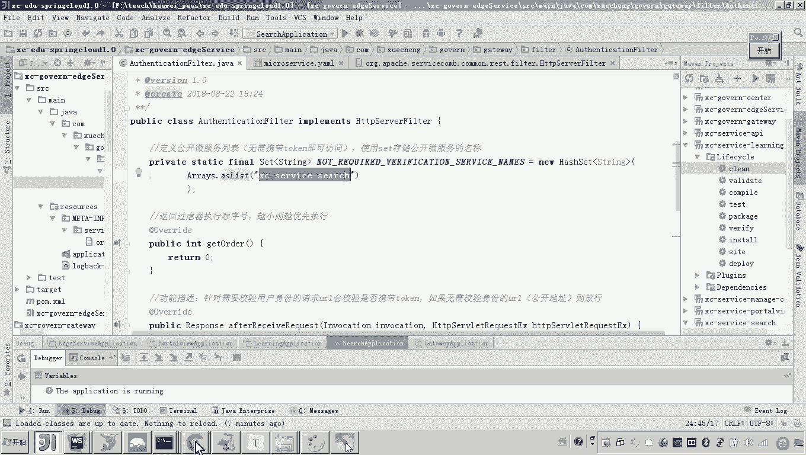

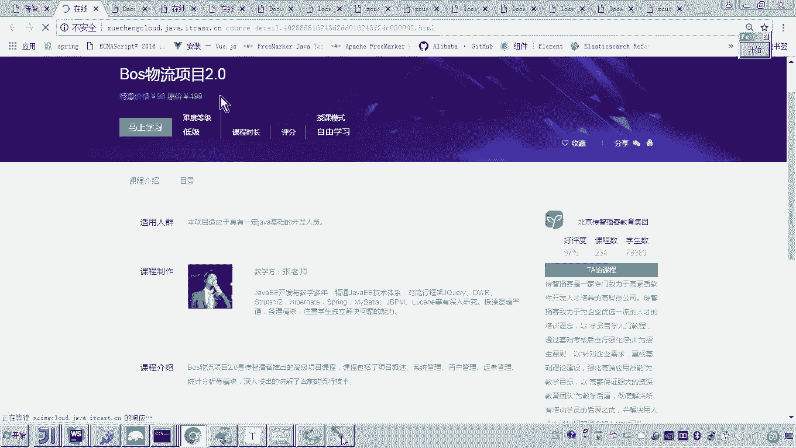

我你包括学习，我是不是也可以呃，没有不用登录我我来先来看看视频，对不对？所以我们把现在我们这几个微服务啊，我们把它都配成我们的这个公共服务。😡。

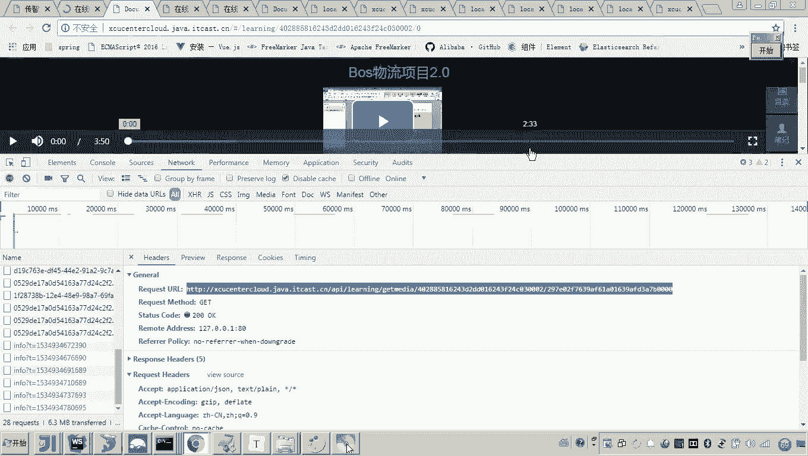

对，有时说老师不配有啥后果？如果不配的话，他就提示你登录了。那你提示你登录，我问你，你请求这个微服务拿到的数据能拿到吗？是不是就拿不到了？对，所以你把这个公共服务哎，这个名称我们全配齐了。😡，嗯。

配齐这个东西之后呢，你把这个A service呢把它起一下。😡，然后你再拐过头来看en，就这儿我要改东西了，哎，我要我要现在做手术了，怎么做啊？😡，那你肯定不是请求他了，你要请求网关了。😡，对不对？😡。

请求网关网关在哪呢？😡，哎，网关在哪呢？这是214行，你记得这个啊，网关往上找，我这应该有网关，就是上面我配了很多，你看好啊，找到有一个叫嗯。😊，看好。那个那个网关的端口是啥呀？

这个A service这个端口，你你找找。😡，是不是叫50201啊，你找找啊。😡，给我看。是不是这个APIservpo看见吗？所以你现在要做的事儿啊，就是把我们学习搜索。

哎也是port view所请求的这些几个微服全部哎我们通过网关。😡，怎么通过网关呀，就把它改了就行了嘛？改成请求这个API server这个server。哎，然后这里边要注意的啊。

这里边这里边的话我们让他走这个API走这个默认路由，可以吧？走URL走默认路由都行啊，能匹配哪个他走哪个哎哎，我我们这里边后边要要怎么写呀？😊，后边就是微服务的名字。😡，这个微服务的名字叫啥名呀？😡。

哎，不要写错啊，刚才我是不是把这个微服务的名字都配到公共服务里头了，对你把这个服务的名字拷过去。😡，这个是不是就是默认路由匹配的前匹配的前缀，对吧？对，然后后边呢。😡，嗯。

后边的话这是不是就是转发的地址了？对你按照这一种方式，你把搜索也配一下。对这个搜索现在是不是也没有走这个网关，对，也让他走网关。😡，一个事务所。看见吗？嗯，好，你这个搜索配了之后，你这个怎么呀。

port view也配置一下。😊，这个portal view。也配置一下。好，那我配完了之后怎么弄啊？配完了之后，你就把这个en呀给它重新加载一下配置文件inin杠S reload。好。

现在呢我们再来看。😊。

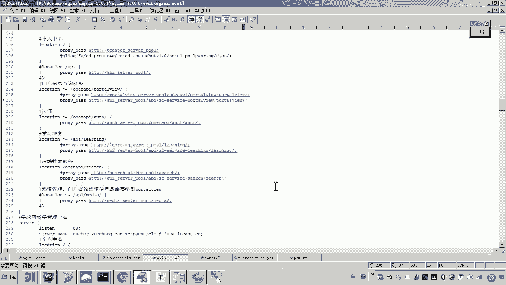

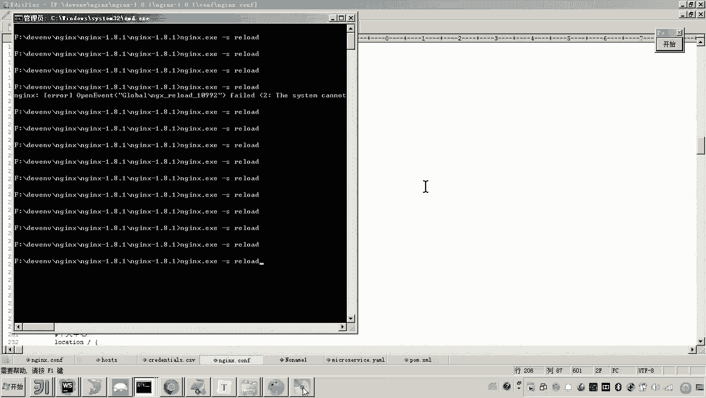

我现在是不是就做过这个手术了，然后现在我刷新。😊。

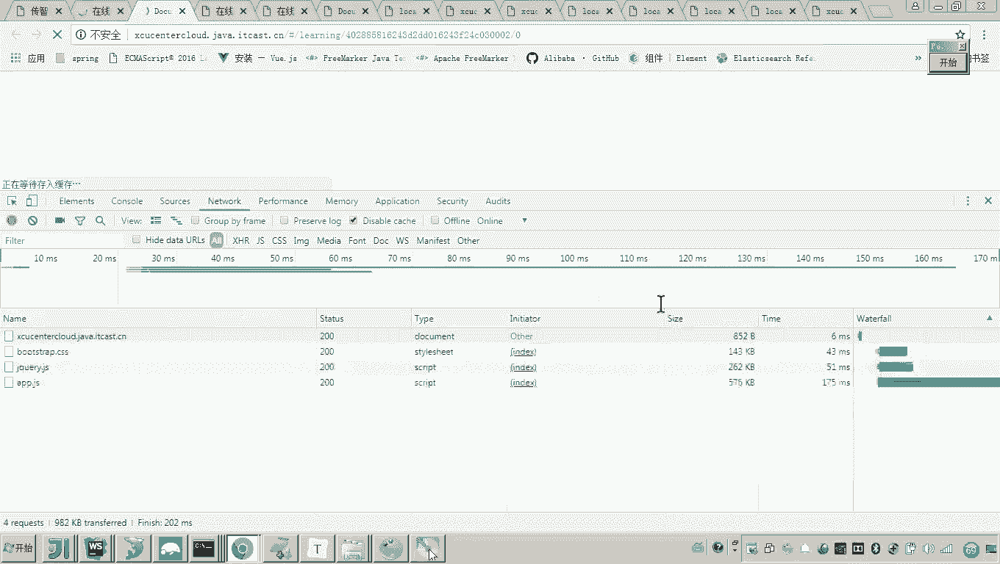

是不可以？有说老师，你走没走网关，你这个东西都是正常的，我咋能知道走不走网关呢？好，我现在教你一招，注意听。😡。

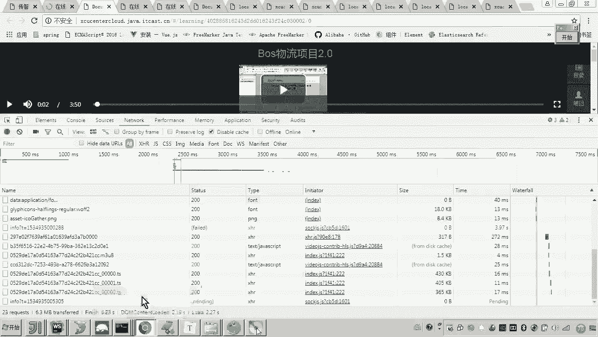

在这个微服务目录这儿，各位这儿看不出来。哎，那你得看这儿啊，你看好啊，看好啊，在这个网关这点哎调用的服务列表。各位你给我看到，只要通过网关走了走调用这个微服务了。那么在这个调用的服务列表。

当前是不是在这个Aservice，它就在这里边就显示出来了。就是曾经他调了哪些服务，看见吗？对。😊。

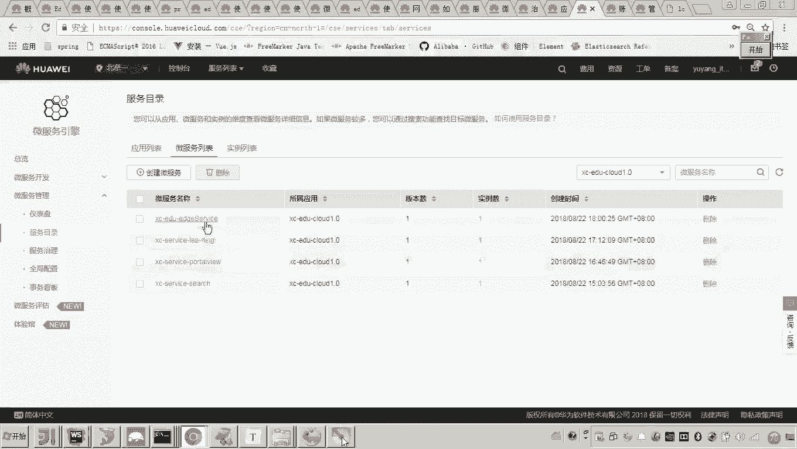

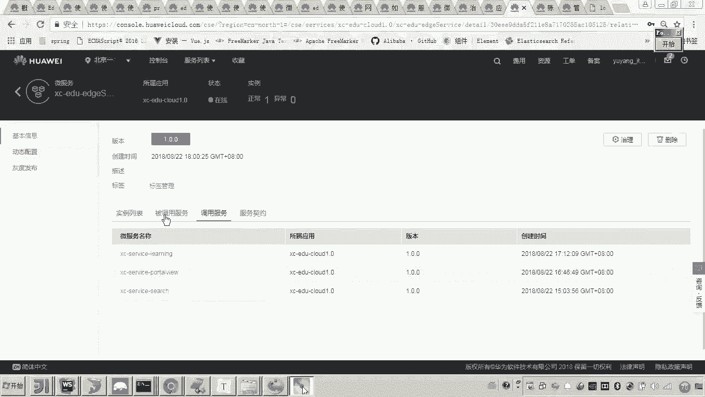

我再教你一招，哎，还可以通过一个图形界面来看，特别的牛牛在哪？各位看一下，这个是我后期要讲的一个服务治理的一个界面。看好啊，各位。😊，我觉得你能看得懂吧。老师在看什么看蜘蛛网了，对吧？不是啊，看好。😊。

注意。这啥意思？各位，你告诉我，这是不是就是我们说的网关。对，而一个请求过来之后，是不是通过网关来走到这个学习服务？😡，哎，学习服务是不是去调用了port头 view？😡，通过网关是不是去请求了搜索？

😡，这就是我们当初在我们讲义上所看到的那个什么呀，这个微服务的这个技术站的这个图。各位告诉我是不是。

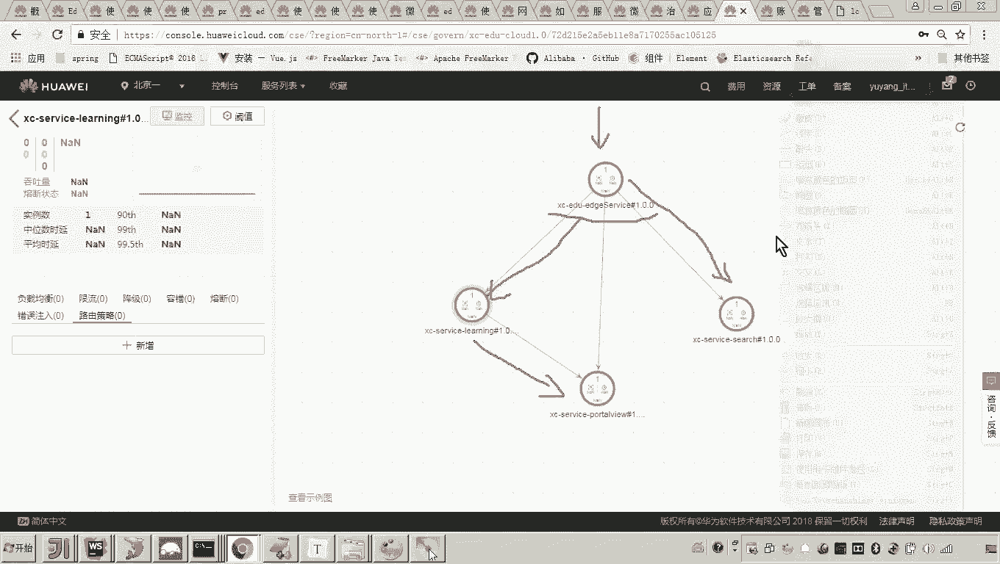

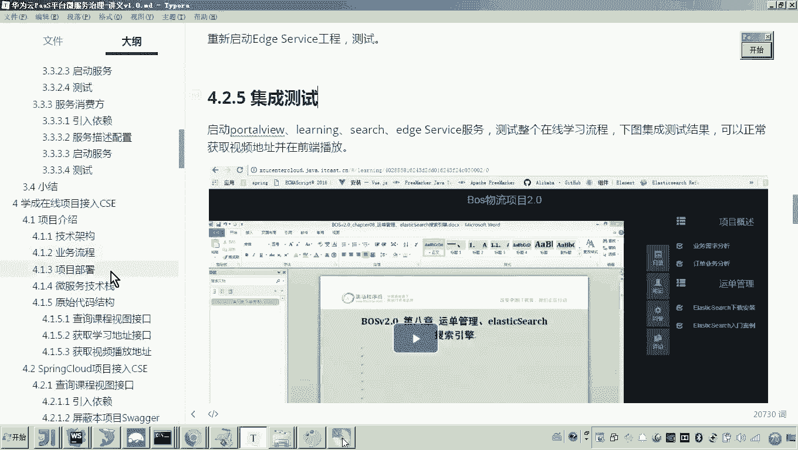

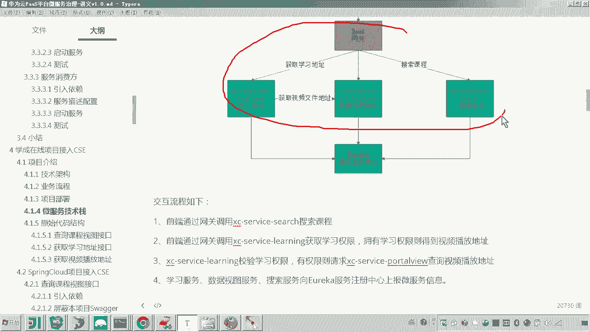

所以这就是云平台的什么厉害的地方。对你只要你的微服务接入了CSE平台，你会发现。😡，他就通过图形界面，通过这个你看这儿回头我会讲啊，还监控了很多的这个什么呀这个记录。

包括这一堆这个微服务治理的策略都可以设置。😊，那么这个图呢，你就可以看到你这个微服务之间的一个调用的过程。😡，最上边就是我们说的网关，通过网关来请求各个微服务，微服务与微服务之间，各位是不是可以调用？

😡。

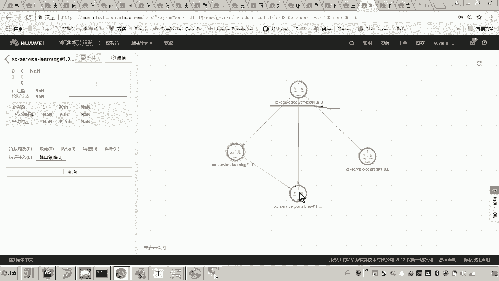

好，那么以上呢就是我们说的这个学程在线接入CSE平台的一个集成测试。哎，我这呢就测完了。

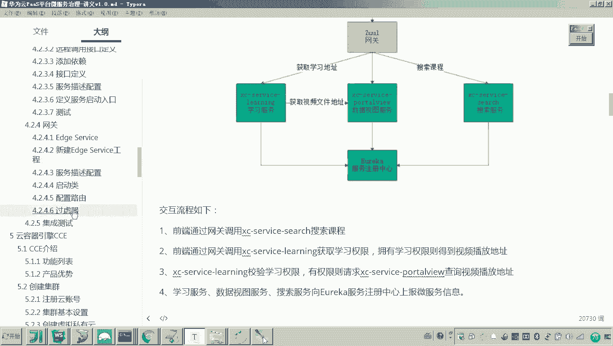