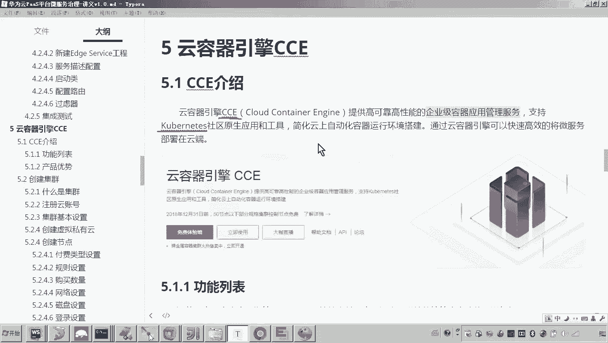
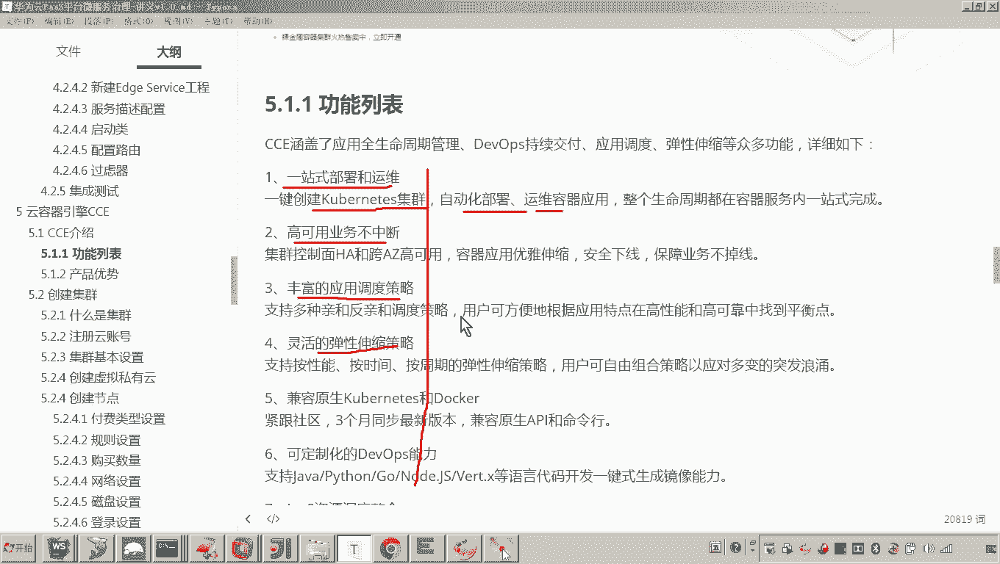
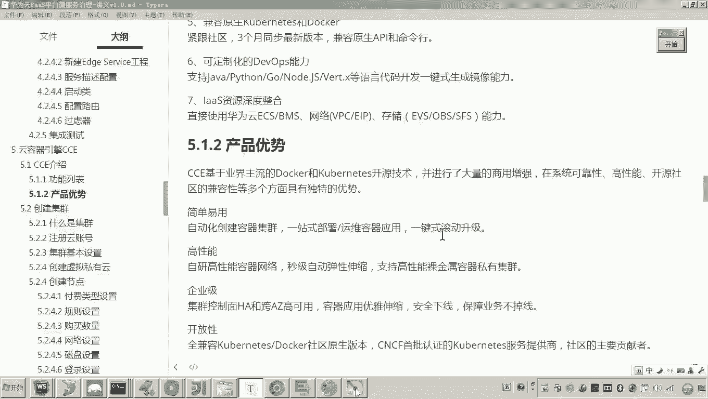
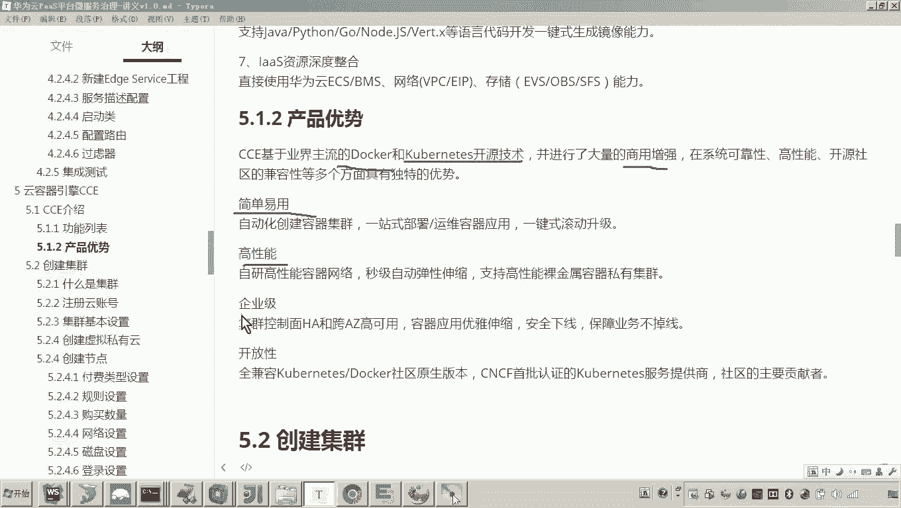
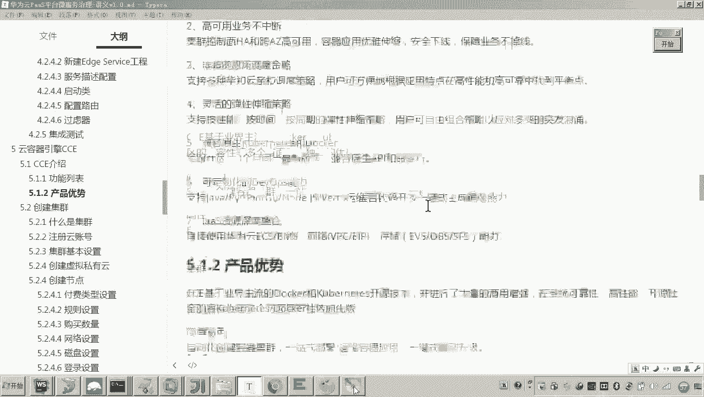
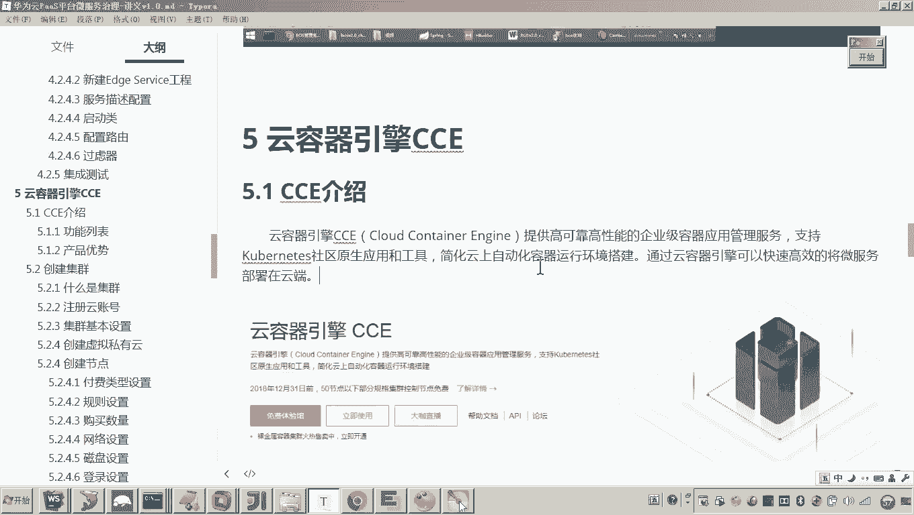

# 华为云PaaS微服务治理技术 - P99：07-云容器引擎CCE-CCE介绍 - 开源之家 - BV1wm4y1M7m5

好，那么下边呢我们来开始学习云容器引擎CCE。首先我们先介绍一下CCE。那CCE呢，它称为云容器引擎。他提供高可靠、高性能的企业级容器应用管理服务，支持kuubernetes。好。

那在最初呃在这个早期课程中，我是不是介绍过这个kuubernetes的概念。因为我们知道啊这个最终啊我们会把我们的微服务啊采用docker容器化技术呢啊来进行部署。嗯，最终呢我们要把我们的这个呃微服务。

我们的项目的所有的这个服务呢都上云啊，而这个云容器引擎CCE呢，它就是采用docker加net啊来实现啊我们说的这个智能化部署啊管理啊，这样一个高效的管理的服务的平台啊。

所以说呢我们可以采用这个云容器引擎CCE呢就可以非常啊简洁快速高效的把我们的呃应用，我们的啊微服务部署到云端。好，那么下边呢我们来看一下它一些功能的列表啊，我们简单来浏览一下好。

那首先第一个是一站式部署和运维啊，我们可以一键创建这个net集群来自进行自动化的部署啊，包括后期的这个维护啊，还有什么。😊。

高可用业务不中断啊，丰富的应用调度策略，灵活的弹性伸缩。好，那这些功能呢，其实我们在后边的课程啊准备最终我们会把学程在线项目呢部署到云端。那么在学习的过程当中呢啊我们说都会接触到。好。

那么呃我们接下来来看。那这个云容器引擎它的优势在哪里呢。😊。

CCE啊基于业界主流的docker和kuubernetes开源技术。啊，然后并进行了大量的商用增强。也就是说呀，华为云容器引擎CCE平台呢啊它是在这两个技术的基础之上呢啊又开发了很多的啊这个商用功能啊。

可以使我们这个系统呢更加的高效啊来进行部署运维和管理。😊，好，那么它的优势呢有简单易用啊，高高性能、企业级开放性啊等等。好，这些呢大家了解一下。

好，那么呃以上呢咱们先简单的介绍一下这个云容器引擎啊，它就是一个可以将我们的这个项目的所有的应用服务啊，以快速高效的部署到云端的一个管理平台。

