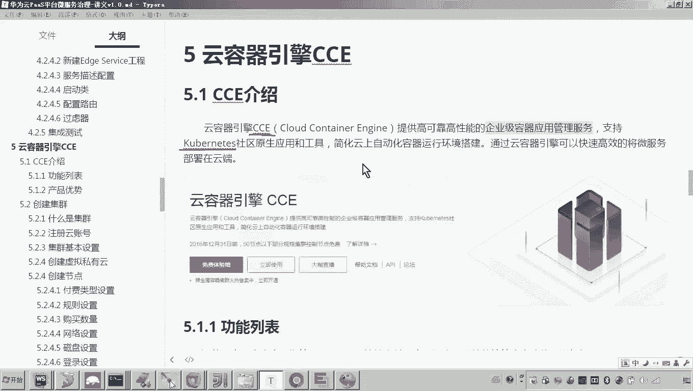
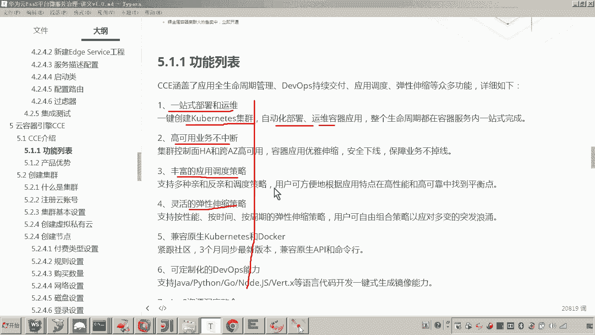
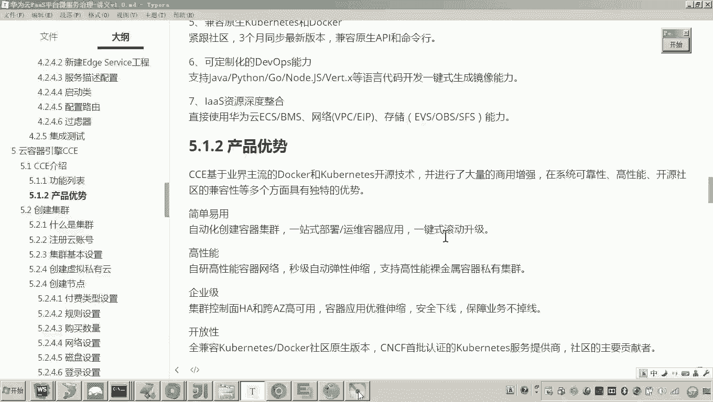
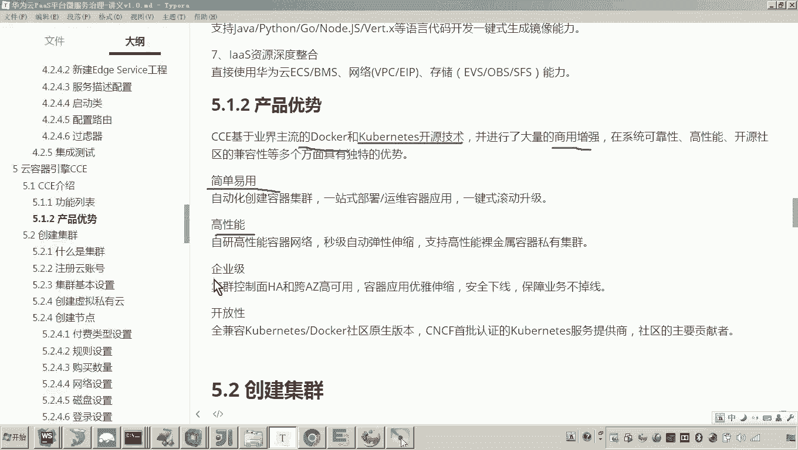
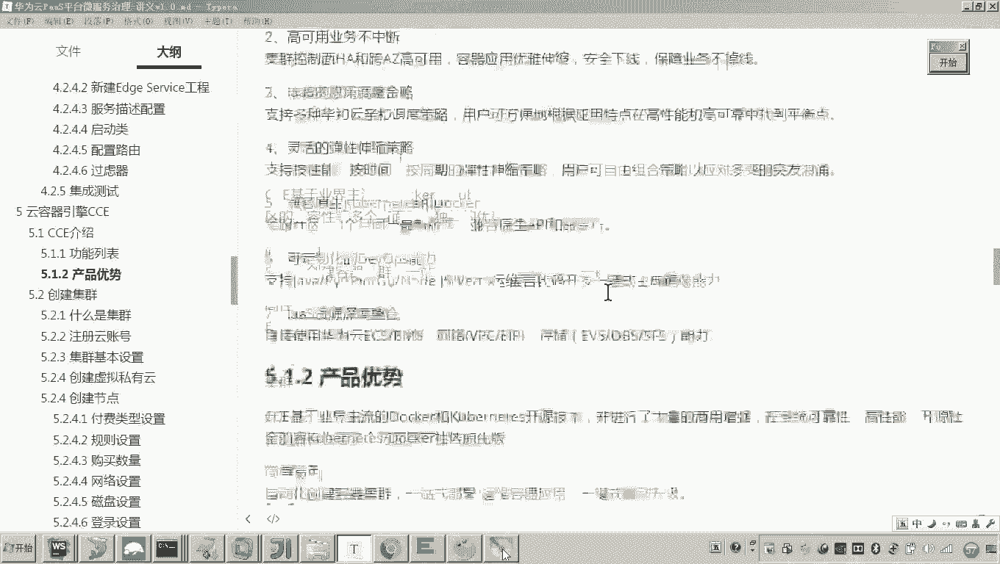
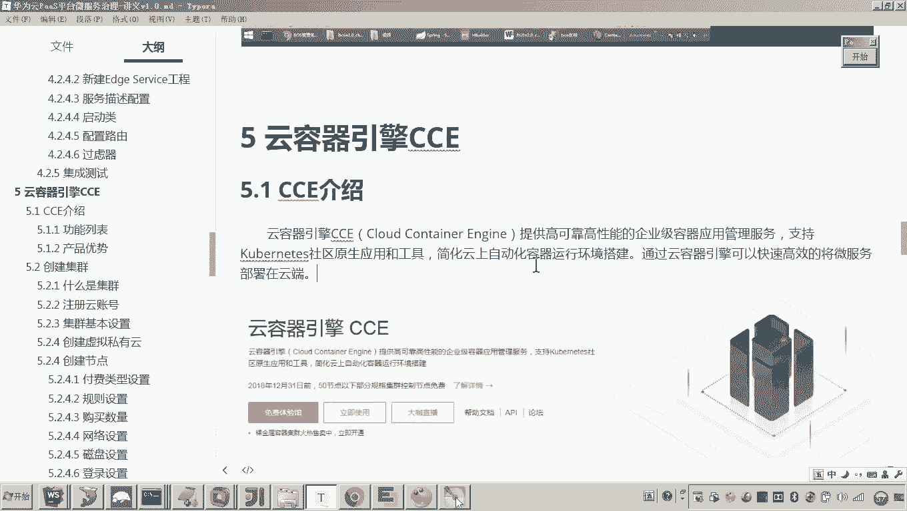

# 华为云PaaS微服务治理技术：P99：07-云容器引擎CCE-CCE介绍 🚢

在本节课中，我们将要学习华为云的云容器引擎CCE。我们将了解CCE是什么，它的核心功能与优势，以及它如何帮助我们高效地部署和管理容器化应用。

## 什么是云容器引擎CCE？ 🤔

云容器引擎CCE是华为云提供的一项服务。它提供高可靠、高性能的企业级容器应用管理服务，并支持Kubernetes。

在早期课程中，我们介绍过Kubernetes的概念。我们知道，最终我们会采用Docker容器化技术来部署微服务。最终，我们需要将项目的所有服务都部署到云端。云容器引擎CCE正是采用 **Docker + Kubernetes** 技术栈，来实现智能化部署与管理的高效服务平台。

因此，我们可以利用云容器引擎CCE，简洁、快速、高效地将应用和微服务部署到云端。

## CCE的核心功能 📋

上一节我们介绍了CCE的基本概念，本节中我们来看看它提供哪些核心功能。以下是CCE的主要功能列表：

*   **一站式部署和运维**：支持一键创建Kubernetes集群，实现自动化部署与后期维护。
*   **高可用与业务不中断**：确保服务的高可用性，保障业务连续性。
*   **丰富的应用调度策略**：提供多种策略来优化应用在集群中的分布和运行。
*   **灵活的弹性伸缩**：可根据业务负载自动或手动调整应用实例数量。

这些功能在我们后续将“学成在线”项目部署到云端时，都会具体接触到和应用。

## CCE的优势 ✨

了解了CCE的功能后，我们接下来分析它的优势所在。

CCE基于业界主流的 **Docker** 和 **Kubernetes** 开源技术，并进行了大量的商用增强。这意味着，华为云容器引擎CCE平台在开源技术的基础上，开发了许多商用功能，使得系统部署、运维和管理更加高效。

以下是CCE的主要优势：

*   **简单易用**：提供友好的控制台和工具，降低使用门槛。
*   **高性能**：优化底层架构，提供卓越的容器运行时性能。
*   **企业级**：满足企业对于安全性、可靠性和可维护性的高要求。
*   **开放性**：兼容Kubernetes原生API和生态，避免厂商锁定。

## 总结 📝

本节课中，我们一起学习了华为云容器引擎CCE。我们了解到，CCE是一个基于Docker和Kubernetes的企业级容器管理平台。它能帮助我们快速、高效地将项目的所有应用服务部署到云端，并提供一站式部署运维、高可用、弹性伸缩等强大功能，是微服务上云的理想选择。