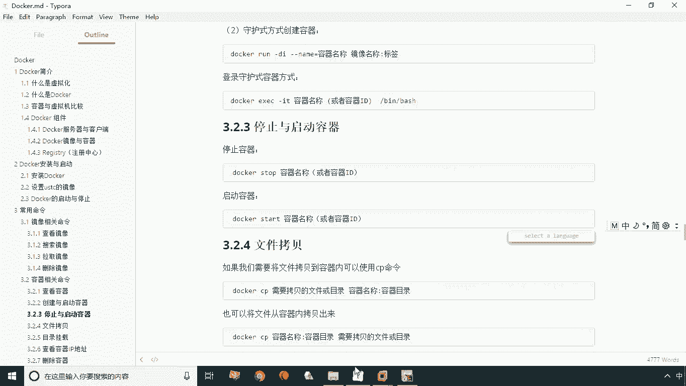
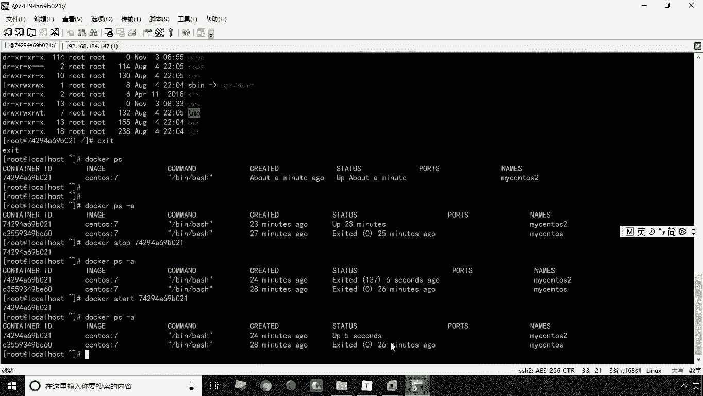
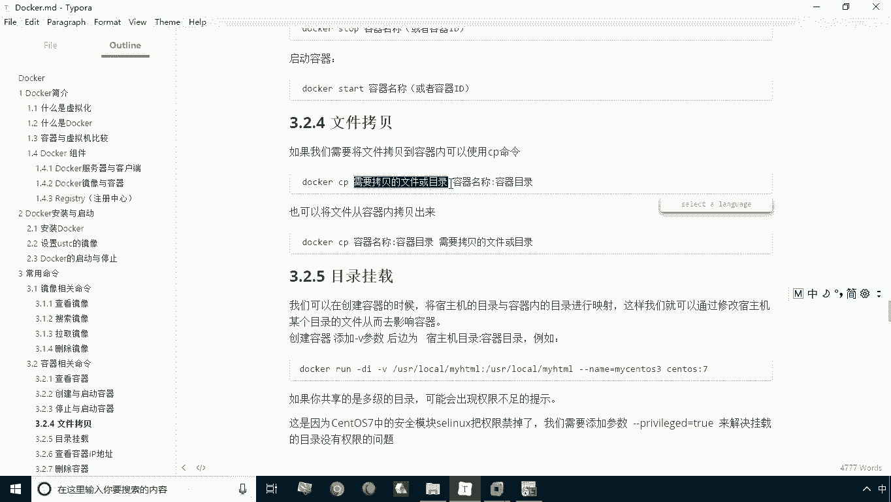
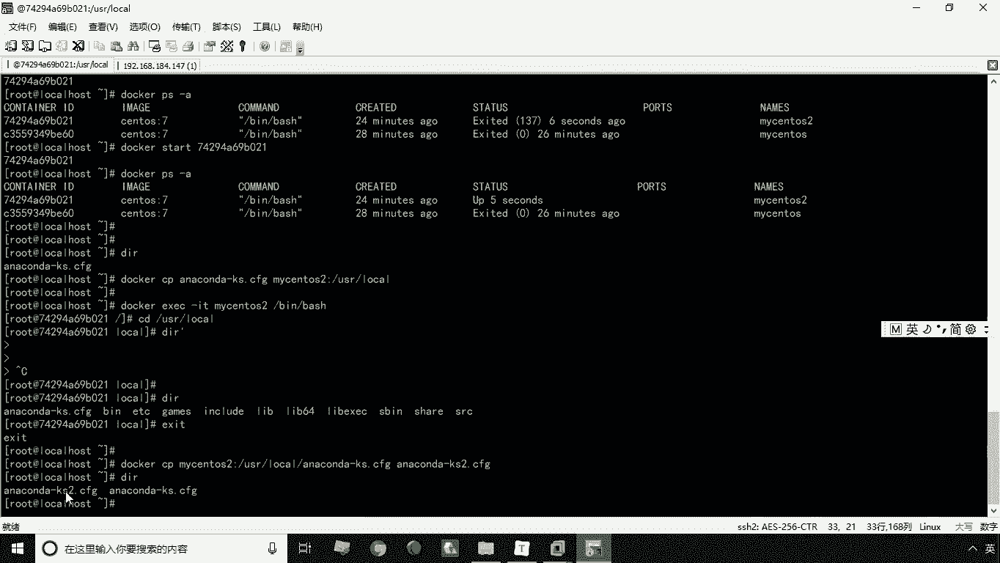
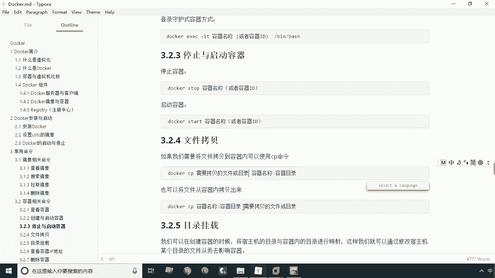

# 华为云PaaS微服务治理技术 - P9：09.容器停止与启动和目录挂载 - 开源之家 - BV1wm4y1M7m5

好刚才呢给大家讲解了啊，是创建容器和查看容器，那么我们说创建的容器启动起来怎么去停掉呢，啊那这时候呢我们给大家讲解两个命令，一个是启动啊，一个是停止，一个是启动好，首先我们来看一下这个停止啊。

那么停止就是stop啊，这个很容易记，那么启动就是大啊，就这么简单，那么咱们给大家演示一下。

首先我们通过docker PS杠A来查看一下，当前我们所有的容器，那么当前呢有一个容器是运行的，有一个容器是停止的，运行的是买SLS2，那么停止的是买SLS，那首先我们来看一下停止容器啊，停止容器的话。

我们将这个MYSQLS2给它停掉，叫docker什么stop，然后是买CTOS2啊，就是我们容器的名称，当然你这里头也可以什么呢，可以去指定我们的容器id也是可以的啊，这两种写法都可以啊。

那我们现在将它停掉，那么停止的这个时间呢，比启动要稍微的慢一点啊，要稍微慢点好，我们看一下好，我们看一下，现在已经停掉了啊，停了之后，我们现在可以用docker p杠A来查看一下，刚才的这个容器呢。

买四张S2就已经停掉了啊，就已经停掉了，那么停掉的容器我们怎么再把它启动起来呢，啊那这时候我们就用这个docker start，然后呢是我们的容器id或者是容器的名称，这都可以啊，然后我们现在来回车好。

我们看一下，现在启动起来了，那么启动起来之后，我们再通过高docker p杠A来查看一下啊，这个容器呢啊又被启动起来了，好这就是容器的停止与启动，那么容器的停滞与启动之后呢。

我们接下来再看一下下面这个命令啊，下面这个命令呢叫文件拷贝啊，那这个文件拷贝的这个命令也很常用，什么时候会用它呢，我们通常呢会随着把某些文件或者目录，考到容器里对吧。

你比如说你像容器里要安装一个什么软软件，对吧，你肯定是要把东西要考去嘛，那么还有一种情况，就是要把容器里的东西再考出来，那么这个拷贝呢这个命令也好记，叫什么叫CP啊，叫CP，那么前面那个部分呢。

你要指定你要拷贝的是什么，那么后面那部分呢你要指定的目标啊，指定第一个是圆，第二个就是目标啊，那我们看一下怎么去把这个文件拷到容器里啊。

咱们给大家演示一下啊，我们还是用买SLS2给大家演示啊，那么我们首先看一下这个当前有什么文件啊，咱们叫就地取材啊，当前目录呢正好有这么一个文件是吧啊，你别管这个文件是什么对吧，那你就把这个文件拷进去。

咱们咱们来做一个测试啊，叫docker什么呢，CB然后呢你这里的文件，这时候我要指定这个名称吧，哎指定这个名称空格，然后接下来什么你的目标是什么，目标是考到MYSTOS2上好，那你这里就指定买SUS2。

接下来我们这里有冒号啊，容器名称后面是冒号，当然这个容器名称你也可以用容器id啊，这两个都是可以通用的啊，有容器名称后面加上一个什么啊，杠什么，他肯定会有这么一个目录对吧，那好了。

我就将这个文件本机的速主机的这个文件，当前目录这个文件拷到我们的容器，这个MYSNLS2这个容器的user的logo下回车，这时候呢我们看一下啊，他现在已经执行完了，没有报错，那就是成功了对吧。

没有报错就成功了，那么怎么来验证他这个东西拷下来呢，你肯定是要进去对吧，所以说我们在进入到容器用什么ESIT，然后杠什么啊，这个啊要指定什么叫杠T啊啊杠T，然后呢指定这个名称my sto s2啊。

杠B杠BH好进去之后呢，我们现在呢啊就先进到这个目录里啊，USRLOLO对吧，进入这个目录之后呢，我们，我们来DR一下，我们会发现啊，这个文件是不是就考进来了啊，这个文件就考虑了这个文件呢。

就是我们从速5G拷贝过来的啊，好我们exit退出来，退出来之后呢，我们从这个文件拷贝啊，就给他拷出来了，拷进去了啊，那么考进之后呢，你怎么可能考出来呢，那这时候你就不洗，写成反的就行了啊。

CP那么你要考什么考，就是还是刚才那个文件，就是指定买C6S2这个容器，我要把这个容器的东西拷出来怎么办，咱们还是考刚才那个文件啊，因为这个刚才文件呢呃就在这个温度下对吧，所以这个文件肯定是存在的。

你把它拷出来，当题目本身就有这么一个文件对吧，那所以说我可不可以给他改个名儿呢是吧，我可以指定我考上之后叫什么名儿，那我给他改个二是吧，好回车，这时候呢我们再看一下啊。

当前目录是不是就有这个就有这个文件了是吧，那就cos了。

好关于我们这个啊文件的这个拷贝啊。

