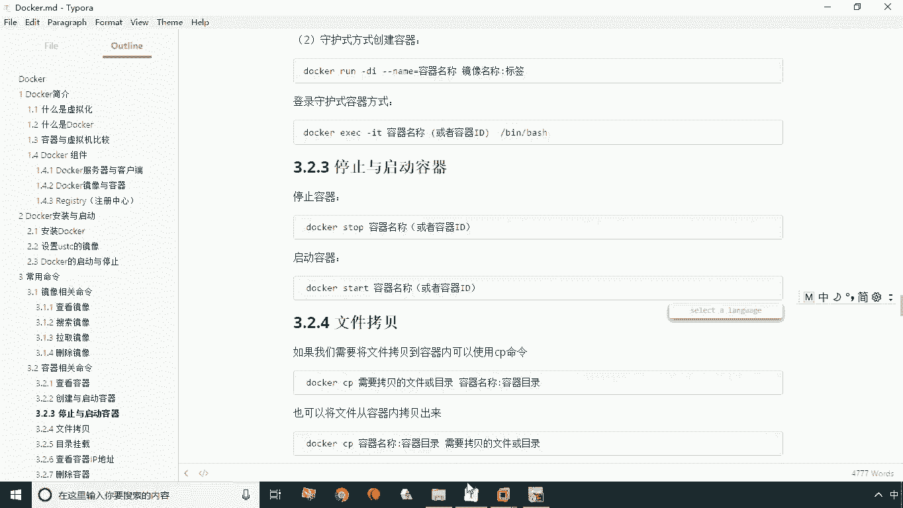
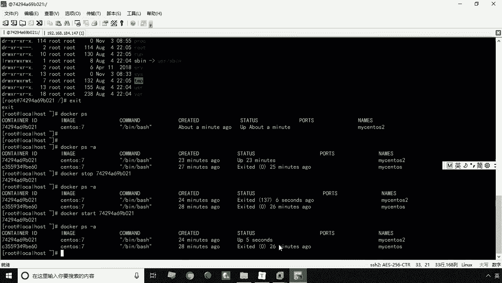
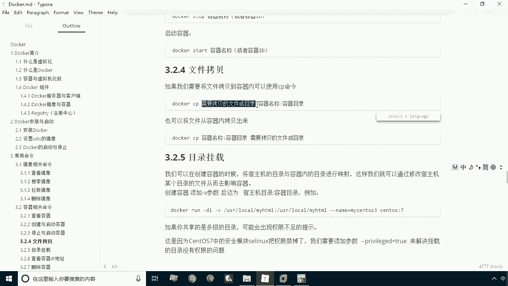
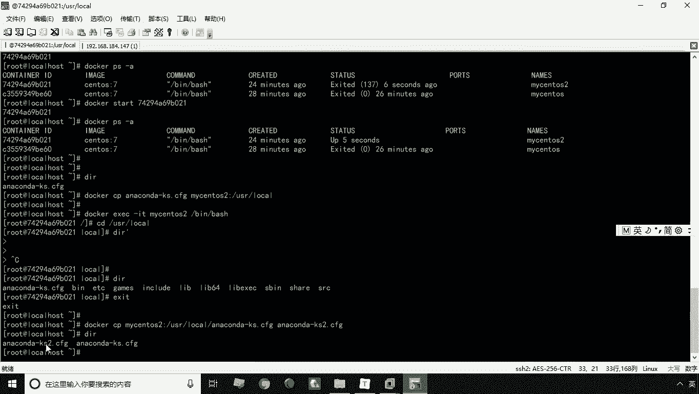
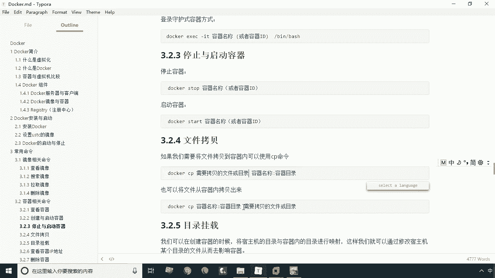

# 华为云PaaS微服务治理技术 - P9：09.容器停止与启动和目录挂载 🐳

在本节课中，我们将要学习Docker容器的两个基本操作：如何停止与启动容器，以及如何在宿主机与容器之间进行文件拷贝。这些是日常使用Docker管理应用时非常实用的技能。



上一节我们介绍了容器的创建与查看，本节中我们来看看如何管理容器的运行状态。

## 容器的停止与启动

停止和启动容器是管理其生命周期的基本操作。以下是相关的两个核心命令：

*   **停止容器**：`docker stop <容器名称或ID>`
*   **启动容器**：`docker start <容器名称或ID>`

现在，让我们通过一个演示来理解这两个命令的使用。

首先，我们使用 `docker ps -a` 命令查看当前所有的容器。假设我们有一个正在运行的容器 `mysqls2` 和一个已停止的容器 `mysqls`。

要停止正在运行的 `mysqls2` 容器，我们执行命令 `docker stop mysqls2`。命令中的 `mysqls2` 是容器的名称，你也可以使用容器的ID，两者效果相同。停止操作可能需要一点时间来完成。



停止后，再次运行 `docker ps -a`，可以看到 `mysqls2` 的状态已变为停止。

接下来，要将已停止的 `mysqls2` 容器重新启动，我们使用命令 `docker start mysqls2`。执行后，容器便会重新运行起来。再次使用 `docker ps -a` 命令验证，可以看到 `mysqls2` 已恢复运行状态。

这就是容器的停止与启动操作。



## 宿主机与容器间的文件拷贝

在容器运行过程中，我们经常需要在宿主机和容器之间交换文件，例如向容器内安装软件或从容器内导出日志。Docker提供了 `docker cp` 命令来实现这一功能。

该命令的基本语法是：
```bash
docker cp <源路径> <目标路径>
```
其中，`<源路径>` 和 `<目标路径>` 可以是宿主机路径或容器内路径，格式为 `<容器名称>:<容器内路径>`。

以下是具体的操作演示。

### 将文件从宿主机拷贝到容器

假设当前宿主机目录下有一个名为 `testfile.txt` 的文件，我们想将其拷贝到 `mysqls2` 容器的 `/usr/local/` 目录下。

我们执行命令：
```bash
docker cp testfile.txt mysqls2:/usr/local/
```
命令执行后若无报错，即表示拷贝成功。

为了验证文件是否已成功拷贝到容器内，我们需要进入容器查看。使用命令 `docker exec -it mysqls2 /bin/bash` 进入容器的交互式终端。

然后，切换到目标目录并列出文件：
```bash
cd /usr/local/
ls
```
此时，应该能看到 `testfile.txt` 文件已存在于容器内的该目录下。验证完毕后，输入 `exit` 退出容器终端。

### 将文件从容器拷贝到宿主机

反过来，如果我们需要将容器内的文件拷贝到宿主机，只需调换命令中源和目标的顺序即可。

例如，将容器 `mysqls2` 中 `/usr/local/testfile.txt` 文件拷贝到宿主机的当前目录，并重命名为 `testfile_copy.txt`，可以执行：
```bash
docker cp mysqls2:/usr/local/testfile.txt ./testfile_copy.txt
```
执行后，在宿主机的当前目录下，就能找到新拷贝出来的 `testfile_copy.txt` 文件。



---



本节课中我们一起学习了Docker容器的停止(`stop`)、启动(`start`)操作，以及使用 `cp` 命令在宿主机和容器之间进行双向文件拷贝。掌握这些命令，能帮助你更灵活地管理和维护容器化应用。