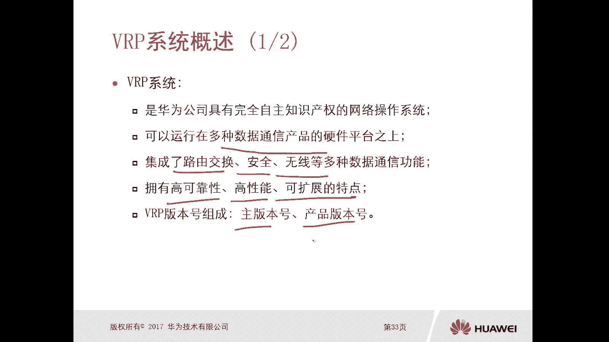
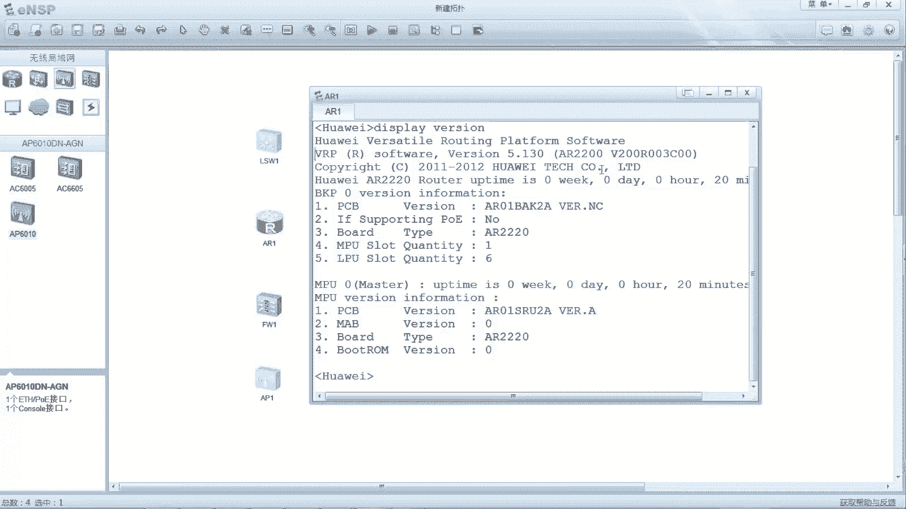
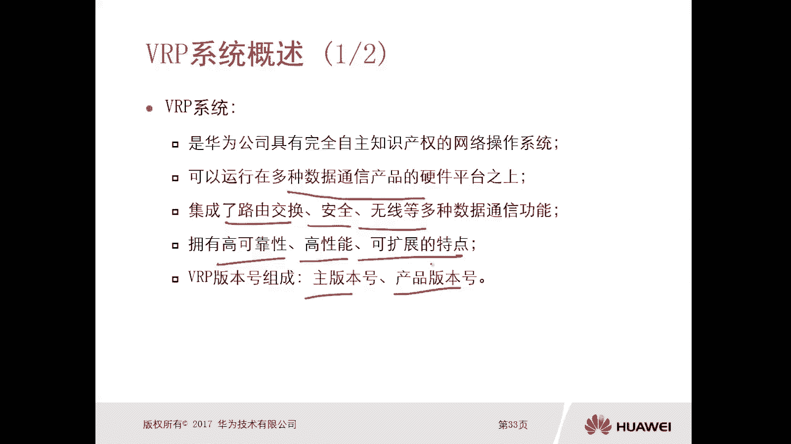
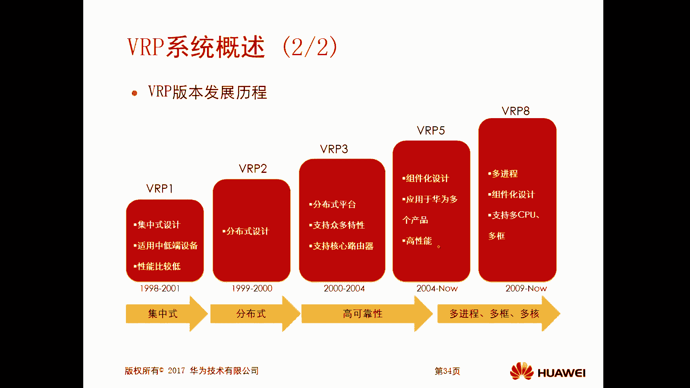
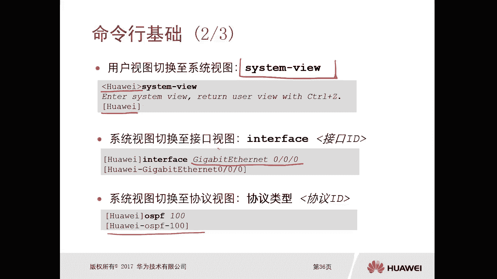
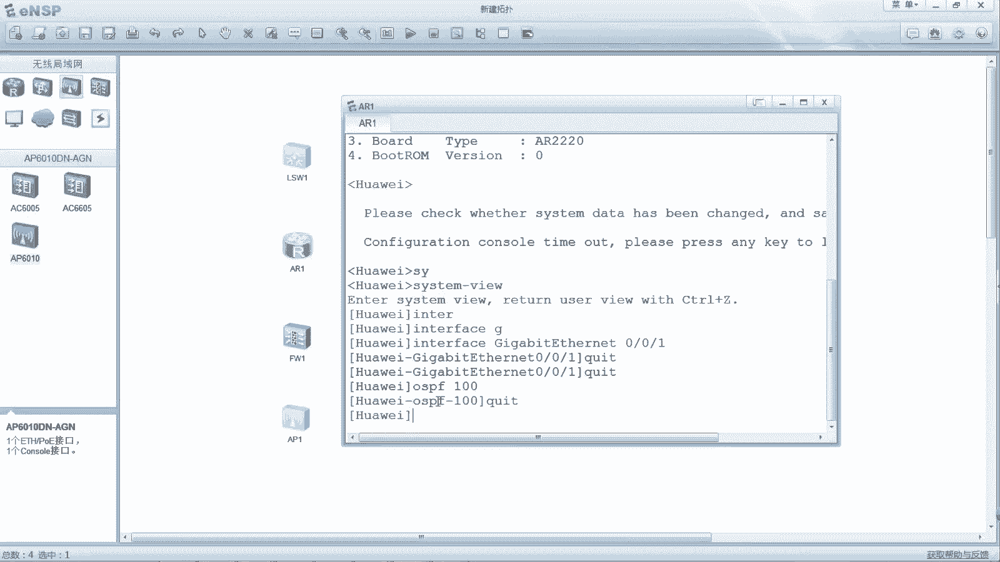
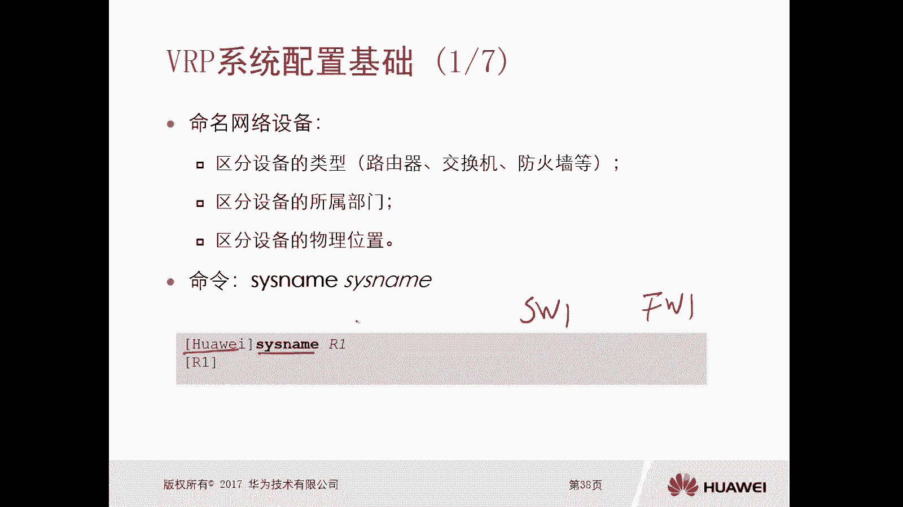
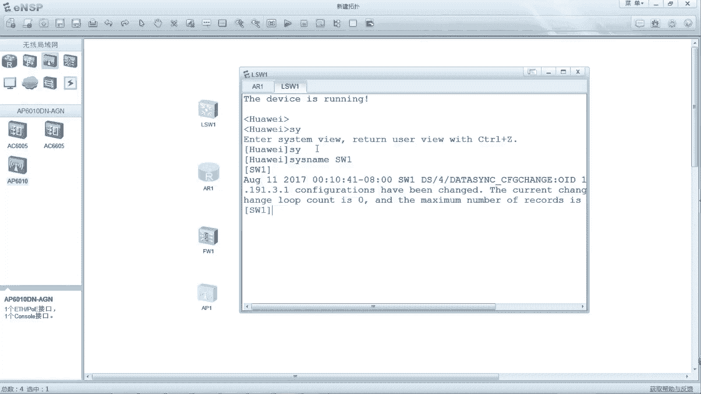
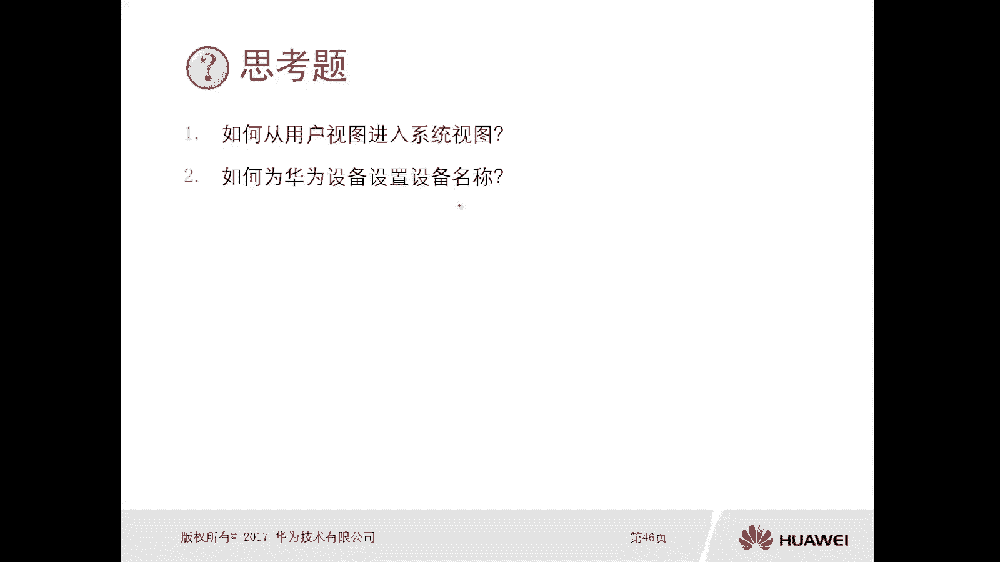

# 华为认证ICT学院HCIA/HCIP-Datacom教程：1：VRP操作系统与配置基础 🖥️

在本节课中，我们将要学习华为网络设备的核心——VRP操作系统。我们将了解VRP是什么，如何通过命令行与设备交互，以及进行最基本的设备配置。掌握这些是学习华为网络技术的基石。

## VRP系统概述

VRP是华为公司自主研发的网络操作系统，它运行在华为的各种网络设备上，如路由器、交换机和防火墙。你可以把它理解为网络设备的“Windows系统”，它集成了路由、交换、安全等多种数据通信功能。



VRP系统具有高可靠性、高性能和可扩展的特点。不同的设备可能运行不同版本的VRP。VRP的版本号主要由两部分组成：**主版本号**和**产品版本号**。例如，在设备上执行 `display version` 命令，可能会看到类似 `5.130` 的版本信息，其中 `5` 是主版本号，`130` 是产品版本号。





VRP的发展经历了多个阶段：
*   **VRP1 (1998-2001)**：集中式设计，用于中低端设备。
*   **VRP2 (1999-2000)**：开始采用分布式设计。
*   **VRP3 (2000-2004)**：分布式平台，支持更多特性。
*   **VRP5 (当前主流)**：组件化设计，用于AR系列路由器、S系列交换机等，性能更高。
*   **VRP8 (用于数据中心)**：多进程、组件化设计，支持多CPU，更为高端。

## 命令行基础与系统视图



与华为设备交互的主要方式是通过命令行。设备提供了不同的操作界面，称为“视图”。不同的视图对应不同的操作权限和命令。

以下是主要的几种视图：

*   **用户视图**：提示符为尖括号 `< >`。例如：`<Huawei>`。在此视图下，只能查看设备运行状态和基本参数，无法进行配置。
*   **系统视图**：提示符为中括号 `[ ]`。例如：`[Huawei]`。在此视图下，可以配置设备的全局参数。
*   **接口视图**：提示符为 `[设备名-接口ID]`。例如：`[Huawei-GigabitEthernet0/0/1]`。在此视图下，可以配置特定接口的参数，如IP地址。
*   **协议视图**：提示符为 `[设备名-协议]`。例如：`[Huawei-ospf-100]`。在此视图下，可以配置特定路由协议等参数。

视图之间可以通过特定命令进行切换：
*   从用户视图进入系统视图：`system-view`
*   从系统视图进入接口视图：`interface` + 接口ID，例如 `interface GigabitEthernet 0/0/1`
*   从系统视图进入协议视图：`协议` + 参数，例如 `ospf 100`

退出当前视图则使用 `quit` 命令。



## 用户等级与命令等级

华为设备对用户的访问权限进行了精细划分，这通过**用户等级**和**命令等级**来实现。



用户等级分为0-15级，不同等级的用户可以执行不同级别的命令：
*   **访问级 (0级)**：只能执行0级命令，如网络诊断工具（`ping`, `tracert`）、部分显示命令（`display`）等。
*   **监控级 (1级)**：可执行0级和1级命令，主要用于系统维护和查看信息。
*   **配置级 (2级)**：可执行0、1、2级命令，可以进行业务配置，如配置路由、接口等。
*   **管理级 (3-15级)**：可执行0、1、2、3级命令，拥有最高权限，可以进行系统管理、用户管理、命令级别设置等。

在远程管理设备（如通过Telnet或SSH登录）时，可以为不同的登录账户分配不同的用户等级，以控制其操作权限。

## VRP基本配置

上一节我们介绍了命令行和权限等级，本节中我们来看看拿到一台新设备后需要做哪些最基本的配置。

以下是设备初始化的基本步骤：

1.  **设置设备名称**
    设备默认名称为“Huawei”，为了便于管理，必须为其设置一个具有意义的名称。命名规则可以包含设备类型（如R1、SW1）、所属部门或物理位置。
    配置命令（在系统视图下执行）：
    ```bash
    system-name R1
    ```



2.  **设置系统时钟**
    准确的时间对于日志记录和故障排查至关重要。
    配置命令（在用户视图下执行）：
    ```bash
    clock timezone BJ add 08:00:00  // 设置时区为北京东八区
    clock datetime 20:30:00 2023-10-27 // 设置具体日期和时间
    ```



3.  **配置登录标题消息（可选）**
    可以设置用户登录前后显示的提示信息。
    配置命令（在系统视图下执行）：
    ```bash
    header login information “Warning: Authorized Access Only!” // 登录前显示
    header shell information “Welcome to R1 Configuration Terminal.” // 登录后显示
    ```

4.  **为设备接口配置IP地址**
    网络设备需要通过IP地址进行通信。IP地址在接口视图下配置。
    配置命令（在接口视图下执行）：
    ```bash
    ip address 192.168.1.1 255.255.255.0
    ```

5.  **保存配置**
    非常重要！所有配置修改后，必须保存到设备的存储中，否则设备重启后配置会丢失。
    保存命令（在用户视图下执行）：
    ```bash
    save
    ```

**其他常用维护命令：**
*   **清除保存的配置**（用户视图）：`reset saved-configuration`。此操作会清空设备所有已保存的配置，使其恢复出厂设置。
*   **重启设备**（用户视图）：`reboot`。用于远程重启设备。

## 总结与思考

本节课中我们一起学习了华为VRP操作系统的基础知识。我们了解了VRP的版本构成与发展历程，掌握了通过命令行在不同视图（用户、系统、接口、协议视图）间切换的方法，理解了用户等级与命令等级的对应关系，并学会了设备初始化最基本的配置步骤，包括命名、设置时间、配置IP地址和保存配置。



最后，请思考两个问题：
1.  如何从用户视图进入到系统视图？
2.  如何为华为设备设置设备名称？