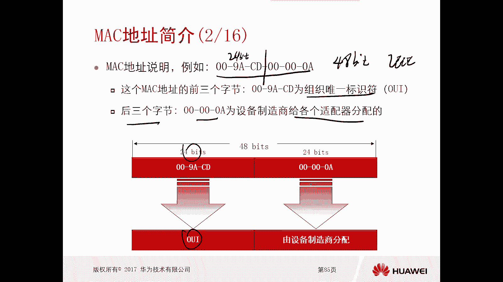
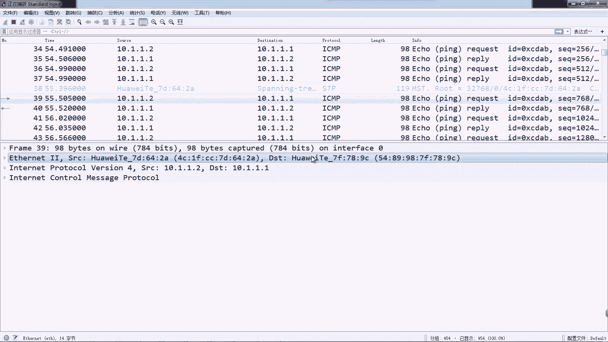
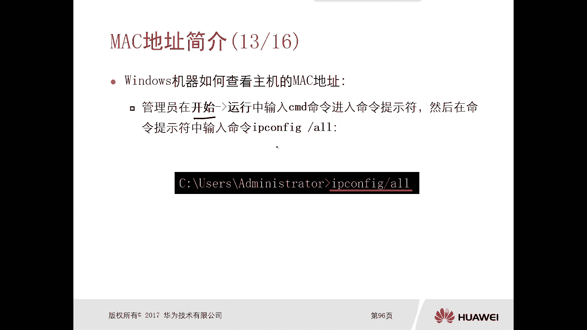
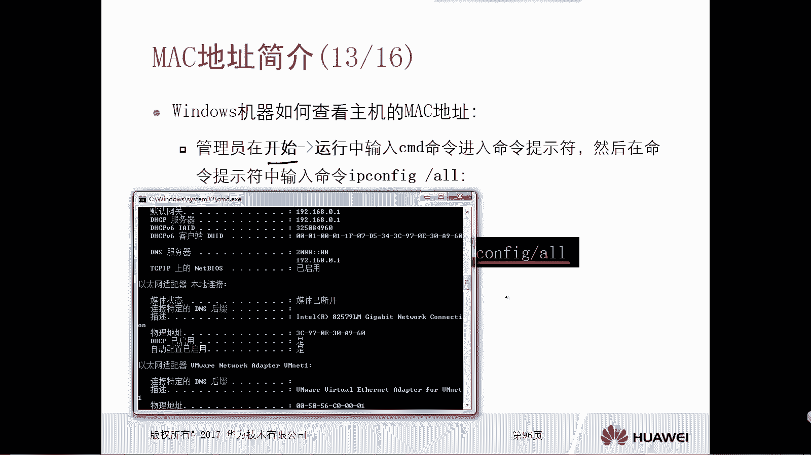
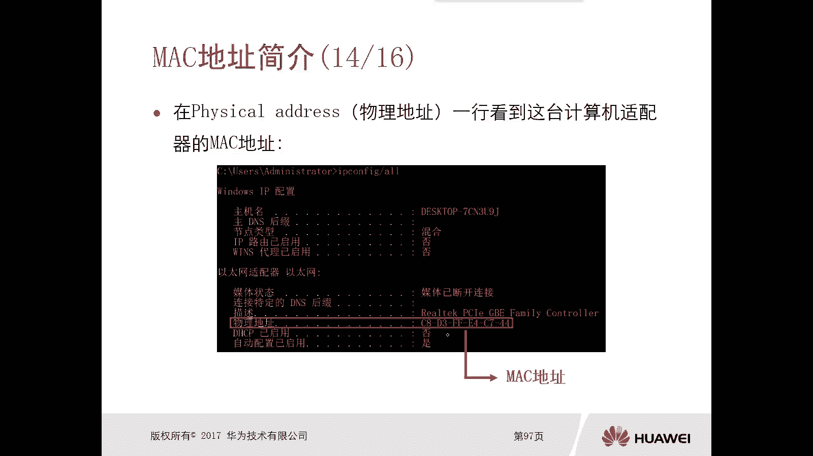
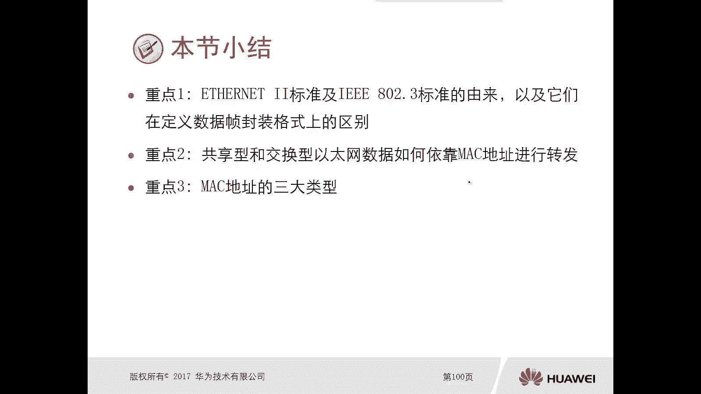

# 华为认证ICT学院HCIA/HCIP-Datacom教程：第1册-第4章-4：MAC地址介绍 📡

在本节课中，我们将要学习数据链路层中一个至关重要的概念——MAC地址。MAC地址是网络设备在网络中进行通信和身份标识的基础。我们将了解它的定义、结构、分类以及它在不同网络环境中的作用。

---

## MAC地址简介

上一节我们介绍了以太网帧的封装格式，其中提到了源和目的MAC地址。本节中，我们来看看MAC地址的具体含义。

MAC地址，也称为硬件地址或物理地址。它是在数据链路层标识一台设备网络适配器（如网卡）身份的地址。理论上，每个网络适配器的MAC地址是全球唯一的。

MAC地址由**6个字节**，即**48个比特**组成。例如：`00-9A-CD-00-00-0A`。

---

## MAC地址的构成

MAC地址的48个比特并非随意分配，它由两部分构成。

*   **前3个字节（24比特）**：称为**组织唯一标识符**。这需要设备制造商向IEEE（电气和电子工程师协会）申请获得，代表了设备的制造商。例如，`00-9A-CD`就是华为公司的其中一个OUI。
*   **后3个字节（24比特）**：由设备制造商自行分配，用于标识其生产的每一个具体的网络适配器。

因此，一个完整的MAC地址可以表示为：`OUI (24比特) + 厂商分配ID (24比特)`。

在实际网络抓包中，分析软件通常会根据OUI自动识别出设备厂商。例如，下图显示的数据包源MAC地址`4C-EF-CC-...`就被识别为华为设备。

---

## 共享型与交换型网络中的MAC地址处理

理解了MAC地址是什么之后，我们来看看它在不同网络环境中是如何工作的。

### 在共享型网络（如使用集线器）中

在共享型以太网中，所有设备处于同一个冲突域。当一台设备（如终端A）发送数据时，集线器会将数据帧从除接收端口外的所有端口广播出去。

*   **终端B和D**：收到数据帧后，检查目的MAC地址发现不是给自己的（例如，目的地址是终端C的`33-33-33`），于是丢弃该帧。
*   **终端C**：检查目的MAC地址发现是给自己的，于是接收并处理该帧。

这种方式效率较低，因为非目标设备也会收到数据，造成不必要的网络流量。

### 在交换型网络（如使用交换机）中

交换机通过维护一张**MAC地址转发表**（也称为CAM表）来智能地转发数据，极大地提升了网络效率。

以下是交换机工作的两个核心步骤：

1.  **学习过程（基于源MAC地址）**：当交换机从一个端口收到数据帧时，它会记录下该数据帧的**源MAC地址**和对应的接收端口，并存入MAC地址表中。例如，从G0/1口收到源地址为`11-11-11`的帧，就学习到`11-11-11 <-> G0/1`的映射。
2.  **转发过程（基于目的MAC地址）**：当交换机需要转发一个数据帧时，它会查询MAC地址表，根据**目的MAC地址**找到对应的出端口，然后只从该端口转发出去。如果表中没有对应条目，则向除接收端口外的所有端口广播（泛洪）该帧。

通过这种方式，数据只会被发送到目标设备所在的端口，避免了不必要的广播，网络效率更高。

---

## MAC地址的分类

根据第一个字节的第8个比特（即最低有效位）的不同，MAC地址可以分为三类。

以下是MAC地址的主要类型：

*   **单播MAC地址**：第一个字节的第8个比特为 **0**。用于标识网络中唯一的一台设备。数据帧只会被拥有该特定MAC地址的设备接收。
    *   公式表示：`MAC[0] & 0x01 == 0`
*   **广播MAC地址**：48个比特全部为 **1**，即 `FF-FF-FF-FF-FF-FF`。发送给广播地址的数据帧会被同一广播域内的所有设备接收和处理。
*   **组播MAC地址**：第一个字节的第8个比特为 **1**。用于标识一组设备。只有加入了特定组播组的主机才会接收和处理发往该组播MAC地址的数据帧。
    *   公式表示：`MAC[0] & 0x01 == 1`
    *   对于IPv4组播，其MAC地址由固定的前缀`01-00-5E`加上IPv4组播地址的后23比特映射而成。

> **注**：IPv6组播MAC地址的生成方式有所不同，由固定前缀`33-33`加上IPv6组播地址的后32比特构成。这部分内容将在后续讲解IPv6时深入探讨。

---

## 如何查看设备的MAC地址

了解理论后，我们来看看如何在操作系统中查看本机的MAC地址。

### 在Windows系统中

1.  打开命令提示符（CMD）。
2.  输入命令 `ipconfig /all`。
3.  在输出的信息中找到“物理地址”或“Physical Address”，其后的一串由连字符分隔的十六进制数即为本机网卡的MAC地址。

### 在Linux系统中

1.  打开终端。
2.  输入命令 `ifconfig -a` 或 `ip addr show`。
3.  在网卡信息中找到“ether”或“link/ether”后面的一串由冒号分隔的十六进制数，即为该网卡的MAC地址。

---

## 总结

本节课中我们一起学习了MAC地址的核心知识。我们了解到MAC地址是48比特的硬件地址，由OUI和厂商ID两部分构成，用于在数据链路层唯一标识设备。它在交换型网络中通过“学习源地址，转发目的地址”的机制高效工作。最后，我们掌握了MAC地址的三种类型（单播、广播、组播）以及在不同操作系统中查看MAC地址的方法。理解MAC地址是学习局域网通信和交换机原理的重要基础。