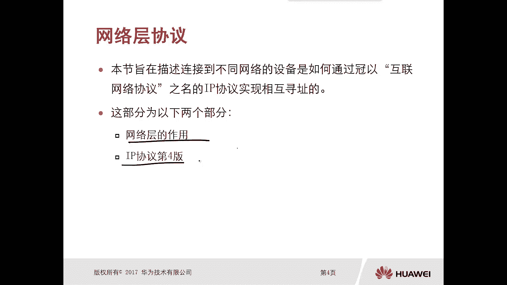
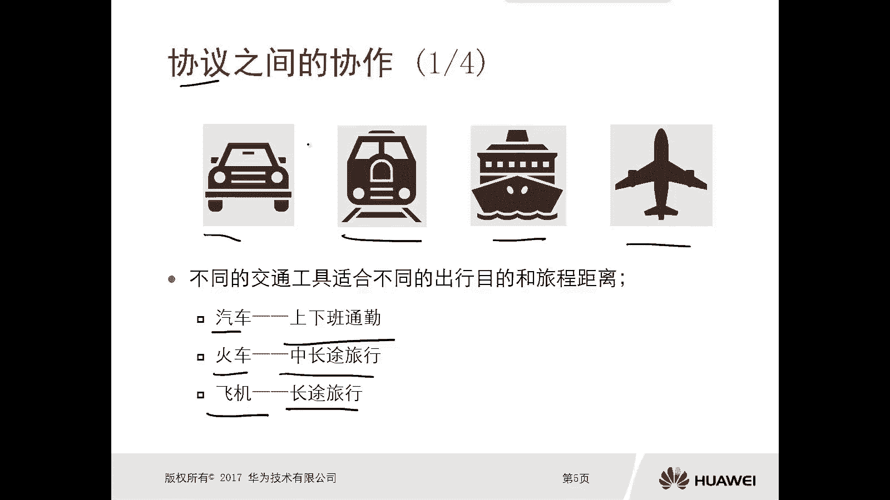
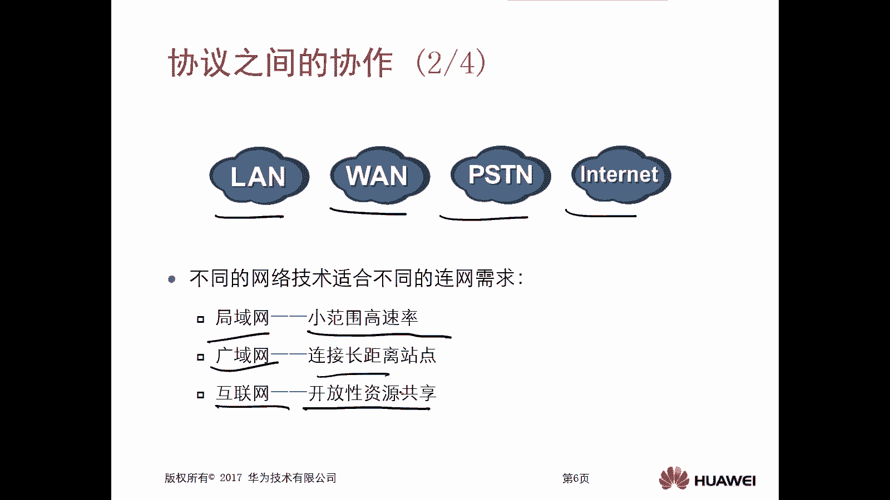
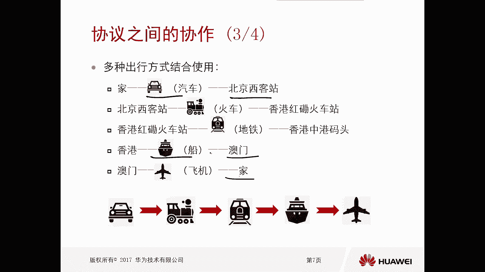
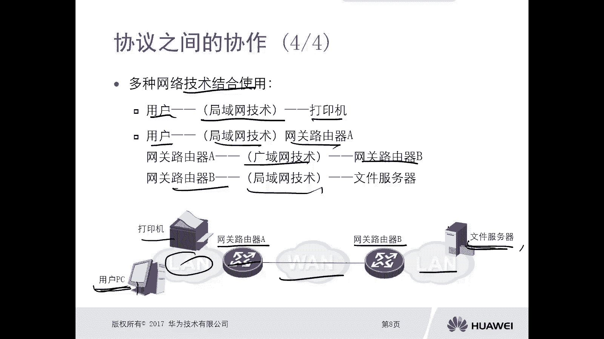
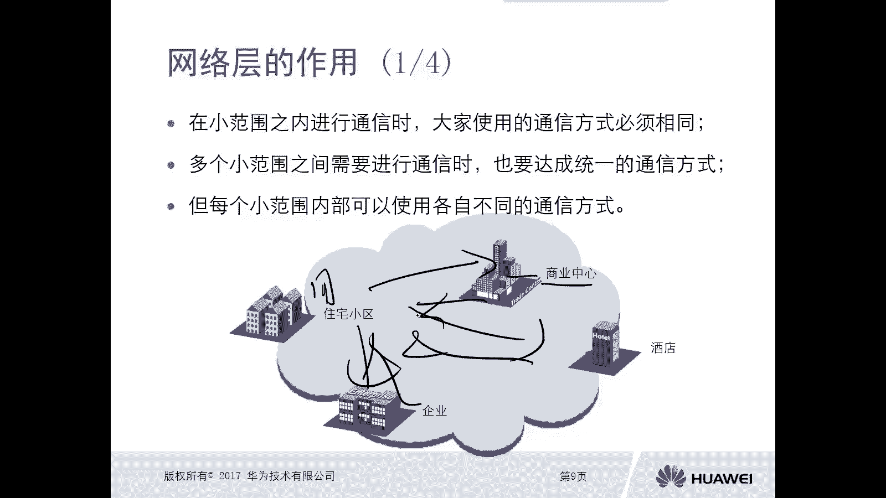
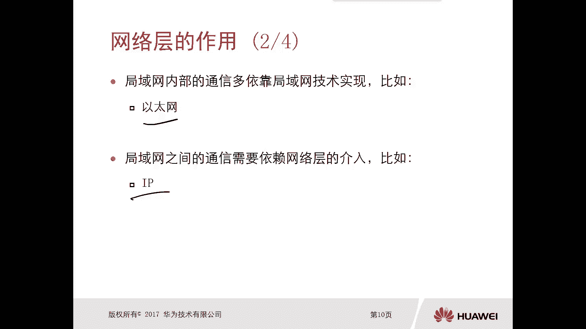
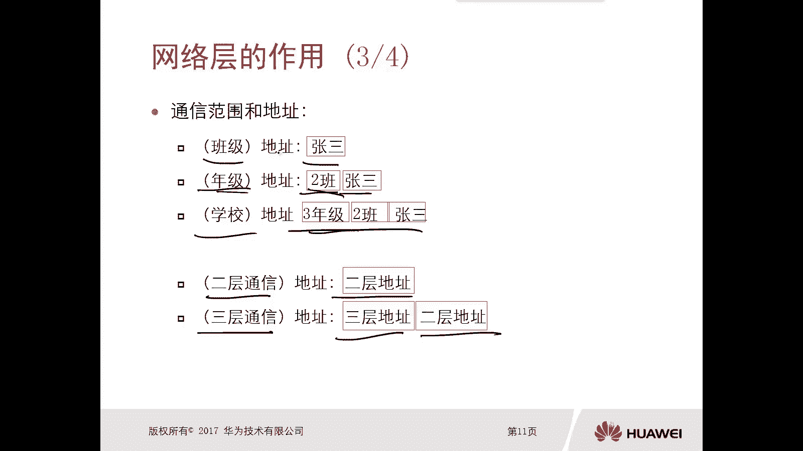
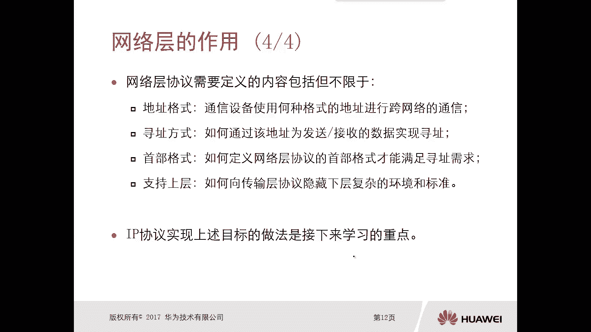

# 华为认证ICT学院HCIA/HCIP-Datacom教程：第1册-第5章-1：网络层的作用 🌐



在本节课中，我们将要学习网络层协议的核心作用。我们将探讨连接在不同网络的设备，如何通过互联网协议（IP协议）实现相互通信。本节内容主要分为两部分：网络层的作用以及IP协议（第四版）。

---

## 协议之间的协作 🚂

上一节我们介绍了网络通信的基本需求，本节中我们来看看不同网络技术如何协作。正如现实生活中，我们根据出行距离和目的选择不同的交通工具（如汽车、火车、飞机），网络技术也根据通信需求分为不同类型。



以下是主要的网络技术类型：

*   **局域网**：适用于小范围、高速率的通信需求，例如办公室内的资源共享。
*   **广域网**：适用于连接长距离站点的需求，例如企业不同分部之间的连接。
*   **互联网**：适用于开放性的自由互联需求，例如家庭用户上网、聊天、看视频。

---

## 网络技术的结合使用 🔗



正如一次长途旅行需要结合多种交通工具，一次跨网络的通信也常常需要结合多种网络技术。

以下是一个网络通信的实例：

*   **场景**：用户PC需要访问另一个局域网内的文件服务器。
*   **过程**：
    1.  用户PC到本地网关路由器A，使用**局域网**技术。
    2.  网关路由器A到远程网关路由器B，使用**广域网**技术。
    3.  网关路由器B到目标文件服务器，再次使用**局域网**技术。



因此，为了实现跨网络的通信，需要将局域网和广域网技术结合起来使用。

---

## 网络层的作用 🎯



每个小范围网络内部可以采用各自的通信标准（如以太网协议）。但当多个小范围网络之间需要通信时，就必须达成一个统一的通信标准。

以下通过一个生活类比来说明：

*   **住宅小区内部**：以**户主姓名**作为通信标准。
*   **商业中心内部**：以**入驻品牌**作为通信标准。
*   **酒店内部**：以**房间号码**作为通信标准。
*   **企业部门内部**：以**部门名称**作为通信标准。

然而，当小区需要给酒店里的客人寄信时，双方必须使用一个更通用、能被广泛识别的标准，例如**邮政编码 + 门牌地址**。

映射到网络技术中：
*   局域网内部的通信，依赖**二层（数据链路层）** 技术（如以太网）。
*   局域网之间的通信，则需要依赖**三层（网络层）** 协议的介入，例如 **IP协议**。

随着通信范围的扩大，所需的地址信息也越详细。例如，从“班级内的张三”到“三年级二班的张三”，再到“XX学校三年级二班的张三”。网络通信也是如此，要实现跨网络（三层）通信，除了二层MAC地址，还需要三层的**IP地址**。



---



## 网络层协议的定义 📝

网络层协议需要定义以下关键内容，以实现跨网络通信：

1.  **地址格式**：规定通信设备使用何种格式的地址进行跨网络通信。例如，IP协议定义了 **`192.168.1.1`** 这样的点分十进制地址格式。
2.  **寻址方式**：规定如何通过上述地址为发送和接收的数据找到路径。
3.  **首部格式**：定义协议数据单元（如IP报文）的头部结构，以封装寻址等信息。一个简化的IP首部关键字段示意如下：
    ```cpp
    struct ip_header {
        uint8_t version;      // 版本号，如IPv4为4
        uint8_t ihl;          // 首部长度
        uint16_t total_length; // 总长度
        uint16_t identification; // 标识
        uint16_t flags_fragment_offset; // 标志与片偏移
        uint8_t ttl;          // 生存时间
        uint8_t protocol;     // 上层协议类型
        uint16_t checksum;    // 首部校验和
        uint32_t src_addr;    // 源IP地址
        uint32_t dst_addr;    // 目的IP地址
    };
    ```
4.  **支持上层**：如何向传输层协议隐藏下层（数据链路层、物理层）复杂的环境和标准差异，实现解耦。这正是分层模型的核心思想：每一层的变化不应直接影响其他层。



IP协议正是能够实现上述所有目标的、网络层中最核心的协议。

---

## 总结 📚



本节课中我们一起学习了网络层的基础作用。我们了解到，就像不同交通工具协作完成长途旅行一样，局域网和广域网技术需要结合以实现跨网络通信。网络层的核心价值在于为不同网络中的设备提供统一的通信“语言”和“寻址标准”，这个标准就是IP协议。它通过定义地址格式、寻址方式、报文首部，并向上层隐藏网络细节，最终实现了全球范围内设备的互联互通。