# 华为认证ICT学院HCIA/HCIP-Datacom教程：第1册-第5章-2：IPv4协议详解 🌐

在本节课中，我们将要学习IPv4协议。IPv4是互联网协议的第4个修订版本，也是当前网络中最广泛使用的版本。我们将了解它的发展背景、核心作用、协议特点以及数据包格式。

---

## IPv4协议概述

上一节我们介绍了网络层的基本概念，本节中我们来看看网络层的核心协议——IPv4。

IPv4是互联网协议开发的第四个修订版本。在此之前，存在IPv0、IPv1、IPv2和IPv3等实验性版本。IPv4是第一个被广泛部署的互联网协议版本。

常规意义上，当我们提到“IP”时，通常指的就是IPv4。后续还有一个版本叫做IPv6。IPv6也被称为下一代IP网络，其主要目的是解决IPv4地址耗尽的问题。IPv4地址数量有限，据了解，全球可分配的IPv4地址在2011年2月已全部耗尽。因此，IPv6是解决此问题的最终方案。

有人可能会好奇为何没有IPv5。实际上，IPv5是存在的，它主要用于互联网流协议（ST），也是一个实验性版本。目前，在互联网和通信网络中实际使用的是IPv4和IPv6。

IPv4协议是TCP/IP协议族中最核心的组件。虽然未来会过渡到IPv6，但过渡时间尚不确定。目前，网络的核心仍是IPv4。IPv4是实现异构网络互联的关键。

---

## IPv4协议的宗旨与作用

上一节我们了解了IPv4的概况，本节中我们来深入探讨它的设计宗旨和具体作用。

IPv4协议主要有两个宗旨：
1.  **实现从源到目的的数据转发**：在数据通信时，数据包必须包含源IP地址和目的IP地址。网络中的中间设备依据这些地址进行数据转发。
2.  **提供尽力而为的服务**：IP协议的目标是尽力转发数据包，但它不保证传输的可靠性。可靠性需要依靠上层协议（如传输层或应用层协议）来保证。

IPv4协议的具体作用包括以下三点：
1.  **定义IP数据报的封装格式**：作为网络层协议，IPv4定义了数据报文的基本格式，这是在TCP/IP网络上传输的基本单元。
2.  **建立寻址与路由机制**：为通信设备分配唯一的逻辑标识（IP地址），并为数据包从源到目的提供转发路径和依据。
3.  **定义分组处理规则**：包括数据包的分片、重组以及首部校验等操作。

---

## 协议封装示例

为了更直观地理解IPv4在网络层的作用，我们可以从数据封装的角度来看。

假设数据在以太网中传输，其封装过程如下：
1.  传输层处理数据，并添加TCP头部。
2.  网络层处理数据，在TCP头部之上添加IPv4头部。IPv4头部中包含用于网络层寻址的**IP地址**。
3.  数据链路层处理数据，在IP头部之上添加以太网头部。以太网头部中包含用于二层寻址的**MAC地址**。

通过这个例子可以看出，IPv4在网络层的主要作用之一是实现基于IP地址的逻辑寻址。

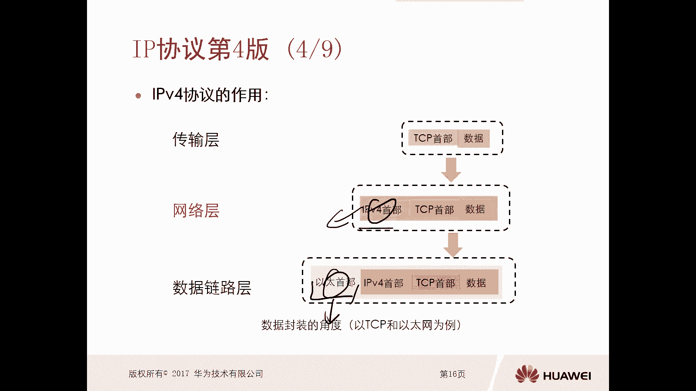

---

## IPv4协议的特点

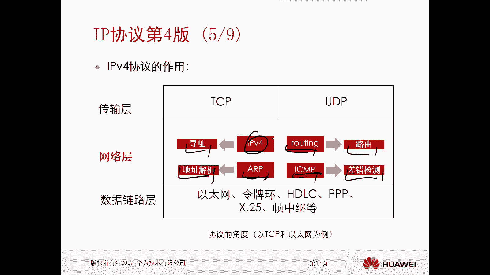

了解了IPv4的作用后，本节我们来看看它的核心特点。

IPv4协议的核心特点是**无连接**和**不可靠**的传输机制，这与其“尽力而为”的服务宗旨一致。

以下是具体表现：
*   对于从相同源去往相同目的的多个数据包，每个数据包可以被独立处理，并可能通过不同的路径进行转发。
*   数据包在传输过程中可能会损坏、丢失或失序到达。IP协议本身不处理这些问题。

“尽力而为”意味着IP协议仅负责将数据包从源端传送到目的端，不提供差错报告、跟踪或顺序保证等服务。与之相对的是“有连接”的协议，后者需要维护连接状态并保证可靠性。

---

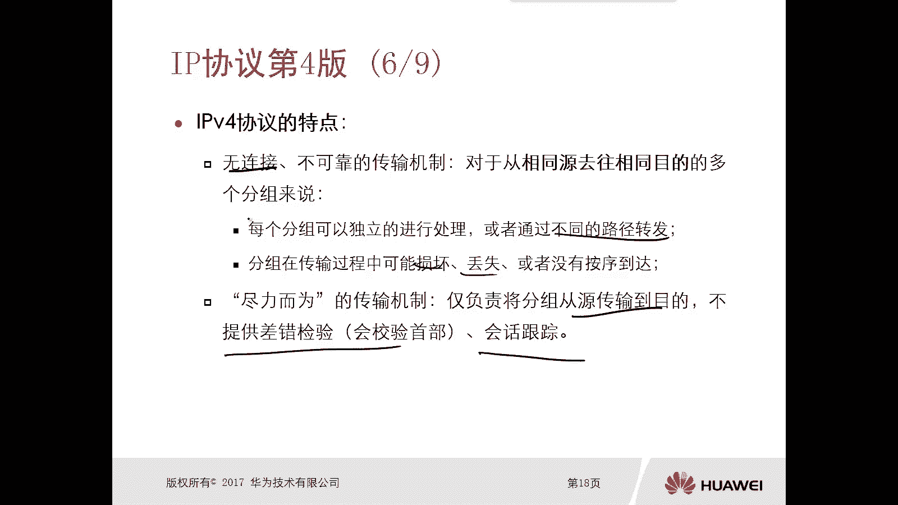

## IPv4数据包格式详解 🧩

上一节我们介绍了IPv4的特点，本节中我们来详细解析IPv4数据包的头部格式。理解这个格式是学习IPv4的基础。

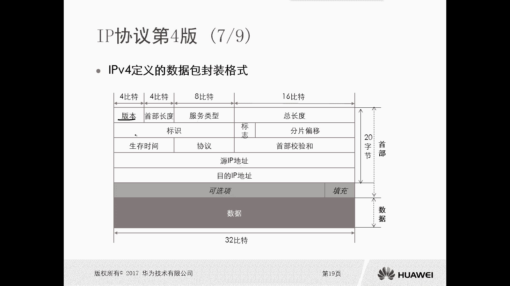

IPv4头部包含多个字段，以下是每个字段的说明：

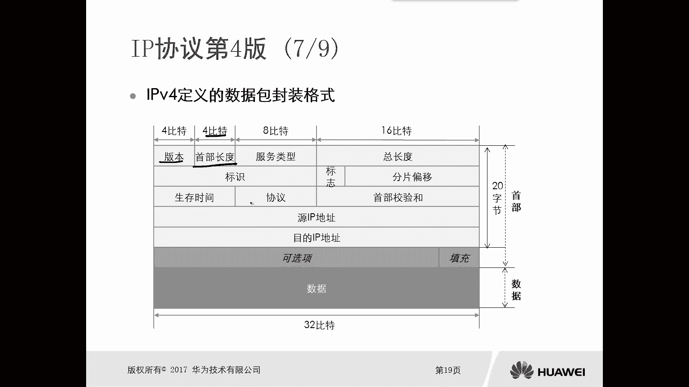

**版本 (Version - 4 bits)**
*   表示IP协议的版本号。对于IPv4，此值为 `4`。

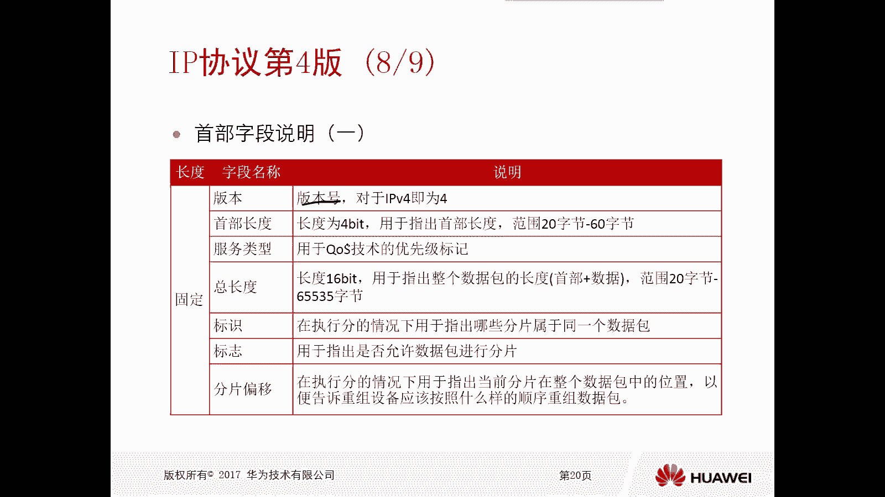

**头部长度 (IHL - 4 bits)**
*   指IPv4头部的基本长度，单位是4字节。最小值为5（代表20字节），最大值为15（代表60字节）。

**服务类型 (ToS - 8 bits)**
*   用于在网络中标识数据包的优先级，通常在实施服务质量（QoS）技术时使用。

**总长度 (Total Length - 16 bits)**
*   指整个IP数据包（头部+数据）的总长度，单位是字节。范围从20字节到65535字节。

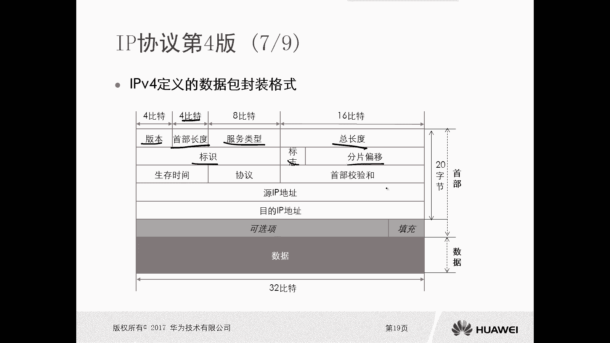

**标识、标志、片偏移 (Identification, Flags, Fragment Offset - 共32 bits)**
*   这三个字段用于数据包的分片与重组。
    *   **标识 (Identification)**：当数据包被分片时，所有属于同一原始数据包的分片具有相同的标识值，以便接收端进行重组。
    *   **标志 (Flags)**：包含控制分片的位，例如 `DF` (Don‘t Fragment) 位。`DF=1` 表示禁止分片，`DF=0` 表示允许分片。
    *   **片偏移 (Fragment Offset)**：指示当前分片在原始数据包中的位置，用于在重组时恢复正确顺序。

**生存时间 (TTL - 8 bits)**
*   用于防止数据包在网络中无限循环。数据包每经过一个路由器，TTL值减1。当TTL值减为0时，数据包被丢弃。初始值通常为 `255`。

**协议 (Protocol - 8 bits)**
*   标识上层协议的类型。例如，`6` 代表TCP，`17` 代表UDP。

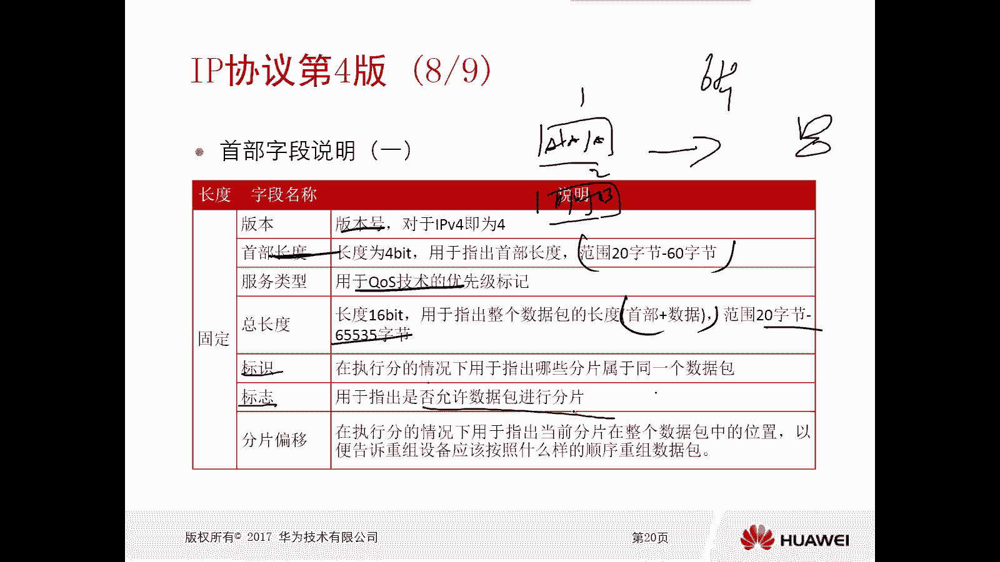

**头部校验和 (Header Checksum - 16 bits)**
*   用于校验IPv4头部在传输过程中是否出现错误。它只校验头部，不校验数据部分。

**源IP地址 (Source IP Address - 32 bits)**
*   发送数据包的设备的IPv4地址。

**目的IP地址 (Destination IP Address - 32 bits)**
*   接收数据包的设备的IPv4地址。

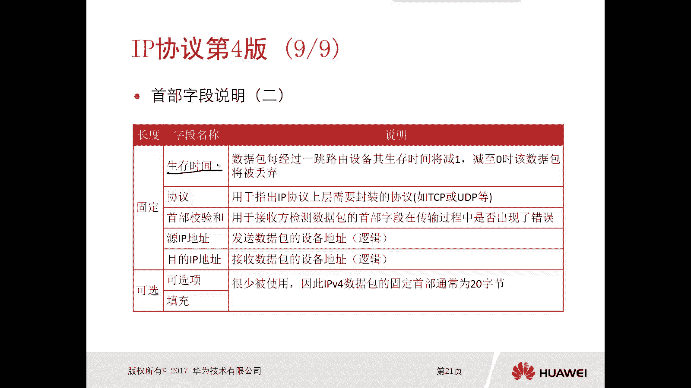

**选项与填充 (Options & Padding - 可变长度)**
*   可选字段，很少使用。当使用选项时，需要用“填充”字段确保头部长度是4字节的整数倍。

**数据 (Data)**
*   这是封装的上层协议数据（如TCP段或UDP报文）。

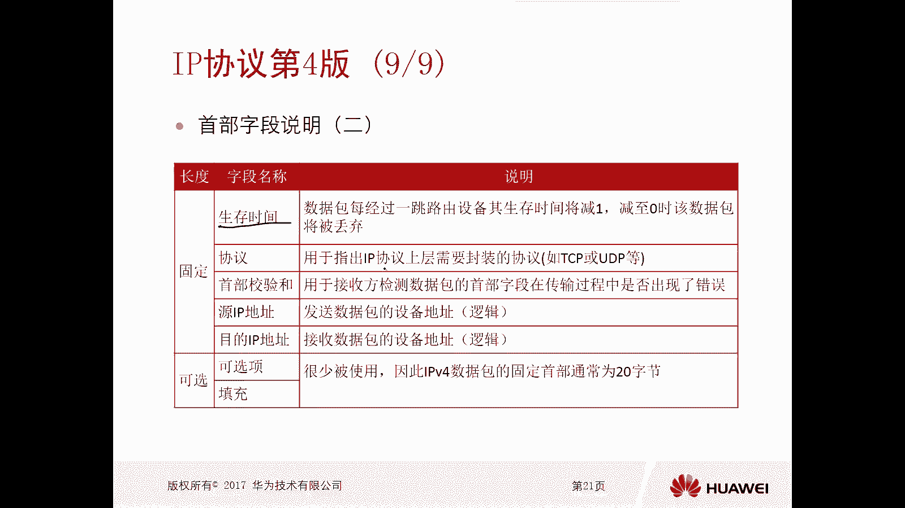

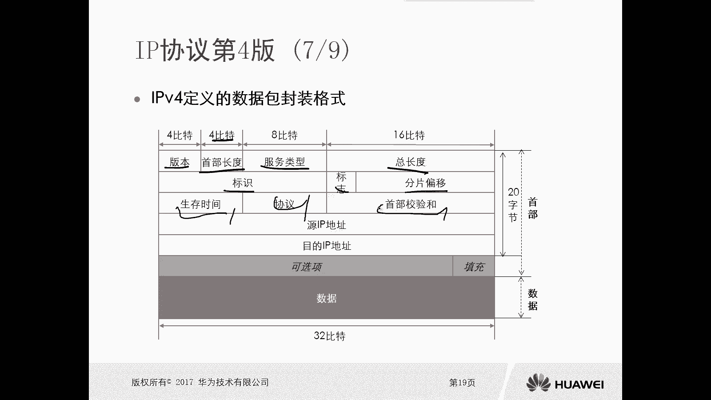

综上所述，一个标准的IPv4头部固定为20字节。当包含选项时，头部长度最大可增至60字节。头部之后的部分是承载的实际数据。

---

## 总结

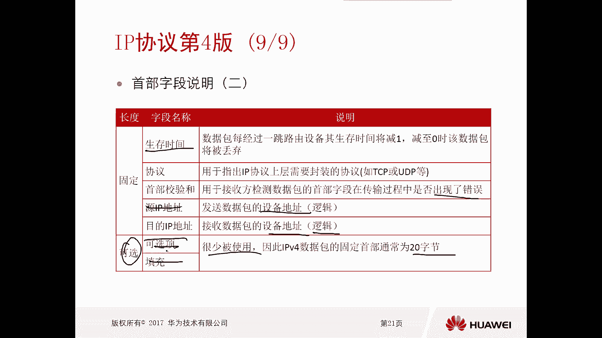

本节课中我们一起学习了IPv4协议。我们从IPv4的发展背景和概述开始，了解了它是当前互联网的核心协议。接着，我们探讨了IPv4的设计宗旨是实现数据转发和提供尽力而为的服务，并明确了其在定义封装格式、建立寻址路由以及制定处理规则方面的作用。

通过封装示例，我们看到了IPv4在网络层中的实际位置。然后，我们分析了IPv4无连接、不可靠的核心特点。最后，我们详细解析了IPv4数据包的头部格式，包括版本、长度、地址、TTL等关键字段的含义。

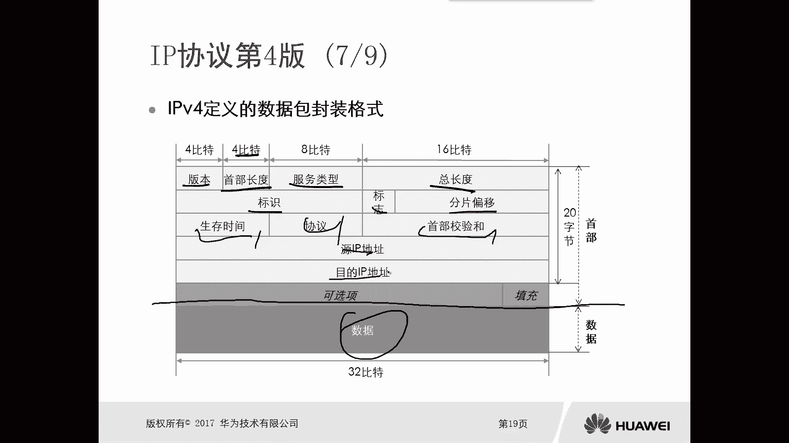

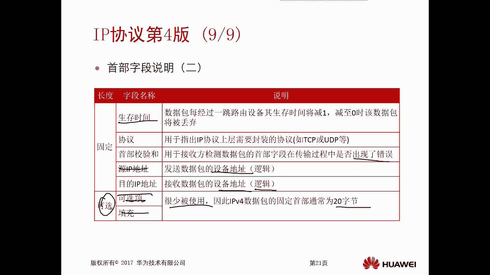

理解IPv4协议是掌握网络通信原理的重要基础，也为后续学习IPv6及其他网络技术做好了准备。