# 华为认证ICT学院HCIA/HCIP-Datacom教程：第1册-第5章-3：路由的概念、路由表、路由条目 📚

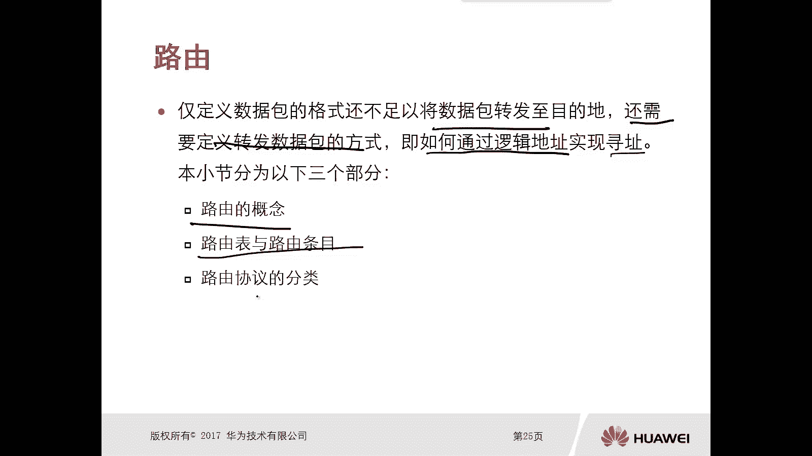

在本节课中，我们将要学习网络通信中一个核心的组件——路由。我们将了解路由的基本概念，路由器如何通过路由表来决定数据包的转发路径，以及路由条目的具体含义。理解这些内容是掌握网络数据转发原理的基础。

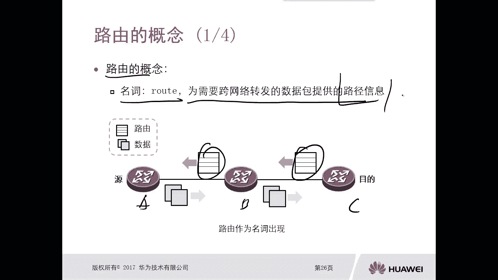

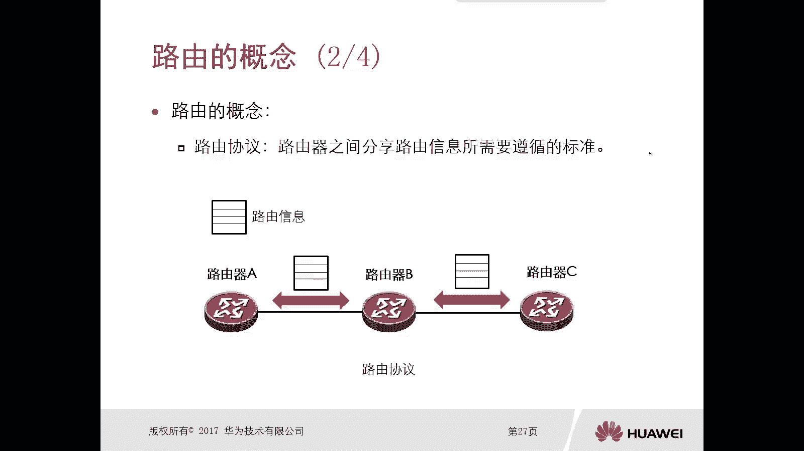

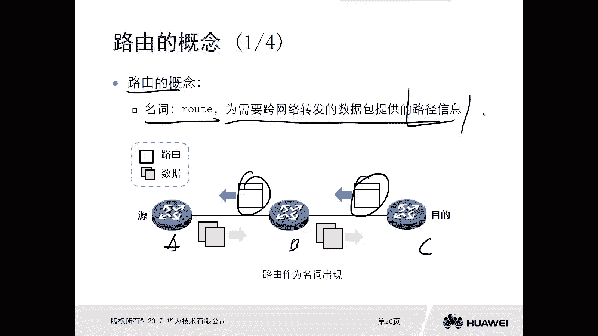

## 路由的概念 🧭

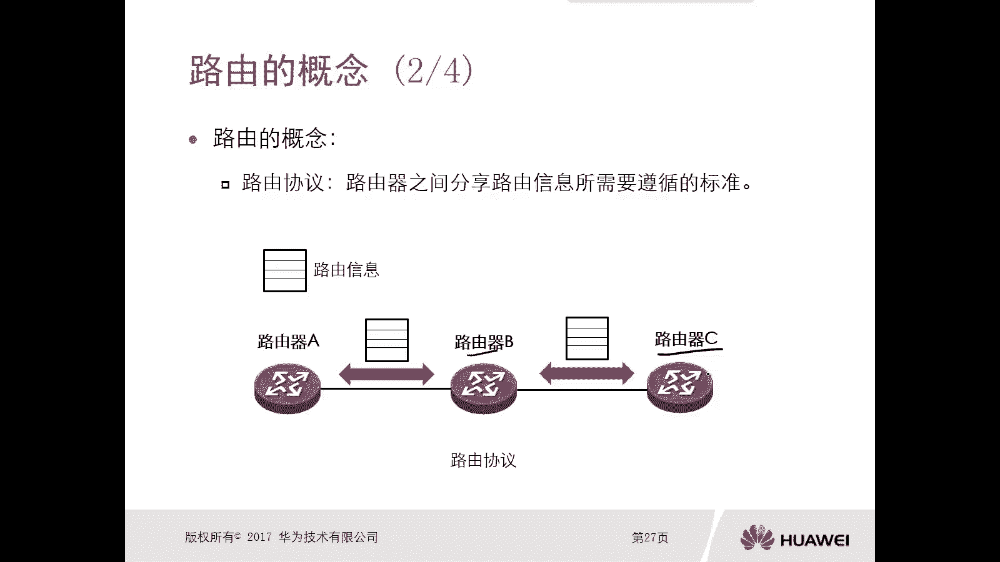

上一节我们介绍了网络层协议定义了数据包的格式。然而，仅定义格式不足以将数据包转发到目的地。IP协议定义了源和目的地址，但并未规定如何根据这些地址进行转发。因此，我们需要定义数据包的转发方式，即如何通过逻辑地址（IP地址）实现寻址和转发。

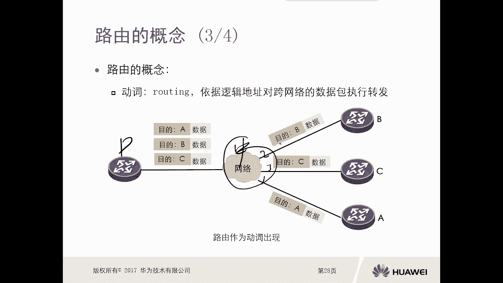

路由的概念可以从两个角度理解：

*   **作为名词（Route）**：指为需要跨网络转发的数据包提供的路径信息。数据包要从源设备到达目的设备，必须知道具体的转发路径。例如，从北京开车到保定，需要知道走哪条高速公路、从哪个出口驶出。在网络中，目的设备所在的网络信息（路径信息）需要传递回源设备所在的网络。
*   **作为动词（Routing）**：指依据逻辑地址对跨网络的数据包进行转发的动作。当一台中间设备（如路由器）收到一个数据包后，需要决定该从哪个接口将数据包发送出去，这个决策和转发的行为就是路由。

路由器之间通过遵循共同的标准来分享各自的路径信息，这个标准就是**路由协议**。运行了相同路由协议的路由器会相互告知自身已知的网络路径，从而使网络中的所有路由器都能获知到达各个目的地的路径。

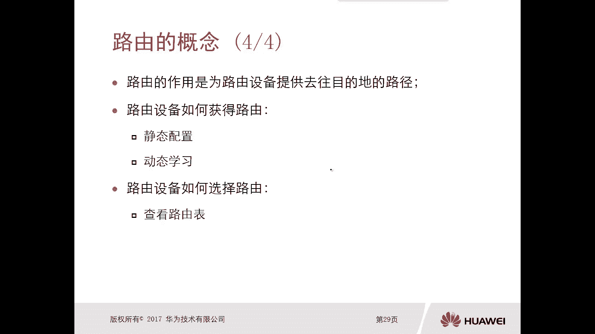

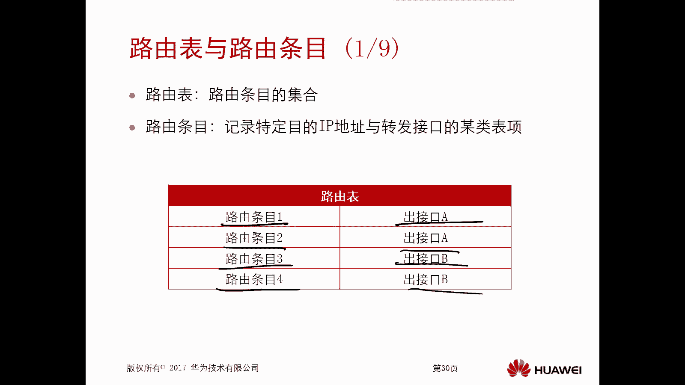

## 路由表与路由条目 📋

上一节我们介绍了路由的概念，本节中我们来看看路由器是如何存储和使用这些路径信息的。路由器依靠**路由表**来做出转发决策。

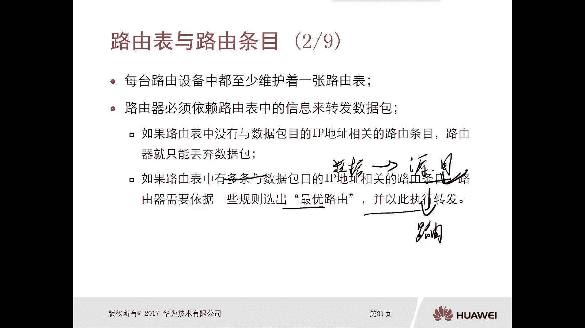

路由表是**路由条目**的集合。每个路由条目记录了去往一个特定目的网络所需的信息。当路由器收到一个数据包时，会查看数据包的目的IP地址，并在路由表中查找匹配的条目。

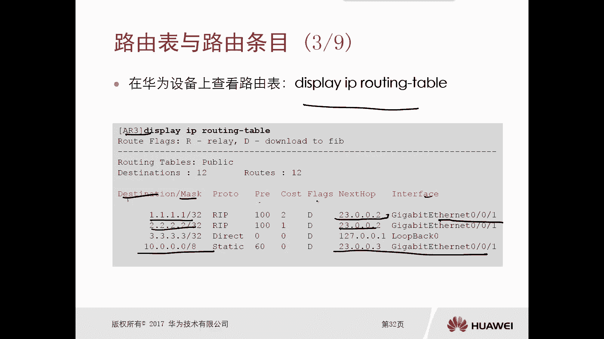

路由器查找路由表的结果有三种：
1.  **没有匹配条目**：路由器不知道如何转发该数据包，只能将其丢弃。
2.  **有一个匹配条目**：路由器按照该条目指示的路径转发数据包。
3.  **有多个匹配条目**：路由器需要根据特定规则（如优先级、开销）选择一条最优路径进行转发。

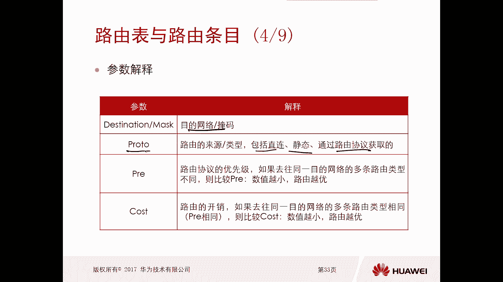

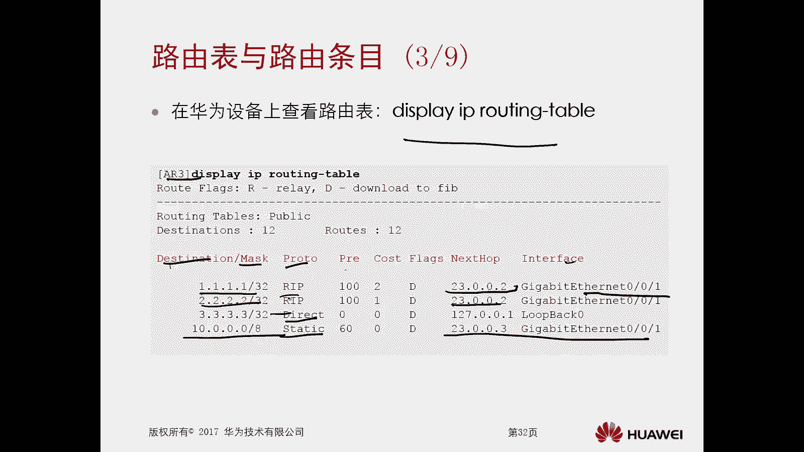

在华为设备上，可以使用 `display ip routing-table` 命令查看路由表。

以下是路由表中一个条目的示例及其关键字段解释：
```
Destination/Mask    Proto   Pre   Cost      Flags NextHop         Interface
1.1.1.1/32          Static  60    0          D    23.0.0.2        GigabitEthernet0/0/1
```

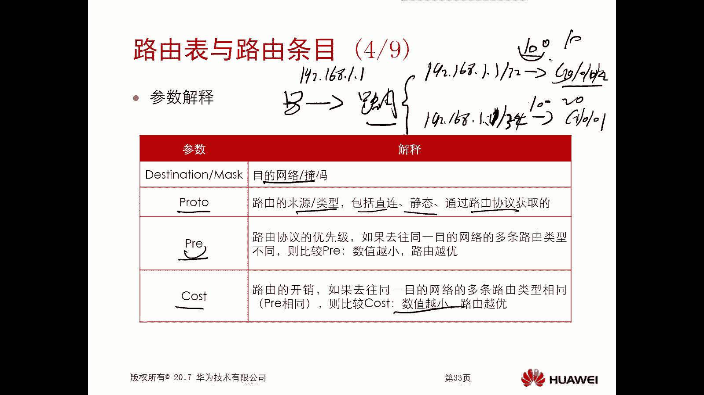

*   **Destination/Mask（目的网络/掩码）**：标识数据包要去的目标网络。
*   **Proto（协议）**：表示该路由条目的来源，例如：
    *   `Direct`：直连路由（优先级 0）
    *   `Static`：静态路由（优先级 60）
    *   `OSPF`：OSPF动态路由（优先级 10）
    *   `RIP`：RIP动态路由（优先级 100）
*   **Pre（优先级）**：用于比较不同来源的路由条目，**数值越小，优先级越高**，路由越优先被采用。管理员可以修改大部分协议的优先级（直连路由除外）。
*   **Cost（开销）**：当多条路由来源相同时（例如都来自OSPF），用来比较路径的优劣，**开销值越小，路径越优**。
*   **Flags（标记）**：路由的标志，例如 `D` 表示该路由已下发到转发信息库（FIB），`R` 表示该路由是迭代路由。
*   **NextHop（下一跳）**：数据包应该被发送到的下一个路由器的IP地址。
*   **Interface（出接口）**：路由器将数据包转发出去的本地接口。

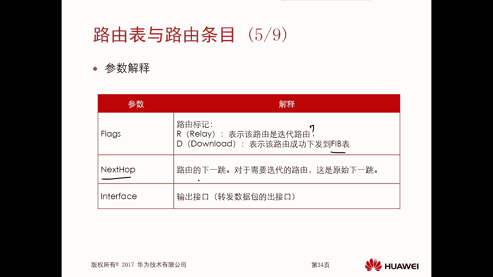

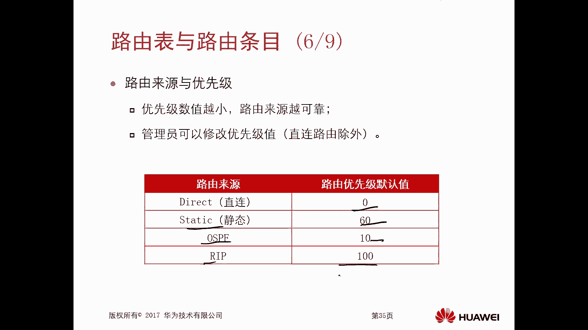

## 路由器的分类 🗂️

了解了路由表如何工作后，我们来看看路由器获取路由条目的不同方式，这对应着路由器的分类。路由器主要通过两种方式学习路由：

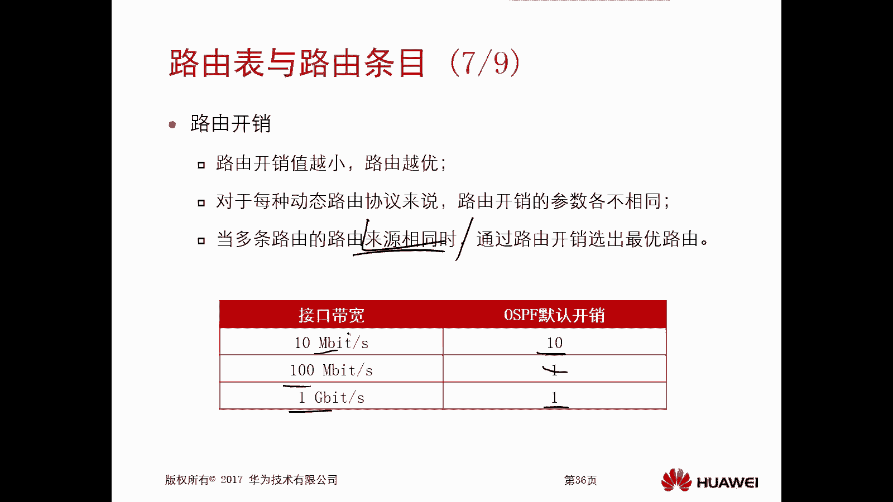

1.  **静态路由**：由网络管理员手动配置和维护。就像开车时依靠固定的路牌指示，路径明确且稳定，但网络拓扑变化时需要手动调整，不适合大型复杂网络。
2.  **动态路由**：路由器之间通过运行**路由协议**（如RIP、OSPF）自动交换路由信息，并动态计算最优路径。就像使用导航软件，可以根据实时路况选择最佳路线，能自动适应网络变化。

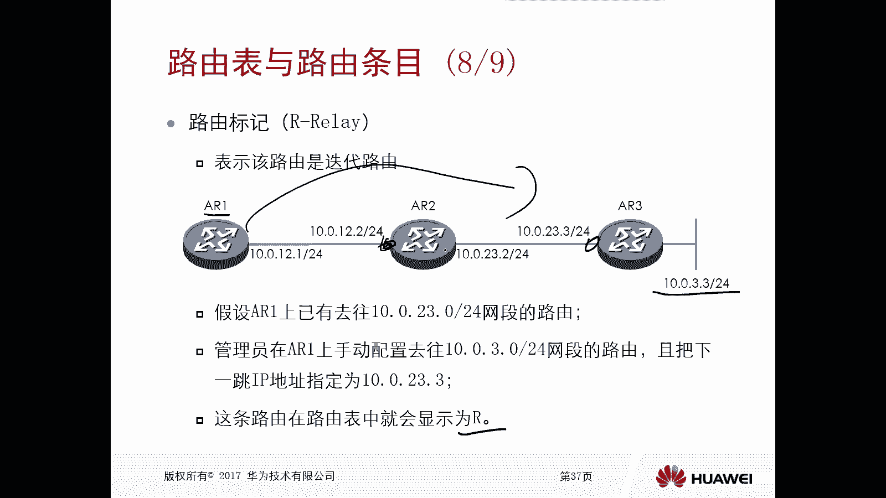

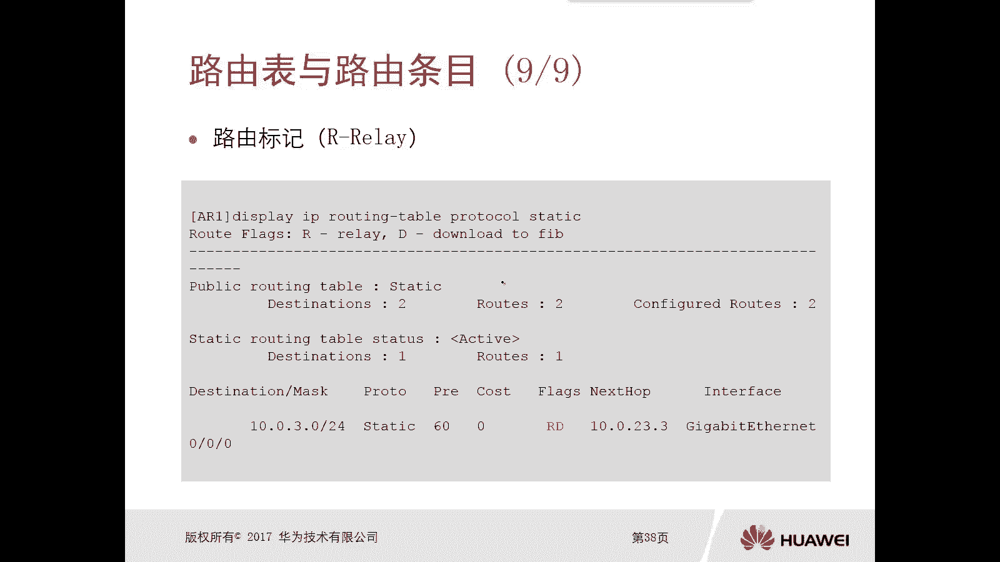

本节课中我们一起学习了路由的核心概念。我们明白了路由既是指导数据包转发的路径信息，也是执行转发的动作。路由器通过查询路由表来决定数据包的命运，而路由表中的条目则包含了目的网络、下一跳、出接口等关键信息。最后，我们了解到路由器可以通过静态配置或动态协议两种主要方式来获取这些路由条目，为后续深入学习具体的路由技术打下了坚实的基础。