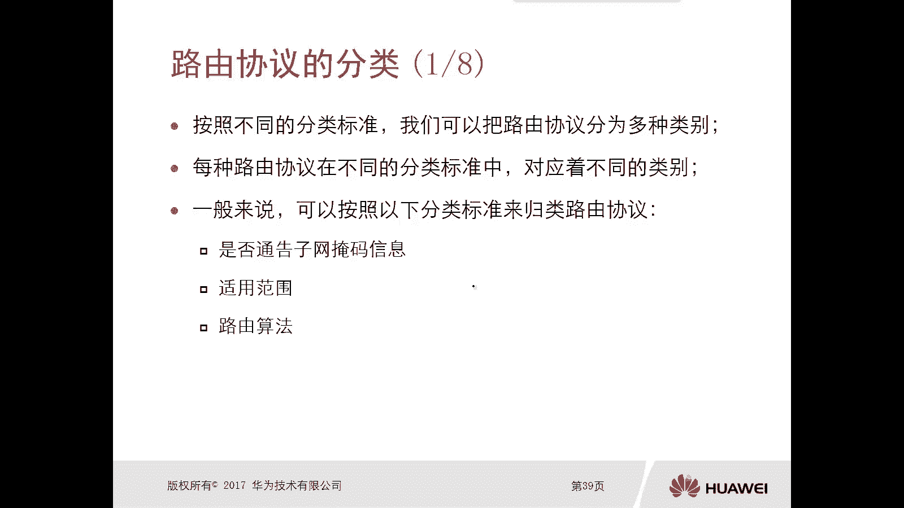
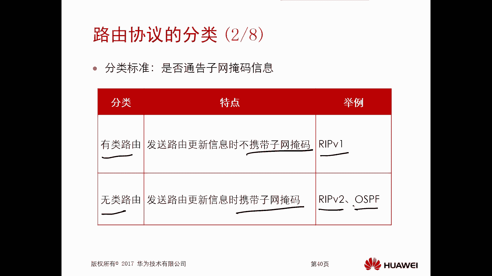
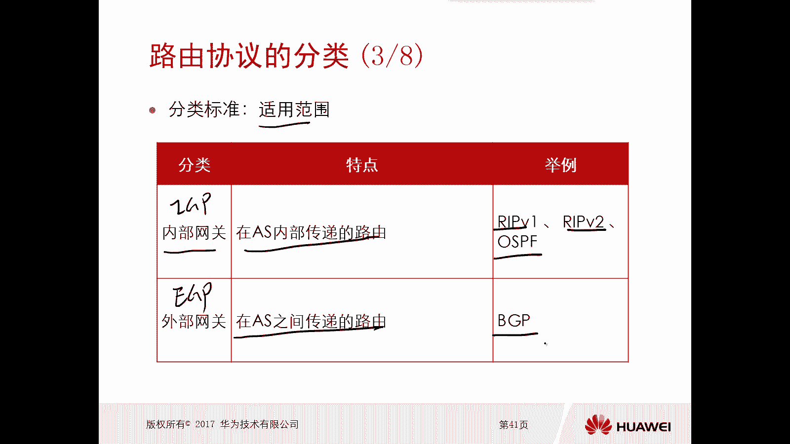
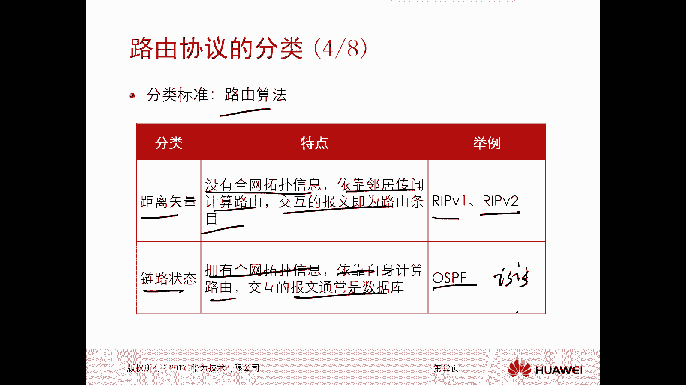
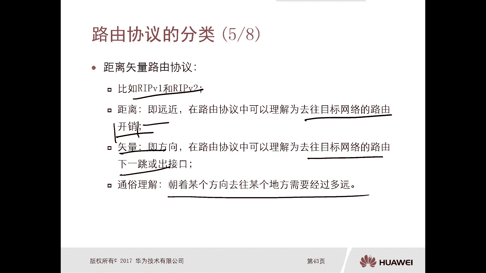
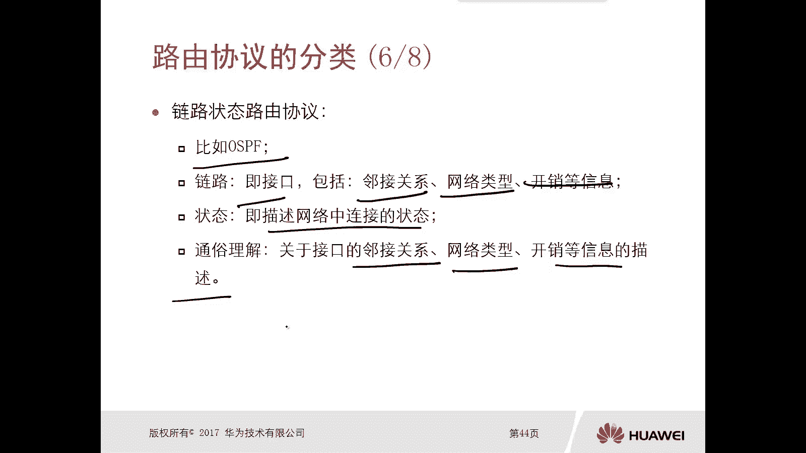
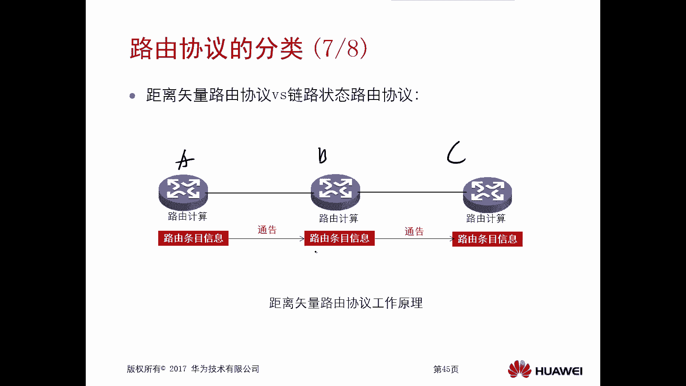
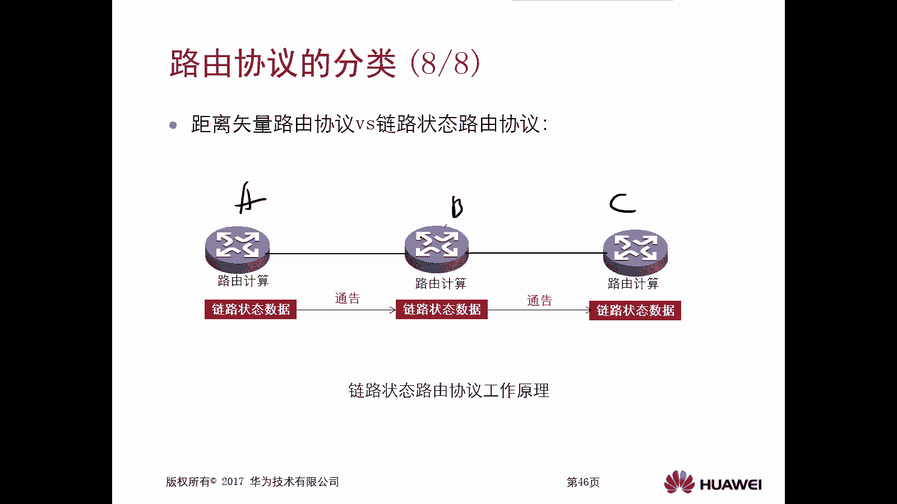

# 华为认证ICT学院HCIA/HCIP-Datacom教程：第1册-第5章-4：路由协议的分类 📚

在本节课中，我们将要学习路由协议的分类。路由协议可以根据不同的标准划分为多种类别，理解这些分类有助于我们更好地掌握各种协议的特点和应用场景。

## 分类标准概述

路由协议可以按照不同的标准进行分类。每种协议在不同的分类标准下可能属于不同的类别。通常，我们可以依据以下三个主要标准进行归类。

## 1. 按是否通告子网掩码分类

第一个分类标准是**是否通告子网掩码信息**。根据这个标准，路由协议分为两大类。

以下是具体的分类：

*   **有类路由协议**：发送路由更新信息时**不携带**子网掩码信息。例如，经典的 **RIP v1**（Routing Information Protocol，路由信息协议）。
*   **无类路由协议**：发送路由更新信息时**携带**子网掩码信息。例如，**RIP v2** 和 **OSPF**（Open Shortest Path First，开放式最短路径优先）。

上一节我们介绍了按是否通告子网掩码的分类，本节中我们来看看第二个分类标准。

## 2. 按适用范围分类

第二个分类标准是**协议的适用范围**。根据此标准，路由协议同样分为两大类。

以下是具体的分类：

*   **内部网关协议**：在**一个自治系统内部**传递路由。这类协议称为 **IGP**。例如，RIP v1、RIP v2 和 OSPF 都属于 IGP。
*   **外部网关协议**：在**不同自治系统之间**传递路由。这类协议称为 **EGP**。目前最常用的是 **BGP**（Border Gateway Protocol，边界网关协议）。

了解了按适用范围的分类后，接下来我们探讨第三个，也是算法层面上的分类。

## 3. 按路由算法分类

第三个分类标准是**路由算法**。根据算法原理，路由协议主要分为两类。

以下是具体的分类：

*   **距离矢量路由协议**：路由器**没有全网的拓扑信息**，只能依靠邻居的“传闻”来计算路由。交互的报文是**路由条目**。代表协议是 **RIP**。
*   **链路状态路由协议**：路由器**拥有全网的拓扑信息**，依靠自身进行计算。交互的报文通常是**链路状态数据库**。代表协议是 **OSPF** 和 **IS-IS**（Intermediate System to Intermediate System，中间系统到中间系统）。

## 核心概念详解

### 距离矢量路由协议

**距离矢量**是这类协议的核心概念。
*   **距离**：可以理解为去往目标网络的**开销**（例如跳数）。
*   **矢量**：可以理解为去往目标网络的**方向**（即下一跳或出接口）。

用一句话通俗解释：**朝着某个方向去往某个地方需要经过多远**。

其工作原理是：路由器直接向邻居通告**路由条目**。邻居收到后，通常不加验证地接受并放入自己的路由表，然后再转发给它的邻居。这个过程类似于听信“传闻”。

### 链路状态路由协议

**链路状态**是这类协议的核心概念。
*   **链路**：指路由器接口及其连接关系，包括邻居关系、网络类型、开销等信息。
*   **状态**：描述网络中这些连接的状态。

其工作原理是：路由器向邻居通告的是**链路状态信息**（而非直接的路由条目）。每台路由器收集这些信息，构建一个统一的拓扑数据库，然后**各自独立运行算法**（如SPF算法）计算出最优路由。这个过程类似于获得一张完整的地图后自己规划路线。

## 工作原理对比

为了更清晰地理解，我们对比两者的工作原理：

*   **距离矢量（如RIP）**：路由器A将路由条目“告诉”路由器B，B相信并放入路由表，再“告诉”路由器C。信息传递像“传言”。
*   **链路状态（如OSPF）**：路由器A将链路状态数据“发送”给路由器B，B将其加入自己的拓扑数据库并重新计算路由，再将链路状态数据“转发”给路由器C。每台路由器都基于完整的拓扑信息独立计算。

本节课中我们一起学习了路由协议的三种主要分类标准：是否通告子网掩码、适用范围以及路由算法。我们重点理解了**距离矢量**和**链路状态**这两类协议的核心概念与工作原理差异，这是学习后续具体路由协议（如RIP、OSPF）的重要基础。