# 华为认证ICT学院HCIA/HCIP-Datacom教程：第1册-第5章：路由器的工作原理 🧭

在本节课中，我们将要学习路由器的工作原理。路由器是网络中的关键设备，负责在不同网络之间转发数据包。理解其工作原理是掌握网络通信的基础。我们将从数据包转发的基本概念入手，逐步深入到路由器内部处理数据包的详细步骤。

## 数据包转发的基本特点

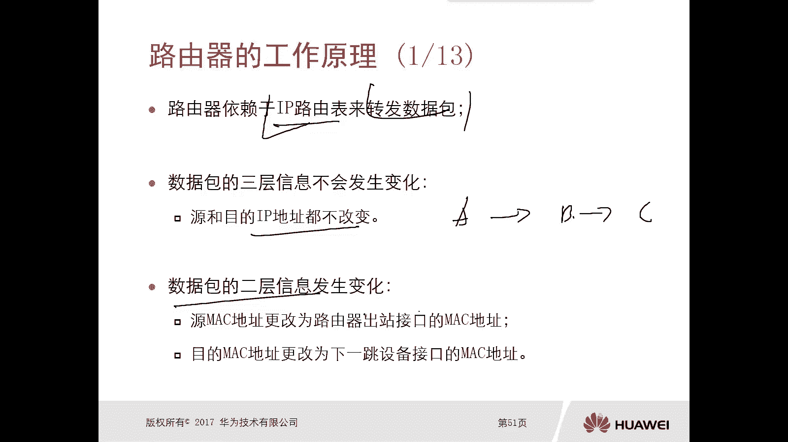

上一节我们介绍了路由器的基本作用，本节中我们来看看数据包在路由器间转发时的特点。

路由器依赖于IP路由表来转发数据包。一台路由器至少需要有一张路由表，其中包含大量路由条目，这些条目用于指导数据包的转发。

数据包在转发过程中，其三层信息（即IP地址）不会发生变化。因为IP协议旨在实现端到端的通信，所以源IP地址和目的IP地址在整个传输过程中保持不变。

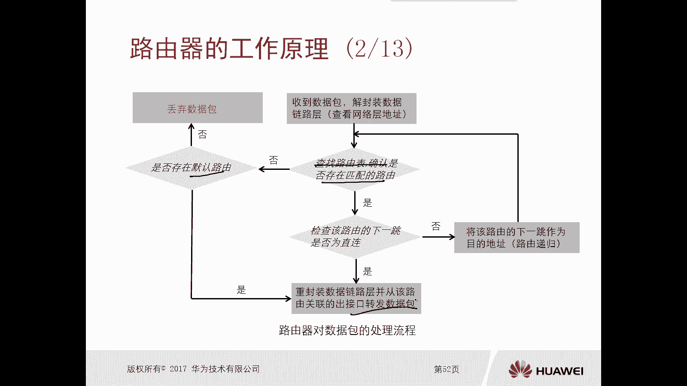

然而，数据包的二层信息（即MAC地址）会逐跳发生变化。例如，路由器A将数据包转发给路由器B时，数据包的源MAC地址是A的出接口MAC地址，目的MAC地址是B的入接口MAC地址。当路由器B再将数据包转发给路由器C时，源MAC地址会变为B的出接口MAC地址，目的MAC地址则变为C的入接口MAC地址。这是因为每台路由器在转发前都需要解封装数据链路层头部，以查看网络层的IP地址。

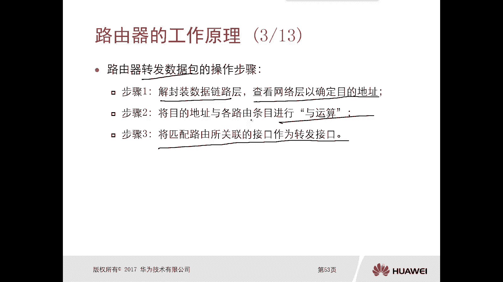

## 路由器工作原理详解

了解了数据包转发的特点后，我们来看看路由器处理数据包的详细流程。

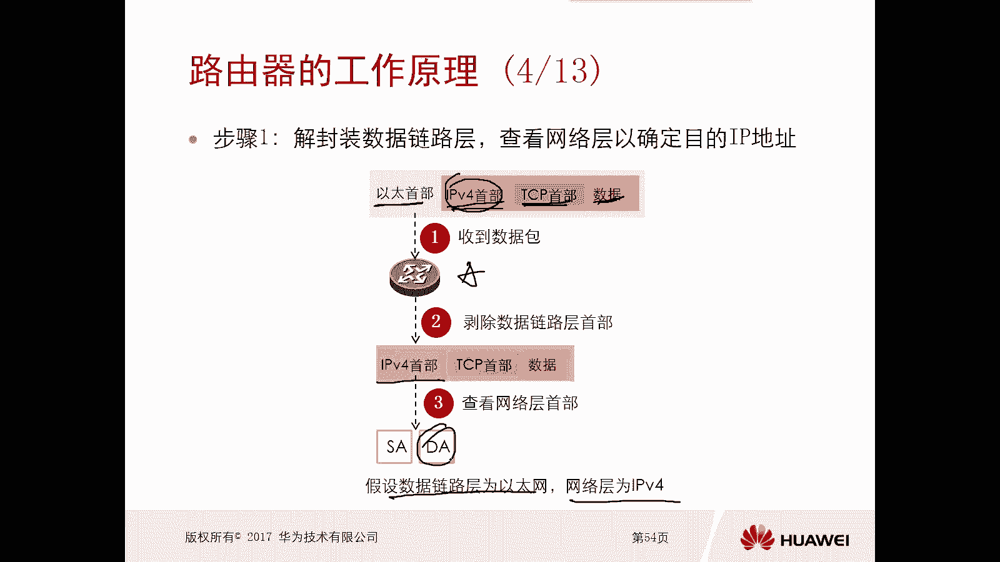

当一台路由器收到一个数据包时，其处理流程如下：
1.  解封装数据链路层头部，目的是查看网络层的IP地址。
2.  根据目的IP地址查找自身的路由表，确认是否存在匹配的路由条目。
3.  如果存在匹配路由，则检查该路由的下一跳是否为直连。
    *   如果是直连，则重新封装数据链路层头部，并从该路由关联的出接口将数据包转发出去。
    *   如果不是直连，则以该路由的下一跳地址作为新的目的地址，进行递归查询，直到找到直连的出口。
4.  如果不存在匹配路由，则检查是否存在默认路由（缺省路由）。
    *   如果存在默认路由，则按照默认路由指示的出口转发。
    *   如果连默认路由也没有，则丢弃该数据包。

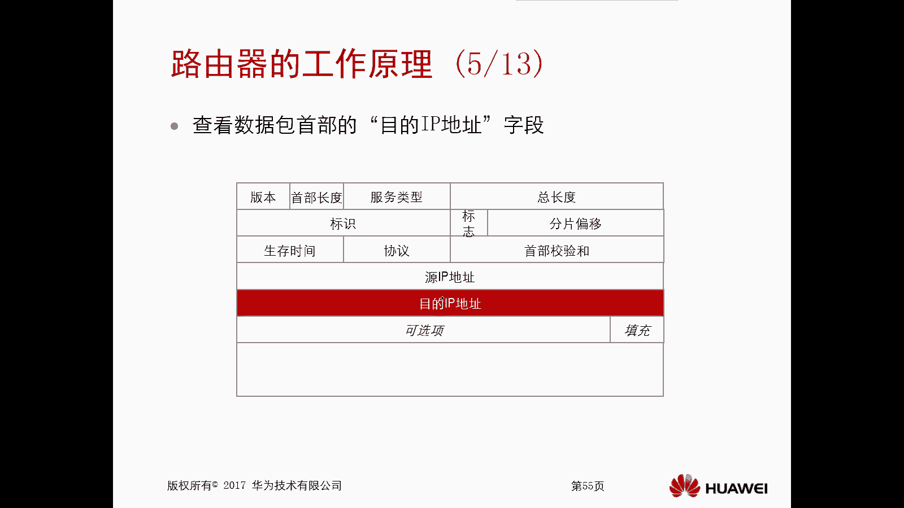

## 路由器转发数据包的三步操作

路由器转发数据包的核心操作可以概括为三个步骤。以下是这三个步骤的详细说明。

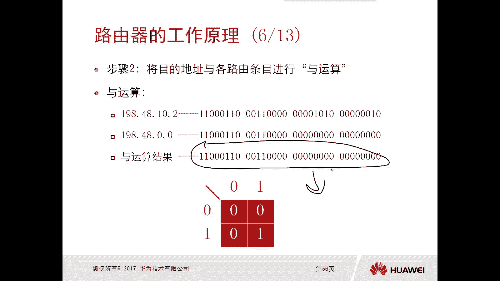

**第一步：解封装与查看目的地址**
路由器收到一个完整封装的数据帧（例如包含以太网头部、IPv4头部、TCP头部和应用数据）。它首先剥离数据链路层（如以太网）的头部，目的是为了查看网络层（IPv4）头部中的目的IP地址。路由器主要依据这个目的IP地址来决定如何转发。

**第二步：执行“与”运算进行路由匹配**
获取目的IP地址后，路由器将其与路由表中的每一条路由条目进行“与”运算。以下是“与”运算的规则：
*   将IP地址和路由的网络地址都转换为二进制。
*   对每一位进行“与”操作：只有两个位都是1时，结果才是1；否则结果为0。

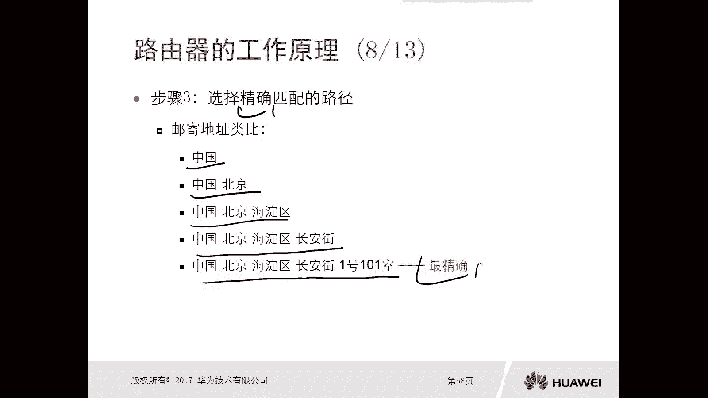

例如，目的IP地址 `198.48.10.2` 与路由 `198.48.0.0/16` 进行“与”运算：
*   IP地址 `198.48.10.2` 二进制: `11000110.00110000.00001010.00000010`
*   路由 `198.48.0.0/16` 二进制: `11000110.00110000.00000000.00000000`
*   “与”运算结果: `11000110.00110000.00000000.00000000` -> `198.48.0.0`

如果运算结果与路由条目的网络地址一致，则该路由匹配。

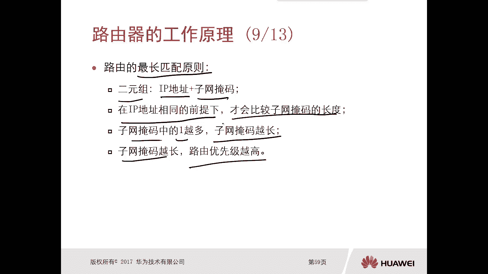

**第三步：应用最长匹配原则选择最佳路由**
当目的IP地址匹配到多条路由时（例如，同时匹配 `198.48.0.0/16` 和 `198.48.10.0/24`），路由器必须选择一条最精确的路由来转发。它遵循 **最长匹配原则**：比较匹配路由的子网掩码长度，掩码最长的路由（即最精确的路由）将被优先选用。只有在掩码长度相同的情况下，才会比较路由优先级等其它参数。

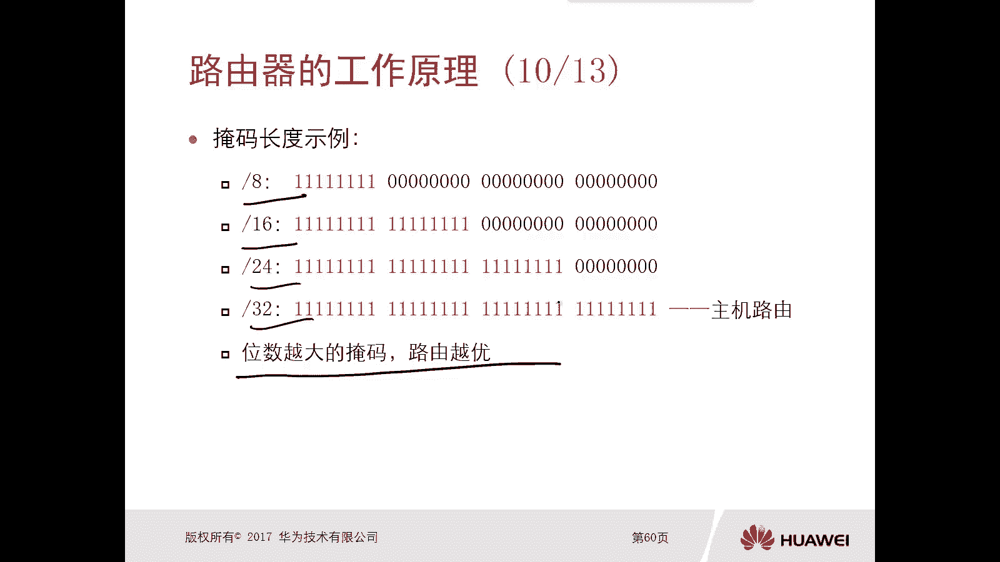

## 实例分析：最长匹配原则的应用

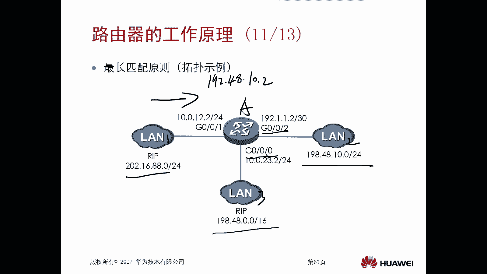

让我们通过一个具体例子来巩固对最长匹配原则的理解。

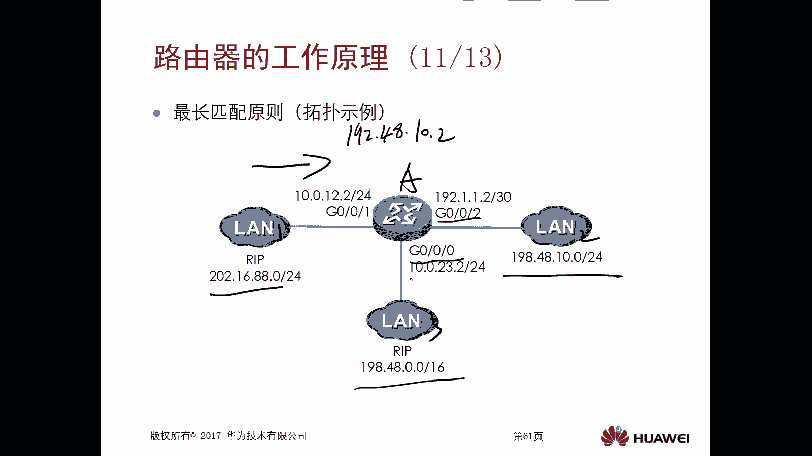

假设路由器A连接了三个网络，其路由表中有两条相关路由：
1.  `198.48.0.0/16`， 下一跳 `10.0.23.3`， 出接口 `G0/0/0`
2.  `198.48.10.0/24`， 下一跳 `11.1.1.1`， 出接口 `G0/0/2`

当路由器A收到一个目的IP为 `198.48.10.2` 的数据包时：
*   它与两条路由都能匹配（运算结果分别为 `198.48.0.0` 和 `198.48.10.0`）。
*   根据最长匹配原则，比较两条路由的掩码长度：`/24`（24位）比 `/16`（16位）更长。
*   因此，路由器会选择更精确的 `198.48.10.0/24` 这条路由，并将数据包从 `G0/0/2` 接口转发出去。

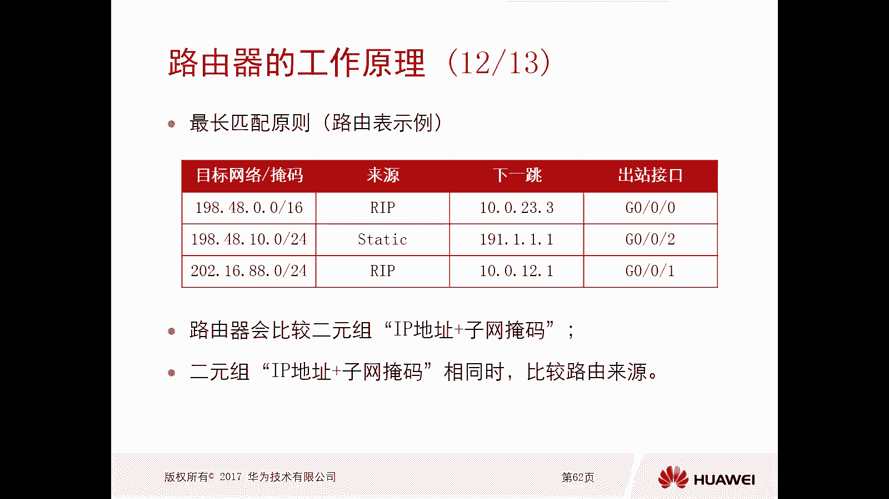

---

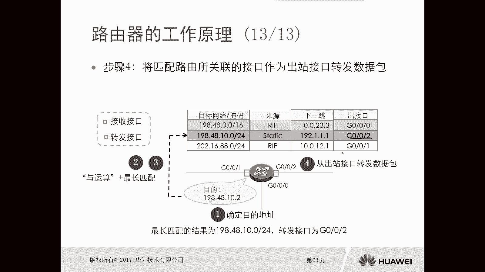

本节课中我们一起学习了路由器的工作原理。我们了解到路由器依靠IP路由表转发数据包，且转发过程中IP地址不变而MAC地址逐跳变化。核心流程包括解封装、查表匹配和重新封装。其中，**最长匹配原则** 是路由器选择路由时的首要规则，它确保了数据包能被最精确地导向目的地。掌握这些原理是理解更复杂网络路由技术的基础。