# 华为认证ICT学院HCIA/HCIP-Datacom教程：第1册-第5章-6：路由器的基本配置 🛠️

在本节课中，我们将学习路由器的基本配置方法。我们将通过一个简单的静态路由实验，来理解路由表对于数据包转发的重要性，并掌握配置设备名称、接口IP地址以及静态路由的基本命令。

## 概述

上一节我们介绍了路由器的工作原理。本节中，我们来看看如何对路由器进行基本配置。我们将通过配置静态路由来演示，如果设备没有正确的路由信息，数据包将无法被正确转发。

## 实验拓扑与目标

我们的实验拓扑包含三台路由器：AR1、AR2和AR3。
*   AR1与AR2通过各自的G0/0/0接口相连。
*   AR2与AR3通过各自的G0/0/1接口相连。

IP地址规划如下：
*   AR1 G0/0/0: `10.0.12.1/24`
*   AR2 G0/0/0: `10.0.12.2/24`
*   AR2 G0/0/1: `10.0.23.2/24`
*   AR3 G0/0/1: `10.0.23.3/24`

**实验目标**：实现AR1 (`10.0.12.1`) 与 AR3 (`10.0.23.3`) 之间的互通。

IP地址是网络层的逻辑地址，用于在网络中寻址。通信必须包含源IP地址和目的IP地址，因此网络设备的接口都需要配置IP地址。

## 基础配置步骤

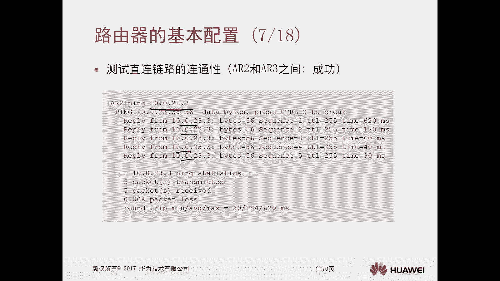

以下是配置路由器的基础步骤，包括设置设备名称和接口IP地址。

### 1. 配置设备名称

进入系统视图后，使用 `sysname` 命令修改设备名称，便于区分和管理多台设备。

**操作命令**：
```bash
<Huawei> system-view
[Huawei] sysname AR1
```
执行后，设备提示符将从 `[Huawei]` 变为 `[AR1]`。

### 2. 配置接口IP地址

首先进入指定接口的视图，然后使用 `ip address` 命令配置IP地址和子网掩码。

**操作命令**：
```bash
[AR1] interface GigabitEthernet 0/0/0
[AR1-GigabitEthernet0/0/0] ip address 10.0.12.1 255.255.255.0
```
也可以使用掩码长度简写：
```bash
[AR1-GigabitEthernet0/0/0] ip address 10.0.12.1 24
```

按照拓扑图，为AR2和AR3的相应接口也配置好IP地址。

### 3. 检查连通性与路由表

配置完成后，应测试直连设备间的连通性。

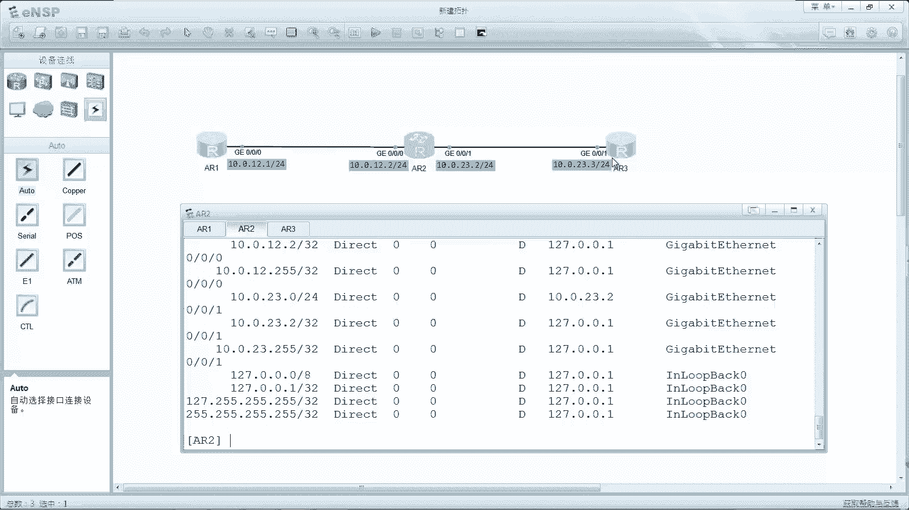

在AR2上使用 `ping` 命令测试与AR1的连通性：
```bash
[AR2] ping 10.0.12.1
```
如果收到类似 `Reply from 10.0.12.1` 的回复，说明链路通畅。

同理，测试AR2与AR3的连通性也应成功。

此时，查看AR2的路由表：
```bash
[AR2] display ip routing-table
```
你会发现路由表中只有 **直连路由**，标记为 `Direct`。只要在路由器接口上配置了IP地址，设备就会自动生成该接口所在网段的直连路由。

## 配置静态路由实现互通

虽然AR1与AR2、AR2与AR3可以互通，但AR1与AR3目前无法通信。原因在于AR1的路由表中没有去往 `10.0.23.0/24` 网段的路由信息。

### 1. 什么是静态路由？

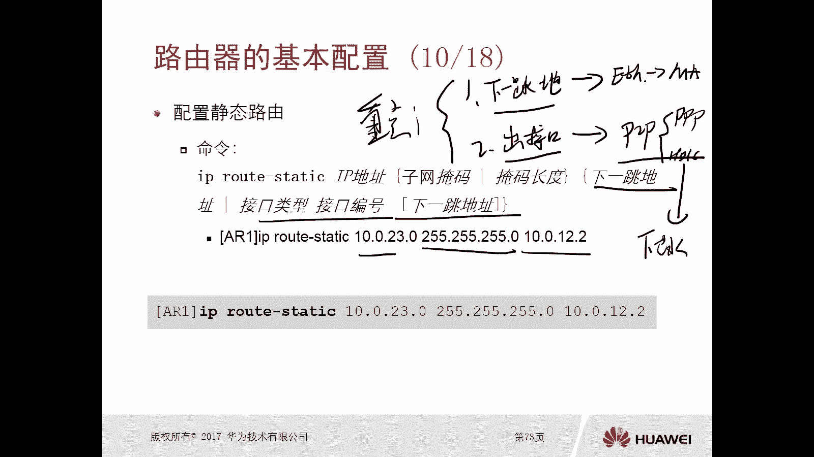

静态路由是由管理员手动配置在路由器上的路由信息。它就像路口的指示牌，明确告诉路由器：“要去往某个目的地，请从这个接口出去，或者交给下一个路由器（下一跳）”。

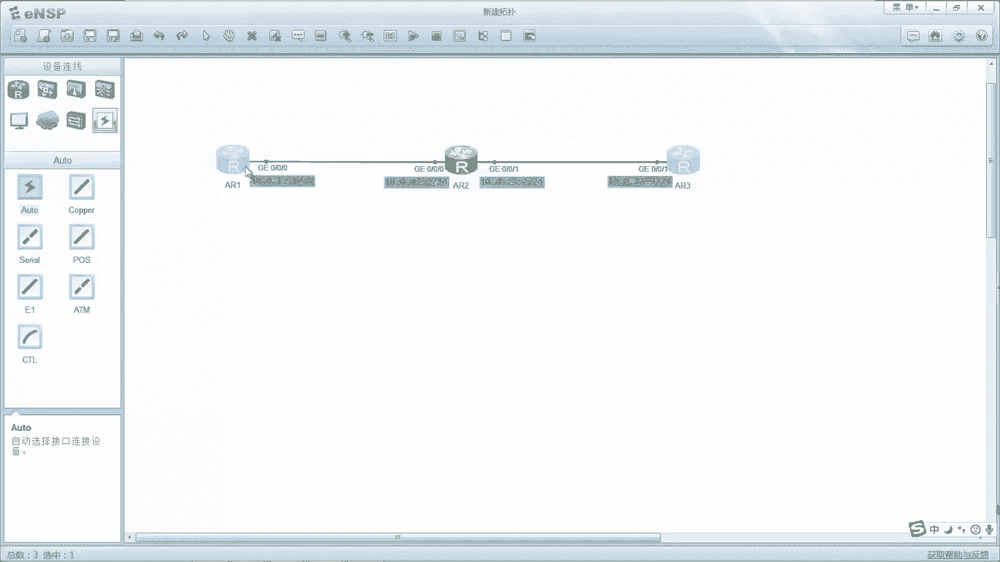

### 2. 配置静态路由命令

配置静态路由的基本命令格式为：
```bash
ip route-static <目标网络> <掩码> <下一跳地址>
```

**关键点**：在以太网（多路访问网络）环境中，配置静态路由时必须指定 **下一跳地址**。在点对点链路中，则可以只指定出接口。

根据拓扑，在AR1上配置去往AR3所在网段的路由：
```bash
[AR1] ip route-static 10.0.23.0 24 10.0.12.2
```
这条命令的含义是：告诉AR1，所有要发送到 `10.0.23.0/24` 网络的数据包，都先转发给 `10.0.12.2`（即AR2）。

配置后，查看AR1的静态路由：
```bash
[AR1] display ip routing-table protocol static
```

### 3. 配置回程路由

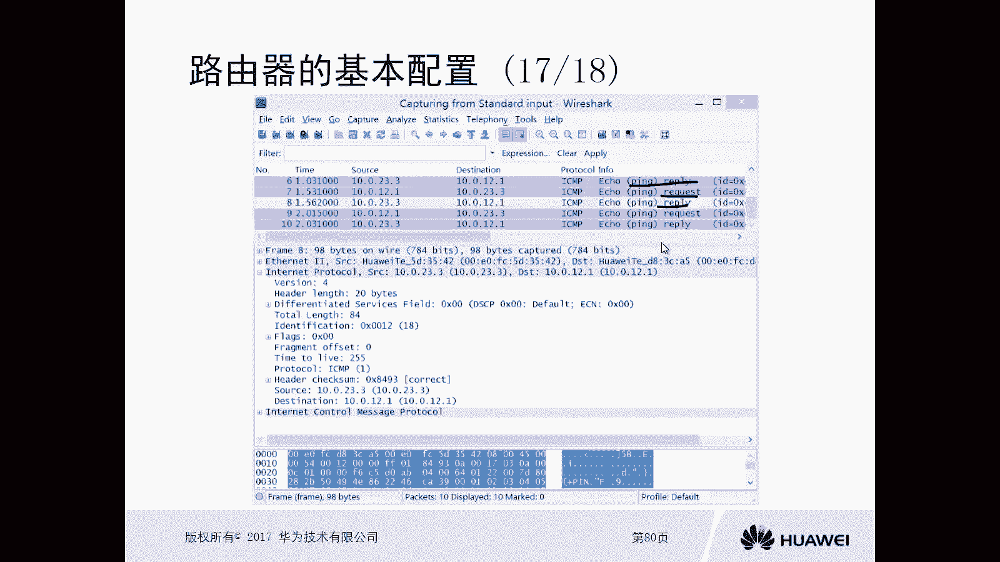

配置完AR1的路由后，从AR1 `ping` AR3仍然会失败。通过抓包分析可以发现，AR1发出的请求包能到达AR3，但AR3的回复包无法返回AR1。

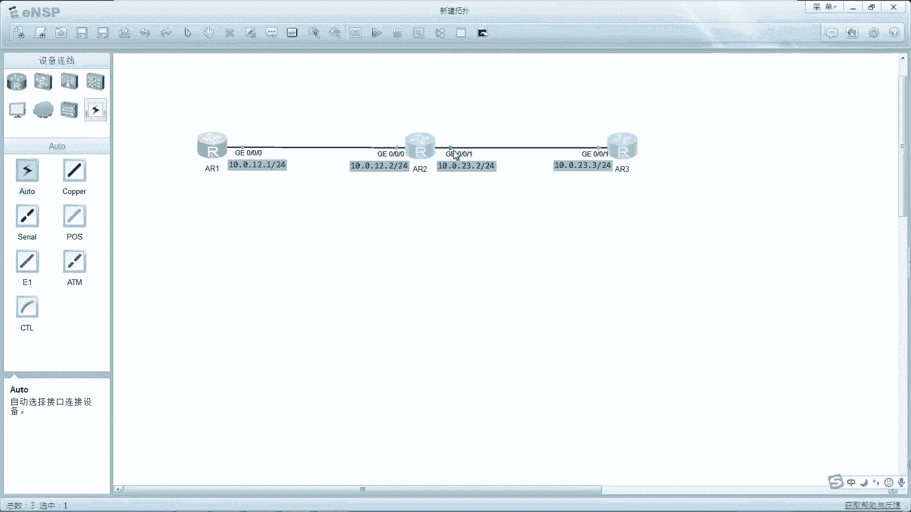

这是因为通信是双向的。AR3要回复AR1，就必须知道如何到达 `10.0.12.0/24` 这个网段。因此，我们需要在AR3上配置回程路由。

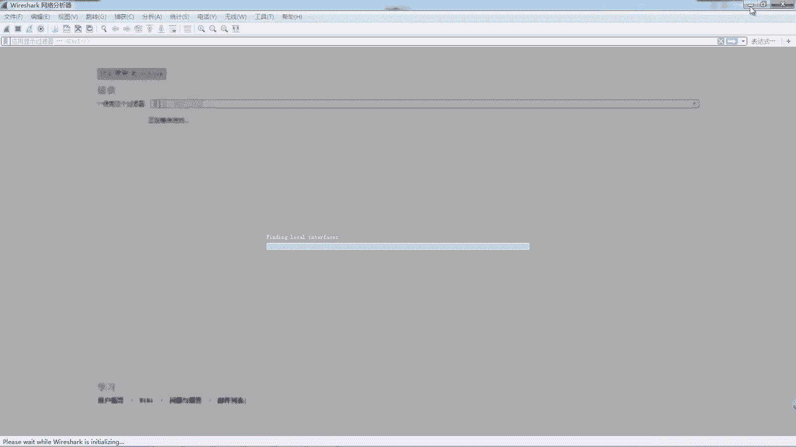

在AR3上配置去往AR1网段的路由：
```bash
[AR3] ip route-static 10.0.12.0 24 10.0.23.2
```
这条命令告诉AR3，去往 `10.0.12.0/24` 网络的数据包，都转发给 `10.0.23.2`（即AR2）。

### 4. 验证结果

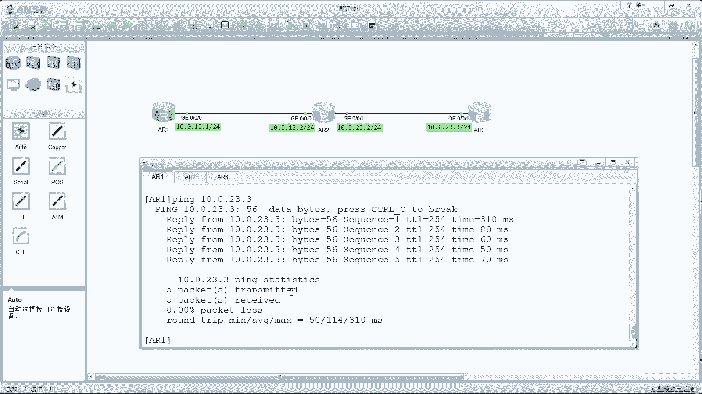

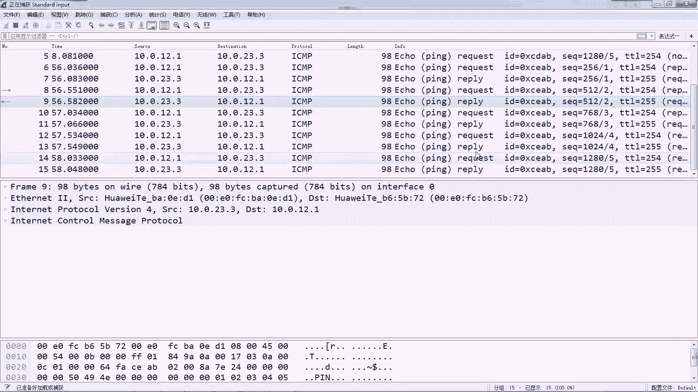

双向静态路由配置完成后，再次从AR1 `ping` AR3的地址 `10.0.23.3`，此时应该能收到成功的回复。抓包也能同时看到请求和响应报文，证明通信成功。

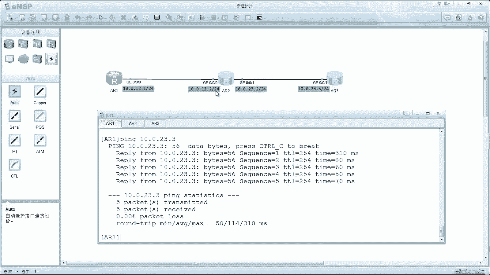

## 总结

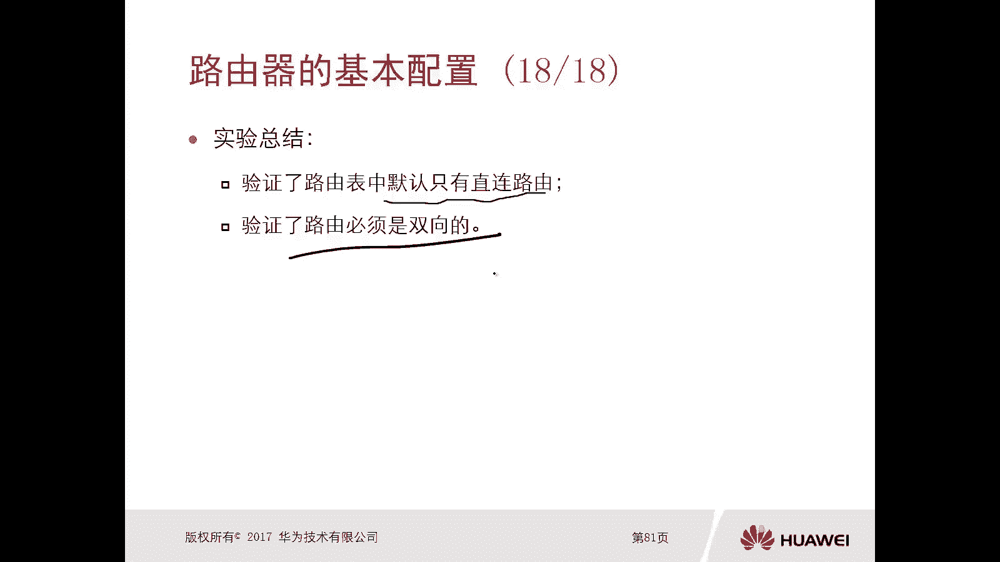

本节课我们一起学习了路由器的基本配置。
1.  我们验证了路由器默认只有直连路由。
2.  我们通过手动配置**静态路由**，解决了非直连设备间的通信问题。
3.  我们理解了网络通信是双向的，因此必须确保通信双方都有到达对方的路由信息（双向路由）。
这是理解路由和进行更复杂网络配置的基础。