# 华为认证ICT学院HCIA/HCIP-Datacom教程：第1册-第6章-1：IPv4编址方式 📝

在本节课中，我们将要学习IPv4地址的编址方式。我们将了解IPv4地址的结构、表示方法、分类以及各类地址的特点和用途。通过本节内容，你将能够理解IP地址如何标识网络中的设备，并掌握查看自己设备IP地址的方法。

---

## IPv4地址的表示方法

上一节我们介绍了网络通信的基础概念，本节中我们来看看IPv4地址的具体表示方式。

IPv4地址的长度是32位，即32个比特。这正好是四个字节。计算机内部的所有数据都以二进制方式呈现，IPv4地址也不例外，它在计算机内部使用二进制标识。

为了更直观地表示和配置，我们采用**点分十进制计数法**。具体做法是将32位二进制数按每8位（一个字节）分为一组，共四组。每组二进制数会转换为对应的十进制数，并用点号`.`分隔。

例如，一个二进制IPv4地址 `11000000.10101000.00000001.00000001` 转换为点分十进制后是 `192.168.1.1`。

**公式**：`IPv4地址 = 第1组(8位).第2组(8位).第3组(8位).第4组(8位)`

每组8位二进制数的十进制取值范围是 **0 到 255**。这是因为8位二进制数最小为`00000000`（十进制0），最大为`11111111`（十进制255）。

---

## IPv4地址的结构

了解了表示方法后，我们进一步剖析IPv4地址的内部结构。

IPv4地址由两部分组成：**网络部分（网络位）** 和 **主机部分（主机位）**。这类似于快递地址中的“城市/街道”和“具体门牌号”。

*   **网络位**：标识该IP地址所属的网络。在一个大型网络（如企业网）中，不同部门（如财务部、销售部）通常属于不同的网络。
*   **主机位**：标识该网络内的一台特定主机（如电脑、服务器）。它用于区分同一网络下的不同设备。

一个完整的32位IPv4地址中，网络位和主机位的划分长度并不固定。例如，可能是前8位为网络位，后24位为主机位；也可能是前16位为网络位，后16位为主机位。

在一个确定的网络中，有两个特殊地址不能分配给任何主机使用：
1.  **网络地址**：主机位**全为0**的地址。它代表这个网络本身。
2.  **广播地址**：主机位**全为1**的地址。向这个地址发送数据，网络内的所有主机都会收到。

因此，一个网络中**可用**的主机IP地址数量，通常是该网络内所有可能的主机地址总数**减去2**（即减去网络地址和广播地址）。

---

## IPv4地址的分类

根据网络位和主机位的不同划分方式，IPv4地址被分为A、B、C、D、E五类。分类依据是地址**最左侧的几位二进制数值**。

以下是各类地址的详细介绍：

### A类地址

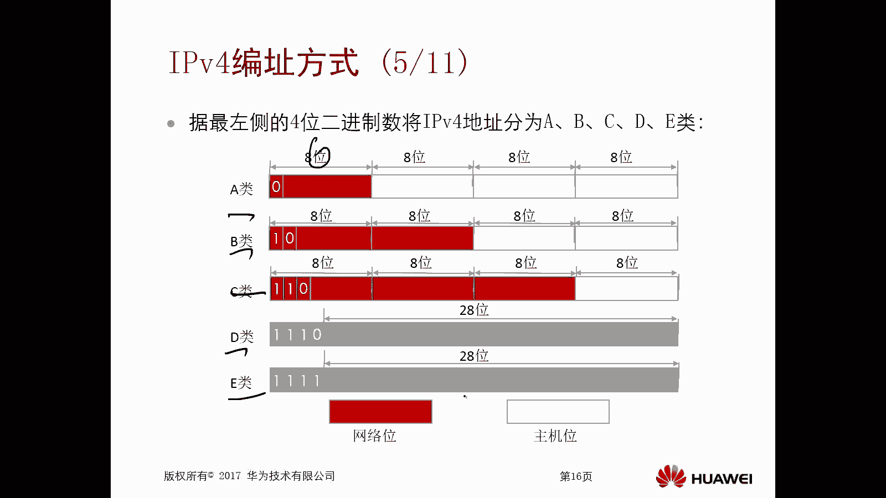

A类地址的特征是**第一位二进制数固定为0**。

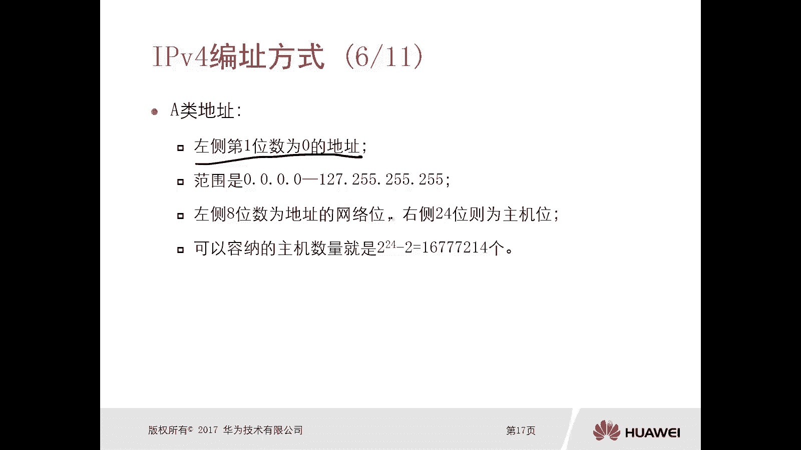

*   **范围**：`0.0.0.0` 到 `127.255.255.255`
*   **结构**：前8位为网络位（其中第1位固定为0），后24位为主机位。
*   **每个网络的主机数量**：`2^24 - 2`（约1677万台主机）
*   **网络数量**：`2^7`（128个A类网络）

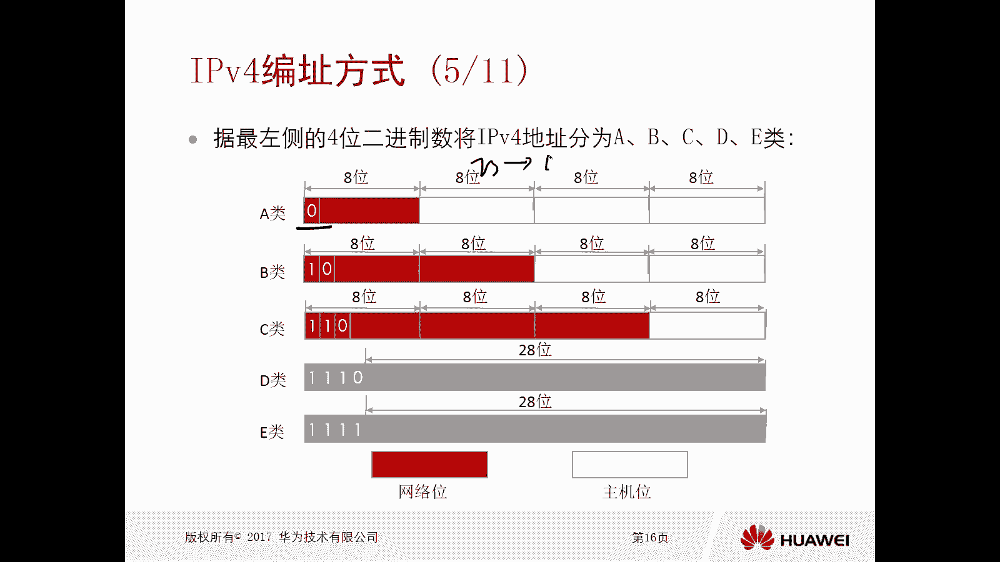

### B类地址

B类地址的特征是**前两位二进制数固定为10**。

*   **范围**：`128.0.0.0` 到 `191.255.255.255`
*   **结构**：前16位为网络位（其中前2位固定为10），后16位为主机位。
*   **每个网络的主机数量**：`2^16 - 2`（65534台主机）
*   **网络数量**：`2^14`（16384个B类网络）

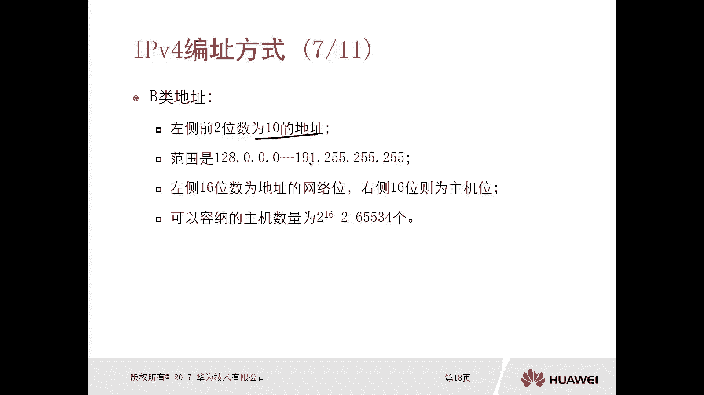

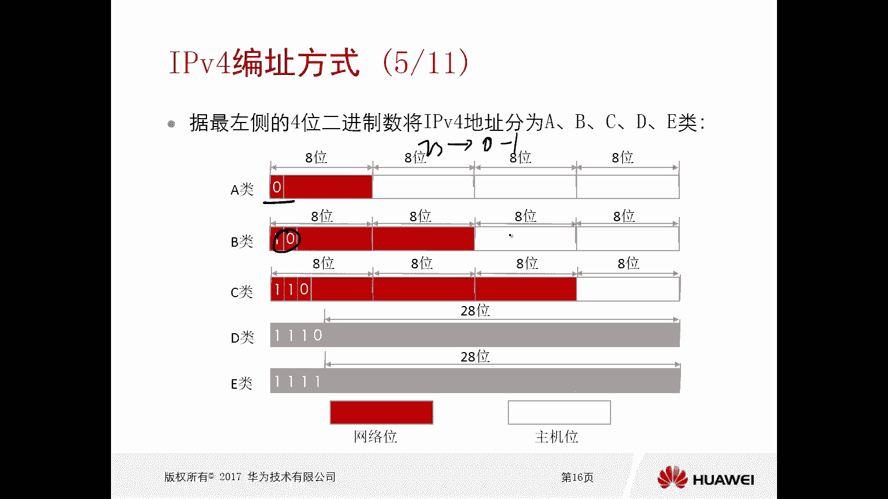

### C类地址

C类地址的特征是**前三位二进制数固定为110**。

*   **范围**：`192.0.0.0` 到 `223.255.255.255`
*   **结构**：前24位为网络位（其中前3位固定为110），后8位为主机位。
*   **每个网络的主机数量**：`2^8 - 2`（254台主机）
*   **网络数量**：`2^21`（约209万个C类网络）

**代码**：判断地址类别的伪代码逻辑
```python
if address_binary[0] == ‘0’:
    print(“这是A类地址”)
elif address_binary[0:2] == ‘10’:
    print(“这是B类地址”)
elif address_binary[0:3] == ‘110’:
    print(“这是C类地址”)
```

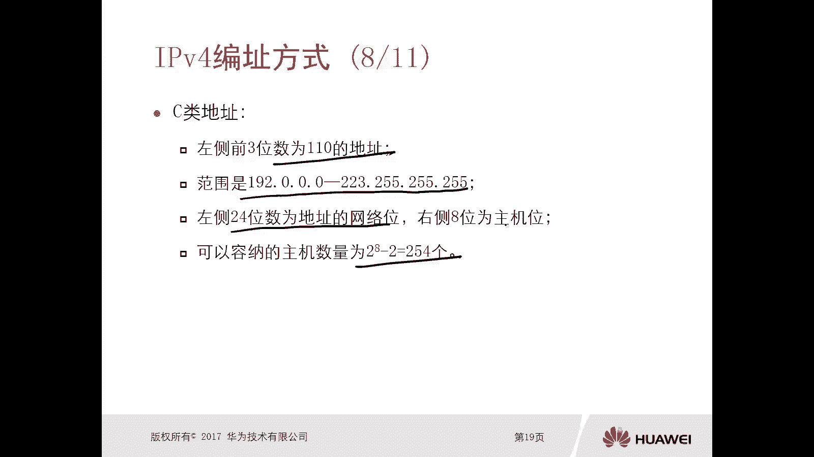

A、B、C三类地址称为**单播地址**，可以分配给网络中的主机或设备使用。

### D类与E类地址

D类和E类地址的结构与A、B、C类不同，不区分网络位和主机位。


*   **D类地址（组播地址）**：
    *   **特征**：前四位二进制数固定为`1110`。
    *   **范围**：`224.0.0.0` 到 `239.255.255.255`。
    *   **用途**：用于一对多的通信（组播），所有地址都可用。

*   **E类地址（保留地址）**：
    *   **特征**：前四位二进制数固定为`1111`。
    *   **范围**：`240.0.0.0` 到 `255.255.255.255`。
    *   **用途**：保留用于科研和实验。

---

## 如何查看设备的IPv4地址

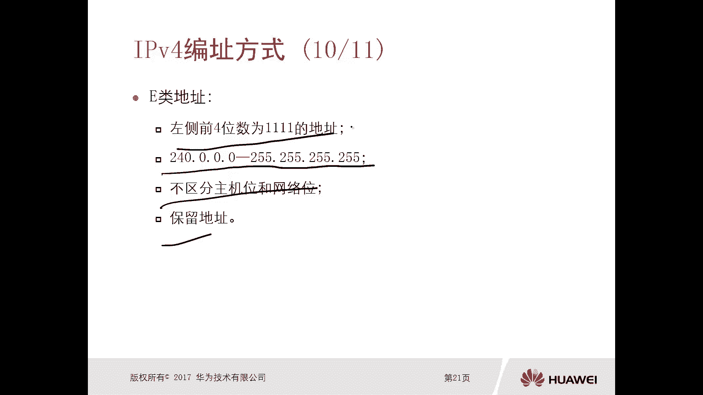

了解理论后，我们来看看如何在实际操作中查看自己设备的IP地址。

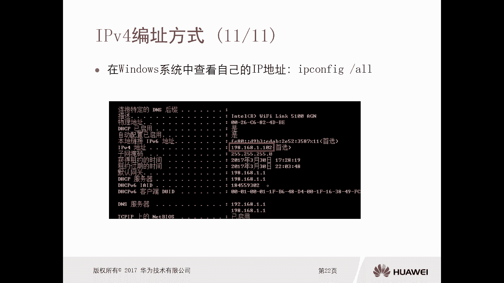

在Windows操作系统中，可以通过命令行工具查看。以下是操作步骤：

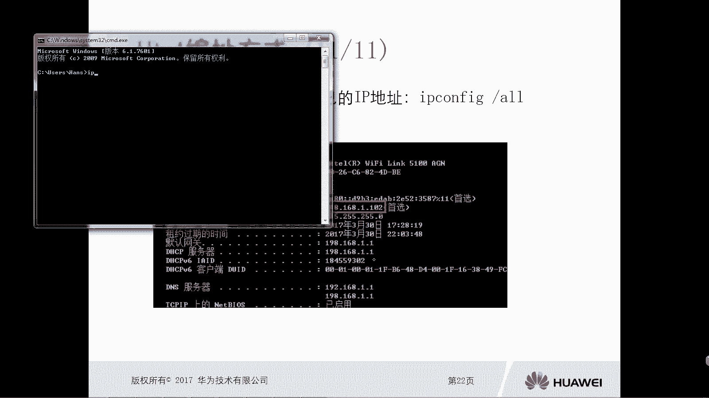


1.  按下 `Win + R` 键，打开“运行”对话框。
2.  输入 `cmd` 并按回车，打开命令提示符窗口。
3.  在命令提示符中输入命令 `ipconfig` 并按回车。
4.  在输出的信息中，找到你正在使用的网络连接（如“无线局域网适配器 WLAN”或“以太网适配器 以太网”）。
5.  在该连接的信息中，即可看到 `IPv4 地址`，其后跟着的就是你的设备的IP地址，例如 `192.168.1.105`。

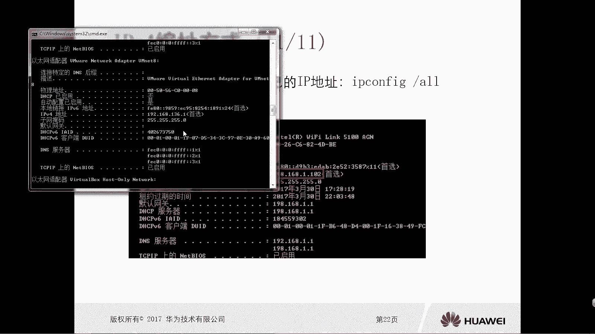

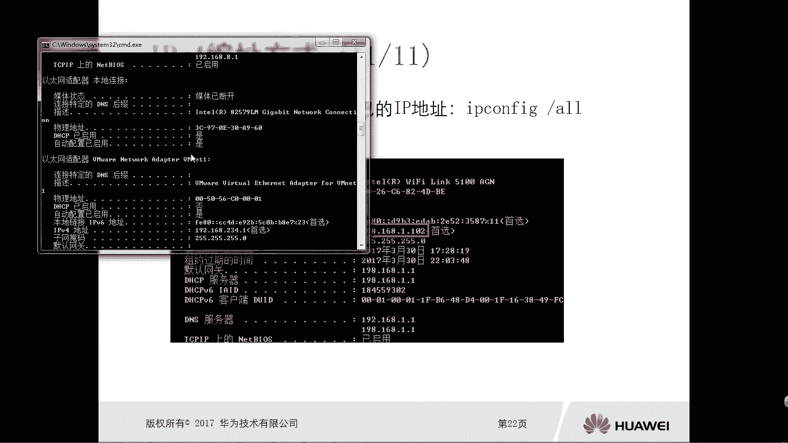

**代码**：Windows查看IP地址命令
```
C:\> ipconfig
```

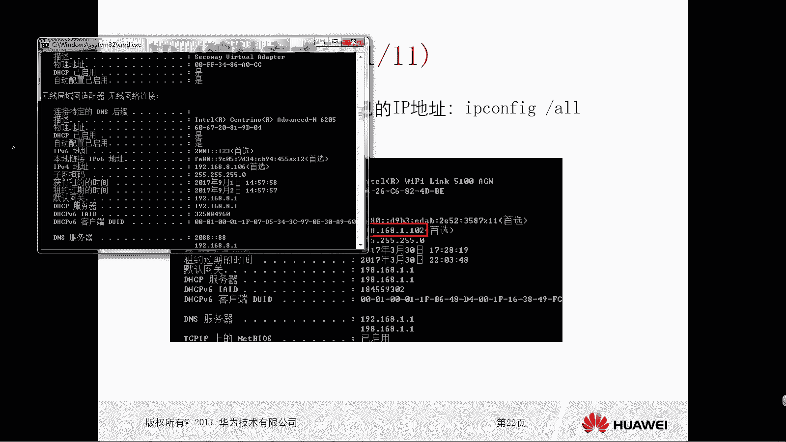

---

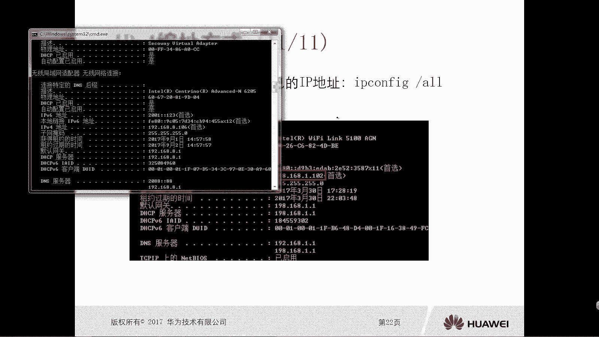

本节课中我们一起学习了IPv4地址的编址方式。我们首先了解了IPv4地址采用**点分十进制**的表示方法，然后剖析了其由**网络位**和**主机位**组成的内部结构，并明确了**网络地址**和**广播地址**这两个特殊地址。接着，我们系统学习了A、B、C、D、E五类IP地址的范围、结构和用途，其中A、B、C类为可分配的单播地址。最后，我们掌握了在Windows系统下使用 `ipconfig` 命令查看设备IP地址的实用技能。理解这些基础知识是后续学习IP子网划分、路由配置等更深入网络技术的基石。