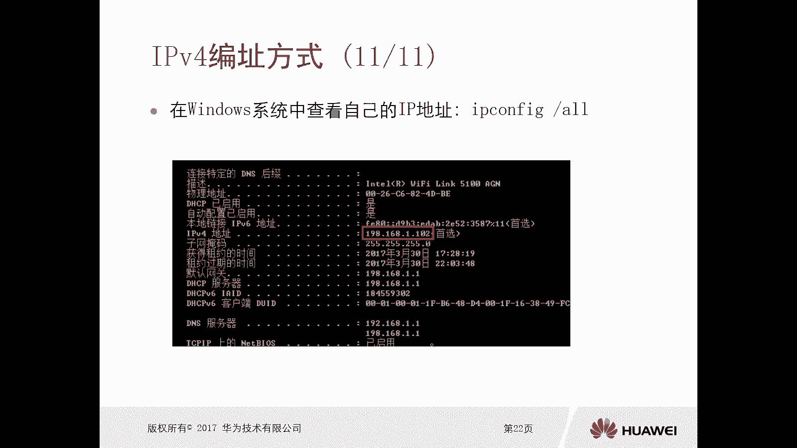
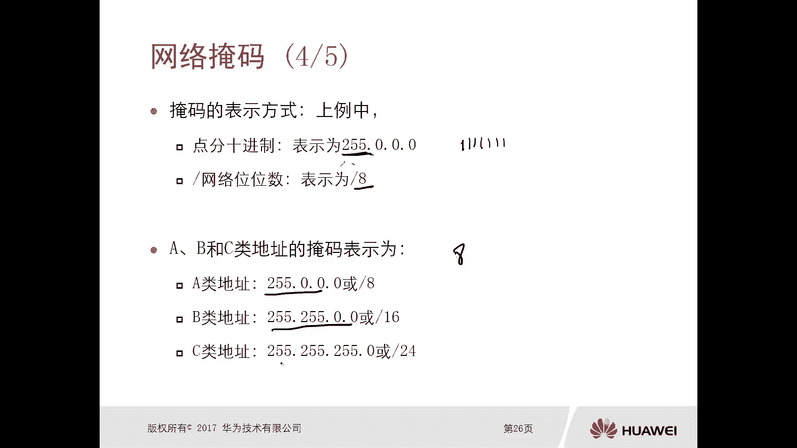
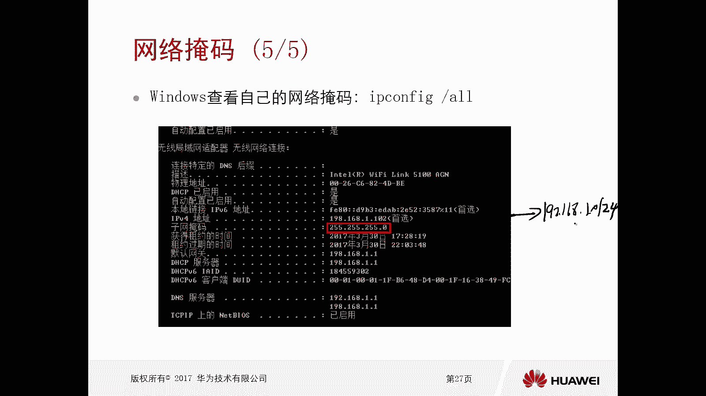
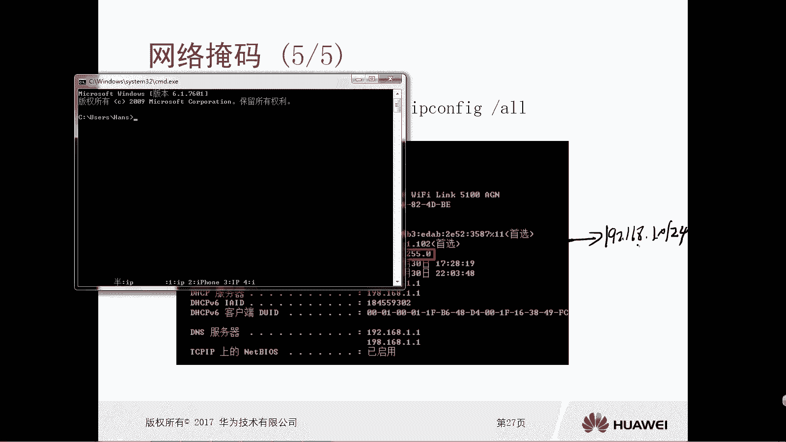
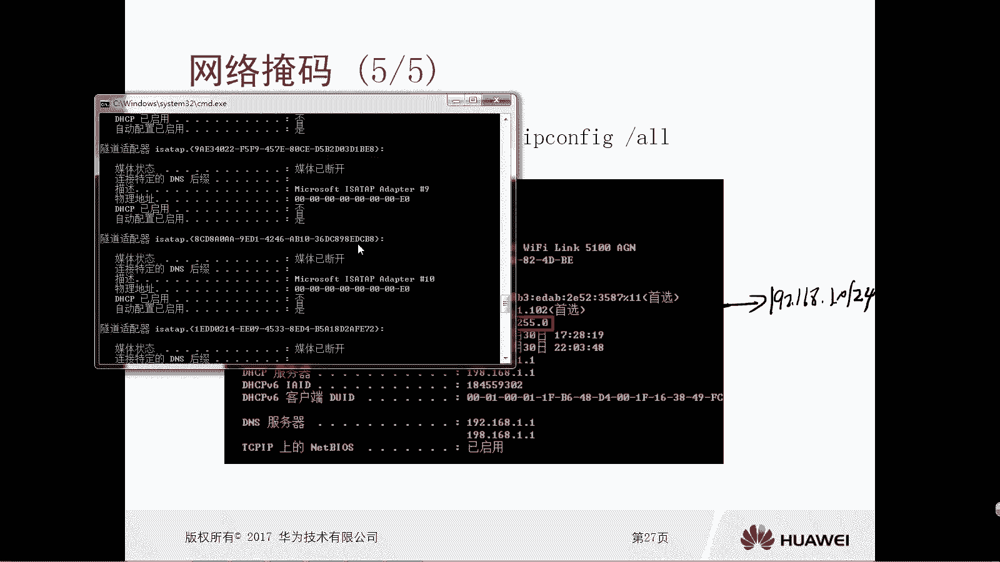
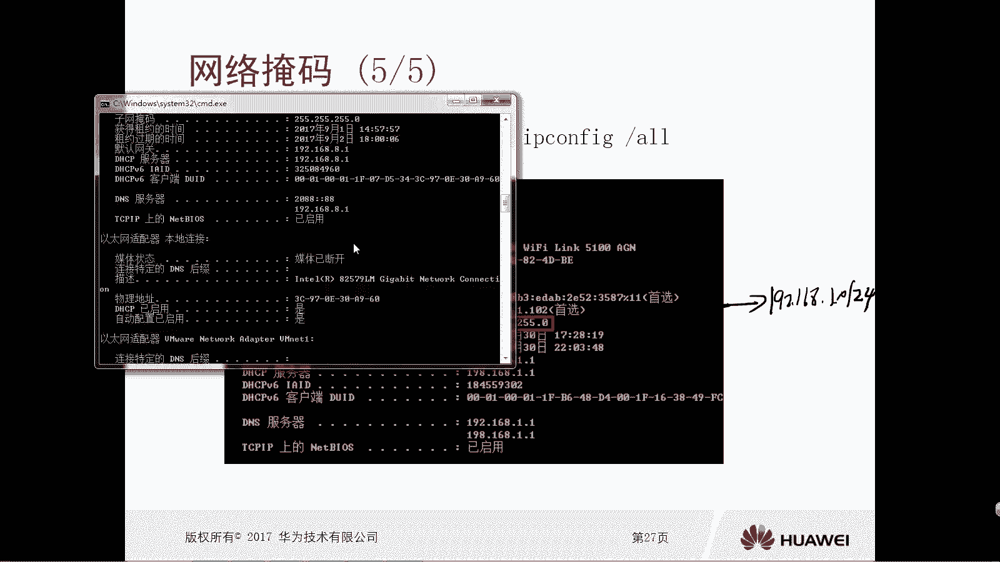
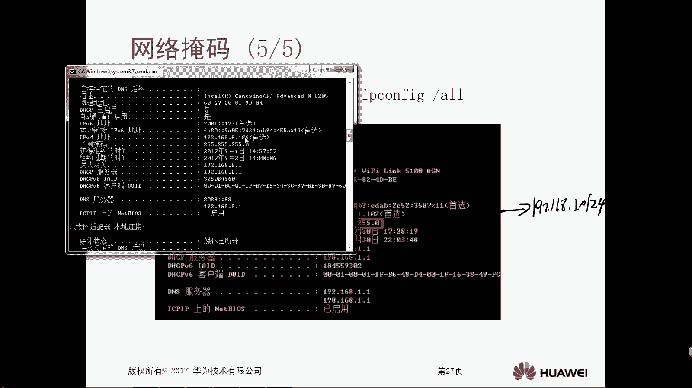

# 华为认证ICT学院HCIA/HCIP-Datacom教程：P18：第1册-第6章-2-网络掩码 📚



在本节课中，我们将要学习网络掩码的概念、作用及其表示方法。网络掩码是区分IP地址中网络部分和主机部分的关键工具，对于理解网络通信至关重要。

## 网络掩码的作用 🎯

上一节我们介绍了IP地址的结构。在IPv4地址中，左侧的N位表示网络位，右侧的（32-N）位表示主机位。例如，A类地址网络位为8位，B类为16位，C类为24位。

然而，仅凭IP地址本身，网络设备（如路由器、交换机或主机）无法自动识别哪部分是网络位，哪部分是主机位。网络掩码正是为了解决这个问题而存在的。它的作用是标识IP地址中的网络部分和主机部分。

## 网络掩码的定义与运算 🔢

网络掩码也是一个32比特的二进制数。它的构成规则是：**前N位连续为1，后（32-N）位连续为0**。

掩码需要与IP地址进行“与”运算，从而得到该IP地址所在的网络地址。“与”运算的规则是：**只有两个对应的比特位都为1时，结果才为1；否则结果为0**。

以下是“与”运算的代码描述：
```python
# 假设IP地址为 192.168.1.1，掩码为 255.255.255.0
ip_bits = 11000000.10101000.00000001.00000001
mask_bits = 11111111.11111111.11111111.00000000
# 进行与运算
network_bits = ip_bits & mask_bits
# 结果为：11000000.10101000.00000001.00000000，即 192.168.1.0
```

通过这个运算，网络设备就能明确知道IP地址 `192.168.1.1` 属于网络 `192.168.1.0`。掩码有效地“遮掩”了主机位，仅保留了网络位。

## 网络掩码的表示方法 📝

网络掩码有两种常见的表示方法，它们本质上是等价的。

以下是两种表示方法的说明：
1.  **点分十进制表示法**：与IP地址格式相同，例如 `255.255.255.0`。
2.  **前缀长度表示法（CIDR表示法）**：在IP地址后加一个斜杠（/）和数字，该数字表示网络位的位数，例如 `192.168.1.0/24`。

对于标准的A、B、C类地址，其掩码对应关系如下：
*   A类地址：掩码为 `255.0.0.0` 或 `/8`
*   B类地址：掩码为 `255.255.0.0` 或 `/16`
*   C类地址：掩码为 `255.255.255.0` 或 `/24`



## 查看实际网络掩码 💻

在实际操作中，我们可以通过系统命令查看本机的IP地址和子网掩码。

例如，在Windows系统中，打开命令提示符并输入 `ipconfig` 命令。在输出信息中，你可以找到类似 `IPv4 地址 . . . . . . . . . . . . : 192.168.8.106` 和 `子网掩码 . . . . . . . . . . . . : 255.255.255.0` 的信息。





结合这个IP地址和子网掩码进行“与”运算，我们就可以得出结论：这台主机位于 `192.168.8.0/24` 这个网络中。





## 总结 ✨



本节课中我们一起学习了网络掩码的核心知识。我们了解到，网络掩码是一个32位的二进制数，由连续的1和连续的0组成，用于区分IP地址中的网络部分和主机部分。通过将IP地址与掩码进行“与”运算，可以得到网络地址。掩码主要有点分十进制和前缀长度两种表示方法。理解并正确配置网络掩码，是进行网络规划、设备互联和故障排查的基础。