# 华为认证ICT学院HCIA/HCIP-Datacom教程：P19：第1册-第6章-3-子网划分与可变长子网掩码 📚

在本节课中，我们将要学习IPv4网络中子网划分的核心概念与操作方法。子网划分是网络规划中至关重要的技能，它能有效解决IP地址浪费问题，并实现网络的层次化管理。我们将从子网划分的原因讲起，逐步深入到可变长子网掩码的原理与实际规划案例。

## 为什么要划分子网？ 🤔

上一节我们介绍了IP地址的分类，本节中我们来看看为什么需要进行子网划分。主要有两个核心原因。

**1. 满足不同网络对IP地址数量的需求**
不同的网络场景需要的主机数量差异巨大。例如，一个销售部门可能只有30台主机，而两个路由器之间的互联链路仅需2个IP地址。如果直接使用A、B、C类主类网络地址，会造成巨大的地址浪费。
*   **A类网络**：可提供 `2^24 - 2` 个主机地址，给30台主机使用浪费极多。
*   **B类网络**：可提供 `2^16 - 2` 个主机地址，同样远超过需求。
*   **C类网络**：可提供 `2^8 - 2 = 254` 个主机地址，给2台路由器使用依然浪费252个地址。

因此，我们需要一种更灵活的方法来“切割”大的网络地址块，以匹配实际的小型网络需求。

**2. 实现网络的层次性**
按照A、B、C类直接分配地址，网络结构是扁平化的，缺乏逻辑层次。通过子网划分，我们可以基于部门、地理位置或功能来规划地址，使网络结构更清晰，便于管理和故障排查。

## 有类地址 vs. 可变长子网掩码 (VLSM) ⚖️

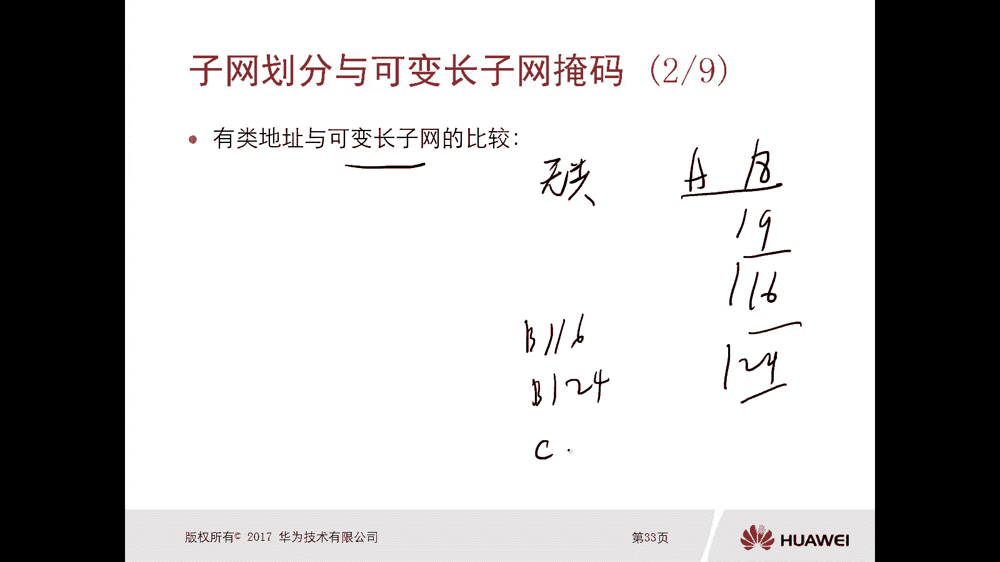

在深入子网划分之前，我们需要理解两个关键概念：有类地址和无类的可变长子网掩码。

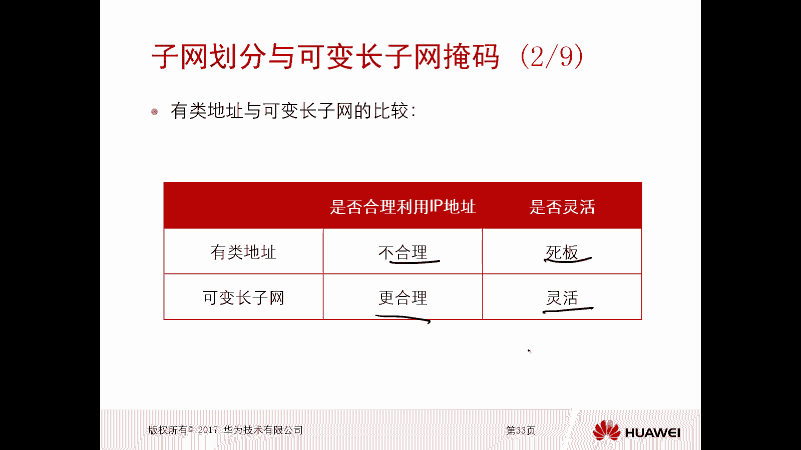

*   **有类地址**：严格按照A类（掩码/8）、B类（掩码/16）、C类（掩码/24）的固定规则来分配和使用IP地址。
*   **可变长子网掩码**：允许网络管理员根据实际需要，自由地调整子网掩码的长度，不再受A、B、C类的限制。例如，一个B类地址（如172.16.0.0/16）可以被划分为多个掩码为/24甚至更长的子网。

以下是两者的对比：

| 对比维度 | 有类地址 | 可变长子网掩码 (VLSM) |
| :--- | :--- | :--- |
| **IP地址利用率** | 不合理，非常死板，浪费严重。 | 更合理，能大幅减少地址浪费。 |
| **灵活性** | 不灵活。 | 非常灵活，是现代网络规划的标准。 |

**VLSM的核心思想**是：**借用主机位来创建子网位**。
将一个大的网络（主机位多）划分成多个小的子网（主机位少）。这样既增加了可用的子网数量，又使每个子网的地址规模贴近实际需求。

**公式表示**：
对于一个原始网络，设其主机位数为 *H*。从中借用 *S* 位作为子网位后：
*   可创建的子网数量 = `2^S`
*   每个子网可用的主机地址数 = `2^(H-S) - 2`

**示例**：
将B类网络 `172.16.0.0/16` 的主机位借用8位作为子网位。
*   子网掩码变为 `/24` (即 `255.255.255.0`)。
*   可划分出 `2^8 = 256` 个子网。
*   每个子网可容纳 `2^(16-8) - 2 = 254` 台主机。

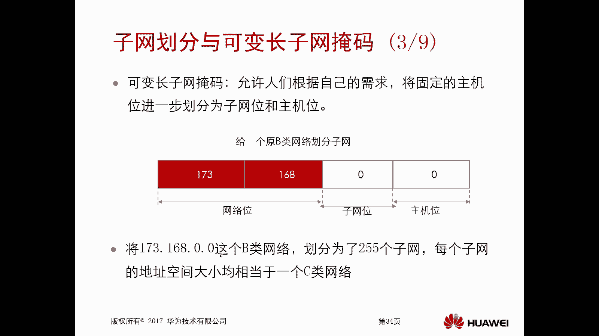

## 实战：为多个学院规划网络地址 🏫

现在，我们通过一个实际案例来应用子网划分。假设学校只有一个IP地址段 `172.168.0.0/16`，需要为三个规模不同的学院分配地址。

**已知条件**：总地址池 `172.168.0.0/16`
**需求**：
1.  学院一：需要约15000个IP地址。
2.  学院二：需要约7000个IP地址。
3.  学院三：需要约3000个IP地址。

规划步骤如下：

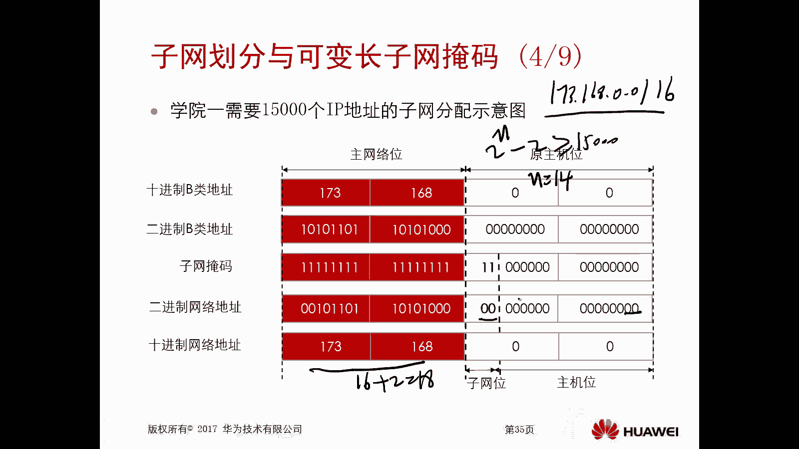

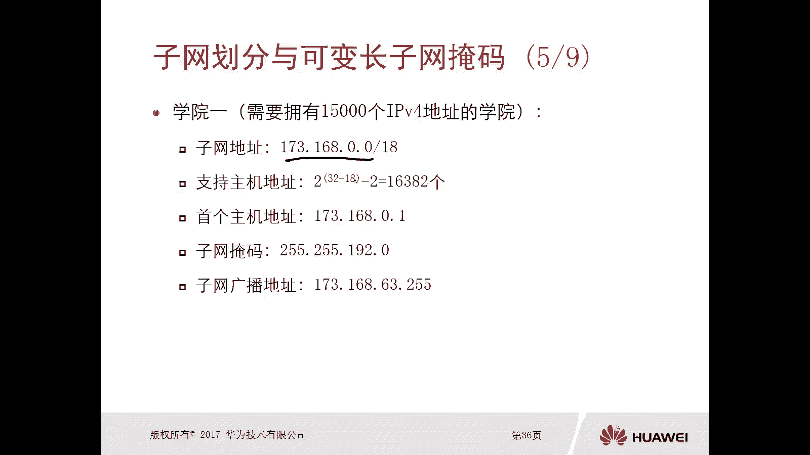

**第一步：为学院一划分地址**
学院一需要约15000个地址。计算所需主机位数 *N*，需满足 `2^N - 2 >= 15000`。
*   当 *N=14* 时，`2^14 - 2 = 16382`，满足要求。
*   原始网络主机位为16位，需借用 `16 - 14 = 2` 位作为子网位。
*   因此，新的子网掩码长度为 `16 + 2 = /18`。

分配给学院一的子网：
*   **子网地址**：`172.168.0.0/18`
*   **子网掩码**：`255.255.192.0`
*   **可用地址范围**：`172.168.0.1 ~ 172.168.63.254`
*   **广播地址**：`172.168.63.255`
*   **可用地址数**：16382个

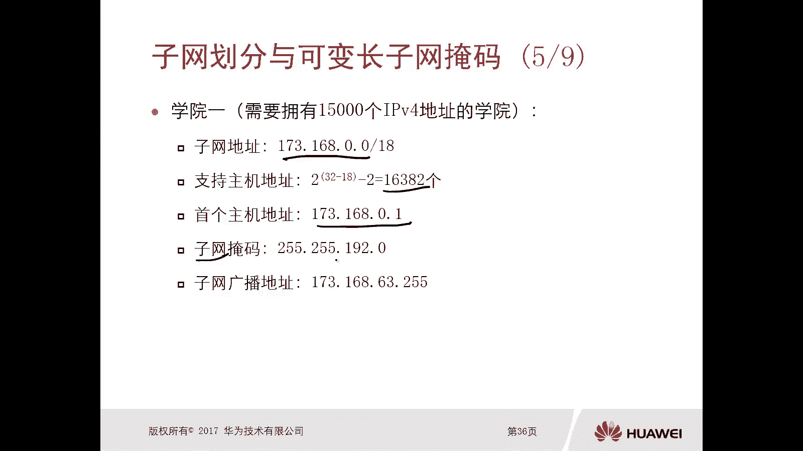

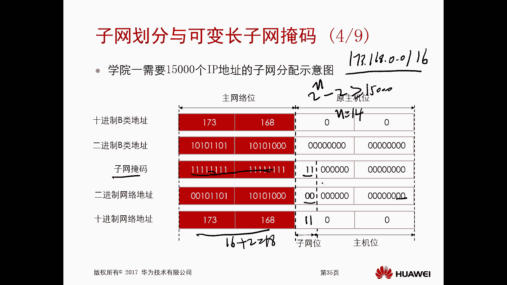

**第二步：为学院二划分地址**
在剩余地址中为学院二规划。学院二需要约7000个地址。
*   当 *N=13* 时，`2^13 - 2 = 8190`，满足要求。
*   在已划分的框架下，需要从剩余的主机位中继续借用。我们可以从第一个可用子网（非`172.168.0.0/18`）开始划分。
*   选择子网 `172.168.64.0/18` 进行进一步划分。在其基础上再借用1位（因为需要13位主机位，`18位掩码`对应14位主机位，`14-13=1`），掩码变为 `/19`。

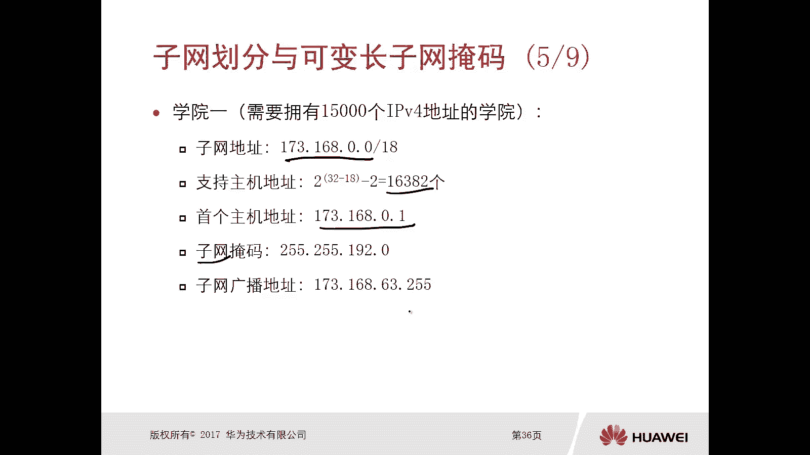

分配给学院二的子网：
*   **子网地址**：`172.168.64.0/19`
*   **子网掩码**：`255.255.224.0`
*   **可用地址范围**：`172.168.64.1 ~ 172.168.95.254`
*   **广播地址**：`172.168.95.255`
*   **可用地址数**：8190个

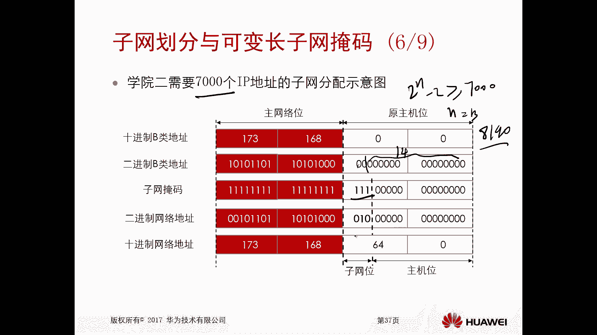

**第三步：为学院三划分地址**
学院三需要约3000个地址。
*   当 *N=12* 时，`2^12 - 2 = 4094`，满足要求。
*   在剩余地址中（例如`172.168.96.0/19`）继续划分。需要再借用1位（`19位掩码`对应13位主机位，`13-12=1`），掩码变为 `/20`。

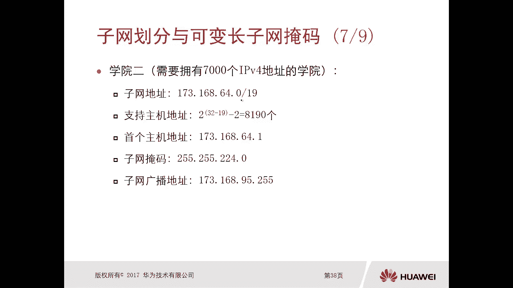

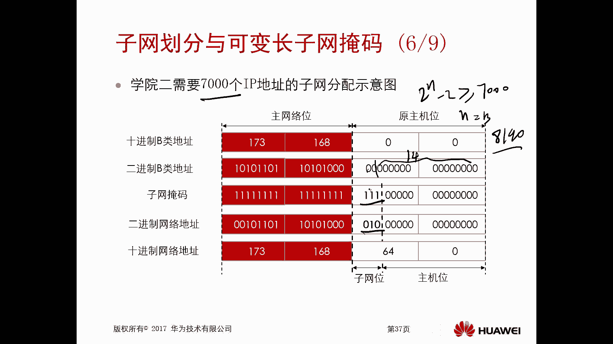

分配给学院三的子网：
*   **子网地址**：`172.168.96.0/20`
*   **子网掩码**：`255.255.240.0`
*   **可用地址范围**：`172.168.96.1 ~ 172.168.111.254`
*   **广播地址**：`172.168.111.255`
*   **可用地址数**：4094个

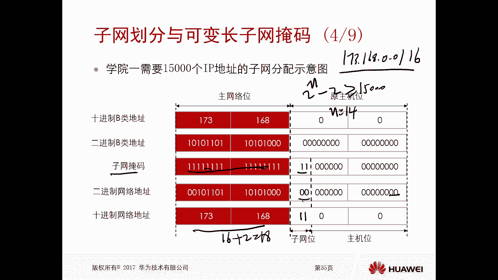

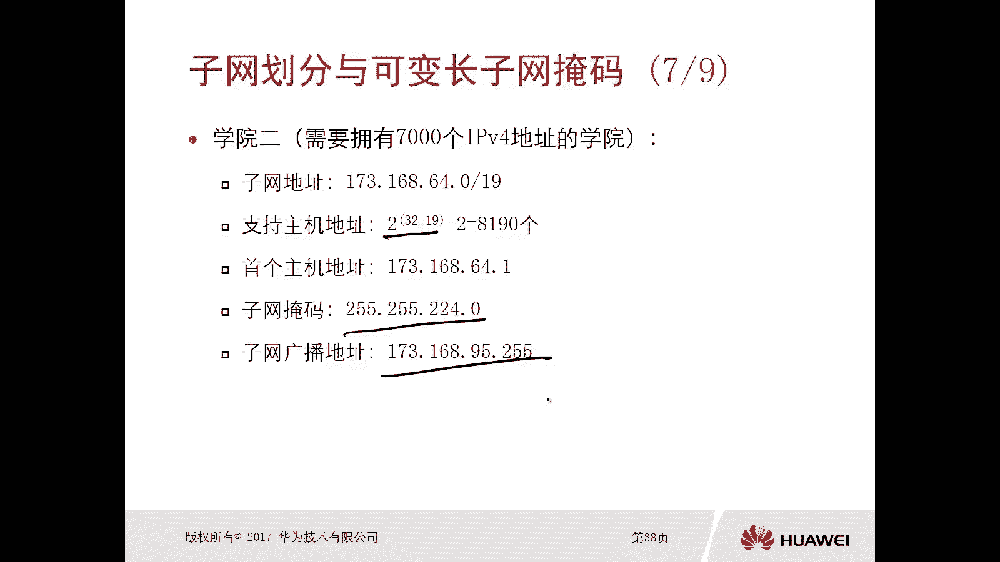

通过以上步骤，我们成功地将一个`/16`的大网络，通过可变长子网掩码技术，划分成了三个大小不同的子网，精准地满足了不同学院的需求，并保留了大量地址供未来使用。

## 总结 📝

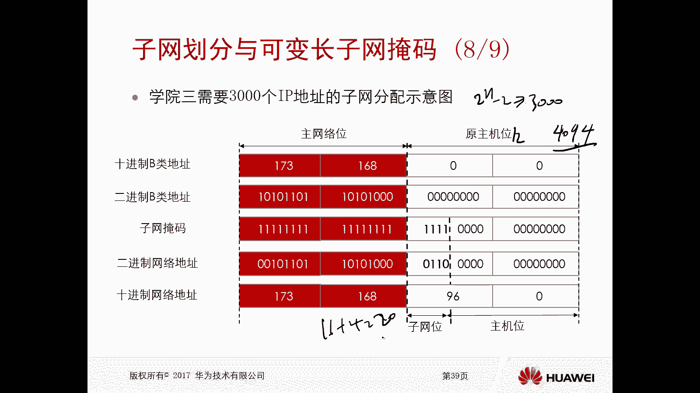

本节课中我们一起学习了IPv4子网划分与可变长子网掩码。
*   我们首先了解了**划分子网的两个主要原因**：提高IP地址利用率和实现网络层次化。
*   接着，我们对比了**有类地址**和**无类的可变长子网掩码**，明确了VLSM灵活、高效的优点。
*   最后，通过一个**为多个学院规划地址的实战案例**，我们掌握了子网划分的具体步骤：根据主机数量需求确定主机位数，从而推导出子网掩码长度，并完成地址块的划分。

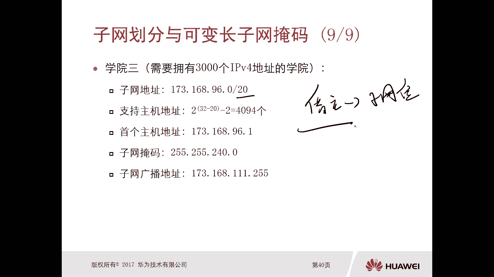

子网划分是网络工程师必备的基础技能，理解并掌握其原理和方法，对于后续的网络设计、实施和排错都至关重要。