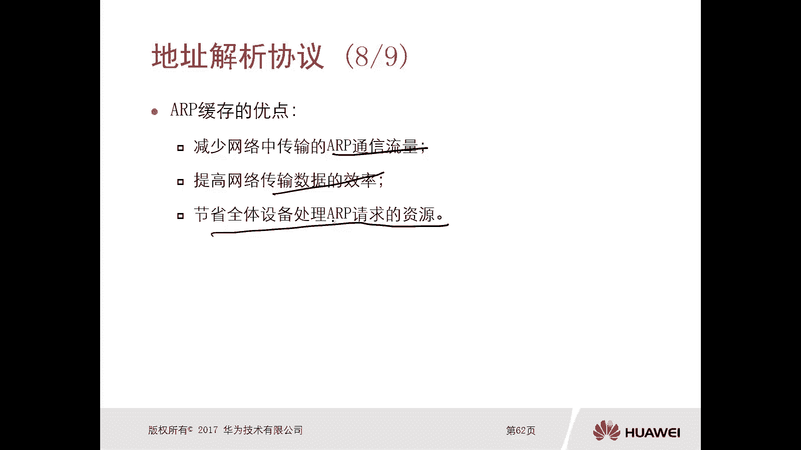
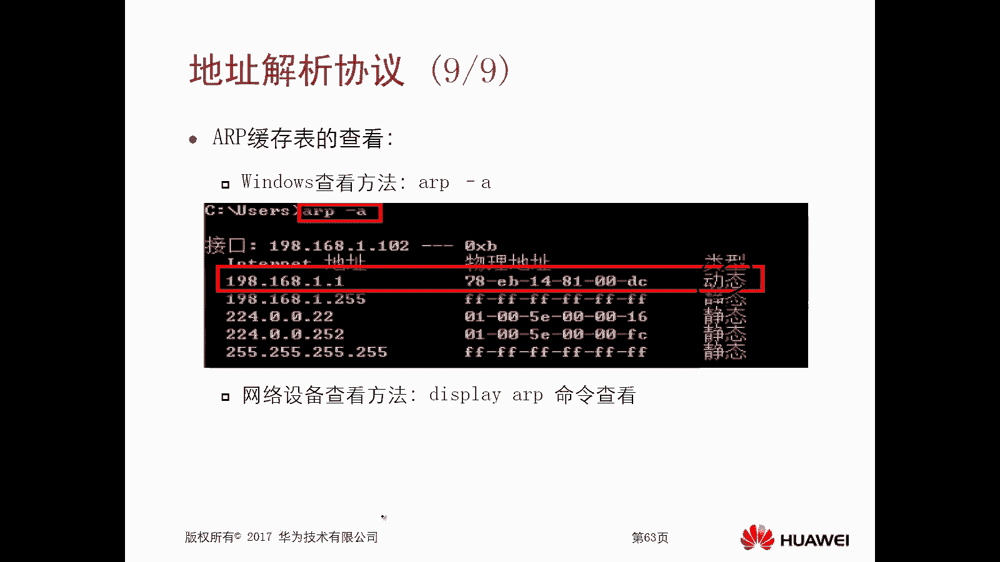
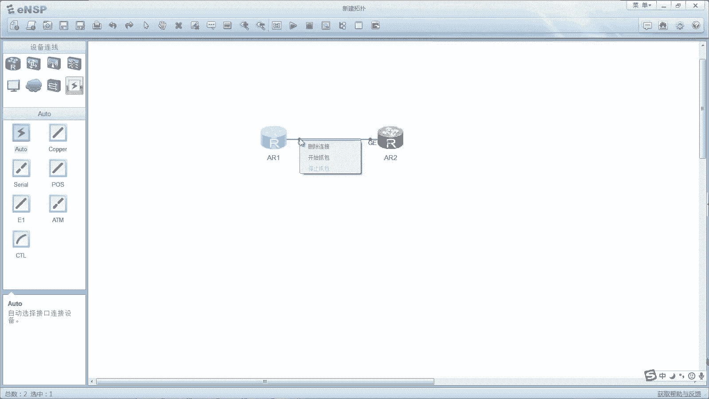
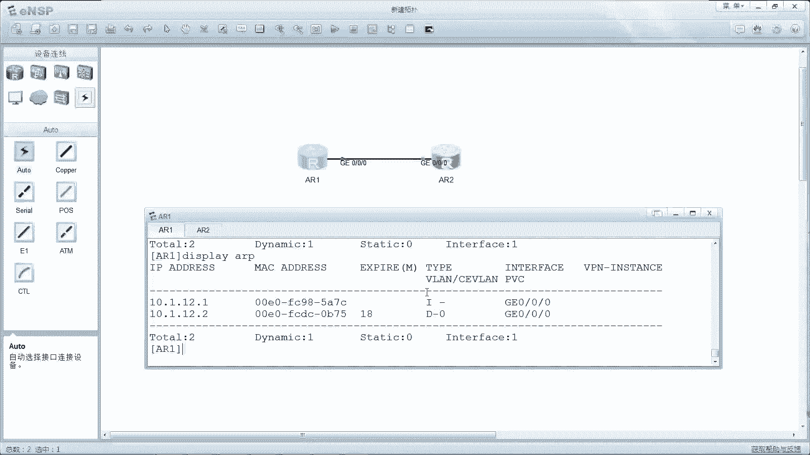

# 华为认证ICT学院HCIA/HCIP-Datacom教程：第1册-第6章-4：ARP地址解析协议 🧩

在本节课中，我们将要学习一个非常重要的网络协议——地址解析协议（ARP）。我们将了解ARP的基本概念、工作原理、报文类型以及它在网络通信中的关键作用。通过本课的学习，你将能够理解设备如何通过IP地址找到对应的MAC地址，从而完成数据包的封装与传输。

---

## ARP协议概述

上一节我们介绍了网络分层与封装的概念。本节中，我们来看看ARP协议。ARP，全称Address Resolution Protocol，即地址解析协议。它的主要作用是根据目的设备的IP地址，查询其对应的MAC地址。

我们知道，在网络层封装的是IP地址，而在数据链路层（如以太网）封装的是MAC地址。发送方通常知道目标设备的IP地址（例如通过DNS解析），但不知道其MAC地址。ARP协议就是用来解决这个问题的。

ARP主要使用两种报文实现其功能：
*   **ARP请求报文（Request）**：当设备需要发送数据但不知道目标MAC地址时，会发送此广播报文进行查询。
*   **ARP响应报文（Reply）**：当目标设备收到针对自己的ARP请求后，会发送此单播报文进行回复，告知自己的MAC地址。

---

## ARP的工作过程详解

接下来，我们通过一个具体的例子来详细说明ARP是如何工作的。假设网络中有四台设备（终端一至四）通过一台交换机连接。

### ARP请求（广播）

当终端一（IP：1.1.1.1）想要访问终端三（IP：1.1.1.3）但不知道其MAC地址时，会发起ARP请求。

以下是ARP请求阶段的关键步骤：
1.  **封装广播帧**：终端一创建一个ARP请求报文。该报文的目的MAC地址被设置为全`F`（即`FF:FF:FF:FF:FF:FF`），这是一个二层广播地址。报文内容大意是：“请问IP地址为`1.1.1.3`的设备的MAC地址是什么？”
2.  **交换机泛洪**：交换机收到这个广播帧后，会向除接收端口外的所有其他端口进行转发（这个过程称为泛洪）。因此，终端二、三、四都会收到这个ARP请求。
3.  **非目标设备处理**：终端二和终端四检查请求中的目标IP地址（`1.1.1.3`）与自身IP不匹配，因此会直接丢弃该数据包。

### ARP响应（单播）

只有IP地址匹配的设备（终端三）会对ARP请求做出响应。

以下是ARP响应阶段的关键步骤：
1.  **封装单播帧**：终端三创建一个ARP响应报文。由于请求报文中包含了终端一的IP和MAC地址，终端三可以精确地使用单播进行回复。响应报文的目的MAC地址是终端一的MAC地址，内容包含：“我的IP是`1.1.1.3`，我的MAC地址是`00:9A:CD:33:33:33`。”
2.  **交换机转发**：交换机根据目的MAC地址，将响应报文仅转发给终端一所在的端口。
3.  **请求方获取信息**：终端一收到响应后，便知道了终端三的MAC地址，从而可以完成数据帧的封装并开始通信。

---

## ARP缓存表

为了提高效率，设备会将学习到的IP-MAC对应关系缓存起来，形成**ARP缓存表**（或ARP表）。

以下是关于ARP缓存表的要点：
*   **作用**：记录已知的IP地址与MAC地址的映射关系（二元组）。
*   **优点**：
    *   减少网络中ARP广播报文的流量。
    *   提高数据传输效率，避免每次通信前都进行ARP请求。
    *   节省网络所有设备处理广播报文所需的资源。
*   **查看方式**：在不同系统中命令不同。
    *   **Windows系统**：在命令提示符中输入 `arp -a`。
    *   **华为设备**：在命令行界面输入 `display arp`。
*   **表项类型**：分为动态和静态。
    *   **动态表项**：由ARP协议自动学习获得，有老化时间，超时后会被删除。
    *   **静态表项**：由管理员手动配置，永久有效，除非手动删除。配置命令示例（华为设备）：`arp static <ip-address> <mac-address>`

---

## 实验验证

为了加深理解，我们通过一个简单的实验来验证ARP的工作过程。实验拓扑包含两台路由器（R1和R2）直连。

1.  **基础配置**：为两台路由器的接口配置IP地址（例如R1: `10.1.12.1/24`， R2: `10.1.12.2/24`）。
2.  **初始状态**：配置完成后，在R1上使用 `display arp` 命令查看ARP表。此时表中只有R1自己的接口信息，没有关于`10.1.12.2`的表项。
3.  **触发通信**：在R1上执行 `ping 10.1.12.2` 命令。在首次Ping通之前，通信过程会触发ARP。
4.  **抓包分析**：在链路上抓包（如使用Wireshark），可以清晰地看到两个ARP报文：
    *   **第一个报文（Request）**：源MAC是R1，目的MAC是全`F`广播。信息字段显示：“Who has `10.1.12.2`? Tell `10.1.12.1`”。
    *   **第二个报文（Reply）**：源MAC是R2，目的MAC是R1。信息字段显示：“`10.1.12.2` is at <R2的MAC地址>”。
5.  **查看结果**：Ping通后，再次在R1上使用 `display arp` 命令，可以看到ARP表中已经动态学习到了`10.1.12.2`对应的MAC地址表项。

这个实验直观地展示了ARP“请求-响应”的完整过程，以及ARP缓存表的动态更新机制。

---

## 总结

本节课中我们一起学习了地址解析协议（ARP）的核心知识。我们首先了解了ARP协议的定义和作用——**根据IP地址解析MAC地址**。然后，我们详细剖析了ARP的两种报文（**请求Request**和**响应Reply**）以及其“广播请求，单播响应”的工作机制。接着，我们介绍了**ARP缓存表**的概念、优点及其查看方法，它对于提升网络效率至关重要。最后，通过一个实验，我们验证了ARP的实际工作过程。

理解ARP是掌握局域网通信基础的关键一步，它是数据能够正确封装并在二层网络中传输的保障。