# 华为认证ICT学院HCIA/HCIP-Datacom教程：P21：交换机对数据帧的转发原理 🖧

在本节课中，我们将要学习交换机如何转发数据帧。与路由器转发数据包需要路由表类似，交换机转发数据帧也需要依据，这个依据就是MAC地址表。我们将详细探讨MAC地址表是如何建立、维护和使用的，以及交换机在收到数据帧后的三种处理方式：泛洪、转发和丢弃。

## 交换机工作原理概述 🔄

上一节我们介绍了路由器转发数据包的原理，本节中我们来看看交换机如何转发数据帧。路由器转发数据包需要查询路由表，而交换机转发数据帧则需要查询MAC地址表。

一台初始的交换机内部没有任何MAC地址表，就像初始的路由器没有路由表一样。没有这个表，交换机就无法正确转发数据帧。因此，交换机启动后，首要任务就是形成MAC地址表。

这个表是如何形成的呢？它是通过数据帧的发送来触发生成的。当交换机从一个接口收到数据帧时，它会利用该数据帧的**源MAC地址**来建立MAC地址表项。这个表项记录了“MAC地址”和“对应接口”的二元组关系。

有了这个表，交换机在后续转发时就有了依据。但在表项建立之前，交换机如何转发第一个数据帧呢？答案是：**泛洪**。当交换机收到一个目的MAC地址不在其当前MAC地址表中的单播帧时，它会将这个帧从除接收端口外的所有其他端口转发出去，以确保数据能够到达目的地。

## MAC地址表的建立与维护 📝

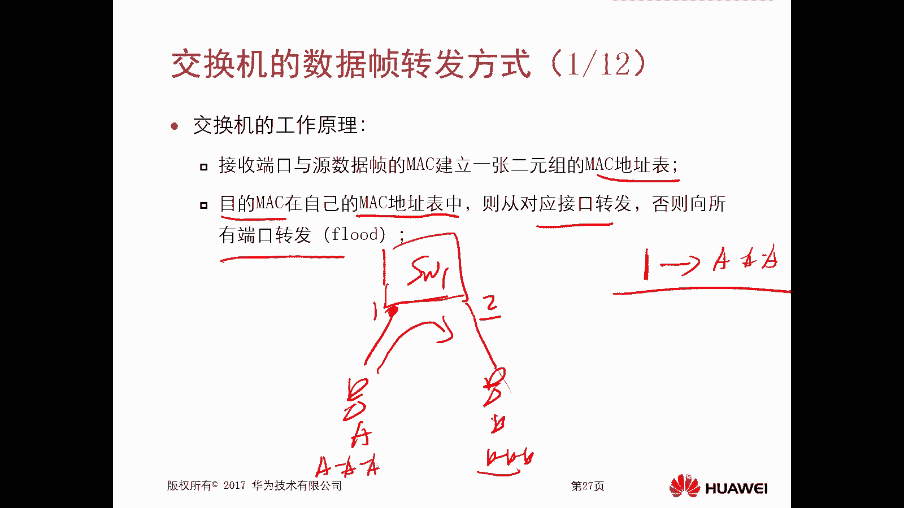

上一节我们概述了交换机需要MAC地址表，本节中我们来看看这个表具体是如何建立和维护的。

### MAC地址表的建立

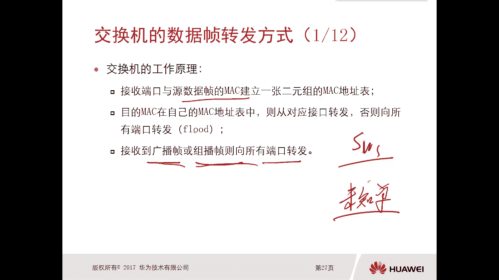

交换机通过监听数据帧的源MAC地址来动态学习并建立MAC地址表。其核心原则是：**学习源MAC，转发时查询目的MAC**。

以下是MAC地址表建立的关键步骤：
1.  交换机从某个接口（例如接口1）收到一个数据帧。
2.  交换机检查该数据帧的**源MAC地址**（例如 `AA-AA-AA-AA-AA-AA`）。
3.  交换机在MAC地址表中创建一个表项，将该源MAC地址与接收接口（接口1）绑定。
4.  后续，当交换机需要转发目的地址为 `AA-AA-AA-AA-AA-AA` 的数据帧时，就知道应该从接口1转发出去。

这个过程是自动进行的。在网络中，当PC首次通信时（例如发送ARP请求），其发出的数据帧就为交换机提供了学习源MAC地址的机会。

### MAC地址表的维护

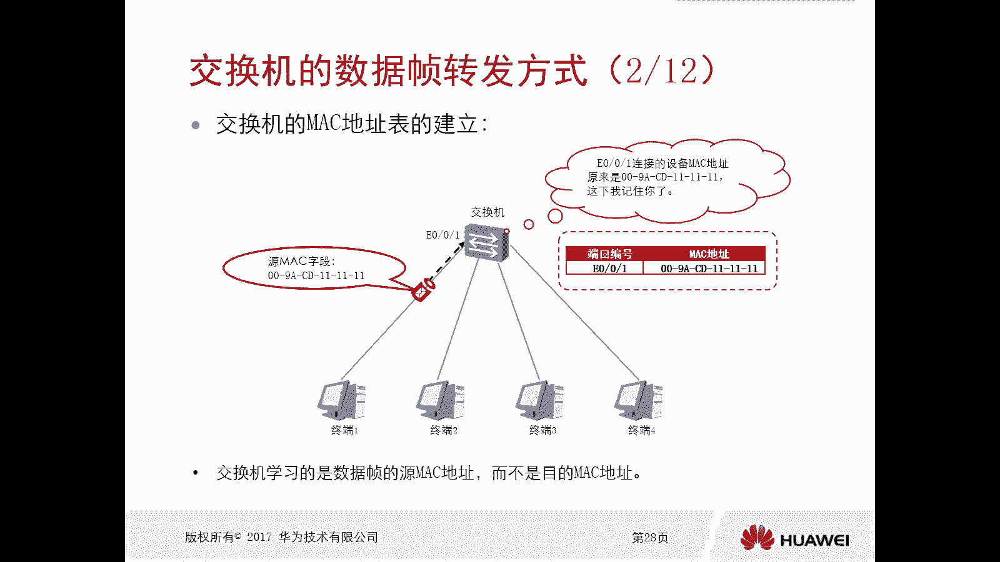

MAC地址表中的动态表项不是永久存在的，它们需要被维护和更新，以确保信息的时效性。

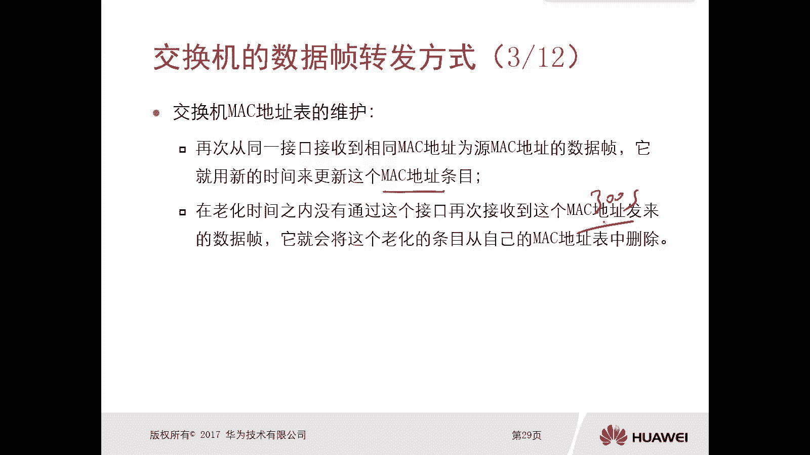

以下是MAC地址表维护的两个核心机制：
1.  **刷新**：如果交换机再次从同一个接口收到相同源MAC地址的数据帧，它会用新的时间戳更新该表项。
2.  **老化**：每个动态学习的MAC地址表项都有一个**老化时间**（默认300秒）。如果在此时间内没有再次收到该MAC地址发来的数据帧，该表项将被自动删除。

此外，如果交换机某个物理接口状态变为`down`，那么所有与该接口关联的MAC地址表项会立即被清除。

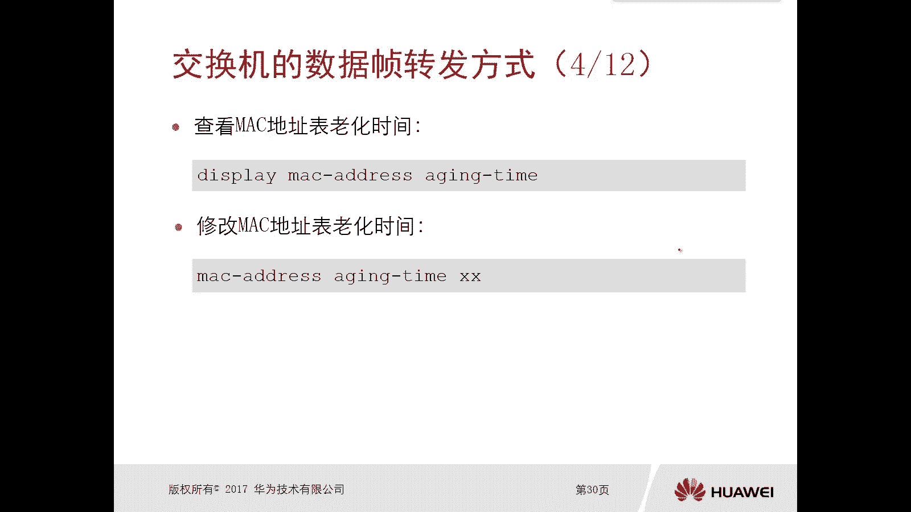

你可以在交换机上使用以下命令查看和修改老化时间：
*   查看老化时间：`display mac-address aging-time`
*   修改老化时间：`mac-address aging-time <秒数>`

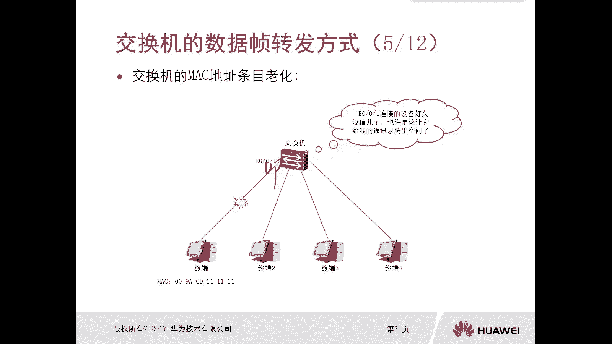

## 静态MAC地址表项 ⚙️

上一节我们介绍了动态学习的MAC地址表，本节中我们来看看另一种方式：静态配置。

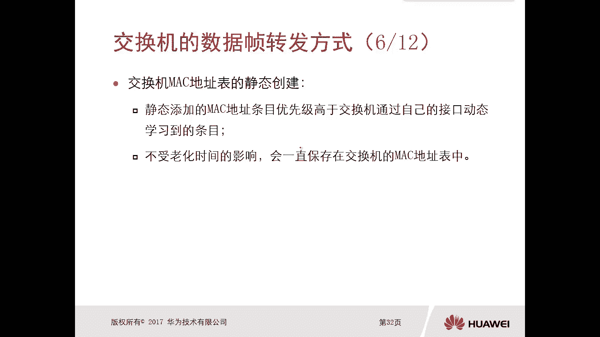

除了动态学习，我们还可以手动在交换机上配置静态MAC地址表项。静态表项具有更高的优先级，并且不受老化时间影响，会永久保存在MAC地址表中，直到手动删除。

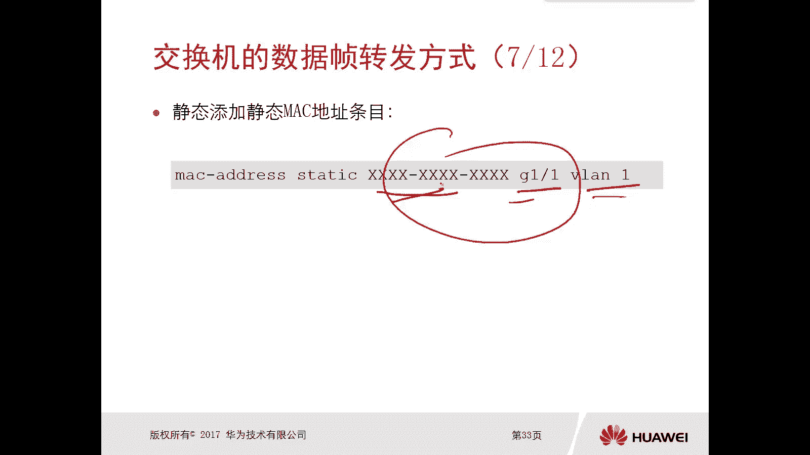

配置静态MAC地址表项的命令格式如下（此处暂不涉及VLAN）：
`mac-address static <MAC地址> interface <接口编号>`

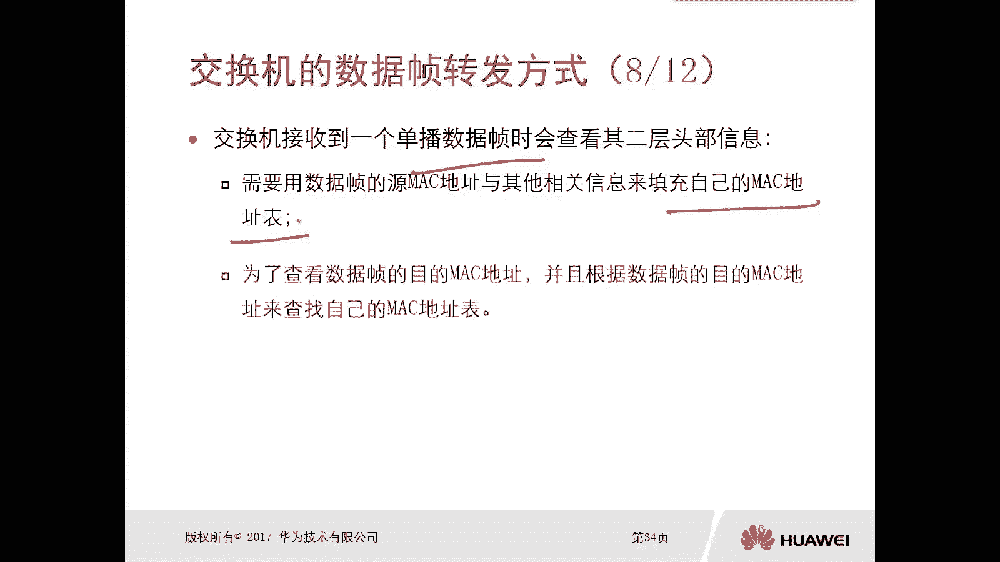

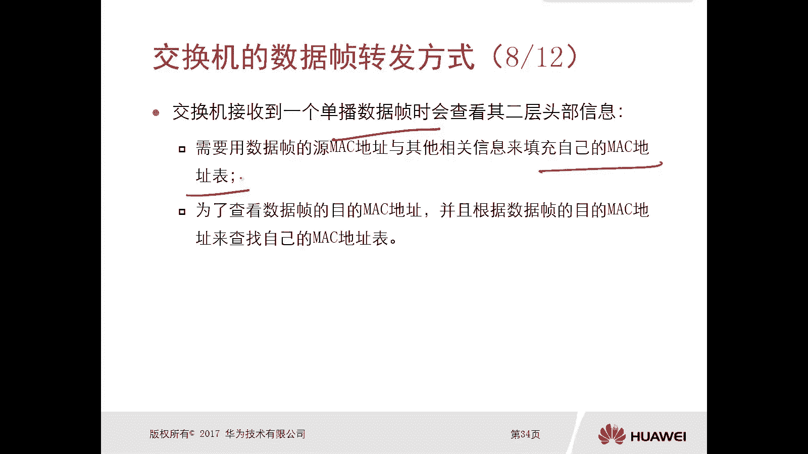

例如，`mac-address static 5489-98FB-1234 interface GigabitEthernet 0/0/1` 命令会将MAC地址 `5489-98FB-1234` 静态绑定到接口 `GigabitEthernet 0/0/1` 上。

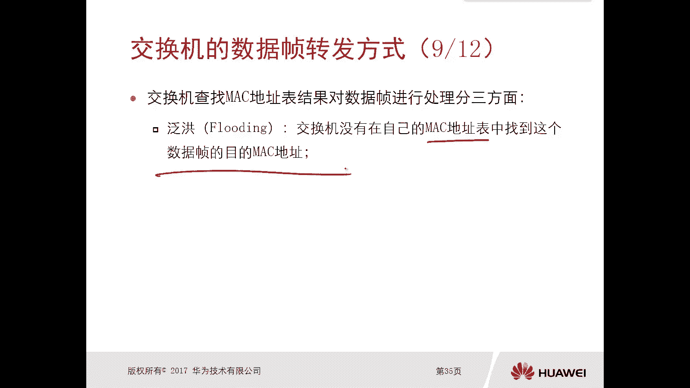

## 数据帧的转发处理 🚦

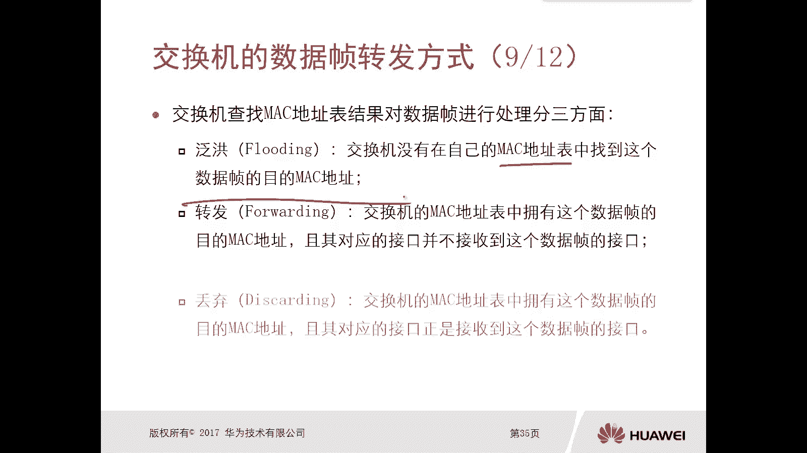

在了解了MAC地址表的建立方式后，本节中我们来看看交换机在收到一个数据帧后，具体是如何查询并处理它的。

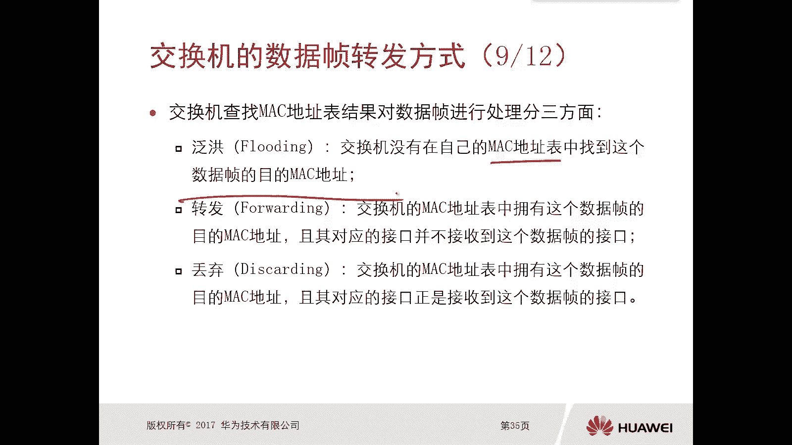

交换机收到一个单播数据帧后，会执行两个关键操作：
1.  **学习**：查看数据帧的**源MAC地址**，并据此更新或创建MAC地址表项。
2.  **转发决策**：查看数据帧的**目的MAC地址**，并查询MAC地址表，根据查询结果决定如何处理该帧。

查询结果及对应的处理方式有以下三种：

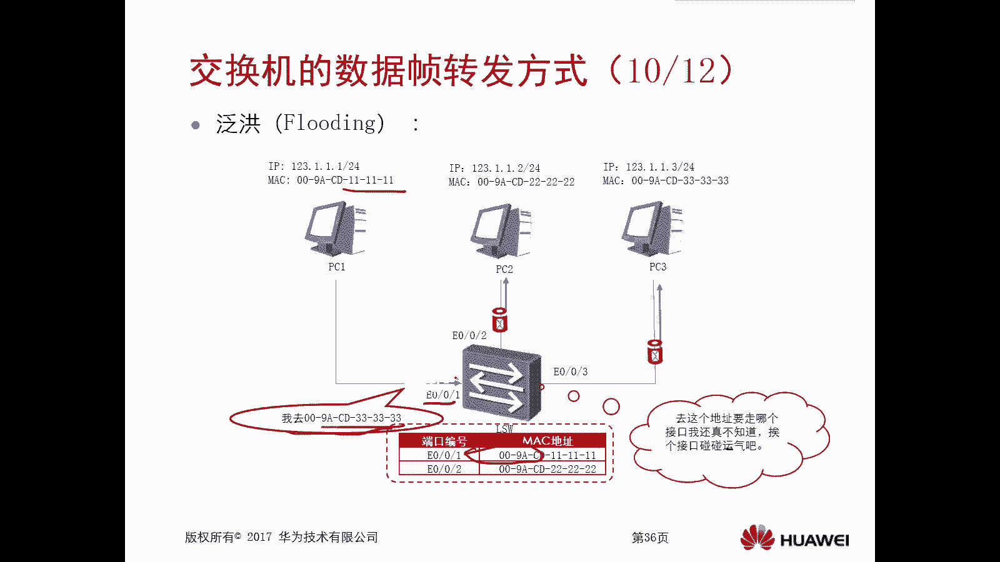

### 1. 泛洪
当交换机在MAC地址表中**找不到**目的MAC地址对应的表项时，它会进行**泛洪**操作。
*   **动作**：将数据帧从**除接收端口外**的所有其他端口发送出去。
*   **目的**：确保即使不知道目标位置，数据也能被传递到网络各处，最终到达目的地。
*   **典型场景**：处理**未知单播帧**、**广播帧**（如ARP请求，目的MAC为`FF-FF-FF-FF-FF-FF`）和**组播帧**。

### 2. 转发
当交换机在MAC地址表中**找到了**目的MAC地址对应的表项，并且该表项指定的出接口与接收接口**不同**时，执行转发。
*   **动作**：将数据帧从表项中指定的那个**正确的出接口**发送出去。
*   **目的**：实现精确的点对点数据交付，避免不必要的网络流量。

### 3. 丢弃
当交换机在MAC地址表中**找到了**目的MAC地址对应的表项，但是该表项指定的出接口**恰好就是接收该数据帧的接口**时，执行丢弃。
*   **动作**：直接丢弃该数据帧，不进行转发。
*   **目的**：避免数据帧在网络中环路或重复传输。这种情况通常发生在网络配置错误或遭受攻击时（例如一台主机发送源和目的MAC地址相同的数据帧）。

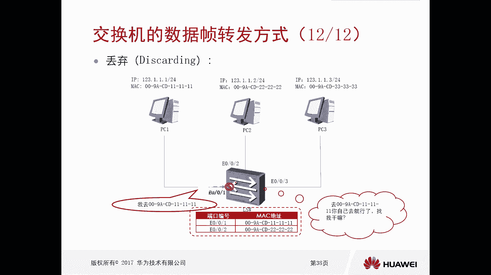

## 总结 📚

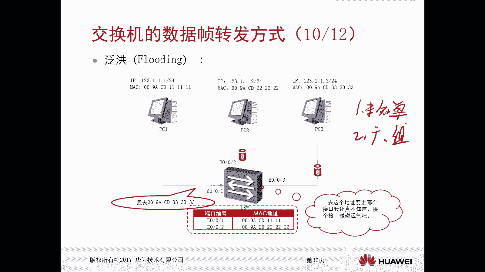

本节课中我们一起学习了交换机转发数据帧的核心原理。
*   我们首先了解到，交换机依赖于**MAC地址表**来做出转发决策，该表记录了MAC地址与交换机端口的映射关系。
*   接着，我们学习了MAC地址表可以通过**动态学习**（依据数据帧的源MAC地址）和**静态配置**两种方式建立，并且动态表项有**老化时间**机制进行维护。
*   最后，我们详细分析了交换机处理数据帧的三种方式：**泛洪**（用于未知单播、广播和组播）、**转发**（已知单播的正确路径）和**丢弃**（防止环路和无效流量）。理解这些原理是掌握二层网络通信和进行网络故障排查的基础。