# 华为认证ICT学院HCIA/HCIP-Datacom教程：第2册-第2章-1：VLAN的用途 🏷️

在本节课中，我们将要学习VLAN（虚拟局域网）技术的核心用途。我们将从传统交换网络的问题出发，逐步理解VLAN如何解决广播域过大、安全性低以及网络资源分配不灵活等挑战。

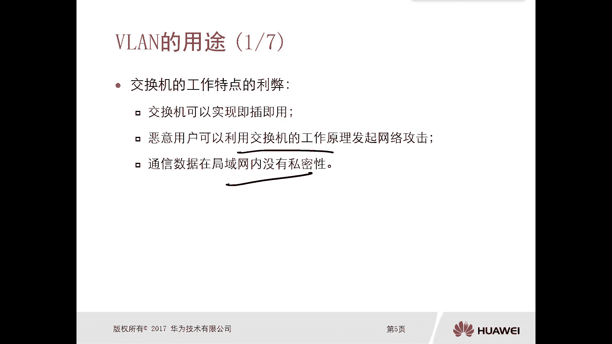

## 交换网络的工作特点与弊端

上一节我们回顾了交换机的基本工作原理。本节中我们来看看这种工作方式可能带来的问题。交换机可以实现即插即用，插电插网线即可转发数据。但这种便利性也伴随着一些固有的弊端。

以下是交换机工作特点可能引发的三个主要问题：

1.  **恶意用户攻击**：恶意用户可以利用交换机的工作原理发起网络攻击。交换机主要依靠形成MAC地址表并进行转发。初始阶段存在ARP泛洪或未知单播泛洪。当MAC地址表项填满后，攻击者可能通过伪造大量MAC地址，导致交换机进行泛洪，从而窃听其他用户的数据。
2.  **通信缺乏私密性**：在缺省情况下，所有连接到同一台交换机的终端都处于同一个广播域内。这意味着，任何一个用户发送的广播数据（如ARP请求），都会被同一广播域内的所有其他用户收到，导致部门间的通信没有隔离和私密性。
3.  **资源分配不灵活**：这主要体现在两种场景中：
    *   **不同部门终端处于同一广播域**：当工程部、市场部、财务部等不同部门的终端连接到同一台交换机时，由于处于同一广播域，部门间广播流量会相互干扰，且存在安全风险。
    *   **同一部门终端处于不同广播域**：当同一部门（如市场部）人员众多或地理位置分散，其终端可能连接到不同的交换机，从而处于不同的广播域。这导致部门内部通信反而需要通过路由器进行三层转发，增加了复杂性和配置负担。

## VLAN技术简介 🛠️

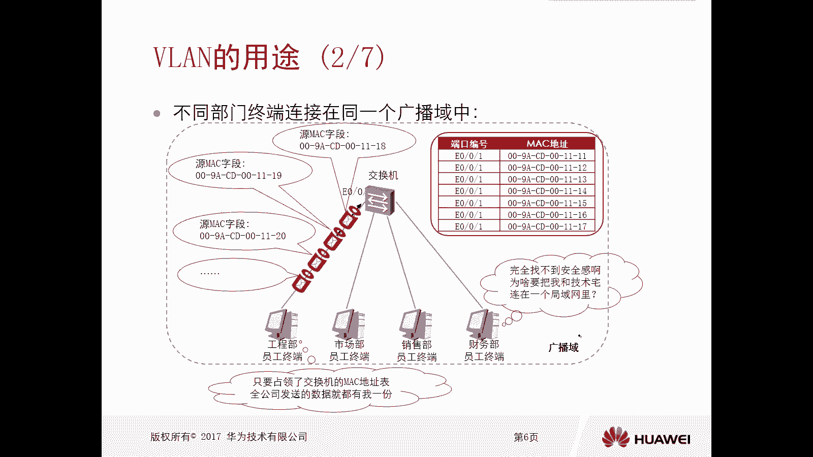

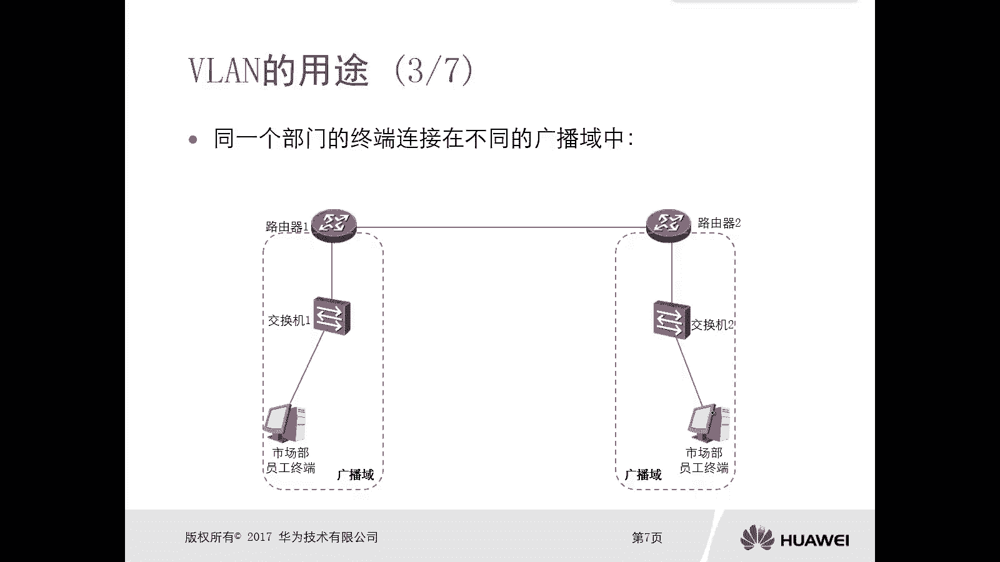

为了解决上述问题，我们引入了VLAN技术。VLAN是一种通过逻辑手段重新分配物理网络资源的虚拟化技术。

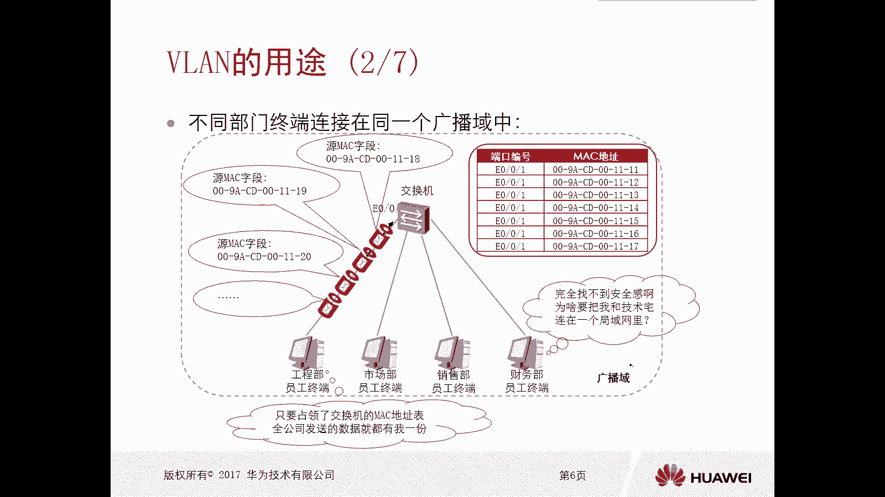

其核心思想是：**将一台物理交换机在逻辑上划分成多个虚拟的交换机**。每个VLAN形成一个独立的广播域。属于同一VLAN的设备可以直接在二层通信，而不同VLAN之间的设备在二层是隔离的，必须通过三层设备（如路由器）才能通信。

默认情况下，华为交换机的所有端口都属于VLAN 1。通过配置，我们可以将端口划分到不同的VLAN中。例如，将端口1和2划入VLAN 10，将端口3和4划入VLAN 20。这样，VLAN 10和VLAN 20就是两个独立的广播域。

**VLAN的跨设备实现**：VLAN的优势在于它可以跨越多台物理交换机。例如，交换机A的端口1（VLAN 10）和交换机B的端口3（VLAN 10）属于同一个广播域，尽管它们连接在不同的物理设备上。

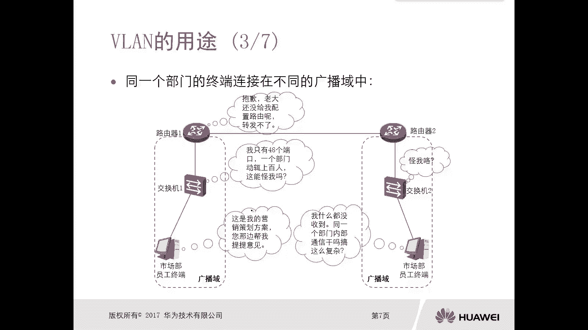

## VLAN如何解决传统网络问题 ✅

现在，让我们看看VLAN如何具体解决之前提到的问题。

1.  **解决不同部门同处一广播域的问题**：我们可以为每个部门创建独立的VLAN（如工程部-VLAN 10，市场部-VLAN 20，财务部-VLAN 30）。这样，各部门的广播流量被限制在本VLAN内，实现了逻辑隔离，提升了安全性和私密性。
2.  **解决同一部门处于不同广播域的问题**：对于分散在不同交换机上的同一部门成员，只需将他们连接的端口都划分到同一个VLAN中（如市场部都用VLAN 20）。这样，他们虽然在物理上连接不同设备，但在逻辑上仍处于同一个广播域，可以直接进行二层通信。
3.  **抑制广播/未知单播泛洪，提升网络性能**：通过划分VLAN，我们将一个大的广播域分割为多个小的广播域。广播和未知单播帧的泛洪范围被严格限制在单个VLAN内，大大减少了不必要的网络流量，节约了带宽和设备资源，从而提升了整体网络的通信效率。

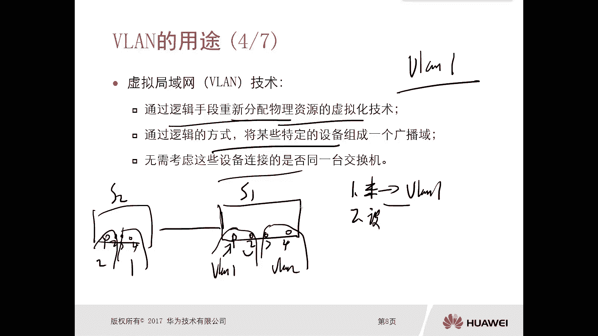

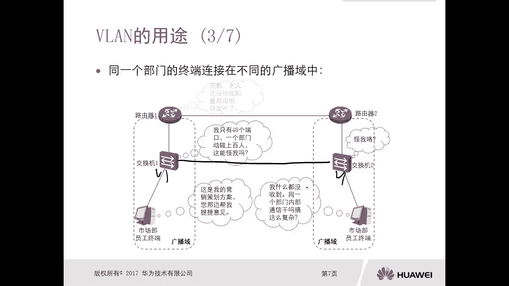

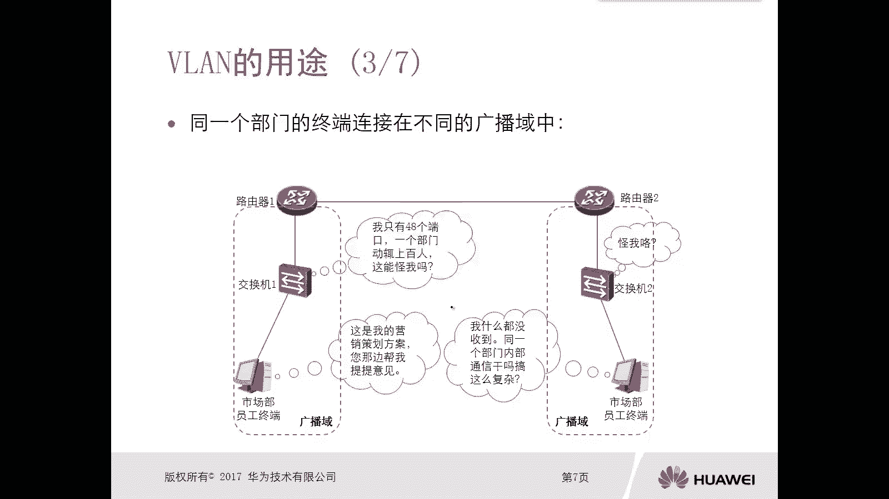

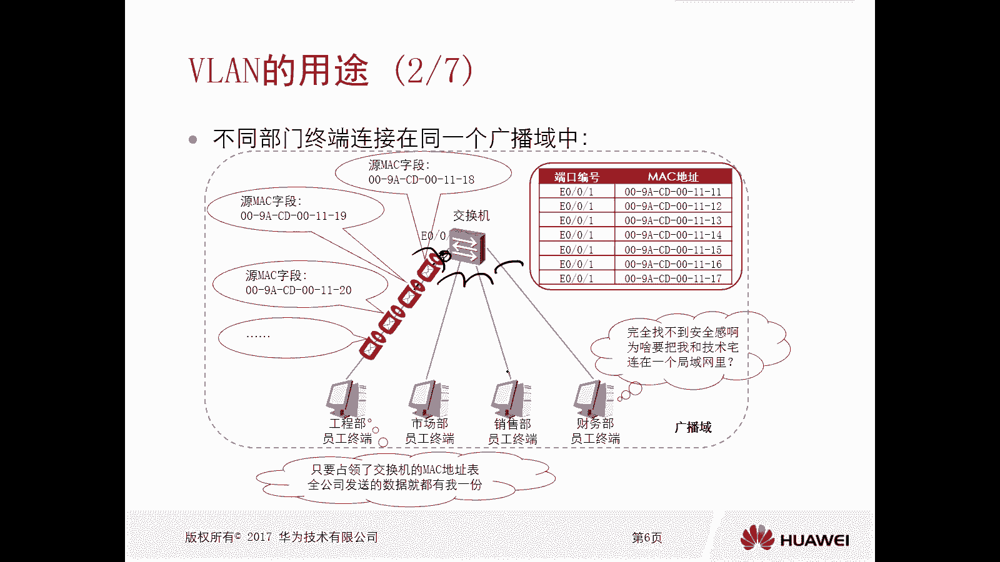

## VLAN的技术特点 📋

了解了VLAN的用途后，我们总结一下它的几个关键特点：

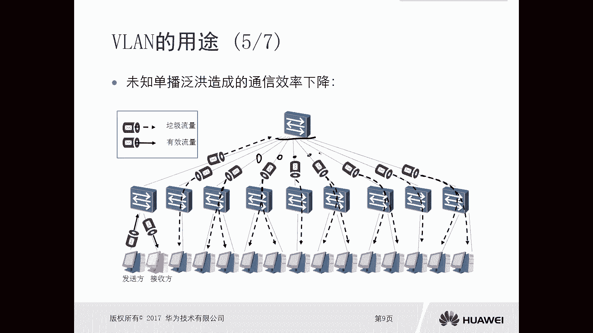

*   **终端与VLAN的关系**：一台网络终端设备（如PC）通常只能属于一个VLAN。一个VLAN内可以包含多个终端设备。
*   **同一VLAN内的通信**：属于同一个VLAN的设备之间，可以直接在数据链路层（二层）进行通信，依据MAC地址表进行转发。
*   **不同VLAN间的通信**：属于不同VLAN的设备之间，在数据链路层是相互隔离的，无法直接通信。它们之间的通信必须依赖网络层（三层）的路由功能来实现。这通常需要通过路由器或三层交换机。

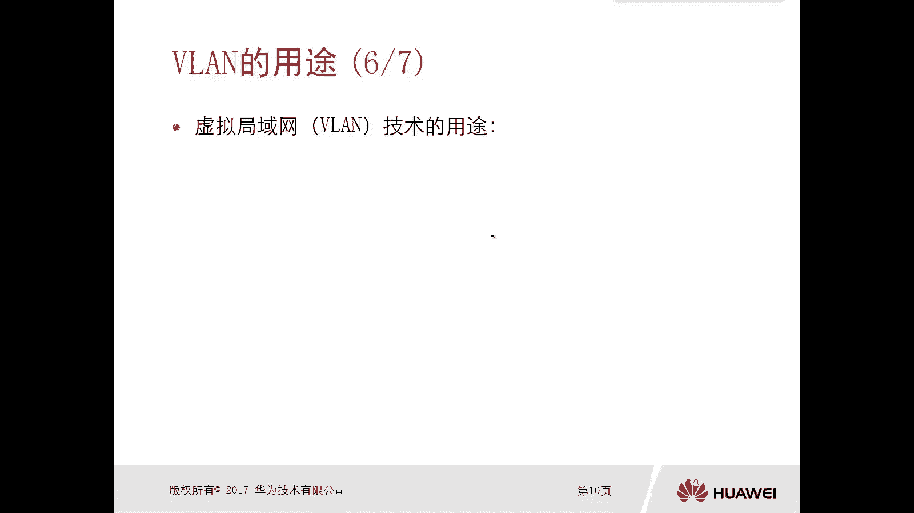

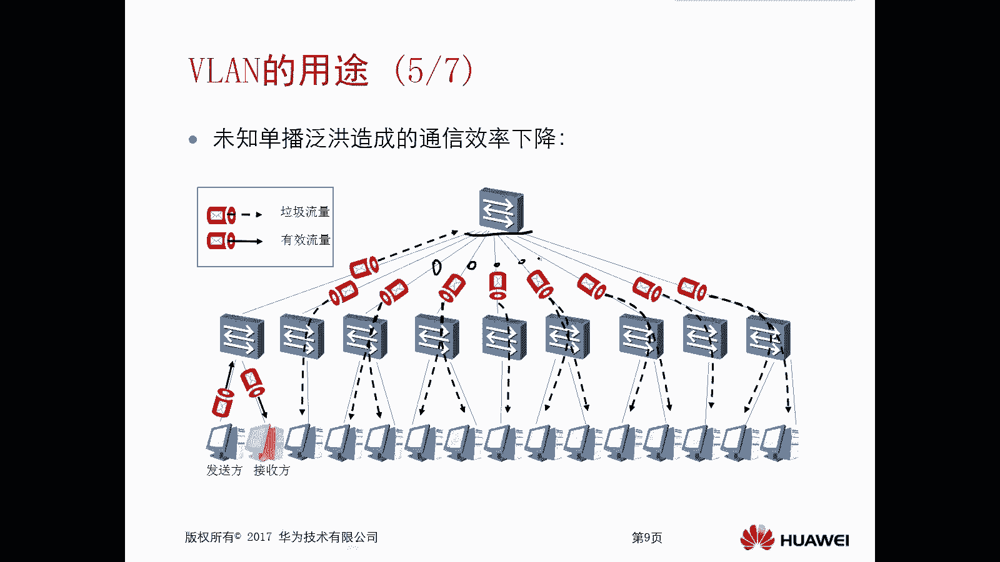

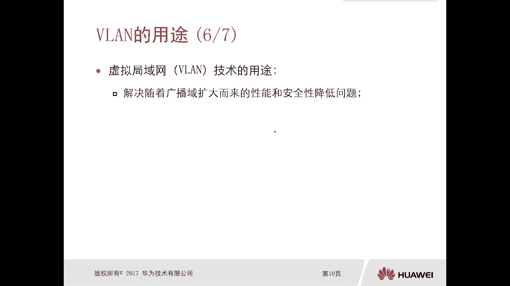

**公式/概念强调**：
*   **同一VLAN = 同一广播域 = 可直接二层通信**
*   **不同VLAN = 不同广播域 = 需通过三层路由通信**

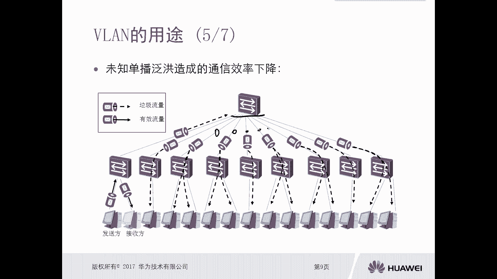

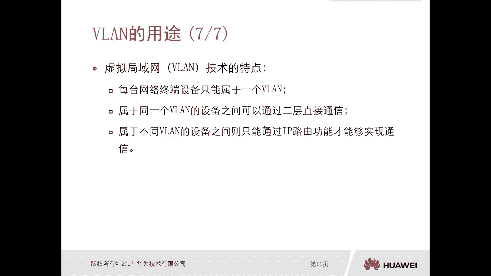

## 总结

本节课中我们一起学习了VLAN（虚拟局域网）的核心用途。我们从传统交换网络存在的广播域过大、安全性低、部署不灵活等问题入手，深入探讨了VLAN技术如何通过逻辑划分广播域来解决这些问题。关键点在于，VLAN能够将物理网络资源虚拟化，实现不同用户组之间的隔离与灵活组网，从而提升网络的安全性、可管理性和性能。记住，VLAN是构建现代企业网络的基础技术之一。