# 华为认证ICT学院HCIA/HCIP-Datacom教程：第2册：第2章：VLAN的原理 🔬

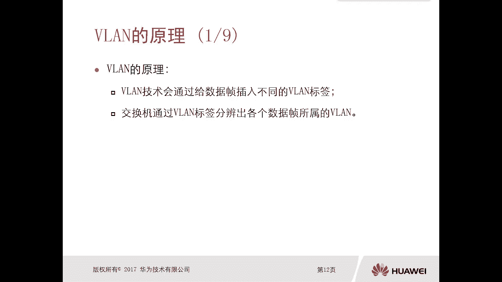

在本节课中，我们将要学习VLAN（虚拟局域网）的工作原理。上一节我们介绍了VLAN的用途，本节中我们来看看VLAN是如何通过技术手段实现广播域隔离的。

## VLAN的工作原理概述

VLAN技术通过给数据帧插入不同的VLAN标签来工作。一个终端只能属于一个VLAN。从终端接口接收到的数据帧，会被打上该接口所属VLAN的标记，即VLAN标签。交换机通过识别这个标签，来判断数据帧属于哪个VLAN，并决定如何将其转发出去。

## VLAN标签的格式与作用

上一节我们介绍了VLAN通过标签工作，本节中我们来看看这个标签具体长什么样。首先，没有携带标签的数据帧是一个标准的以太网帧，包含目的MAC地址、源MAC地址、类型、数据和FCS字段。当PC发出数据帧时，它本身没有VLAN标签。

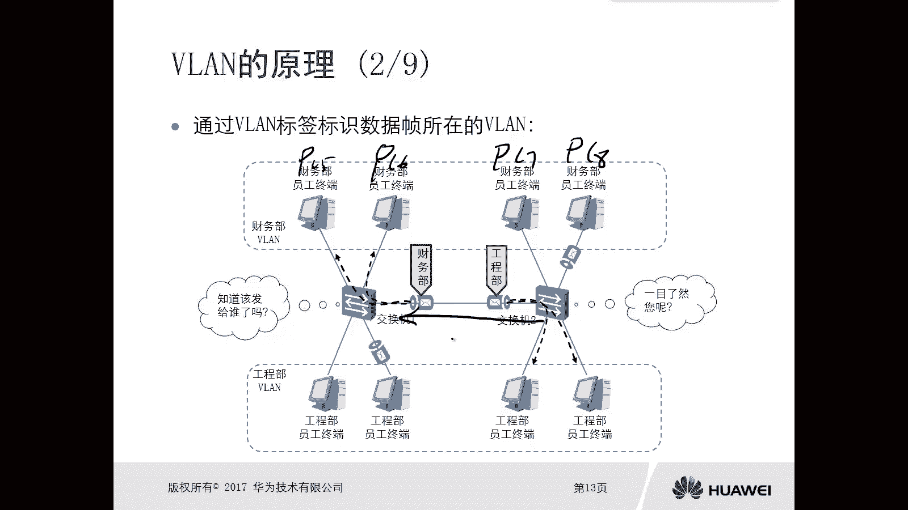

交换机处理数据帧时，会为其打上VLAN标签。携带了VLAN标签的数据帧，是在源MAC地址和类型字段之间插入了一个标签字段。

以下是标签字段的组成部分：

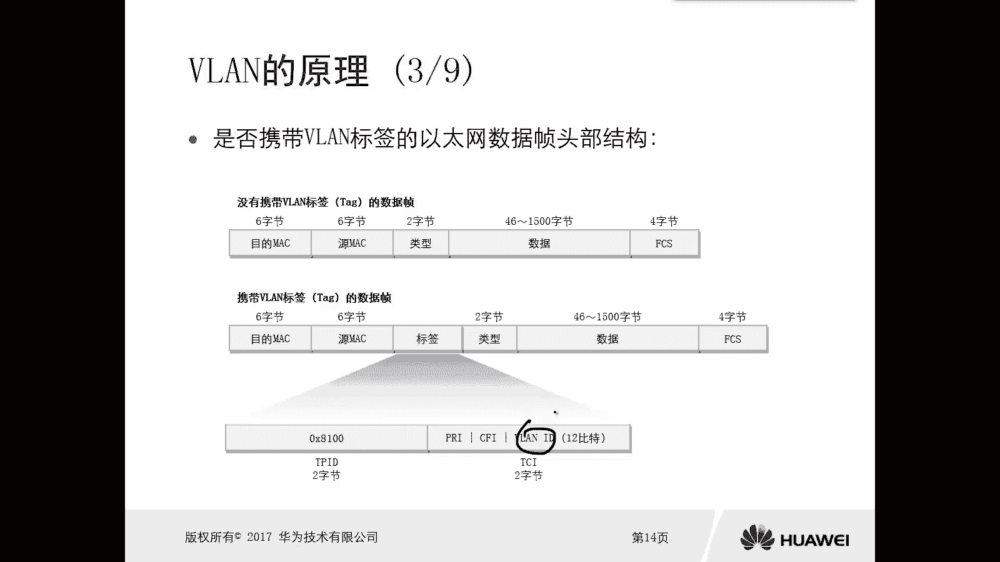

*   **TPID**：标签协议标识符，固定为`0x8100`，表示这是一个802.1Q标准的VLAN标签。
*   **TCI**：标签控制信息，包含以下子字段：
    *   **PRI**：优先级，与QoS（服务质量）相关。
    *   **CFI**：规范格式指示器，长度1比特。
    *   **VID**：VLAN标识符，长度12比特，取值范围为`1~4094`，用于区分数据帧属于哪个VLAN。

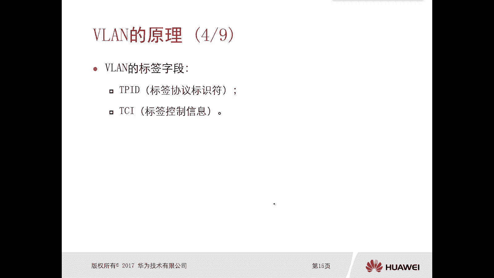

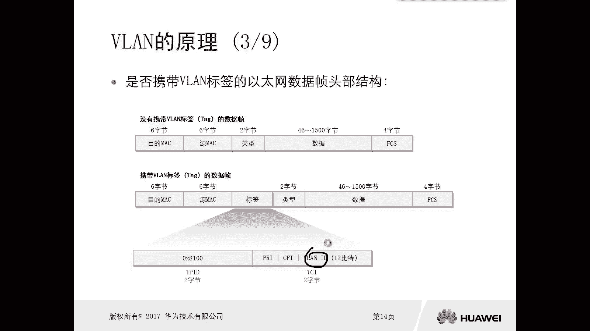

交换机正是通过读取数据帧中的VID字段，来识别其所属的VLAN。

## 多VLAN环境下交换机的工作机制

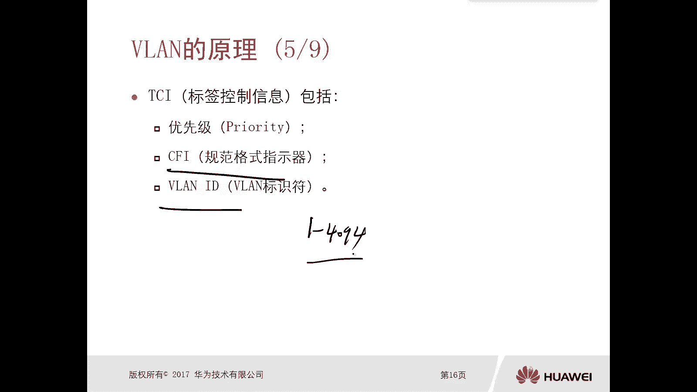

在配置了多个VLAN的网络中，交换机的工作机制与之前有所不同。以下是其核心转发原则：

*   **广播帧处理**：交换机收到广播数据帧时，只会将该数据帧从除了入站端口之外，其他**同VLAN**的所有端口发送出去。这实现了广播域在VLAN内的隔离。
*   **未知单播帧处理**：交换机收到目的MAC地址不在其MAC地址表中的单播数据帧（即未知单播帧）时，会将其从除了入站端口之外，其他**同VLAN**的端口发送出去。

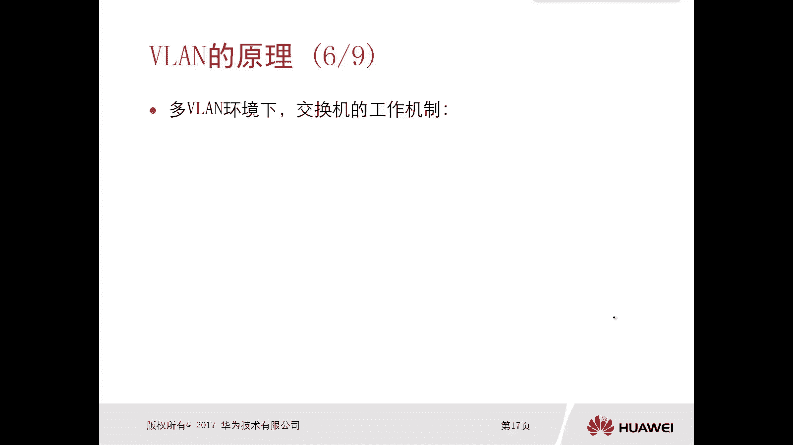

通过以上机制，VLAN技术有效地将一个大广播域分割成多个小的广播域。

## VLAN隔离广播域的具体做法

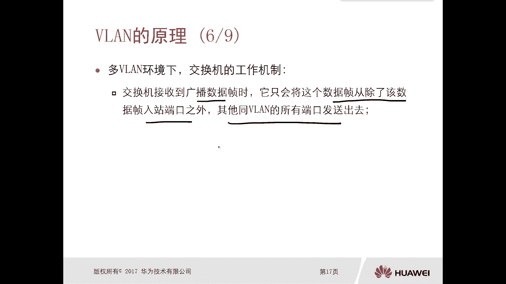

VLAN隔离广播域的具体做法是在交换机上创建不同的VLAN，并将连接不同部门终端的端口划分到对应的VLAN中。

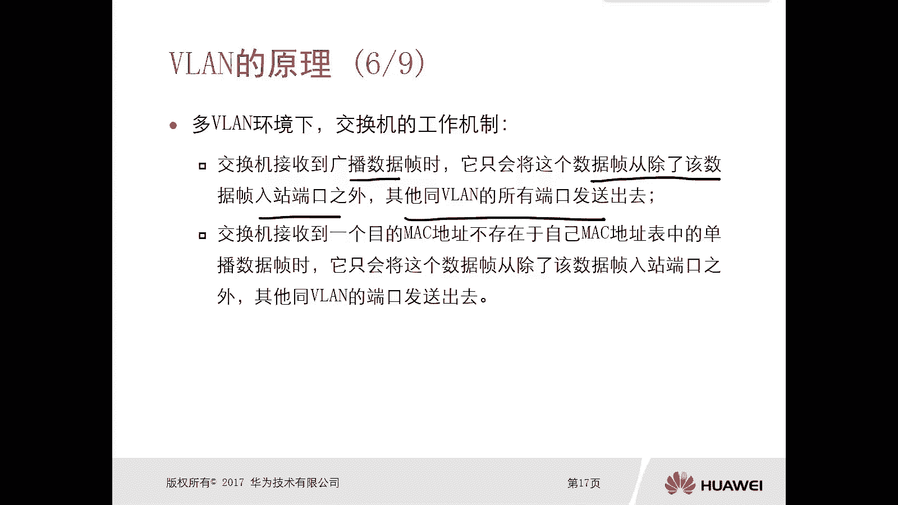

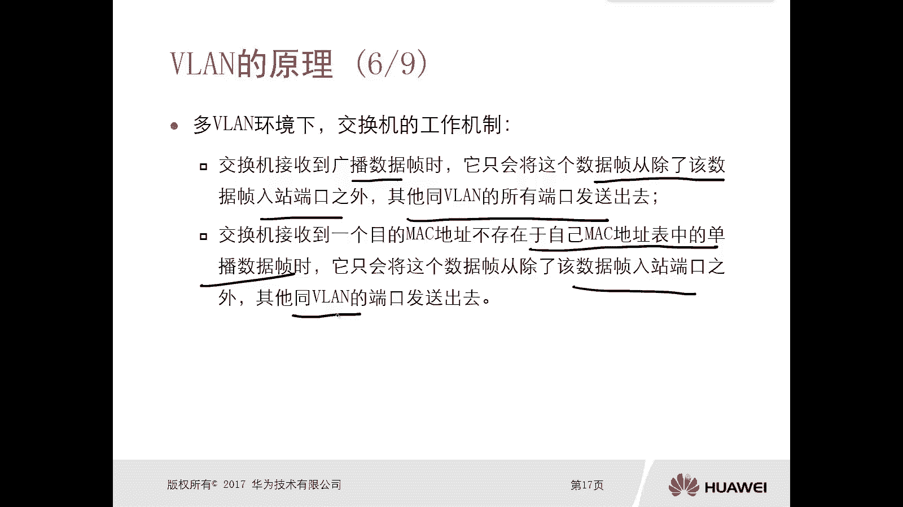

例如，一个交换机连接了四台PC（PC1-PC4）。我们可以进行如下配置：
1.  创建VLAN 10（财务部）和VLAN 20（工程部）。
2.  将连接PC1、PC2、PC3的端口划入VLAN 10。
3.  将连接PC4的端口划入VLAN 20。

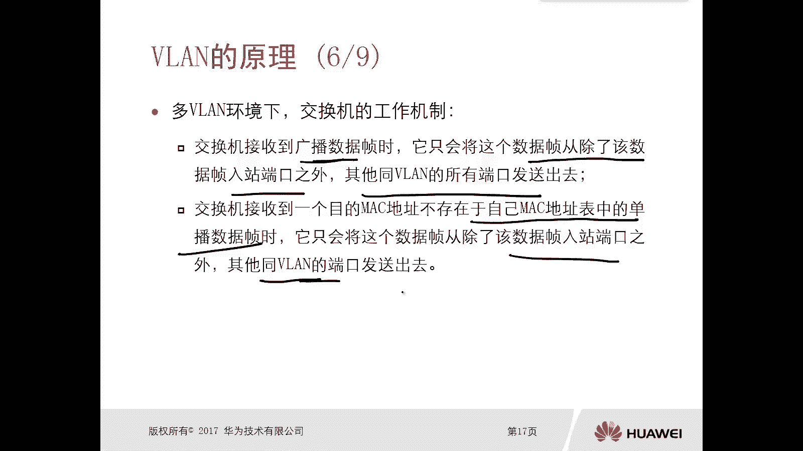

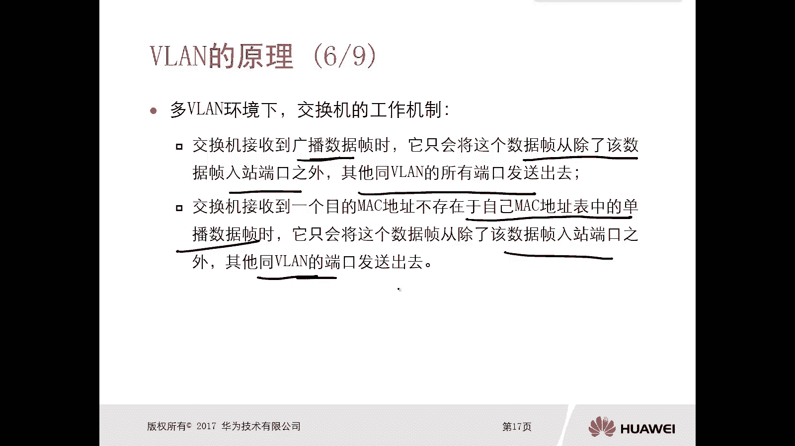

这样，PC1、PC2、PC3属于同一个广播域（VLAN 10），PC4属于另一个广播域（VLAN 20）。当PC1发送广播帧时，该帧只会泛洪给PC2和PC3，而不会到达PC4，从而实现了广播域的隔离。

## 未知单播帧在VLAN环境下的转发

在VLAN环境下，未知单播帧的泛洪范围也被限制在同VLAN内。

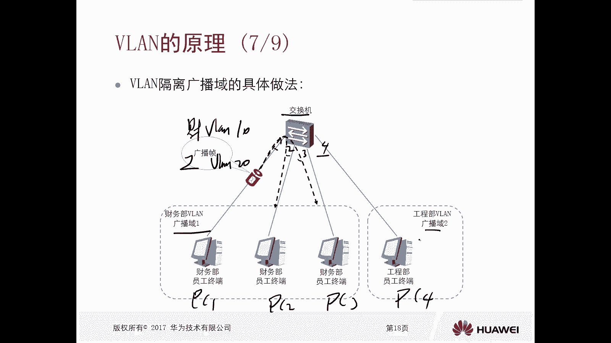

假设交换机三个端口分别连接PC1、PC2、PC3。其中，端口1（PC1）和端口2（PC2）属于VLAN 100，端口3（PC3）属于VLAN 101。交换机MAC地址表中目前只有PC1的MAC记录。

当PC1要发送一个目的MAC为PC2（但交换机尚未学习到）的数据帧时，交换机会查找MAC表，发现没有对应条目，因此将其视为未知单播帧进行泛洪。由于该帧从属于VLAN 100的端口1进入，因此交换机只会将其从同样属于VLAN 100的端口2转发出去，而不会从属于VLAN 101的端口3转发。这进一步减少了不必要的网络流量。

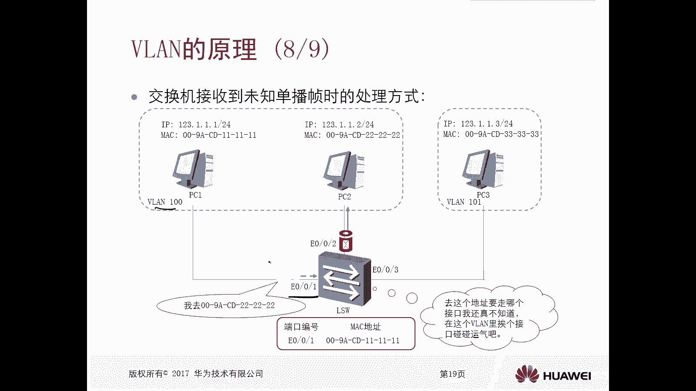

## 原理总结

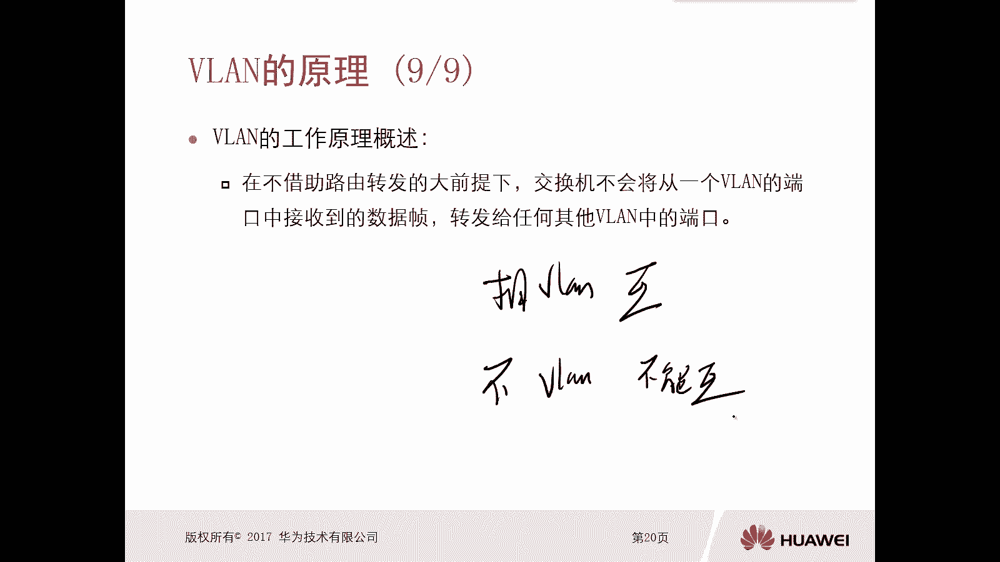

本节课中我们一起学习了VLAN的工作原理。其核心可以概括为：在不借助三层路由转发的前提下，交换机不会将一个VLAN中收到的数据帧，转发到任何其他VLAN的端口。这意味着，相同VLAN内的设备可以相互通信，而不同VLAN间的设备在二层是被隔离的。这一切都是通过为数据帧添加和识别VLAN标签来实现的。