# 华为认证ICT学院HCIA/HCIP-Datacom教程：P24：第2册-第2章-3-跨交换机的VLAN原理及实验 🧑‍💻

在本节课中，我们将要学习跨交换机的VLAN通信原理。我们将了解交换机端口的不同类型及其工作方式，并通过一个实验来演示如何配置以实现跨交换机的VLAN通信。

## 概述 📖

VLAN技术可以将一个物理局域网在逻辑上划分为多个广播域。当网络中存在多台交换机时，需要一种机制让属于同一VLAN的设备跨交换机通信，同时隔离不同VLAN的流量。本节将介绍实现这一目标的核心概念：PVID、Access端口和Trunk端口。

## PVID：端口默认VLAN ID 🔑

每个交换机的接口都有一个PVID（Port VLAN ID）。它的作用是：当接口收到一个不带VLAN标签（untagged）的数据帧时，交换机会根据该接口的PVID值，为数据帧打上对应的VLAN标签。

**公式/概念**：
*   **PVID**：端口的默认VLAN ID。管理员可配置，缺省值为1。

在交换机未做任何配置时，所有端口的PVID都是1。因此，从任何端口收到的无标签帧都会被标记为VLAN 1，这也是为什么默认情况下所有端口都属于VLAN 1。

## 端口类型与链路类型 🔌

在包含多台交换机和终端设备的网络中，端口和链路根据其连接对象被划分为不同类型。

以下是两种主要的端口类型及其对应的链路：

*   **Access端口 / Access链路**：通常用于连接终端设备（如PC、打印机）。这类端口的特点是连接单一VLAN的设备。
*   **Trunk端口 / Trunk链路**：用于交换机与交换机之间的互联。这类端口可以承载多个VLAN的流量。

（注：还有一种Hybrid端口类型，将在后续章节讲解。）

## Access端口工作特点 📥➡️📤

理解端口的工作方式，需要从两个方向分析：**接收数据**和**发送数据**。

以下是Access端口在两个方向上的处理规则：

1.  **接收数据（入方向）**：当从Access端口收到一个无标签的数据帧时，交换机会为其打上该端口PVID（即端口所属VLAN）的标签。
2.  **发送数据（出方向）**：当需要从一个Access端口向外发送数据帧时，交换机会移除该数据帧的VLAN标签，将其变为无标签帧再发出。

这样能确保终端设备发送和接收的都是普通的以太网帧，无需理解VLAN标签。

## Trunk端口工作特点 🌉

同样，我们从接收和发送两个方向来分析Trunk端口。

以下是Trunk端口在两个方向上的处理规则：

1.  **接收数据（入方向）**：保留接收到的数据帧原有的VLAN标签。
2.  **发送数据（出方向）**：保留数据帧的VLAN标签并发送出去，以便对端交换机识别流量所属的VLAN。

**例外情况**：当交换机需要从Trunk端口发送一个数据帧，且该数据帧的VLAN ID与此Trunk端口的PVID值**相同**时，交换机会**移除**VLAN标签后再发送。

相应地，如果Trunk端口收到一个无标签帧，它会为其打上本端口PVID的标签。

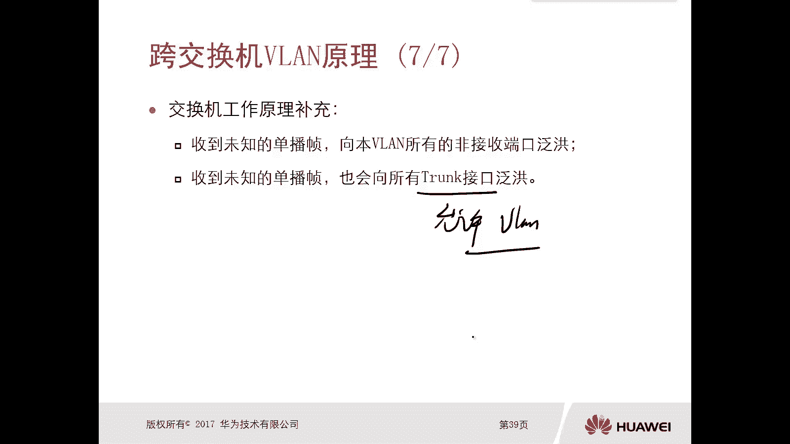

## 跨交换机VLAN通信流程详解 🔄

上一节我们介绍了端口的基本工作原理，本节中我们通过一个具体场景，来看一看数据帧是如何跨交换机传递的。

假设网络中有两台交换机（SW1, SW2）。PC1和PC3属于VLAN 10，通过Access端口连接。SW1与SW2之间通过Trunk链路互联，且该Trunk允许VLAN 10通过。

以下是PC1发送数据给PC3的完整流程：

1.  PC1发送一个无标签的以太网帧给SW1。
2.  SW1的Access端口（连接PC1）收到帧后，为其打上VLAN 10的标签。
3.  SW1查询MAC地址表，决定通过Trunk端口转发此帧。
4.  由于Trunk端口允许VLAN 10通过，且帧的VLAN标签（10）与Trunk端口的PVID（假设为1）不同，SW1会保留VLAN 10的标签，将帧从Trunk端口发出。
5.  SW2的Trunk端口收到带VLAN 10标签的帧，并检查允许列表。由于允许VLAN 10，故接收该帧。
6.  SW2查询MAC地址表，发现需要将帧转发给连接PC3的Access端口。
7.  SW2从该Access端口发送帧前，会移除VLAN 10的标签。
8.  PC3最终收到一个无标签的普通以太网帧，通信完成。

**补充：未知单播帧泛洪**：交换机收到目的MAC地址不在其MAC地址表中的单播帧（未知单播帧）时，会向该VLAN内所有端口泛洪，**包括允许该VLAN通过的Trunk端口**。

## 实验：配置跨交换机VLAN通信 🧪

理解了原理之后，我们通过一个实验来巩固所学知识。实验目标是实现：同一VLAN内的设备可以跨交换机通信，不同VLAN间的设备相互隔离。

### 实验拓扑与规划

实验使用两台交换机（SW1， SW2）和四台PC。
*   **VLAN 10**：包含 PC1 (192.168.10.1/24) 和 PC3 (192.168.10.3/24)。
*   **VLAN 20**：包含 PC2 (192.168.20.2/24) 和 PC4 (192.168.20.4/24)。
*   PC与交换机之间的链路配置为Access。
*   交换机之间的链路（G0/0/10）配置为Trunk，并允许VLAN 10和20通过。

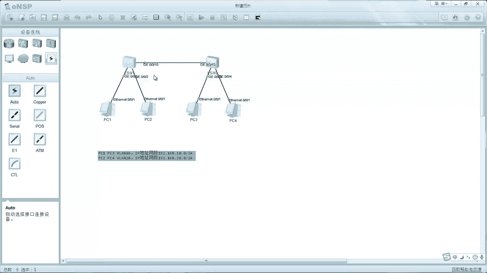

### 配置步骤

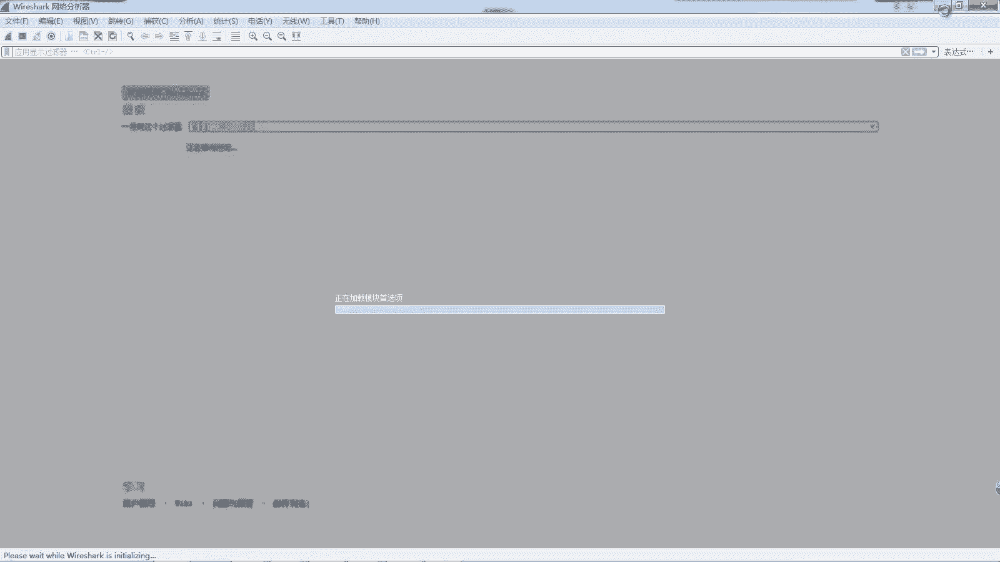

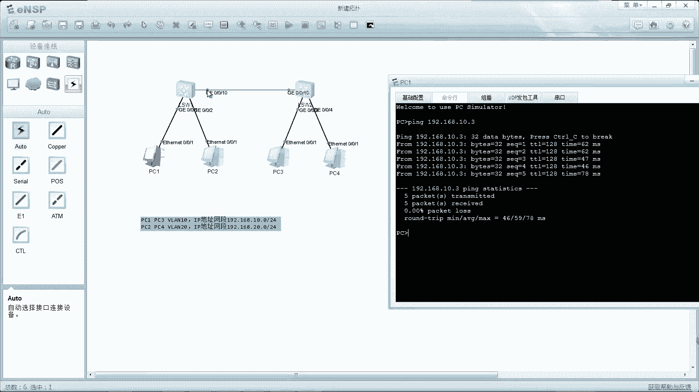

以下是具体的配置命令。

**第一步：配置终端IP地址**
为PC1-PC4配置上述规划的IP地址。

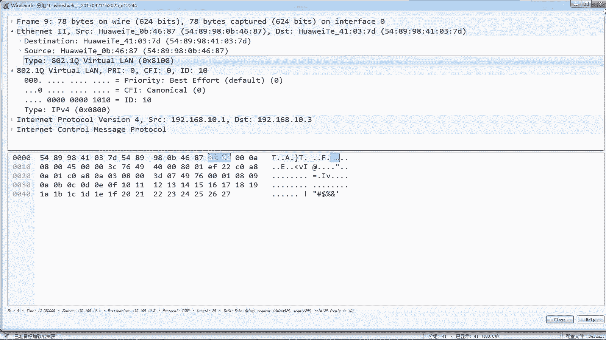

**第二步：在交换机上创建VLAN**
在SW1和SW2上分别创建VLAN 10和20。
```bash
[SW1] vlan batch 10 20
```

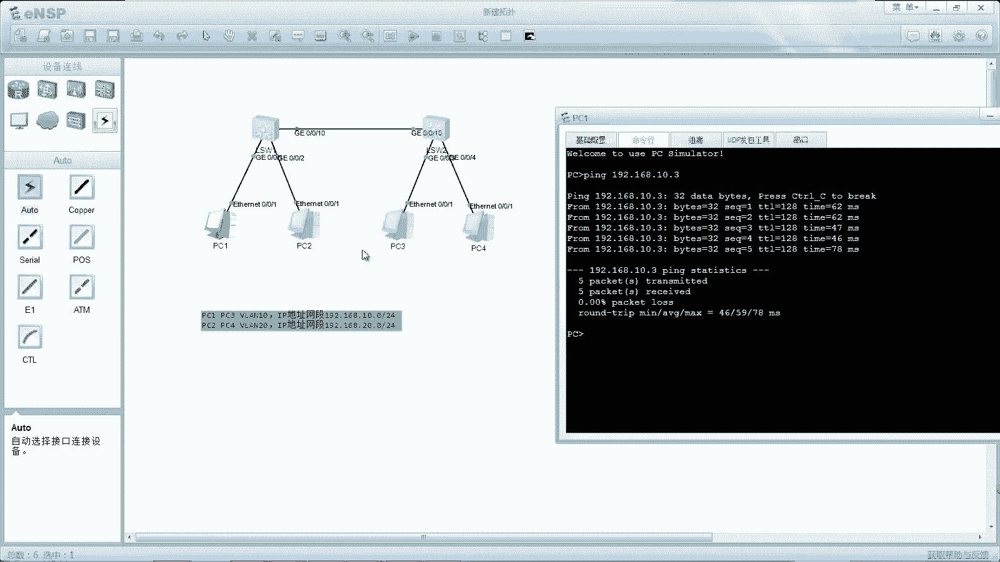

**第三步：配置Access端口**
将连接PC的端口类型改为Access，并划分到对应的VLAN。
以SW1的G0/0/1（连接PC1）和G0/0/2（连接PC2）为例：
```bash
[SW1] interface GigabitEthernet 0/0/1
[SW1-GigabitEthernet0/0/1] port link-type access
[SW1-GigabitEthernet0/0/1] port default vlan 10
[SW1-GigabitEthernet0/0/1] quit

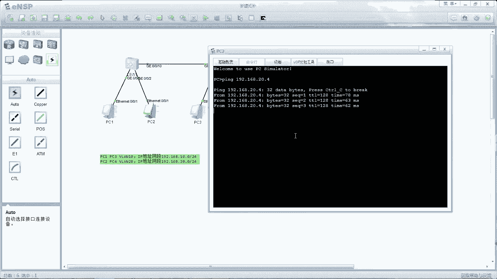

[SW1] interface GigabitEthernet 0/0/2
[SW1-GigabitEthernet0/0/2] port link-type access
[SW1-GigabitEthernet0/0/2] port default vlan 20
```
在SW2上对G0/0/3（连接PC3）和G0/0/4（连接PC4）进行类似配置。

**第四步：配置Trunk端口**
配置交换机互联的端口为Trunk类型，并允许VLAN 10和20通过。
在SW1和SW2的G0/0/10口上执行：
```bash
[SW1] interface GigabitEthernet 0/0/10
[SW1-GigabitEthernet0/0/10] port link-type trunk
[SW1-GigabitEthernet0/0/10] port trunk allow-pass vlan 10 20
```

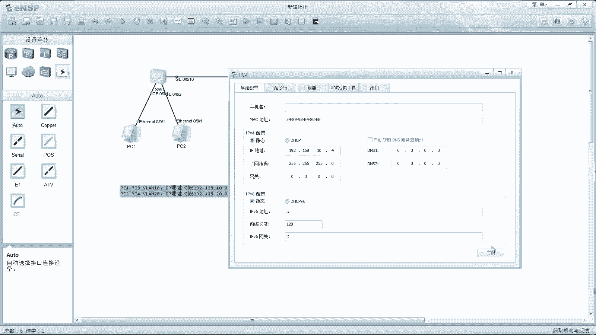

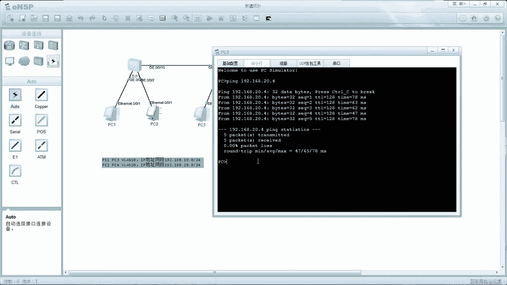

### 验证与测试

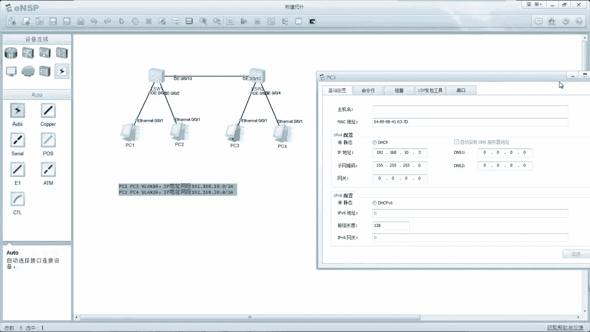

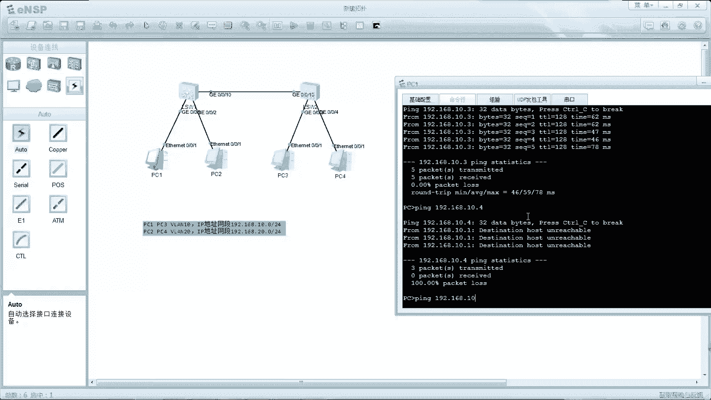

1.  **连通性测试**：PC1应能`ping`通PC3（同VLAN），但不能`ping`通PC2或PC4（不同VLAN）。
2.  **抓包验证**：在SW1与SW2之间的Trunk链路上抓包，可以观察到数据帧中携带的802.1Q VLAN标签（例如VLAN 10或20），而在PC连接的Access链路上，数据帧则没有标签。
3.  **修改测试**：将PC2的IP改为192.168.10.2/24（与PC1同网段），但因其属于VLAN 20，PC1依然无法`ping`通PC2。若将SW1上连接PC2的端口也加入VLAN 10，则PC1与PC2可以互通。这证明了VLAN的隔离是基于二层标签，而非IP地址。

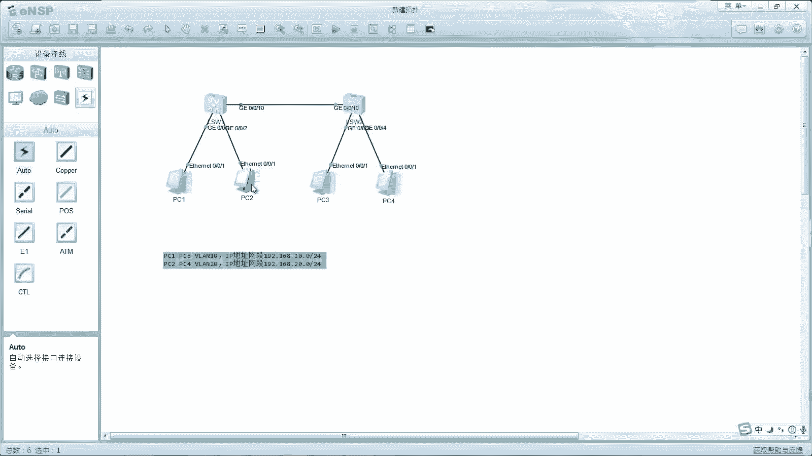

## 总结 🎯

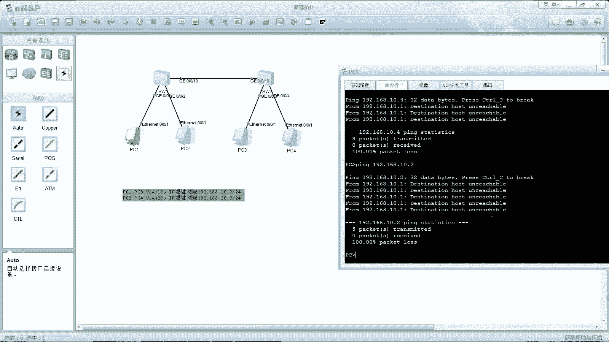

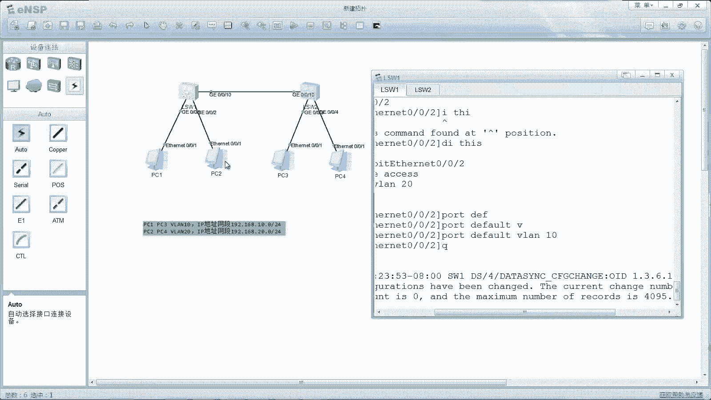

本节课中我们一起学习了跨交换机VLAN通信的核心知识。

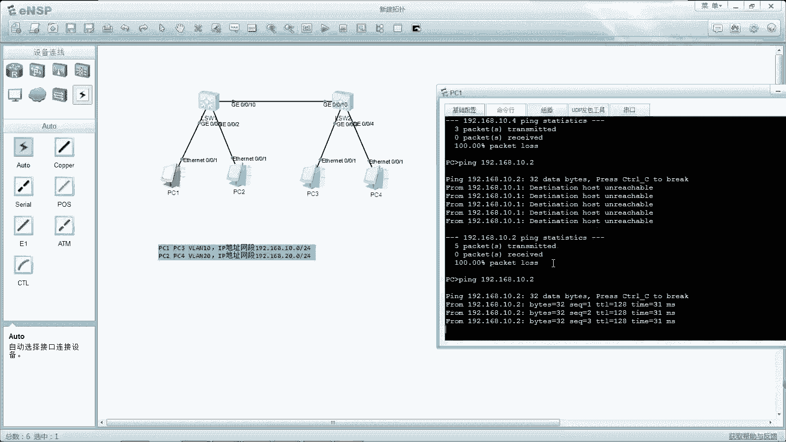

我们首先认识了**PVID**的概念，它是端口处理无标签帧的基准。接着，我们详细分析了**Access端口**和**Trunk端口**在接收和发送数据时的不同行为，这是实现VLAN扩展的关键。最后，我们通过一个完整的实验，演示了如何配置交换机，使得同一VLAN内的用户能够跨越物理交换机进行通信，同时严格隔离了不同VLAN间的流量。

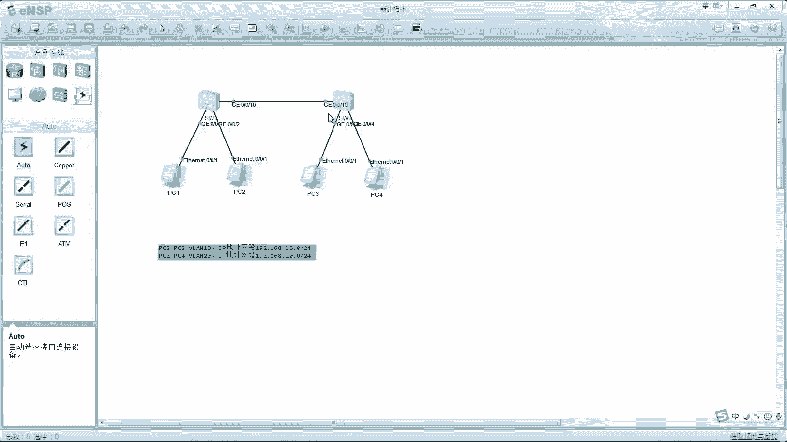


记住关键点：Access端口用于接终端，收发帧会打标/剥标；Trunk端口用于交换机互联，通常保留标签（PVID相同的例外）。