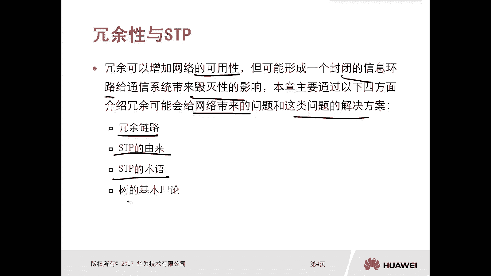
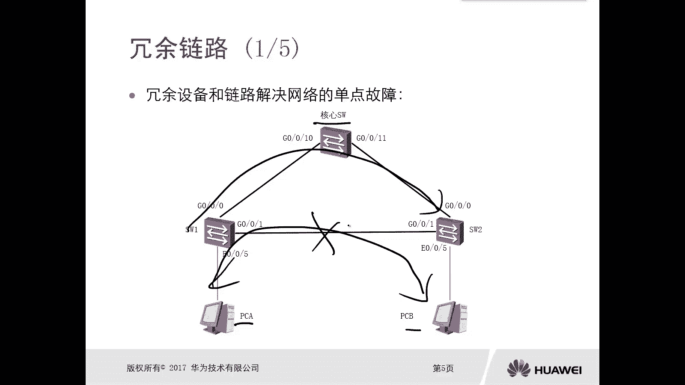
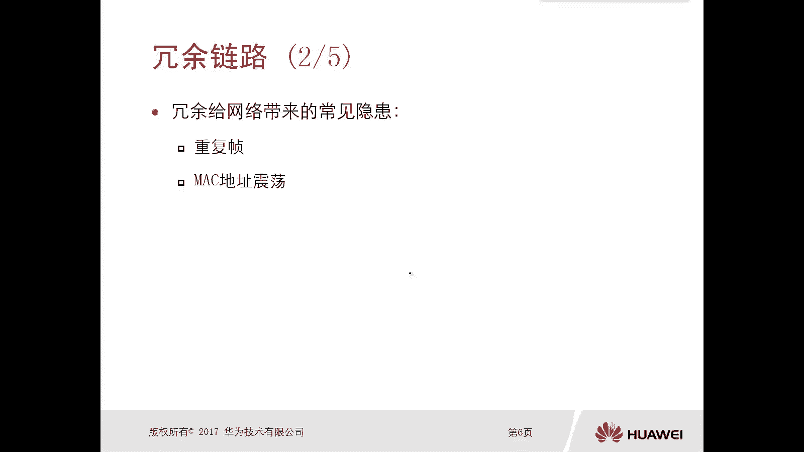
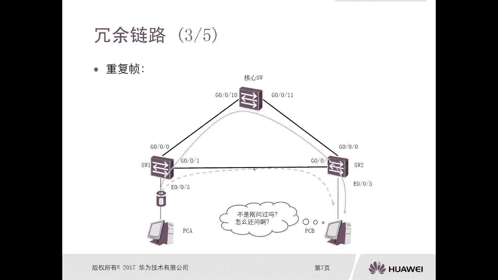
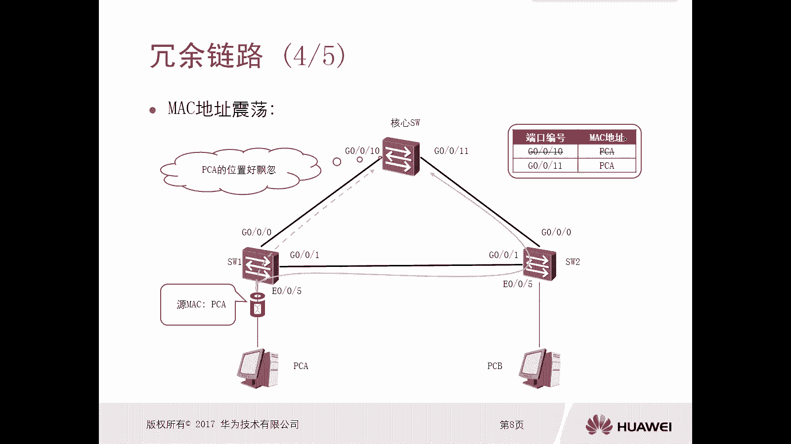
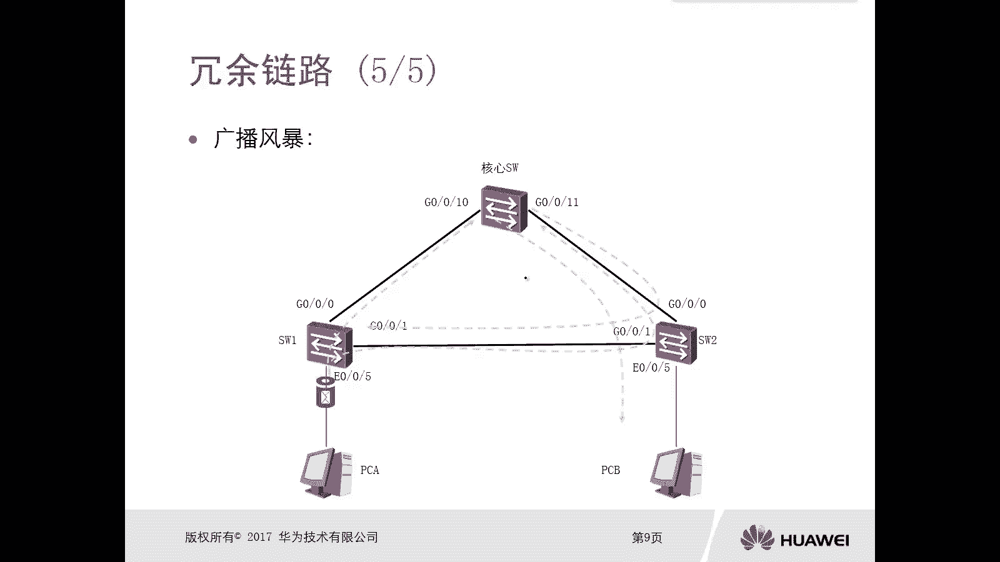
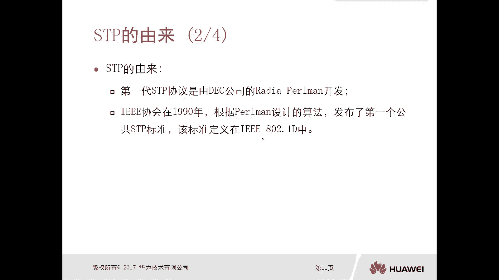
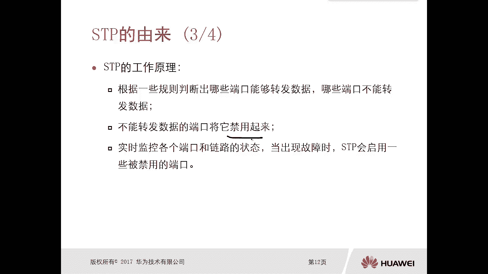
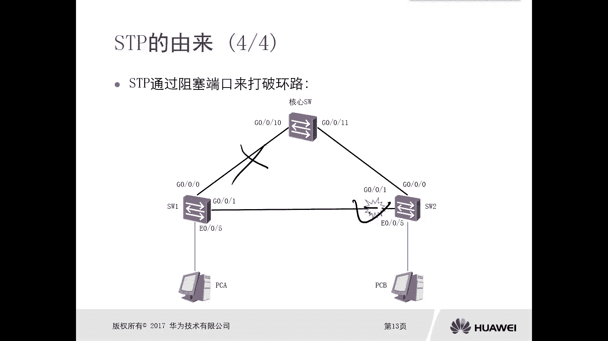

# 华为认证ICT学院HCIA/HCIP-Datacom教程：第2册-第3章-1：冗余性与STP的由来 🌐

在本节课中，我们将要学习网络冗余性的概念及其带来的问题，并了解生成树协议（STP）是如何被设计出来解决这些问题的。

## 冗余链路 🔗

上一节我们介绍了网络可靠性的重要性，本节中我们来看看为实现可靠性而引入的冗余链路和设备。冗余链路和设备主要用于解决网络中的单点故障问题。在网络部署时，通常会考虑使用多台设备或多条链路，以避免单一节点故障导致整个网络中断。

例如，在一个由三台交换机构成的网络中，设备之间通过多条链路互联。这种设计除了提供链路冗余，也提供了设备冗余。当主用路径出现故障时，流量可以自动切换到备用路径，从而保证通信不中断。

然而，过多的冗余链路和设备可能会给网络带来隐患。以下是几种常见的问题：

*   **重复帧**：在交换网络环境中，同一数据帧可能通过不同路径到达目的地，导致接收方收到多份相同的帧。
*   **MAC地址表震荡**：交换机的MAC地址表会记录端口与MAC地址的映射关系。当同一台主机的数据帧从不同端口进入交换机时，会导致其MAC地址对应的端口记录不断变化，造成地址表不稳定。
*   **广播风暴**：这是最严重的问题。广播帧（如ARP请求）在存在环路的网络中会被无限循环转发和复制，迅速耗尽网络带宽和设备CPU资源，最终导致网络瘫痪。

## STP的由来 🛡️

面对由冗余链路形成的环路所带来的问题，我们需要一种解决方案。这就是生成树协议（STP）。

STP的作用是在具备冗余链路的网络环境中实现两个目标：
1.  **在消除单点故障的同时，保证所有节点可达**。
2.  **打破网络中的逻辑环路，阻止广播帧的循环传播**，从而解决重复帧、MAC地址表震荡和广播风暴等问题。

STP协议最初由DEC公司的Radia Perlman开发。IEEE协会在1990年基于其算法，发布了第一个公共的生成树标准，即**IEEE 802.1D**。

## STP的工作原理 ⚙️

那么，STP是如何工作的呢？它的核心原理如下：

1.  **选举与阻塞**：STP通过一套规则（后续章节会详细讲解）在网络中选举出“树”的结构，并判断哪些端口可以转发数据，哪些端口需要被逻辑阻塞（Blocking）。
2.  **逻辑禁用**：被阻塞的端口只是逻辑上禁止转发数据帧，物理上仍然处于连接状态。这与直接关闭（Shutdown）端口不同。
3.  **故障监测与恢复**：STP会持续监控网络中的链路和端口状态。当正在转发数据的链路出现故障时，STP会重新计算，并激活之前被阻塞的备用端口，接管流量转发任务。

通过这种方式，STP既打破了网络环路，又能在主链路故障时利用备用链路实现冗余备份，达到了可靠性设计的最终目的。

## 总结 📚

本节课中我们一起学习了网络冗余性的双面性。冗余设计提高了网络的可靠性，但同时也可能形成环路，引发重复帧、MAC地址表震荡和广播风暴等问题。为了解决这些问题，诞生了生成树协议（STP）。STP通过逻辑阻塞特定端口来打破环路，并能在链路故障时激活备用路径，从而在保证网络无环的同时，实现了冗余备份的目标。