# 华为认证ICT学院HCIA/HCIP-Datacom教程：第2册-第3章-2：STP的工作流程 🌳

在本节课中，我们将要学习生成树协议（STP）的核心工作流程。STP通过一系列选举步骤，在存在物理环路的网络中构建一个逻辑上无环的树形拓扑，从而防止广播风暴并确保网络可靠性。我们将详细解析选举根网桥、根端口、指定端口以及阻塞预备端口的每一步。

## 概述：STP的四步工作流程

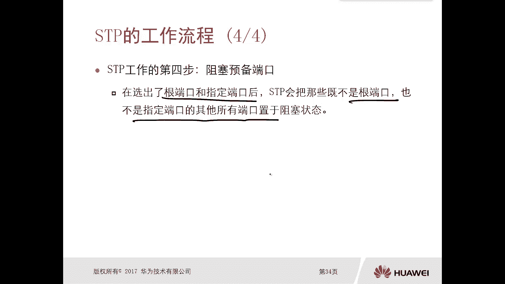

STP的工作流程可以归纳为四个关键步骤，其目标是打破逻辑环路。这四步依次是：选举根网桥、选举根端口、选举指定端口、阻塞预备端口。接下来，我们将逐一深入探讨。

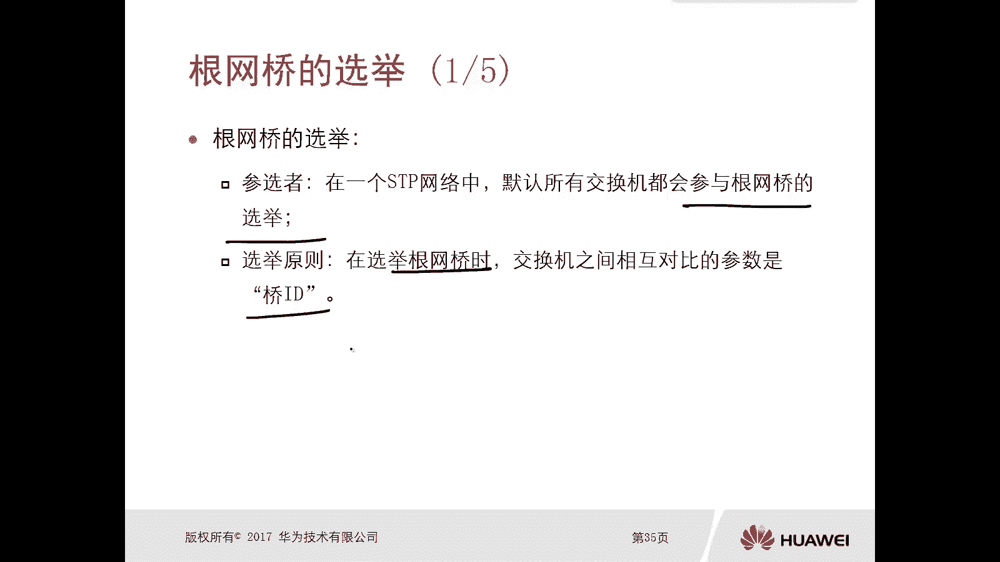

## 第一步：选举根网桥 🏆

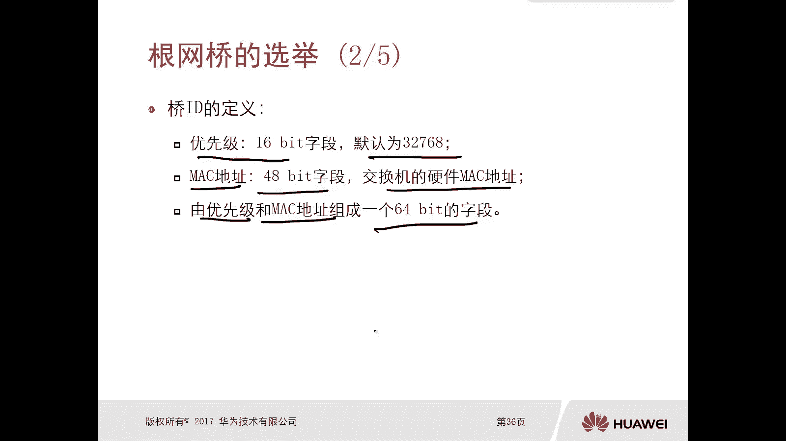

上一节我们介绍了STP的总体目标，本节中我们来看看它是如何开始的。STP工作的第一步是选举一个根网桥（也称为根交换机）。每个STP网络中有且仅有一台根网桥，它是整个生成树的逻辑根节点。

**选举范围**：整个交换网络。
**参选者**：网络内所有启用了STP的交换机。
**选举依据**：交换机通过比较**桥ID（Bridge ID, BID）** 来决定。桥ID数值最小的交换机将成为根网桥。

桥ID是一个64比特的字段，由两部分组成：
*   **优先级（16比特）**：默认值为32768，数值越小优先级越高。
*   **MAC地址（48比特）**：交换机的硬件地址，具有全球唯一性。

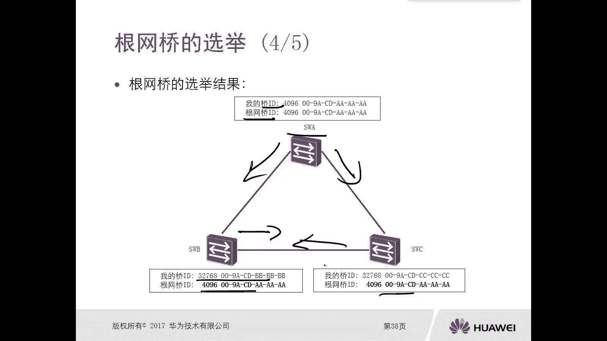

**选举原则公式**：
1.  首先比较**优先级**，数值小的胜出。
2.  如果优先级相同，则比较**MAC地址**，数值小的胜出。

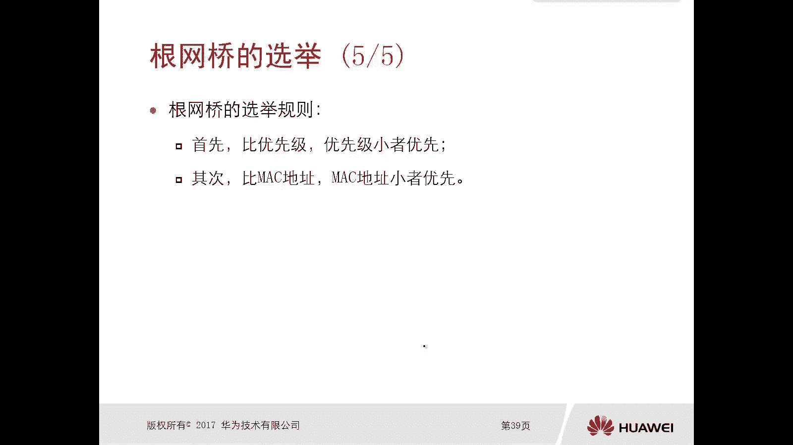

由于MAC地址唯一，最终一定能选举出一台根网桥。

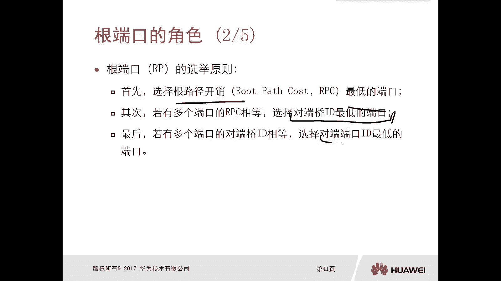

## 第二步：选举根端口 🔌

在确定了网络的“树根”（根网桥）之后，下一步是为“树枝”（非根交换机）确定朝向树根的最佳路径。这就是根端口选举的目的。

**选举范围**：每一台**非根交换机**上（根交换机没有根端口）。
**参选者**：该非根交换机上所有启用了STP的端口。
**选举原则**：选择“距离”根网桥最近的端口。这个“距离”由以下规则依次判定：

以下是根端口选举的三条核心规则：
1.  **比较根路径开销（Root Path Cost, RPC）**：选择累计RPC最小的端口。RPC是数据帧从该端口到达根网桥所经过的所有链路的路径开销总和。
2.  **比较对端桥ID（Sender BID）**：如果多个端口的RPC相等，则选择接收到的BPDU中“发送者BID”较小的那个端口所对应的本地端口。
3.  **比较对端端口ID（Sender Port ID）**：如果对端桥ID也相等，则选择接收到的BPDU中“发送者端口ID”较小的那个端口所对应的本地端口。

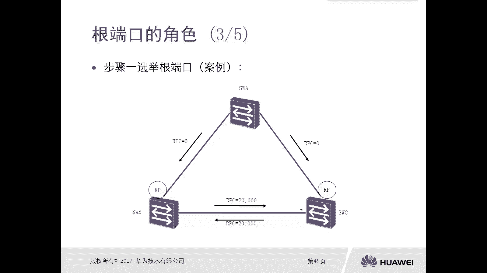

**关键点**：每台非根交换机上有且仅有一个根端口。

## 第三步：选举指定端口 🚦

为每个网段确定一个“负责人”，这个端口负责向该网段转发来自根方向的数据，并处理该网段发往根方向的数据。这个端口就是指定端口。

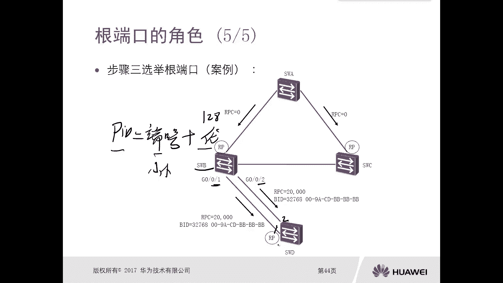

**选举范围**：每一个**网段**（或冲突域）。
**参选者**：该网段上连接的所有交换机端口（已被选为根端口的端口不参与）。
**选举原则**：选择该网段上“距离”根网桥最近的端口。判定规则如下：

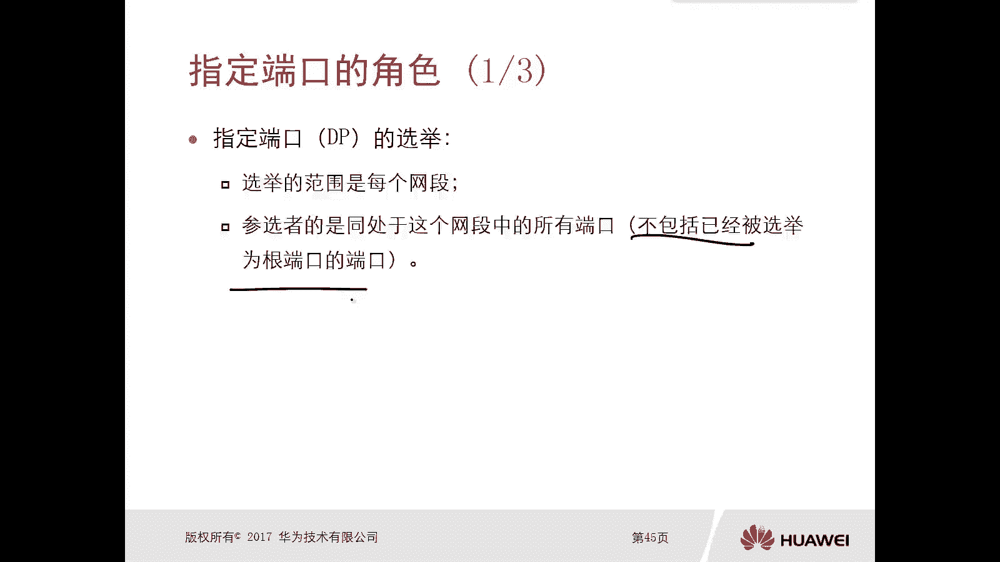

以下是指定端口选举的三条核心规则：
1.  **比较根路径开销（RPC）**：选择RPC最小的端口。
2.  **比较本端桥ID（BID）**：如果RPC相等，则选择端口所在交换机BID较小的端口。
3.  **比较本端端口ID（Port ID）**：如果本端BID也相等，则选择端口ID（由端口优先级和端口号组成）较小的端口。

**关键点**：
*   根网桥上的所有端口都是指定端口。
*   每个网段上有且仅有一个指定端口。

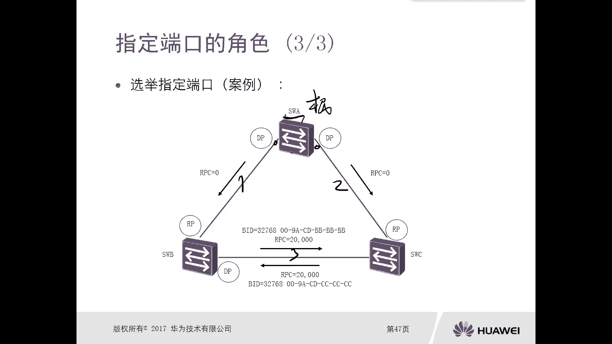

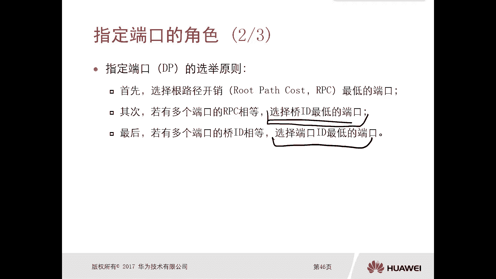

## 第四步：阻塞预备端口 🚫

经过前三步选举，网络中逻辑上的“树干”和“主枝”（根端口和指定端口）已经确定，它们都处于**转发（Forwarding）** 状态。剩余的端口既不是根端口也不是指定端口，它们将被置为**阻塞（Blocking）** 状态，称为预备端口或替代端口。

**状态**：预备端口逻辑上被阻塞，不转发用户数据帧，只接收BPDU报文以监控网络状态。
**作用**：当活动的根端口或指定端口发生故障时，预备端口可以接替其工作，转换为转发状态，从而实现链路备份。

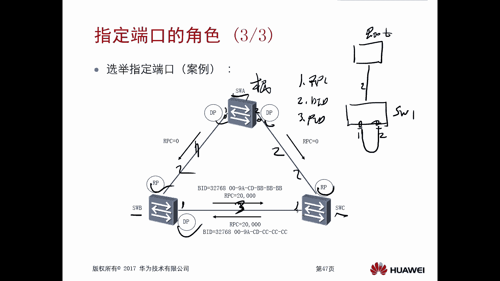

## 端口角色与状态总结 📊

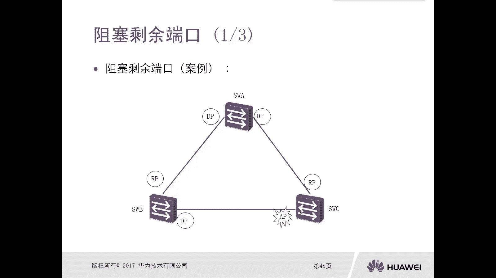

本节课中我们一起学习了STP的四种端口角色及其关键特性。为了更清晰地理解，以下是各类端口的对比：

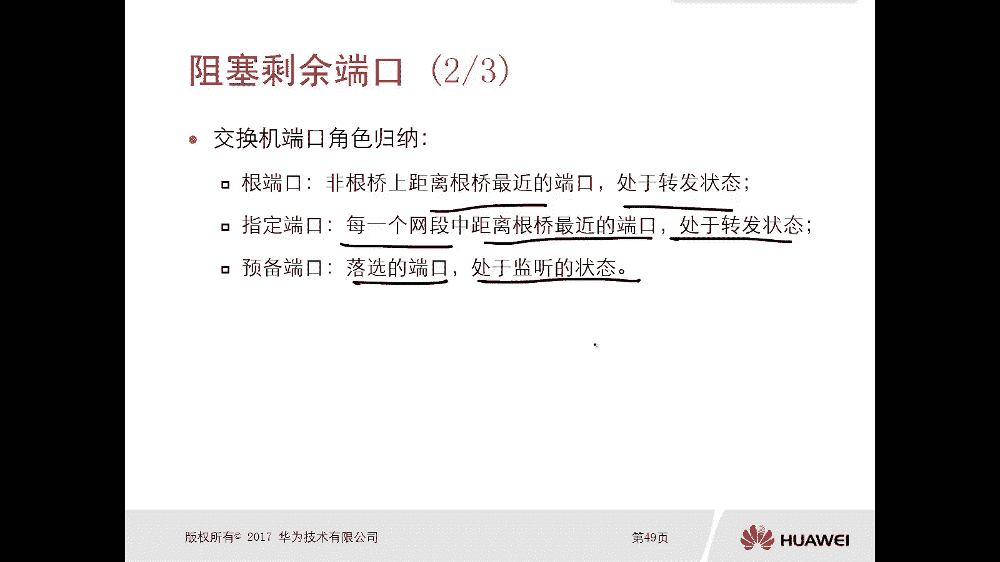

| 端口角色 | 描述 | 发送BPDU? | 接收BPDU? | 转发数据? | 状态 |
| :--- | :--- | :--- | :--- | :--- | :--- |
| **根端口 (RP)** | 非根交换机上离根网桥最近的端口。 | 否 | 是 | 是 | 转发 (Forwarding) |
| **指定端口 (DP)** | 每个网段上离根网桥最近的端口。 | 是 | 是 | 是 | 转发 (Forwarding) |
| **预备端口 (AP)** | 既非RP也非DP的端口。 | 否 | 是 | 否 | 阻塞 (Blocking) |

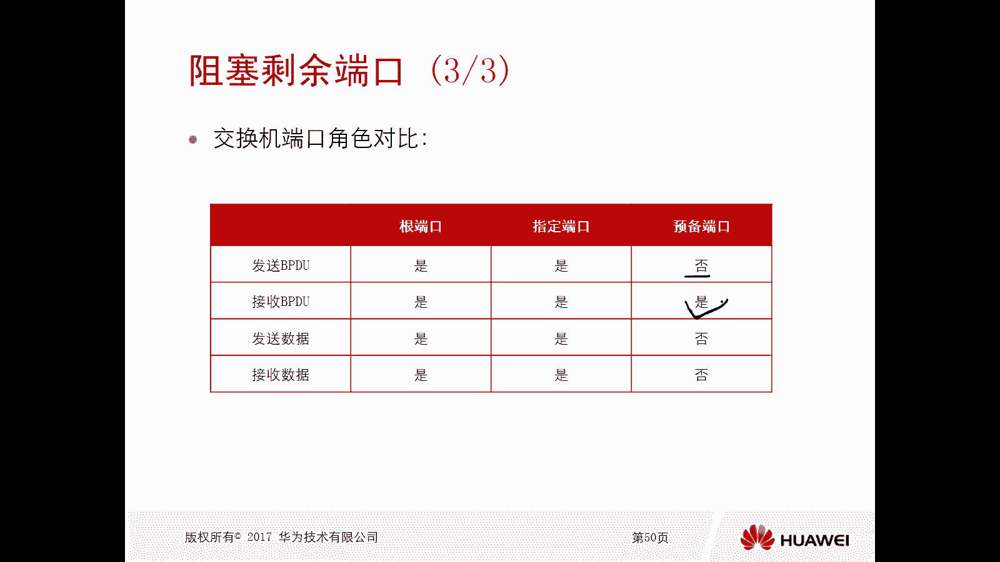

**总结**：STP通过**选举根桥 -> 选举根端口 -> 选举指定端口 -> 阻塞预备端口**这一系列流程，在物理环路上构建出一个逻辑无环的树形拓扑。理解每一步的**选举范围**和**选举原则**是掌握STP工作原理的关键。根端口和指定端口负责数据转发，预备端口则处于备份状态，共同保障网络的可靠性与冗余性。