# 华为认证ICT学院HCIA/HCIP-Datacom教程：第2册-第3章-3：RSTP的特点和快速收敛 🚀

在本节课中，我们将学习快速生成树协议（Rapid Spanning Tree Protocol, RSTP）。我们将了解RSTP如何改进标准生成树协议（STP）收敛速度慢的问题，并详细解析其核心机制，包括新的端口角色、边缘端口以及关键的PA（Proposal/Agreement）协商机制。

---

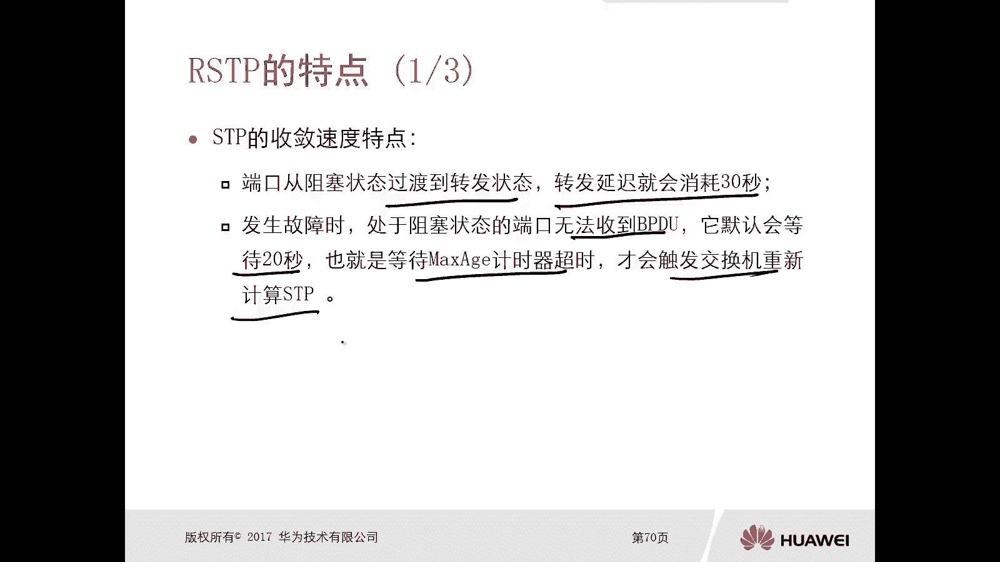

## 概述 📋

标准生成树协议（STP，802.1D）在收敛速度上存在不足，端口从阻塞到转发需要等待30秒，故障检测也需要20秒。RSTP（802.1W）正是为了解决这些问题而设计，其核心目标是实现网络的快速收敛。

上一节我们介绍了STP的基本原理与收敛过程，本节中我们来看看RSTP是如何实现“快速”这一目标的。

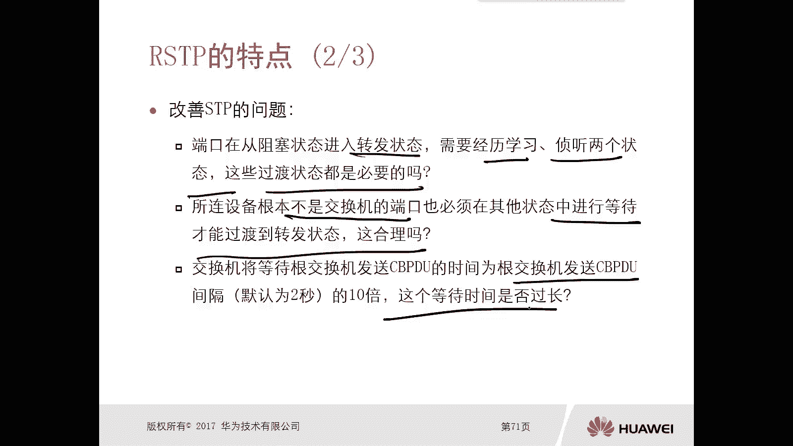

---

## STP收敛慢的问题分析 ⏳

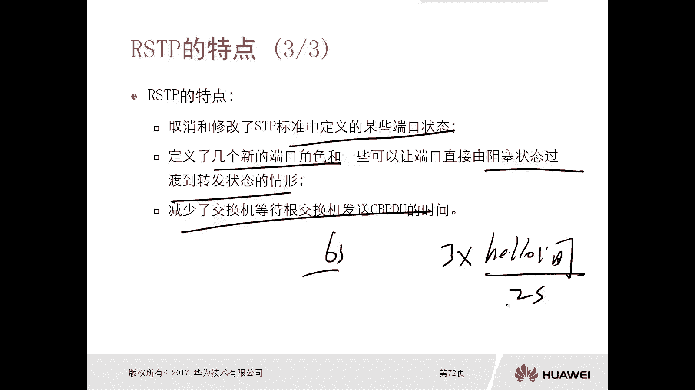

STP收敛速度慢主要源于以下几个因素：

1.  **端口状态过渡时间长**：端口从阻塞状态（Blocking）过渡到转发状态（Forwarding）需要经历侦听（Listening）和学习（Learning）状态，各需15秒，总计30秒的转发延迟。
2.  **不必要的等待**：即使端口连接的是终端设备（如PC），不会形成环路，也必须等待这30秒才能转发数据，这不合理。
3.  **故障检测时间长**：交换机通过最大生存时间（Max Age，默认20秒）来检测与根桥的链路故障，这个等待时间过长。

为了解决这些问题，RSTP从这些造成延迟的因素入手进行了优化。

---

## RSTP的核心特点与改进 ✨

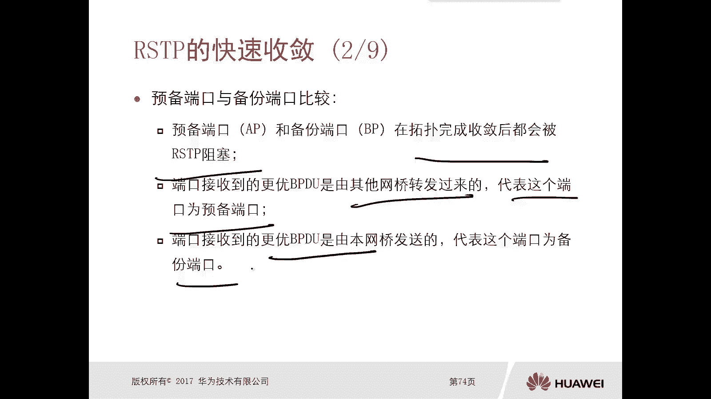

RSTP对STP进行了多项重要改进，以实现快速收敛。

### 端口状态的简化

RSTP简化并重新定义了端口状态，将STP的5种状态合并为3种：
*   **Discarding**：等同于STP的Disabled、Blocking和Listening状态。此状态下的端口不转发数据帧，也不学习MAC地址。
*   **Learning**：端口不转发数据帧，但开始学习MAC地址。
*   **Forwarding**：端口正常转发数据帧和学习MAC地址。

这种简化减少了不必要的状态过渡时间。

### 新增的端口角色

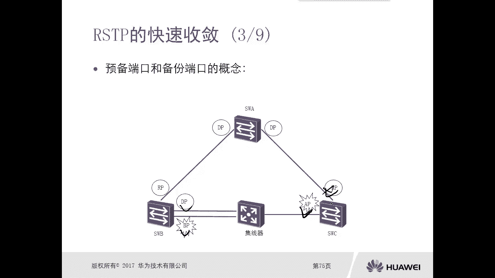

RSTP在STP原有的**根端口（Root Port, RP）**和**指定端口（Designated Port, DP）**基础上，明确定义了两种备用角色：

以下是预备端口（Alternate Port, AP）与备份端口（Backup Port, BP）的对比：

*   **共同点**：在拓扑收敛后，两者均处于阻塞（Discarding）状态，不转发用户数据。
*   **区分关键**：根据接收到的更优BPDU的来源进行区分。
    *   **预备端口（AP）**：端口接收到的**更优BPDU来自其他网桥**。AP是根端口的备份。
    *   **备份端口（BP）**：端口接收到的**更优BPDU来自本网桥**（即同一台交换机的另一个端口）。BP是指定端口的备份。

**示例**：
假设根桥为Switch A，Switch B优先级高于Switch C。在Switch B和Switch C之间的链路上选举指定端口。
*   Switch C的端口收到来自Switch B的更优BPDU，则该端口为**AP**。
*   Switch B的两个端口相互发送BPDU，优先级低的端口（如端口2）收到来自本机优先级高的端口（端口1）的更优BPDU，则端口2为**BP**。

当根端口或指定端口失效时，对应的AP或BP可以快速接管并转换为转发状态，无需等待30秒。

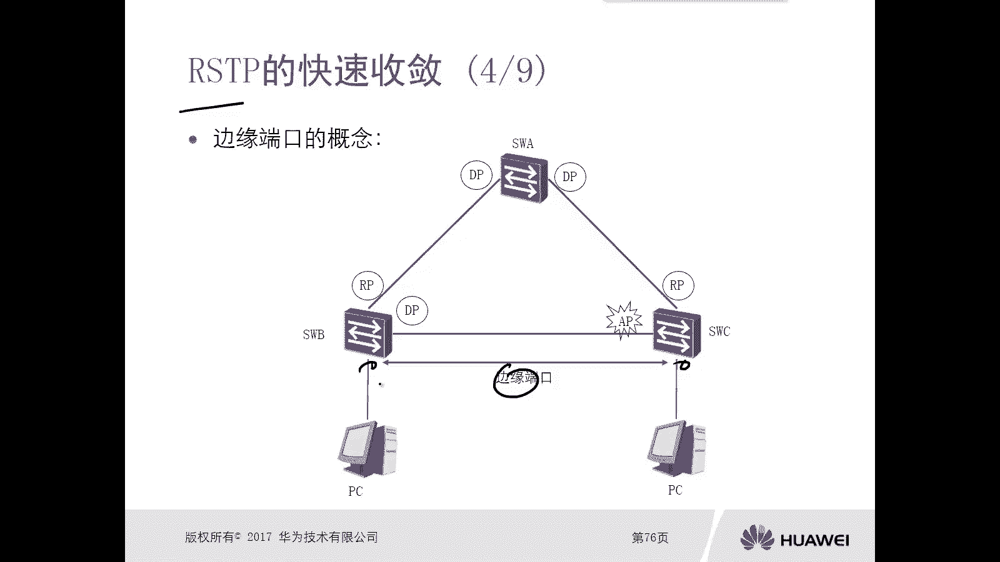

### 边缘端口（Edge Port）⚡

边缘端口是管理员手动配置的、直接连接终端设备（如PC、服务器）的端口。

**特点**：
*   不参与生成树计算。
*   端口启用后**立即进入Forwarding状态**，无需经历Listening和Learning状态。
*   这极大地提升了终端用户的接入体验。

**注意**：部分新版华为交换机支持自动边缘端口检测功能，但通常仍建议手动配置以确保稳定。

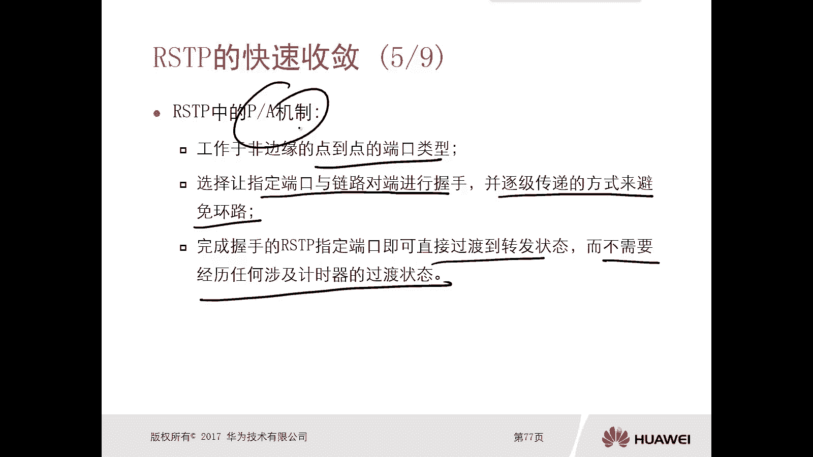

### PA（Proposal/Agreement）机制：快速收敛的核心 🤝

PA机制是RSTP实现快速收敛的最关键技术。其核心思想是：**只要确认某条链路启用后不会形成环路，其两端的端口就可以立即进入转发状态，无需依赖计时器等待。**

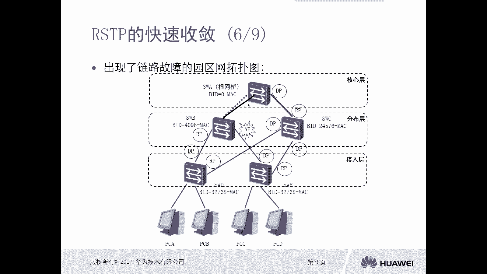

PA机制的工作过程是逐跳（逐链路）进行的：

1.  **P（Proposal）报文**：当链路激活，上游设备的指定端口会发送**Proposal位置1**的BPDU，表示希望立即进入转发状态。
2.  **同步（Sync）操作**：下游设备收到P报文后，为确保无环，会**阻塞（Discarding）所有非边缘指定端口**。
3.  **A（Agreement）报文**：完成同步后，下游设备向上游回复**Agreement位置1**的BPDU，并**立即将接收P报文的端口（即其根端口）置为转发状态**。
4.  **上游转发**：上游设备收到A报文后，**立即将发送P报文的指定端口置为转发状态**。

通过这种“握手-同步-转发”的逐段确认方式，RSTP可以在避免环路的前提下，使链路两端的端口瞬间进入转发状态。

### 更快的故障检测机制

在STP中，交换机等待20秒（Max Age）未收到根桥的BPDU才认为链路故障。RSTP将此机制修改为：
*   在**3个Hello Time（默认2秒）内**，即**6秒内**，若未收到上游发来的BPDU，下游交换机便认为链路故障，立即发起拓扑重计算。

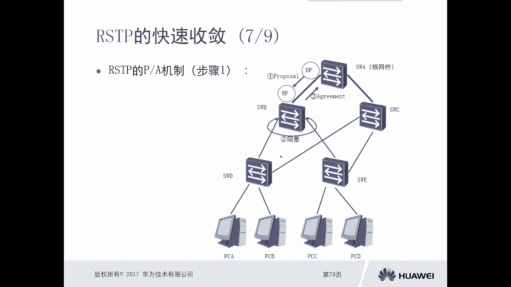

---

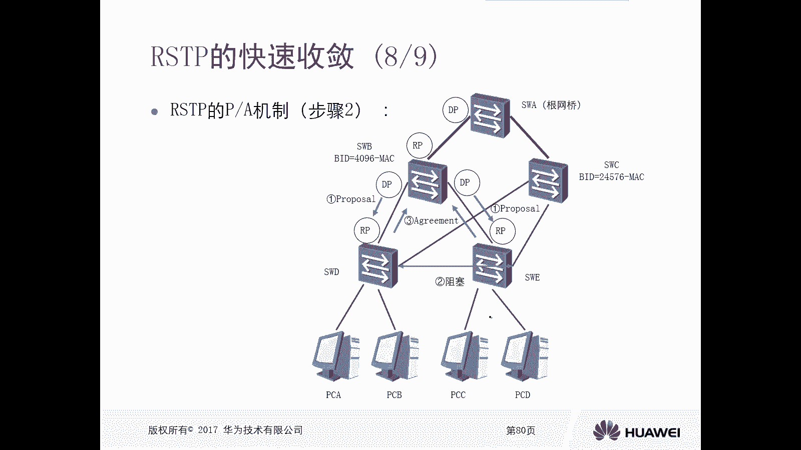

## 总结 🎯

本节课我们一起学习了快速生成树协议（RSTP）的核心特点与快速收敛机制。主要内容总结如下：

1.  **目标明确**：RSTP（802.1W）旨在解决STP（802.1D）收敛慢的问题。
2.  **状态简化**：将端口状态合并为Discarding、Learning、Forwarding三种。
3.  **角色丰富**：在RP和DP基础上，明确定义了**AP**（根端口备份）和**BP**（指定端口备份），便于快速切换。
4.  **边缘端口**：手动配置后，连接终端的端口可立即转发，提升接入速度。
5.  **核心机制**：**PA（Proposal/Agreement）机制**通过逐跳握手与同步，允许端口在确认无环后立即进入转发状态，这是RSTP快速收敛的基石。
6.  **快速故障检测**：将链路故障检测时间从20秒缩短至约6秒（3倍Hello Time）。

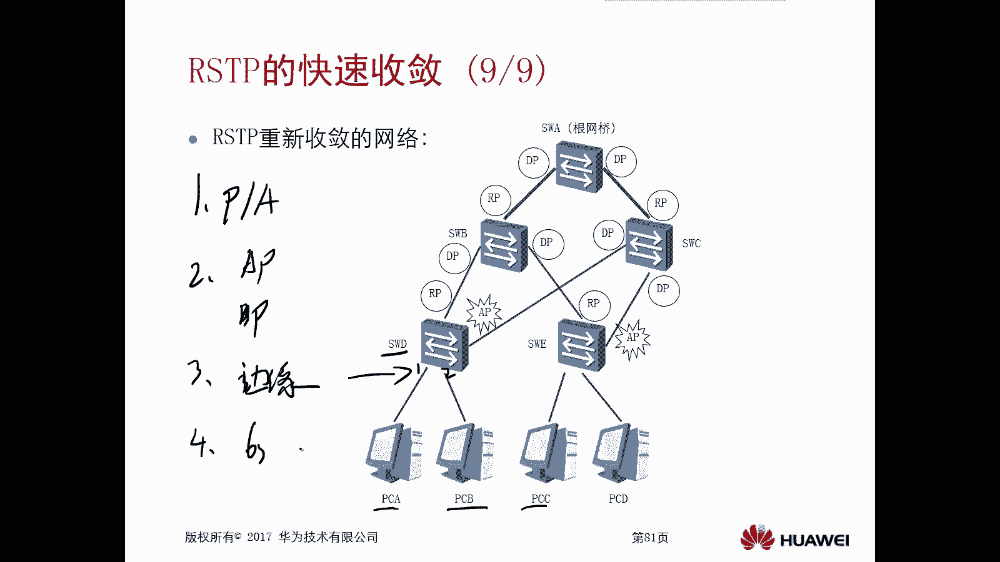

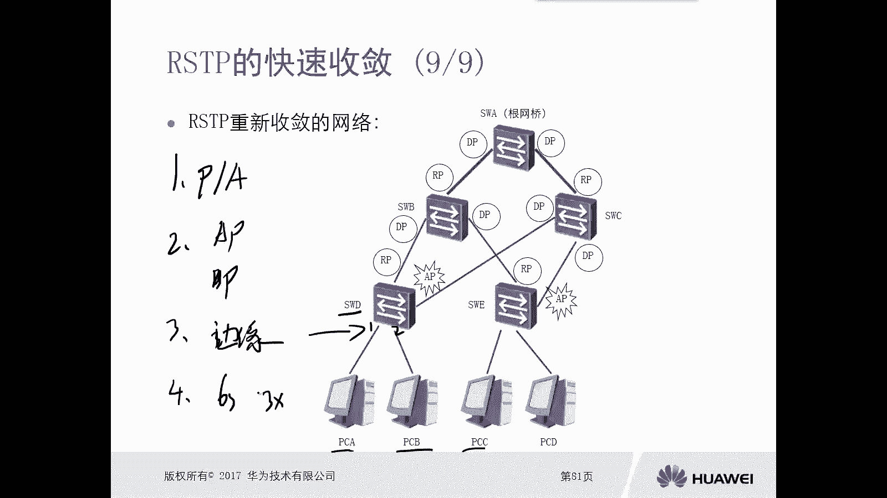

通过以上改进，RSTP显著提升了生成树协议的收敛性能，使其更适合现代网络对高可用性的要求。