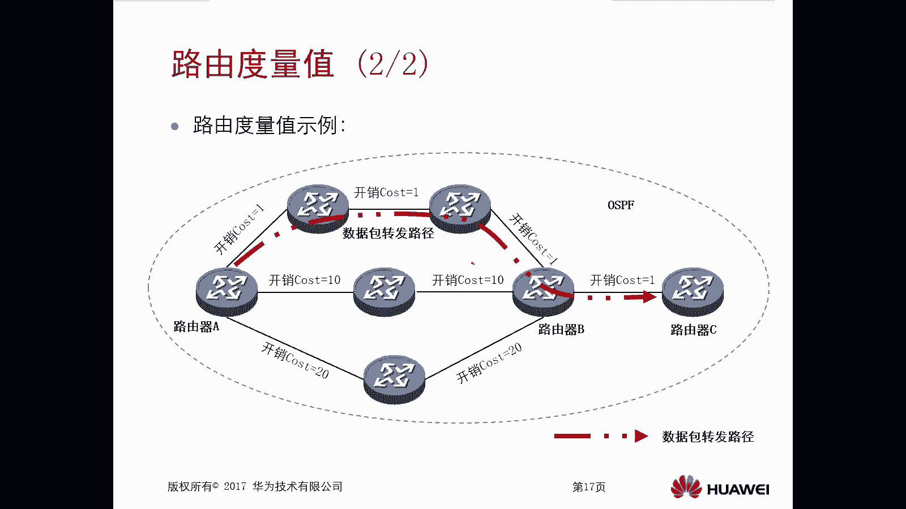

# 华为认证ICT学院HCIA/HCIP-Datacom教程：第2册-第4章-1：路由基础 🧭

在本节课中，我们将要学习路由的基础概念。路由是网络设备（如路由器或三层交换机）通过查找路由表，对数据包进行转发的一种处理方式。本章将从六个方面介绍路由基础，包括基本概念回顾、路由表与条目、路由信息来源以及路由优先级和度量值等核心概念。

## 路由基本概念回顾 🔄

上一节我们介绍了课程概述，本节中我们来看看路由的基本概念。首先回顾一下MAC地址与IP地址的对比。

*   MAC地址工作在数据链路层，通常被称为物理地址。它由设备厂商烧录在网卡中，在数据传输过程中，每一跳的MAC地址都会改变。
*   IP地址工作在网络层，通常被称为逻辑地址。在数据传输过程中，源和目的IP地址一般保持不变。

## 网络设备如何建立转发数据库 💾

设备要转发数据，必须拥有一个转发数据库。以下是网络设备建立该数据库的三种主要方式。

*   **直连路由**：设备会自动将自身接口所在的子网信息记录到转发数据库中。
*   **静态路由**：网络管理员可以手动在设备的转发数据库中，输入去往特定子网的转发路径。
*   **动态路由**：通过在网络设备间配置动态路由协议（如RIP、OSPF），设备可以相互传递和学习路由信息，从而形成转发数据库。

这个转发数据库，实际上就是设备中的**路由表**。路由表中的每一条记录称为一个**路由条目**，它代表了一条数据转发的路径。

## 路由表的工作原理 ⚙️

路由表是路由器转发数据包所依赖的数据库。当路由器收到一个数据包时，其工作原理如下：

1.  提取数据包中的**目的IP地址**。
2.  用该目的IP地址去**匹配**路由表中的各个路由条目（通常通过逻辑“与”运算进行匹配）。
3.  根据匹配成功的路由条目中携带的参数（如下一跳地址、出接口等），决定如何转发该数据包。

## 如何查看路由表 👀

在路由器上，我们可以使用命令来查看IPv4路由表的信息。

*   查看路由表的摘要信息，使用命令：`display ip routing-table`
*   查看某条路由或整个路由表的详细信息，使用命令：`display ip routing-table verbose` 或在查看具体路由时加上 `verbose` 参数。

由于路由表条目可能很多，通常建议有针对性地查看特定路由的详细信息。

## 路由信息的三种来源 📬

正如我们所见，路由表中有许多路由条目。这些路由信息主要来源于以下三种途径。

*   **直连路由**：当设备接口配置了IP地址且物理和协议状态均为UP（双UP）时，该接口所在的网段会自动出现在路由表中，无需额外配置。
*   **静态路由**：由网络管理员手工配置并添加到路由表中的特定路由。
*   **动态路由**：通过运行动态路由协议，路由器从邻居路由器那里学习到的路由信息。这种方式可以动态感知网络变化并调整路由。

## 路由优先级与度量值 ⚖️

在路由选择过程中，有两个非常重要的概念：路由优先级和路由度量值。

### 路由优先级

当一台路由器通过**不同的路由协议**学习到去往**相同目标网段**的多条路由时，需要根据**路由优先级**来选择最优路径。

*   路由优先级是路由器为每种路由信息源（协议）赋予的一个**权重值**，也称为协议优先级。
*   优先级数值**越小**，代表该路由的**可信度越高**，越优先被选用。

以下是常见路由协议的默认优先级：
*   直连路由（Direct）：**0**
*   OSPF内部路由：**10**
*   静态路由（Static）：**60**
*   RIP路由：**100**
*   OSPF外部路由：**150**

### 路由度量值

当一台路由器通过**相同的路由协议**学习到去往**相同目标网段**的多条路由时，则需要根据**路由度量值**来选择最优路径。

*   路由度量值表示去往目的网络的**开销**（Cost）。
*   度量值**越小**，代表路径越优，越优先被选用。
*   不同路由协议计算度量值所参考的因素不同（如跳数、带宽、延迟等）。

**示例**：假设路由器A通过三条都运行OSPF的链路，学习到了去往同一网段10.1.1.0/24的路由。此时，路由器A会比较这三条路径的总开销（Cost），并选择开销最小的路径作为最优路由进行数据转发。

---

本节课中我们一起学习了路由的基础知识。我们回顾了MAC与IP地址的区别，了解了路由表作为转发数据库的作用及其工作原理，掌握了查看路由表的方法。我们还详细分析了路由信息的三种来源：直连、静态和动态路由。最后，我们深入探讨了路由选择过程中的两个关键参数：**路由优先级**（用于区分不同协议来源的路由）和**路由度量值**（用于区分同一协议下的不同路径），它们是保证网络数据能够高效、准确转发的核心机制。