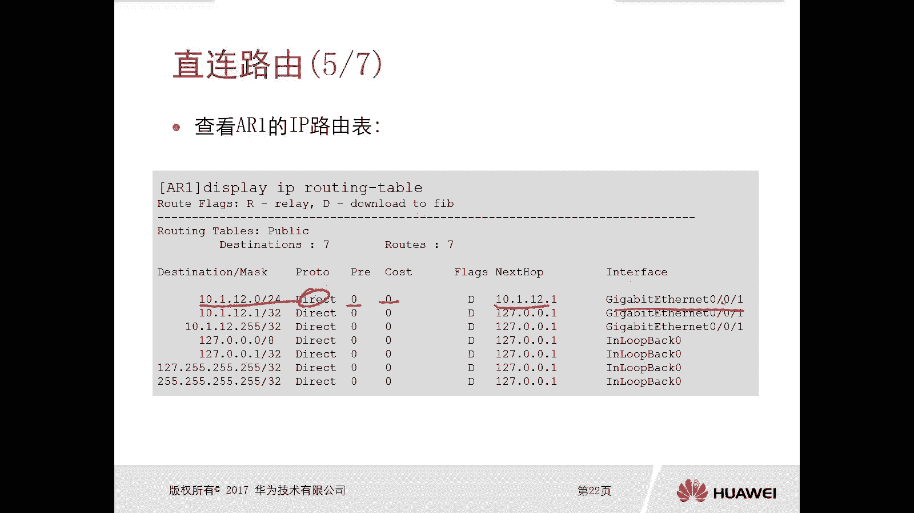
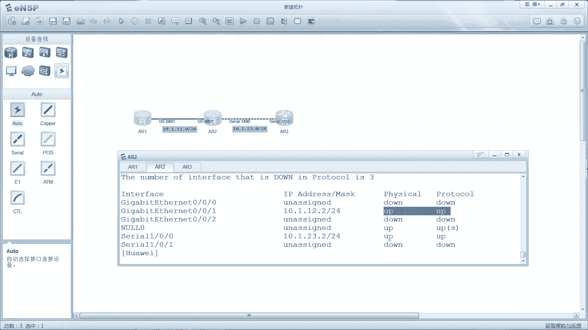
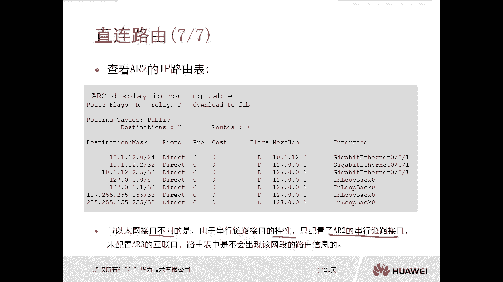
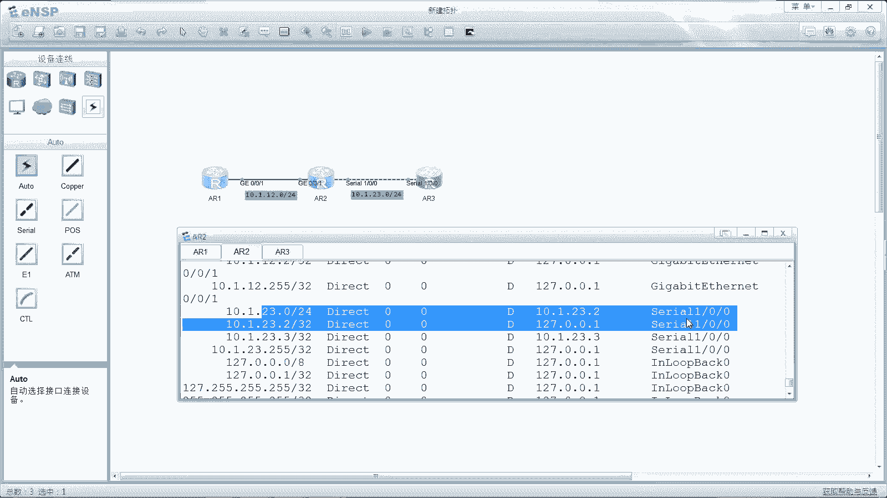
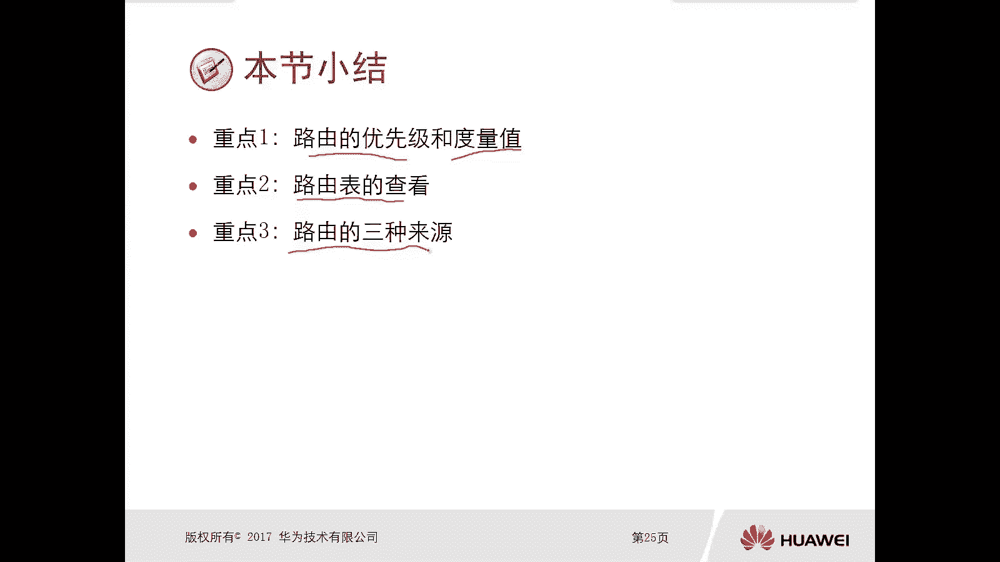

# 华为认证ICT学院HCIA/HCIP-Datacom教程：第2册-第4章-2：直连路由详解 🧭

在本节课中，我们将要学习路由表中的一种基础且重要的路由类型——直连路由。我们将了解它的生成条件、特性，并通过实例演示其配置与查看方法。

## 概述

路由器会自动将状态正常的接口所连接的网络信息，作为直连路由添加到自身的路由表中。理解直连路由是学习后续静态路由和动态路由的基础。

## 直连路由的生成条件

上一节我们介绍了路由表的基本概念，本节中我们来看看直连路由是如何生成的。直连路由的生成依赖于接口的“状态正常”，这主要体现在以下两个方面：

以下是接口状态正常的两个必要条件：
1.  接口的物理状态为 **`up`**。
2.  接口的协议状态为 **`up`**。

我们通常将同时满足这两个条件的状态称为“双 `up`”。只有在接口达到双 `up` 状态时，路由器才会将其连接的网段作为直连路由加入路由表。

## 直连路由的特性



了解了生成条件后，我们来看看直连路由的几个关键特性。

以下是直连路由的核心特性：
*   **优先级与度量值**：直连路由的优先级和度量值（开销）**固定为 0**。
*   **不可修改性**：直连路由的优先级和度量值是系统缺省值，**无法进行手动修改**。

## 实例演示：以太网接口直连路由

理论需要结合实践。接下来，我们通过一个简单的拓扑实例来观察直连路由。假设网络中有三台设备，接口与网段信息清晰。

如果不对路由器进行任何配置，使用 `display ip interface brief` 命令查看接口信息时，物理接口的协议状态通常是 `down` 的。此时，使用 `display ip routing-table` 命令查看路由表，**不会出现**与该物理接口相关的任何直连路由信息。

为了让路由器将接口网络的路由信息加入路由表，我们需要在接口上配置IP地址以激活它。配置命令如下：

```bash
[Huawei] interface GigabitEthernet 0/0/1
[Huawei-GigabitEthernet0/0/1] ip address 10.1.12.1 24
```

配置完成后，再次使用 `display ip interface brief` 命令，可以看到对应接口的物理和协议状态均变为 `up`。此时，查看路由表就能发现新增的直连路由条目，例如：`10.1.12.0/24`，其下一跳为接口自身，优先级和开销均为0。

## 注意事项：串行接口的特殊性



上一节我们在以太网接口上验证了直连路由，本节中我们来看看串行接口有何不同。串行接口（如Serial口）的直连路由生成条件更为严格。

在串行接口仅一端配置IP地址时，即使使用 `display ip interface brief` 命令查看显示为双 `up` 状态，路由表中**仍然不会出现**该直连网段的路由信息。



这是因为串行链路通常涉及链路层协议（如PPP）的协商。只有在链路两端的接口都正确配置了IP地址，并完成协议协商后，路由表才会生成相应的直连路由。因此，串行链路需要**两端设备均完成配置**，直连路由才会生效。

## 本章重点回顾



本节课中我们一起学习了直连路由的核心知识。

以下是本讲的重点总结：
1.  直连路由由路由器自动生成，前提是接口物理和协议状态均为 `up`。
2.  直连路由的优先级和度量值固定为0，且不可更改。
3.  查看路由表的命令是 **`display ip routing-table`**。
4.  以太网接口配置IP地址激活后，即可生成直连路由。
5.  串行接口需要链路两端均配置正确并完成协商，才会生成直连路由。



直连路由是路由表中最基本、最可靠的路由来源。理解它，为我们接下来学习需要手动配置的**静态路由**和由协议自动学习的**动态路由**打下了坚实的基础。