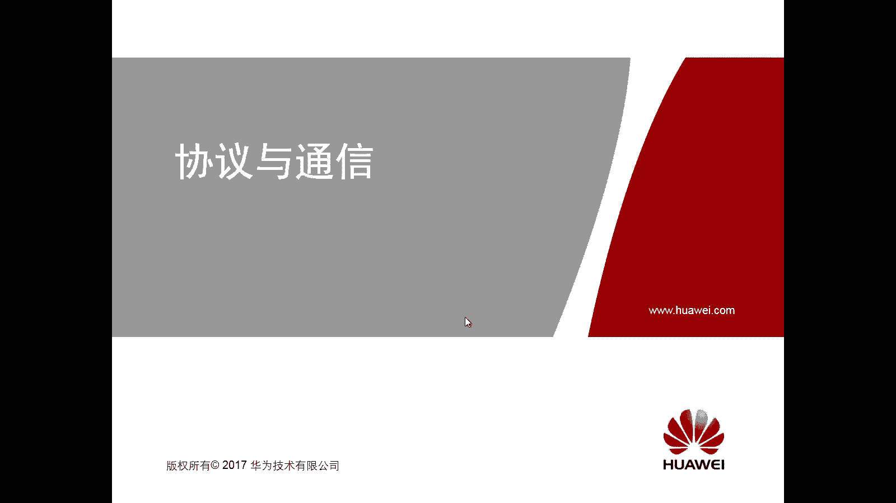
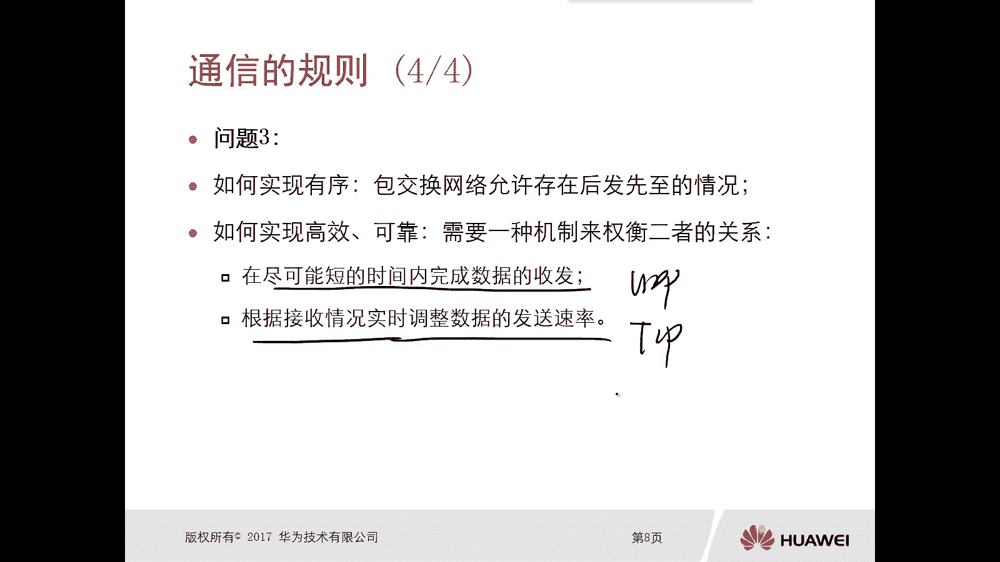

# 华为认证ICT学院HCIA/HCIP-Datacom教程：第1册-第3章-1：通信规则 📡



在本节课中，我们将要学习网络通信的基础规则。我们将探讨数据如何在网络中传输、如何确保数据到达正确的目的地，以及如何保证传输过程高效可靠。理解这些规则是学习后续复杂网络协议和模型的基础。

## 通用规则

上一节我们介绍了课程的学习目标，本节中我们来看看通信的通用规则。通信并非单一协议能够完成，而是一个由多种协议协同工作的复杂过程。

例如，通过QQ发送一张图片，接收方看到的是图片而非视频。这背后涉及将不同形式的数据转换为统一的格式进行传输、确保数据发送给正确的接收方，以及保证数据有序、高效、可靠地到达。这些就是通信需要遵循的基本规则。

## 网络协议的作用

通信过程非常复杂，需要多个协议协同工作。那么，网络协议的具体作用是什么呢？

网络协议定义了设备之间通信的规则和标准。它确保了不同厂商、不同类型的设备能够相互理解和交换数据。没有统一的协议，网络通信将无法进行。

## 协议栈的必要性

既然通信需要多种协议，这些协议是混杂在一起使用，还是各有分工呢？这就引出了协议栈的概念。

协议栈的必要性在于，它将复杂的通信过程分层处理。每一层负责特定的功能，下层为上层提供服务。这种分层结构使得协议设计、实现和故障排查都变得更加清晰和高效。

## 数据的转换与传输

如何将图片、文字、视频等不同形式的数据放到光纤、网线等媒介中传输呢？这是实现通信要解决的第一个问题。

解决方案是将所有数据转换为**二进制编码**。发送设备将原始数据（如图片）转换为二进制，再通过I/O接口将二进制转换为适合特定媒介（如光信号、电信号）的物理信号进行传输。接收设备则执行相反的过程，将物理信号还原为二进制，再转换为原始数据。

其核心过程可以概括为以下流程：
```
发送端：原始数据 -> 二进制编码 -> 物理信号 -> 网络媒介
接收端：网络媒介 -> 物理信号 -> 二进制编码 -> 原始数据
```

## 数据的寻址

第二个问题是：如何确保数据被发送给正确的接收方？本质是解决通信过程中的寻址问题。

这类似于寄快递，必须提供准确的收件地址。在网络通信中，每个参与者都需要满足两个条件：
1.  拥有地址信息来标识自己的物理或逻辑位置。
2.  拥有身份识别信息来标识设备本身。

在网络中，我们主要通过**IP地址**来实现寻址。IP地址是一个逻辑地址，用于标识设备在网络中的位置，确保数据能够被路由到正确的目的地。

## 数据的可靠与高效传输

第三个问题是：如何确保数据有序、高效、可靠地到达接收方？

在包交换网络中，数据被分割成多个数据包发送。由于网络状况复杂，数据包到达的顺序可能与发送顺序不同（乱序）。同时，还需要在传输速度和可靠性之间进行权衡。

解决方案主要在传输层通过两种协议实现：
*   **TCP (传输控制协议)**：提供**可靠**的、面向连接的传输。它能检测丢包并重传，保证数据顺序，并能根据网络拥塞情况动态调整发送速率。公式可简化为：`可靠性 + 流量控制`。
*   **UDP (用户数据报协议)**：提供**不可靠**的、无连接的传输。它不保证数据包一定到达或顺序正确，但开销小、延迟低、传输效率高。公式可简化为：`高效性 + 低延迟`。

选择哪种协议取决于应用需求：追求可靠性和有序性时使用TCP；追求传输效率和实时性时（如视频流、语音通话）使用UDP。

---



本节课中我们一起学习了网络通信的基本规则。我们了解了数据需要通过二进制编码和物理信号进行传输，通过IP地址解决寻址问题，并通过TCP和UDP协议在可靠性与高效性之间取得平衡。理解这些基础概念，是进一步学习OSI和TCP/IP参考模型的关键。