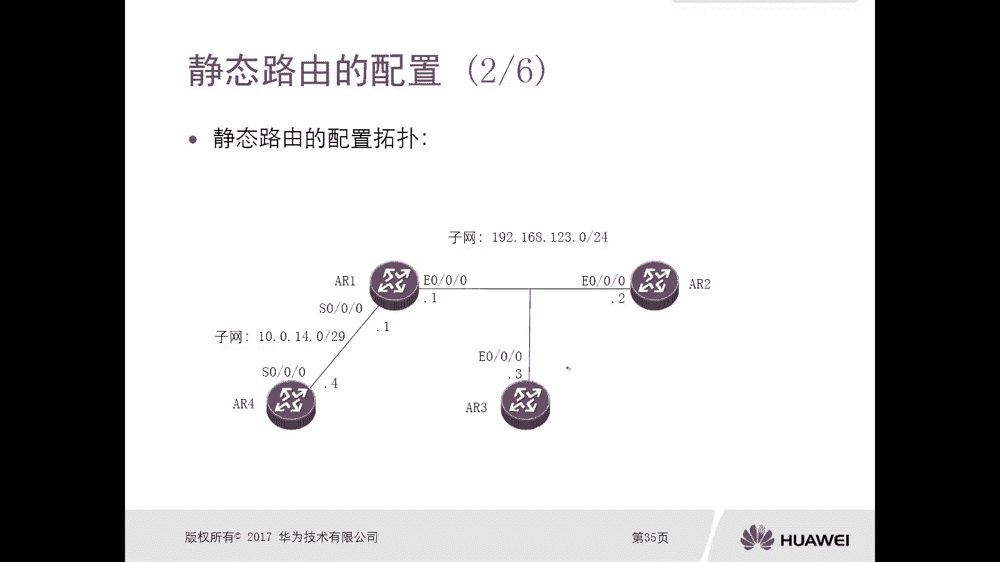
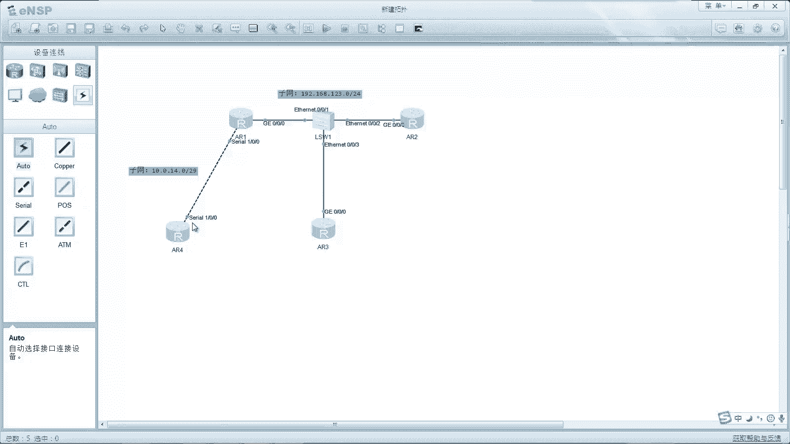
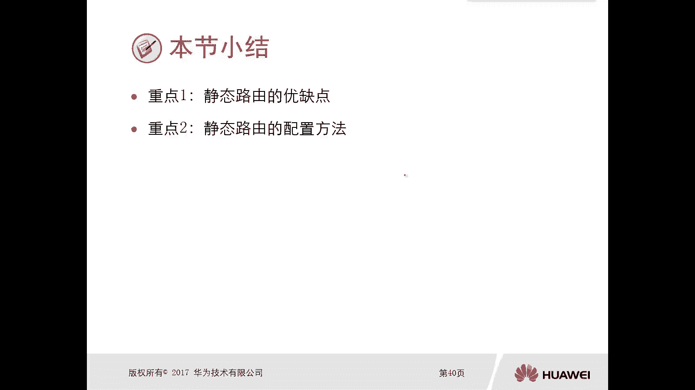

# 华为认证ICT学院HCIA/HCIP-Datacom教程：第2册-第4章-3：静态路由 🛣️

在本节课中，我们将要学习静态路由的核心概念、优缺点以及具体的配置方法。静态路由是网络管理员手动配置的路由条目，用于指导数据包的转发路径。我们将从概述开始，逐步深入到其特点与配置实践。

## 静态路由概述 📖

上一节我们介绍了路由的来源，主要包括直连路由、静态路由和动态路由三大类。本节中，我们来看看静态路由的具体定义。

静态路由是由网络管理员手工配置的、指向目的网络的路径。其默认优先级为**60**，度量值为**0**。度量值无法更改，但优先级可以通过命令进行修改。在大多数场景下，我们无需修改默认优先级。

## 静态路由的优缺点 ⚖️

了解了静态路由的基本概念后，本节我们来分析它的优点与局限性。

静态路由具有以下优点：
*   **稳定性高**：一旦配置并保存，只要网络拓扑或管理员不主动更改，路由条目将始终保持不变。
*   **可控性强**：路由路径完全由管理员指定，可以实现精确的流量控制。
*   **部署简单**：对于小型或结构简单的网络，配置静态路由非常快捷。

然而，静态路由也存在明显的缺点：
*   **扩展性差**：在网络规模扩大、路由条目激增时，手工配置和维护的工作量会变得非常庞大。
*   **无法适应拓扑变化**：当网络链路发生故障或拓扑结构改变时，静态路由无法自动感知并调整，可能导致路由失效，需要管理员手动干预。

## 静态路由的配置 🛠️

前面我们讨论了静态路由的特点，现在进入实践环节，学习如何配置静态路由。

以下是配置静态路由时需要注意的关键点：

**1. 配置命令格式**
静态路由的基本配置命令格式如下：
```bash
ip route-static <目标网络> <子网掩码> <下一跳地址|出接口>
```
例如，`ip route-static 192.168.2.0 255.255.255.0 10.0.12.2`。

**2. 以太网与点对点链路的区别**
*   **在以太网（如GigabitEthernet接口）环境中**：必须指定**下一跳IP地址**。因为以太网是多路访问网络，一个接口可能连接多个设备，仅指定出接口无法确定具体转发目标。
*   **在点对点（如Serial串口）链路中**：可以指定**出接口**或**下一跳IP地址**，因为点对点链路只有两个端点，从指定接口发出的数据必然到达对端。

**3. 负载均衡与浮动路由**
*   **负载均衡**：当存在多条优先级相同、通往同一目的网络的静态路由时，设备会同时使用这些路径转发数据，实现流量分担。
*   **浮动静态路由**：通过为备份路由配置更高的优先级（例如100），使其在正常情况下处于非活跃（Inactive）状态。当主路由（优先级60）失效时，备份路由会变为活跃（Active），实现主备切换。查看静态路由表的命令是：
```bash
display ip routing-table protocol static
```



### 配置案例演示

假设有一个网络拓扑，需要让设备AR4能够与AR2、AR3通信。核心配置思路如下：

1.  **基础配置**：为所有设备的接口配置正确的IP地址。
2.  **在AR4上配置静态路由**：添加去往`192.168.123.0/24`网段的路由。由于AR4到AR1是串口链路，可以指定出接口。
    ```bash
    [AR4] ip route-static 192.168.123.0 255.255.255.0 Serial 1/0/0
    ```
3.  **在AR2和AR3上配置回程路由**：添加去往`10.0.14.0/29`网段的路由。由于AR2/AR3到AR1是以太网链路，必须指定下一跳地址（AR1的接口IP）。
    ```bash
    [AR2] ip route-static 10.0.14.0 255.255.255.248 192.168.123.1
    [AR3] ip route-static 10.0.14.0 255.255.255.248 192.168.123.1
    ```
4.  **验证连通性**：配置完成后，在AR4上使用`ping`命令测试与AR2、AR3的连通性。


## 总结 📝



本节课中我们一起学习了静态路由。我们首先回顾了静态路由是由管理员手工配置的这一基本概念。接着，我们分析了其稳定性高、可控性强但扩展性差、无法动态适应拓扑变化的优缺点。最后，我们重点掌握了静态路由的配置方法，特别是区分了在以太网和点对点链路上配置时的不同要求，并通过一个案例演示了完整的配置流程。理解并掌握静态路由是学习更复杂动态路由协议的重要基础。



