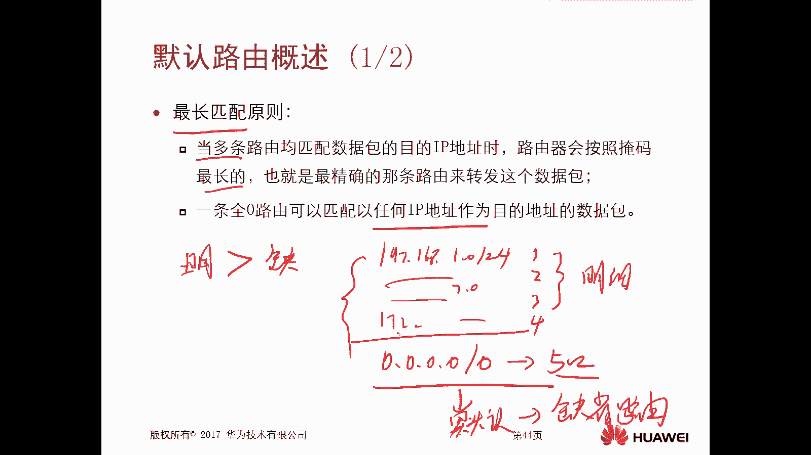
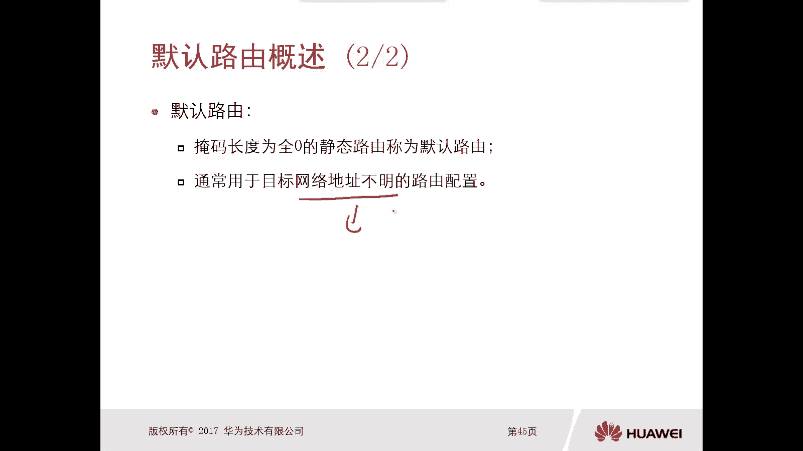
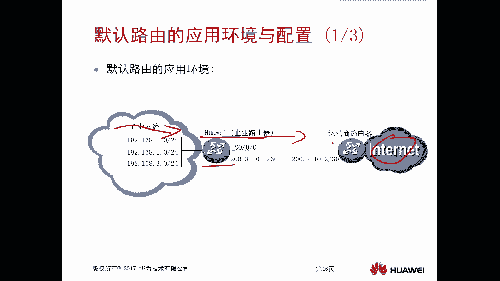
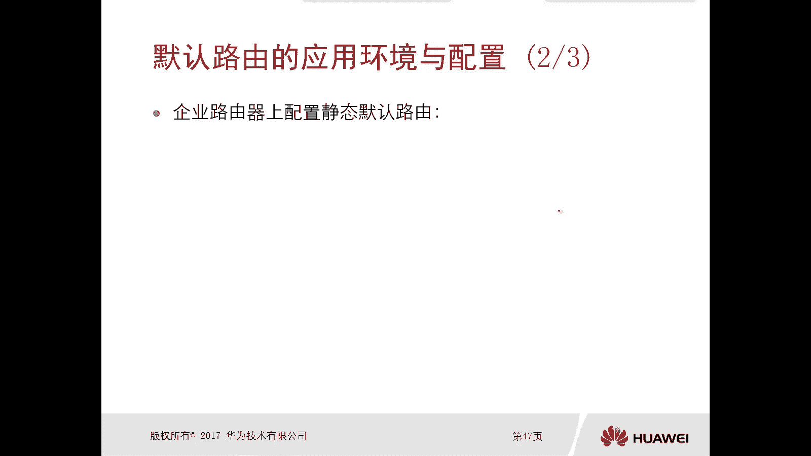
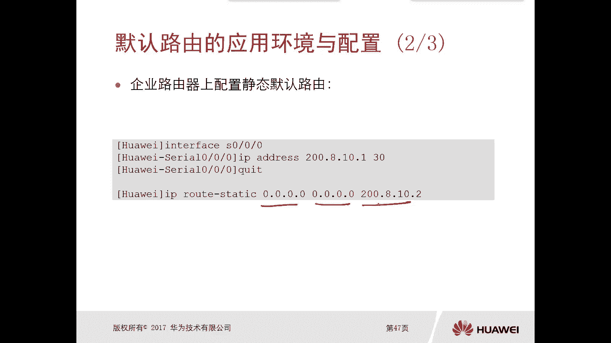
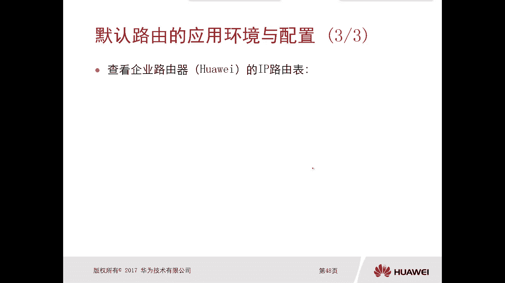
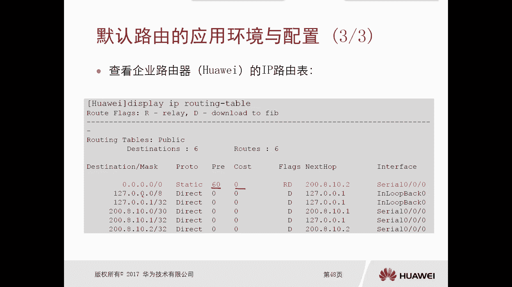
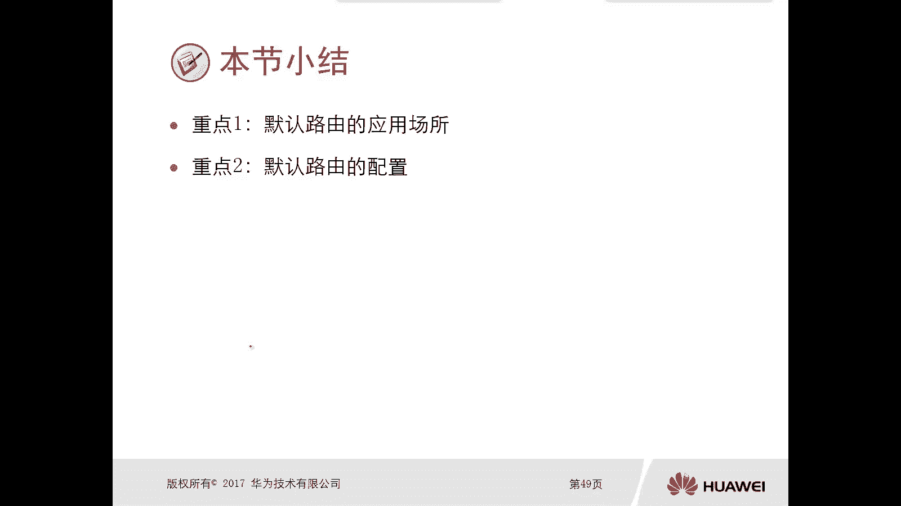

# 华为认证ICT学院HCIA/HCIP-Datacom教程：第2册-第4章：默认路由 📚

在本节课中，我们将要学习默认路由。默认路由是一种特殊的静态路由，在网络中扮演着至关重要的角色，尤其是在企业网络出口。我们将从概念、应用场景到配置方法，系统地了解它。

上一节我们介绍了静态路由，本节中我们来看看默认路由。默认路由与静态路由关系密切，理解它有助于我们更灵活地设计网络。

## 默认路由概述 🔍

默认路由实际上是一种特殊的静态路由。因此，它的配置方法与静态路由没有本质区别。本章主要通过以下两个方面介绍默认路由：
1.  默认路由的概述：解释什么是默认路由。
2.  默认路由的应用环境和配置：重点在于理解其应用场景。

### 最长匹配原则

在深入默认路由之前，必须先理解一个核心概念：**最长匹配原则**。这是路由器进行路由选择时的首要原则。

当多条路由条目都能匹配数据包的目的IP地址时，路由器会选择**掩码最长**（即最精确）的那条路由来转发数据包。

以下是一个例子，通过代码描述路由表：

```text
路由表条目：
1. 192.168.1.0/24   -> 出接口: Ethernet0/0/1
2. 192.168.0.0/16   -> 出接口: Ethernet0/0/2
3. 192.0.0.0/8      -> 出接口: Ethernet0/0/3
```

假设路由器收到一个目的IP为 `192.168.1.100` 的数据包。查询路由表后，发现以上三条路由都能匹配（因为目的IP `192.168.1.100` 落在这些网段内）。根据最长匹配原则，路由器会对比三条路由的掩码长度：`/24`（24位）最长。因此，数据包将从 `Ethernet0/0/1` 接口转发出去。

### 默认路由的定义

一条全零的路由可以匹配任何IP地址作为目的地址的数据包，这就是**默认路由**（也称缺省路由）。

其路由条目表示为：**`0.0.0.0/0`**。

由于“最长匹配原则”的存在，明细路由（如 `192.168.1.0/24`）的优先级永远高于默认路由（`0.0.0.0/0`）。路由器转发数据包时，会先查找是否有明细路由可以匹配。只有在**没有任何明细路由能够匹配**目的IP地址时，才会使用默认路由进行转发。如果没有默认路由，该数据包将被丢弃。



所以，默认路由是掩码和网络前缀全为零的静态路由，通常用于目标网络不明确或无法预知所有明细路由的情况。

理解了默认路由的基本概念后，接下来我们看看它最典型的应用场景。



## 默认路由的应用场景与配置 🏢

默认路由的应用场景极为常见，几乎百分之百的企业网络都会使用。

### 应用场景：企业网络出口

考虑一个典型的企业网络拓扑：企业内部网络通过一台路由器（称为出口网关）连接到运营商网络，进而访问互联网。

对于出口网关路由器而言，内网用户可能需要访问互联网上无数个目的地（如百度、新浪等海量网站）。如果试图通过静态路由一条条配置去往所有互联网地址的路由，是**不现实且低效**的。

然而，无论内网用户访问互联网上的哪个地址，数据包在离开企业网络时，下一跳都是**同一个运营商路由器**。因此，与其配置成千上万条明细静态路由，不如在出口网关上配置一条**默认路由**，其下一跳指向运营商路由器。

这样，所有去往未知互联网地址的数据包，在匹配不到明细路由时，都会通过这条默认路由发送给运营商，由运营商的网络负责后续转发。这极大地简化了配置和管理。

### 配置方法

配置默认路由非常简单，它就是一条目的网络和掩码均为 `0.0.0.0` 的静态路由。

配置命令如下（以华为设备为例）：



```bash
[Huawei] ip route-static 0.0.0.0 0.0.0.0 { next-hop-address | interface-type interface-number }
```



例如，指定下一跳IP地址为 `10.0.0.1`：
```bash
[Huawei] ip route-static 0.0.0.0 0.0.0.0 10.0.0.1
```



配置完成后，可以使用 `display ip routing-table` 命令查看路由表，会发现一条 `Destination/Mask` 为 `0.0.0.0/0` 的路由条目。



## 总结 📝

本节课中我们一起学习了默认路由的核心知识。



*   **概念**：默认路由（`0.0.0.0/0`）是一种特殊的静态路由，用于匹配所有目的IP地址。其转发优先级低于任何明细路由，遵循“最长匹配原则”。
*   **应用场景**：最常用于企业网络出口，将去往互联网的未知流量通过一条路由指向运营商，极大简化配置。
*   **配置**：配置方式与静态路由相同，只需将目的网络和掩码设置为全零即可。



掌握默认路由，是构建高效、简洁网络的重要一步。