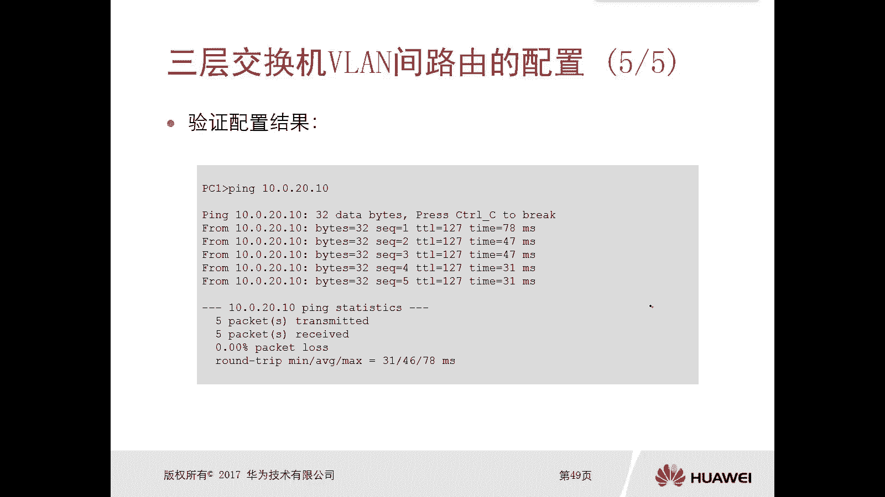
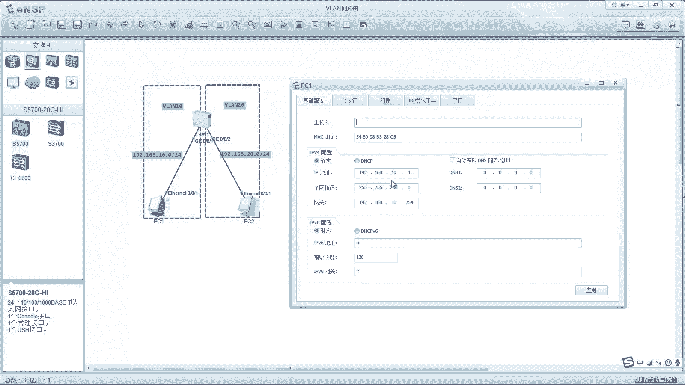
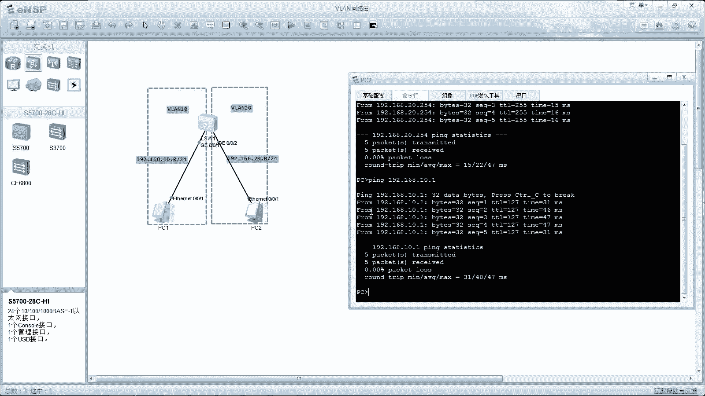
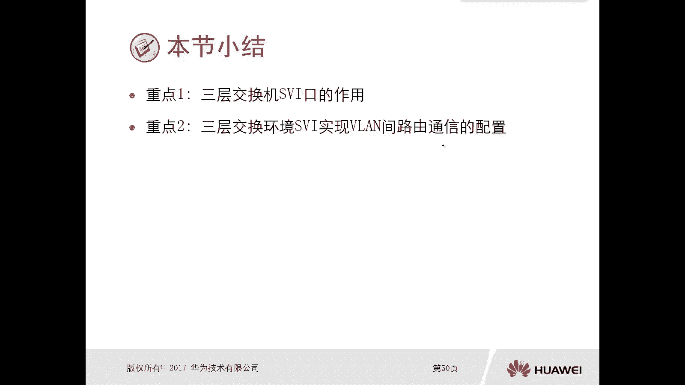

# 华为认证ICT学院HCIA/HCIP-Datacom教程：第2册-第5章-2：VLAN间路由概念及配置三层交换技术 🧠

在本节课中，我们将要学习实现VLAN间通信的第三种方法：**三层交换技术**。我们将了解三层交换机的概念、其核心接口（VLAN接口），并掌握如何配置三层交换机来实现不同VLAN之间的路由。

上一节我们介绍了通过传统路由器和单臂路由实现VLAN间通信的方法。本节中，我们来看看如何利用**三层交换机**这一更高效、更灵活的解决方案。

## 三层交换机概述 🔄

三层交换机是一种集成了**二层交换**和**三层路由**功能的网络设备。它既能在同一VLAN内基于MAC地址进行高速数据帧转发，也能在不同VLAN间基于IP地址进行路由转发。

以下是三层交换机的核心特征：
*   **二层交换功能**：与普通二层交换机一样，基于MAC地址表进行数据帧的转发、泛洪或丢弃。其转发逻辑是高度程序化的固定流程。
*   **三层路由功能**：与路由器一样，能够基于IP路由表进行数据包的路由决策。它支持直连路由、静态路由和动态路由协议。
*   **硬件转发**：现代三层交换机通过专用硬件（如ASIC芯片）进行数据包转发，速度极快，性能远超早期依靠软件转发的路由器。

因此，三层交换机可以独立完成VLAN的划分与隔离，并实现VLAN间的路由，无需再外接路由器。

## VLAN接口（SVI）环境 🏷️

要在三层交换机上实现VLAN间路由，核心在于配置**VLAN接口**，也称为**SVI**。

*   **SVI是什么？** SVI是一个**逻辑三层接口**，与一个特定的VLAN绑定。我们可以为它配置IP地址。
*   **SVI的作用**：为所属VLAN内的设备充当**默认网关**。当VLAN内的主机需要与其它VLAN通信时，会将数据包发送给SVI接口的IP地址。三层交换机收到后，会查询自身的路由表，将数据包路由到目的VLAN对应的SVI接口，最终送达目标主机。
*   **逻辑拓扑**：配置了SVI接口的三层交换机，在逻辑上等同于一台拥有多个子接口的路由器。每个SVI接口就像路由器上的一个物理接口，负责一个网段（VLAN）的路由。

## 三层交换机VLAN间路由配置 ⚙️

配置三层交换机实现VLAN间路由主要分为两个步骤：**VLAN配置**和**SVI接口配置**。

以下是具体的配置流程与命令示例：

1.  **创建VLAN并将端口划入VLAN**（二层功能）：
    ```bash
    # 进入系统视图
    system-view
    # 批量创建VLAN 10和VLAN 20
    vlan batch 10 20
    # 进入连接PC1的接口（例如GigabitEthernet 0/0/1）
    interface GigabitEthernet 0/0/1
    # 设置端口链路类型为Access
    port link-type access
    # 将端口划入VLAN 10
    port default vlan 10
    # 退出接口视图，进入连接PC2的接口
    quit
    interface GigabitEthernet 0/0/2
    port link-type access
    port default vlan 20
    ```

2.  **创建SVI接口并配置IP地址**（三层功能）：
    ```bash
    # 创建并进入VLAN 10的接口视图
    interface Vlanif 10
    # 配置IP地址，此地址将作为VLAN 10内主机的网关
    ip address 192.168.10.254 24
    # 退出并创建VLAN 20的接口
    quit
    interface Vlanif 20
    ip address 192.168.20.254 24
    ```

3.  **验证配置**：
    ```bash
    # 查看VLAN信息，确认端口划分正确
    display vlan
    # 查看接口IP状态，确认Vlanif接口状态为UP
    display ip interface brief
    # 查看路由表，确认已生成VLAN 10和VLAN 20的直连路由
    display ip routing-table
    ```



4.  **主机配置**：将PC1的IP地址设置为`192.168.10.1/24`，网关设置为`192.168.10.254`；将PC2的IP地址设置为`192.168.20.1/24`，网关设置为`192.168.20.254`。

配置完成后，PC1和PC2之间即可相互ping通，实现了跨VLAN的通信。

## 实验演示与小结 ✅

通过实验拓扑（一台三层交换机连接两台属于不同VLAN的PC）进行配置后，可以验证：
*   PC能够ping通自己的网关（对应的Vlanif接口地址）。
*   PC能够ping通另一VLAN中的PC。





**本节课中我们一起学习了：**
1.  **三层交换机**的概念，它集二层交换与三层路由于一体。
2.  **VLAN接口**的核心作用，它是实现VLAN间路由的逻辑三层接口和网关。
3.  配置三层交换机实现**VLAN间路由**的具体步骤：创建VLAN、划分端口、配置SVI接口IP地址。



与单臂路由相比，三层交换技术**无需外接路由器**，**数据转发路径更优**（无需在物理链路上往返），是园区网中实现VLAN间路由的**首选和主流方案**。