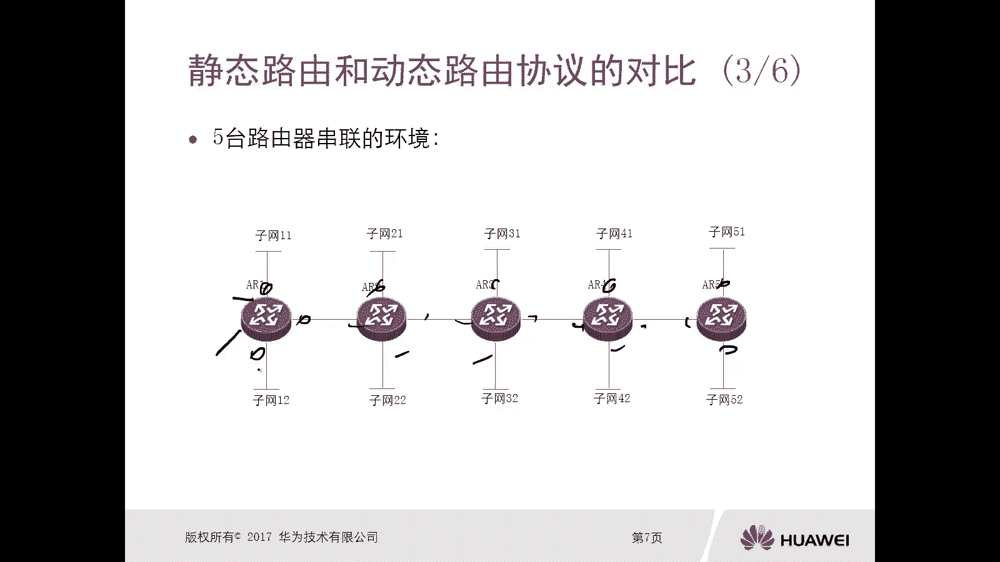
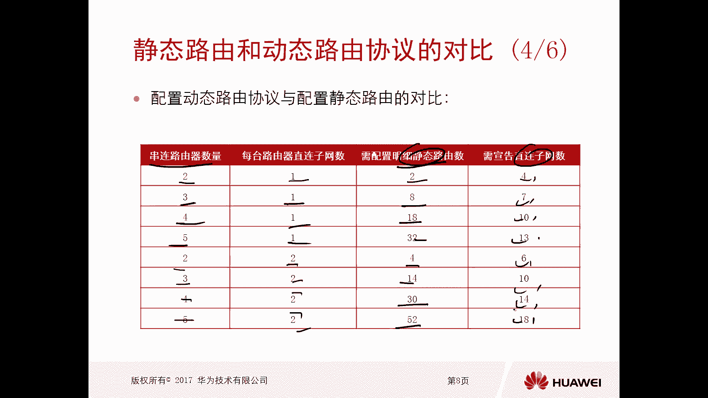
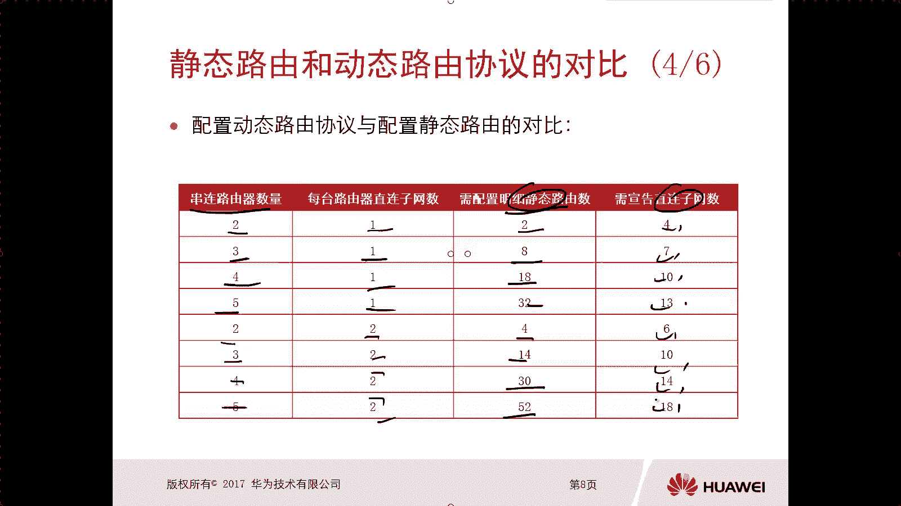
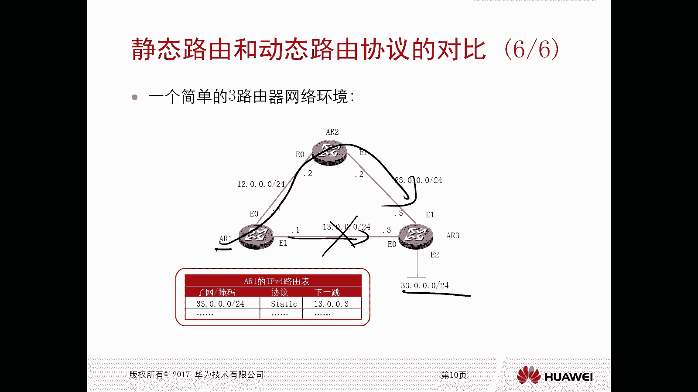
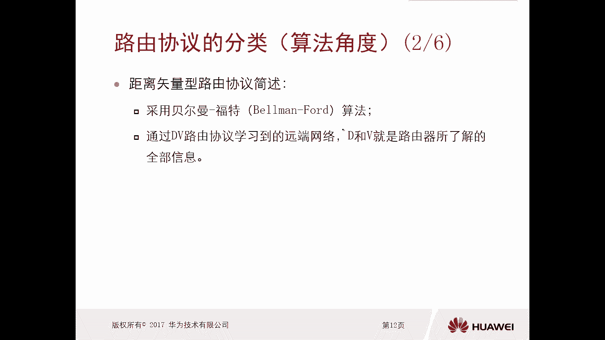
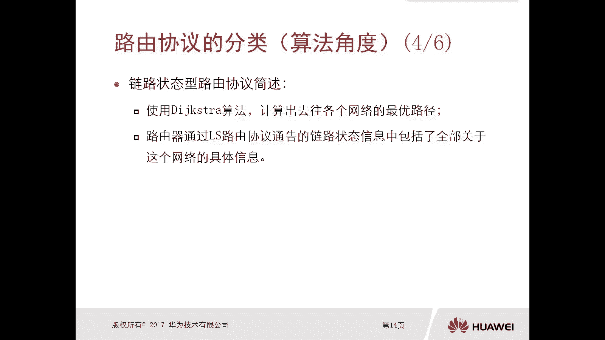
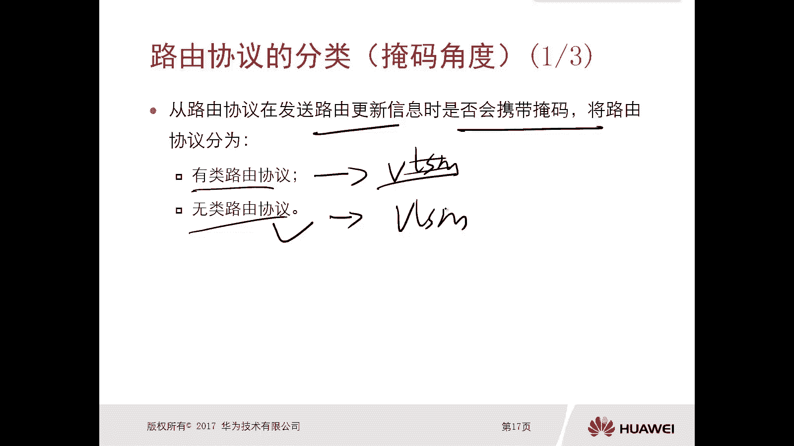
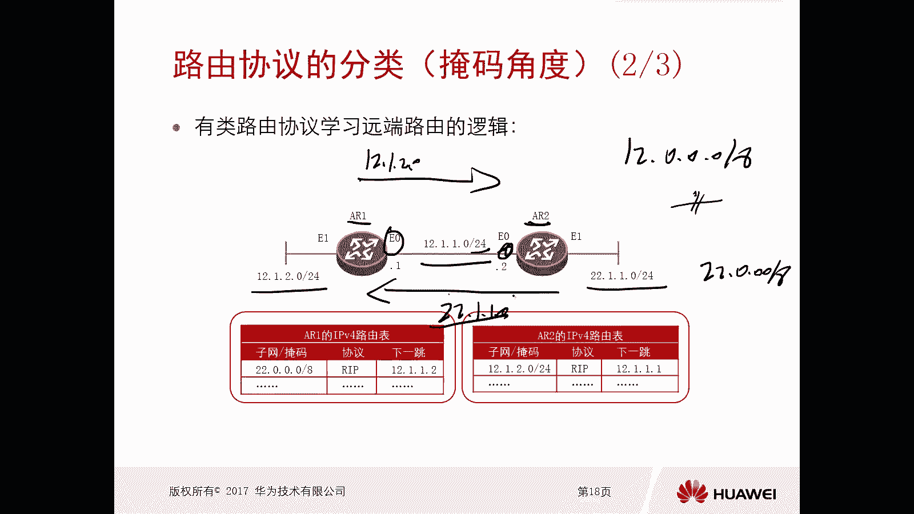
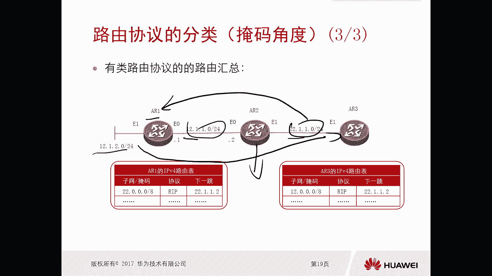
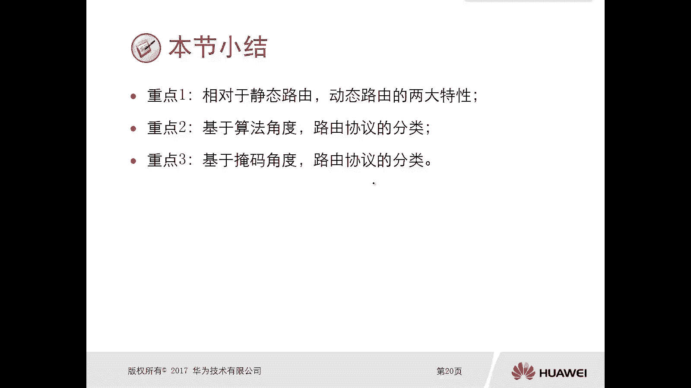

# 华为认证ICT学院HCIA/HCIP-Datacom教程：第2册-第6章-1：动态路由概述 🧭

在本节课中，我们将要学习动态路由协议的基本概念。我们将通过与静态路由的对比，了解动态路由的优势，并介绍其主要的分类方式，为后续深入学习各类动态路由协议打下基础。

## 静态路由与动态路由的对比

上一节我们介绍了静态路由，本节中我们来看看动态路由协议与静态路由有何不同。相对于静态路由，动态路由协议更适合于大规模的网络环境，主要基于以下两个理由。

### 理由一：扩展性强

动态路由协议的扩展性远强于静态路由。这主要体现在配置的复杂度上。

以下是具体体现：
1.  **配置难度**：随着网络规模的增加，配置静态路由的难度会急剧增大。例如，在两台路由器上配置静态路由可能只需几条命令，但在一个有50台路由器、100个网段的网络中，手动配置静态路由将变得极其复杂。
2.  **配置简化**：配置动态路由时，管理员通常只需在路由器上宣告其直连的网络。路由器之间会自动交换路由信息，这极大地简化了配置工作。

为了更直观地理解，我们来看一个例子。假设有五台路由器（AR1至AR5）串联，每个路由器连接了多个子网。若要让所有子网互通，采用静态路由的方案如下：

*   在AR1上，需要配置约11条静态路由才能访问全网所有非直连子网。
*   在AR2上，需要配置约10条静态路由。
*   以此类推，AR3、AR4、AR5也需配置大量路由。
*   五台路由器总计需要配置约52条静态路由。

如果网络规模更大，或某个路由器新增了子网，管理员需要在全网所有相关路由器上手动添加或修改静态路由，工作量巨大且容易出错。静态路由也不会因为拓扑变化而自动消失或更新。

相反，如果采用动态路由协议，管理员只需在每个路由器上宣告其直连的链路（例如，AR1宣告3条，AR2宣告4条等），路由器之间就会自动学习并生成完整的路由表。当新增子网时，也只需在新增子网的路由器上进行宣告，其他路由器会自动学习到这条新路由。

下表清晰地展示了在不同规模网络中，静态路由条目数与动态路由宣告数的对比：

| 路由器数量 | 每台路由器直连子网数 | 静态路由条目总数 | 动态路由宣告总数 |
| :--- | :--- | :--- | :--- |
| 2 | 1 | 2 | 4 |
| 3 | 1 | 8 | 7 |
| 4 | 1 | 18 | 10 |
| 5 | 1 | 32 | 13 |
| 2 | 2 | 4 | 6 |
| 3 | 2 | 14 | 10 |
| 4 | 2 | 30 | 14 |
| 5 | 2 | 52 | 18 |

可以看出，在小规模网络中，两者差距不大。但随着网络规模和子网数量的增加，动态路由在配置简化方面的优势就非常明显了。

### 理由二：具备应变能力

动态路由协议具备强大的网络应变能力，而静态路由则缺乏这种能力。

静态路由一旦配置，就不会自动改变。即使网络链路出现故障，数据包仍会试图通过失效的路径转发，导致通信中断，除非管理员手动介入修改路由。因此，静态路由不适合在大型网络中单独使用。

动态路由协议则可以对网络异常（如链路故障）进行自动感知和收敛。当某条路径失效时，路由协议会重新计算最优路径，并更新所有路由器的路由表，确保流量能够通过其他可用路径正常转发。

我们可以用一个简单的比喻来理解：
*   **静态路由**：好比是路口一个固定的指路牌，写着“此路通往A地”。如果前方道路施工，指路牌不会改变，你仍可能走向错误或不通的路。
*   **动态路由**：好比是手机上的导航软件（如高德地图、百度地图）。它能实时感知路况，如果某条路拥堵或封闭，它会立即为你重新规划一条更优的路线。

例如，在一个三台路由器（AR1, AR2, AR3）组成的简单网络中，AR1通过AR3访问子网 `33.0.0.0/24`。如果使用静态路由，AR1的下一跳指向AR3。一旦AR1与AR3之间的链路故障，通信就会中断，除非在AR1上额外配置一条经过AR2的静态路由。而如果使用动态路由，当主链路故障时，协议会自动计算并通过AR1->AR2->AR3的新路径转发流量。

## 动态路由协议的分类

了解了动态路由的优势后，本节我们来看看动态路由协议有哪些主要的分类方式。

### 按算法分类

根据路由协议所使用的核心算法，主要分为两大类：**距离矢量型路由协议**和**链路状态型路由协议**。

*   **距离矢量路由协议**
    *   英文：Distance-Vector，简称 **DV**。
    *   使用算法：贝尔曼-福特算法。
    *   工作原理：运行DV协议的路由器将自己已知的路由信息（**距离**和**方向/下一跳**）通告给邻居路由器。每个路由器都根据邻居告知的信息来更新自己的路由表，但并不了解全网的拓扑结构。
    *   特点：这种方式类似于“道听途说”。好比在一个路口，你问环卫工如何去天安门，他告诉你“从那个路口走，大约5公里”。你相信这个信息并依此前行，但并不清楚整个路线细节。因此，DV协议有时也被称为“传话路由”或“依据传闻的路由”。

*   **链路状态路由协议**
    *   英文：Link-State，简称 **LS**。
    *   使用算法：Dijkstra（最短路径优先）算法。
    *   工作原理：运行LS协议的路由器会向网络中所有其他路由器通告自己直连链路的**状态信息**。每台路由器收集这些信息后，能构建出整个网络的完整“地图”（拓扑图），然后独立地使用Dijkstra算法计算出到达每个目的地的最短路径。
    *   特点：这种方式类似于“获得地图”。同样在路口，你问如何去天安门，对方给你一张完整的北京市地图。你可以自己在地图上研究所有可能的路线，并选择最优的一条。因此，LS协议被称为“传信路由”，传递的是可靠的拓扑信息。

简单比较：运行DV协议的路由器只了解局部、间接的信息；而运行LS协议的路由器拥有全局、直接的拓扑信息，能做出更精确的路由决策。

### 按掩码处理方式分类

根据路由器在发送路由更新时是否携带子网掩码信息，路由协议可分为**有类路由协议**和**无类路由协议**。

*   **有类路由协议**：在发送路由更新时**不携带**子网掩码信息。
*   **无类路由协议**：在发送路由更新时**携带**子网掩码信息。

在实际网络环境中，**无类路由协议**应用更为广泛，因为它支持**VLSM**和**CIDR**，能够更高效地利用IP地址空间。而有类路由协议由于不支持VLSM，在地址规划上限制很大，已较少使用。

有类路由协议的工作机制需要特别注意：由于它不发送掩码，接收方路由器需要自行判断该使用什么掩码。判断规则是：**比较接收到的路由前缀与接收接口的IP地址是否属于同一个主类网络**。

*   **如果属于同一个主类网络**，则使用接收接口的掩码。
*   **如果不属于同一个主类网络**，则使用该IP地址所属主类网络的默认掩码（即A类/8， B类/16， C类/24）。

例如，路由器AR1（接口IP: `12.1.1.1/24`）从邻居收到一条关于 `22.1.1.0` 的路由更新（不携带掩码）。`12.1.1.0` 属于A类主网 `12.0.0.0/8`，而 `22.1.1.0` 属于另一个A类主网 `22.0.0.0/8`。两者不属于同一个主类网络，因此AR1会将这条路由安装为 `22.0.0.0/8`。这实际上在边界路由器上产生了一种自动汇总的效果。

---

本节课中我们一起学习了动态路由协议的概述。我们首先通过对比，明确了动态路由相比静态路由的两大核心优势：**强大的扩展性**和**智能的应变能力**。接着，我们介绍了动态路由协议的两种主要分类方式：按算法可分为**距离矢量型**和**链路状态型**；按掩码处理方式可分为**有类**和**无类**。理解这些基础概念，是后续深入学习RIP、OSPF、IS-IS、BGP等具体路由协议的关键。