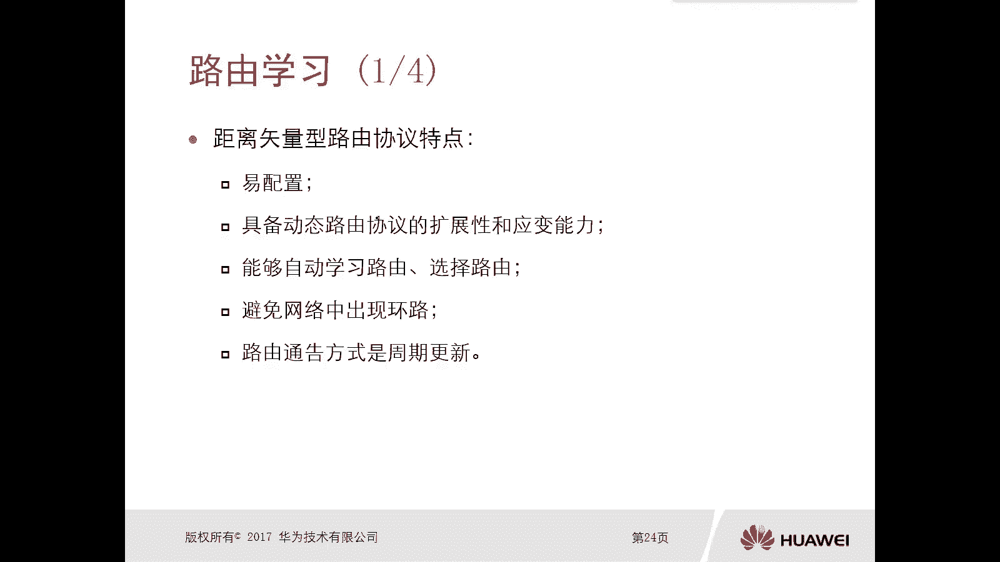
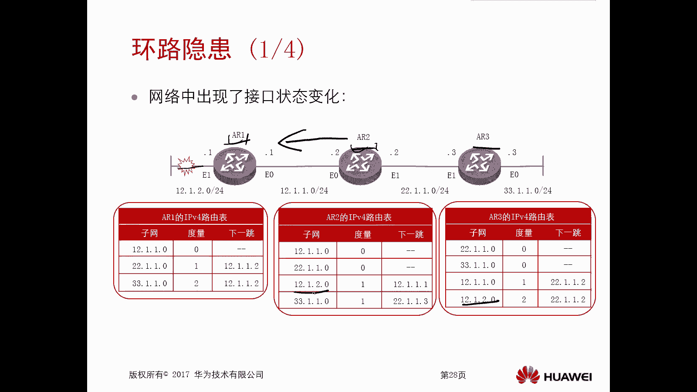
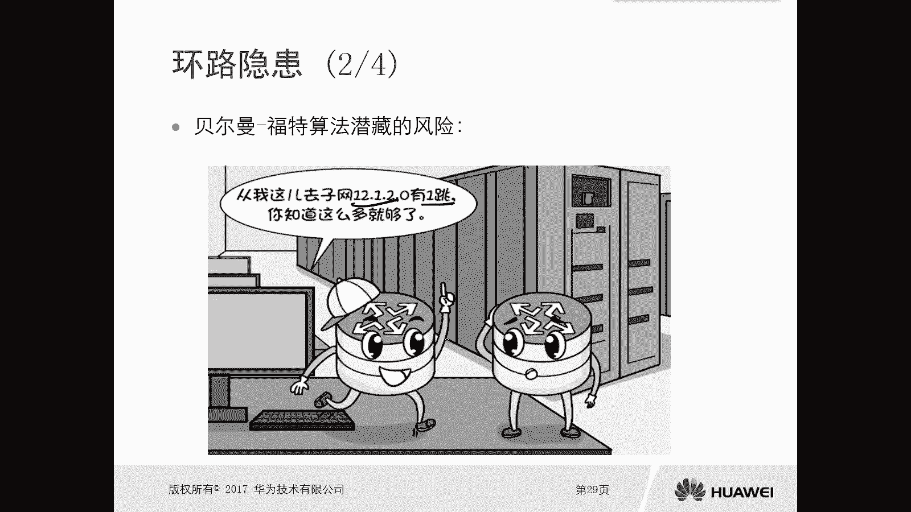
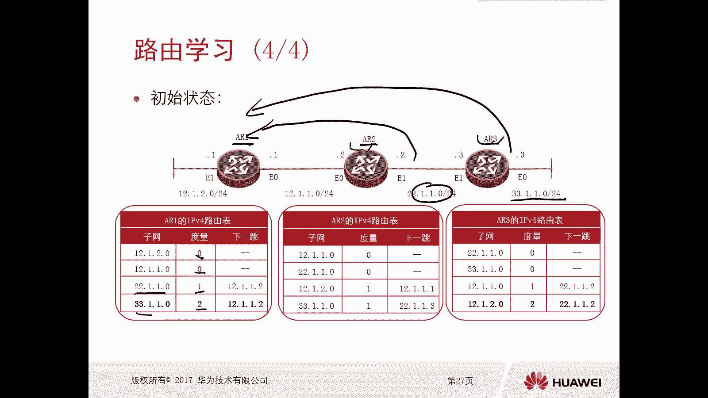
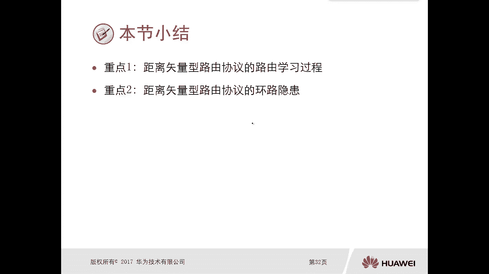
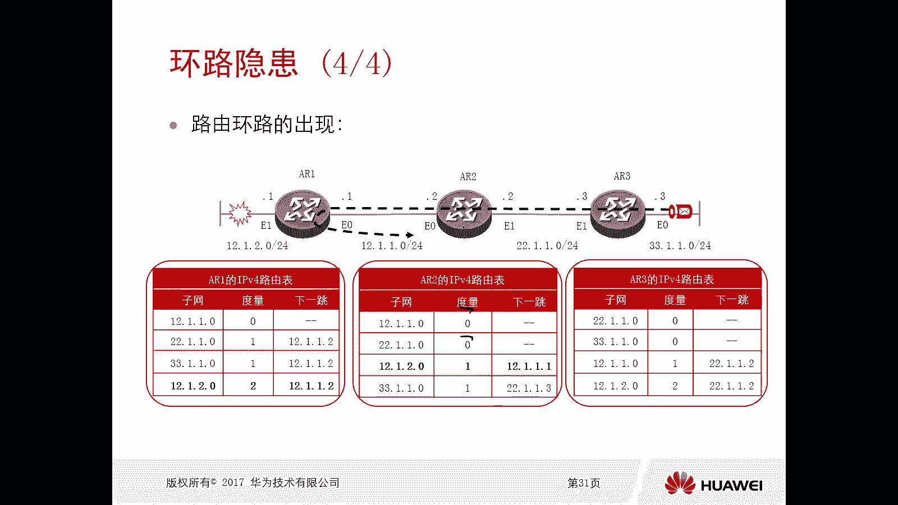
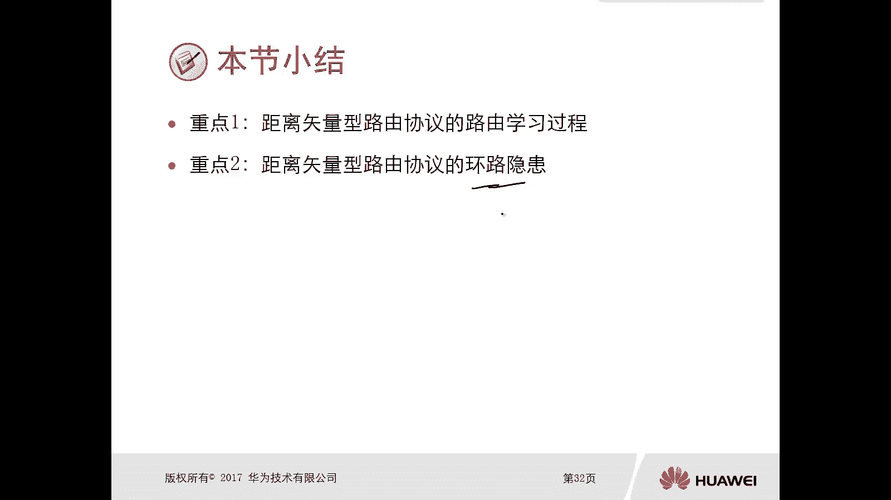

# 华为认证ICT学院HCIA/HCIP-Datacom教程：P34：第2册-第6章-2-距离矢量路由协议 📡

在本节课中，我们将要学习距离矢量路由协议的核心概念。上一节我们介绍了路由协议的两种主要类型：动态路由协议中的距离矢量型和链路状态型。本节中，我们将详细探讨距离矢量路由协议的特点、工作原理以及其固有的环路隐患。

## 距离矢量路由协议概述

距离矢量路由协议是一种动态路由协议。它的核心特点是配置简单，并具备动态路由协议所必需的扩展性和应变能力。协议能够自动学习并选择路由路径。然而，由于其算法特性，网络中存在产生路由环路的隐患，因此协议本身必须包含环路避免机制。路由通告的方式是**周期性更新**，即路由器会按照固定的时间间隔向邻居发送路由更新信息。

## 路由学习过程 🔄

以下是距离矢量路由协议的基本学习过程。我们通过一个由三台路由器（R1, R2, R3）串联的简单拓扑来演示。

1.  **初始状态**：在配置并启动距离矢量路由协议（如RIP）之前，每台路由器的路由表中仅有其直连网络的路由。例如：
    *   R1: 12.1.1.0/24, 12.1.2.0/24
    *   R2: 12.1.1.0/24, 22.1.1.0/24
    *   R3: 22.1.1.0/24, 33.1.1.0/24

2.  **协议运行与路由交换**：当在三台设备上启用距离矢量路由协议后，它们开始周期性地与邻居交换完整的路由表。
    *   R1 将自己的直连路由（12.1.1.0/24, 12.1.2.0/24）通告给 R2。
    *   R2 将自己的直连路由（12.1.1.0/24, 22.1.1.0/24）以及从R1学到的路由（12.1.2.0/24）通告给 R1 和 R3。
    *   同理，R3 也会通告自己的路由。

3.  **路由度量计算**：距离矢量协议使用**跳数**作为度量值。直连网络的跳数为0。每经过一台路由器，跳数加1。
    *   例如，网络 33.1.1.0/24 从 R3 传到 R1，需要经过 R2，因此在 R1 的路由表中，该路由的度量值为 **2**。
    *   路由表条目示例：`目的地网络 | 下一跳 | 度量值`

4.  **稳定状态**：经过几轮更新后，网络达到稳定状态。此时，所有路由器都学习到了去往拓扑中所有网络的路由信息，并且路由表保持一致（指路由前缀信息一致，度量值和下一跳根据位置不同而不同）。

## 环路隐患与产生原因 ⚠️

上一节我们介绍了路由的稳定学习过程，本节中我们来看看距离矢量协议的主要问题：路由环路。环路主要由网络拓扑变化引发，以下是一个典型场景：

1.  **链路故障**：假设 R1 连接网络 12.1.2.0/24 的接口发生故障（链路断开）。R1 会立即从自己的路由表中删除这条直连路由。

2.  **过时信息传播**：然而，R2 和 R3 尚未感知到此变化。在下一个更新周期，R2 仍然会向它的邻居（包括 R1）通告“我可以到达 12.1.2.0/24，度量值为1”这条路由信息。

3.  **错误路由学习**：R1 收到了来自 R2 的这条更新。由于 R1 当前没有关于 12.1.2.0/24 的路由，它会将这条信息加入路由表，并认为：要去往 12.1.2.0/24，下一跳是 R2（12.1.1.2），度量值为 **1+1=2**。这实际上是一条错误的路由。

4.  **环路形成**：此时，如果 R3 有数据要发往 12.1.2.0/24：
    *   数据包到达 R3，R3 查表后发给下一跳 R2。
    *   R2 查表后发给下一跳 R1。
    *   R1 查表（错误路由）后，又发回给下一跳 R2。
    *   数据包在 R1 和 R2 之间来回传递，形成**路由环路**，直至生存时间耗尽。

环路产生的根本原因在于：**距离矢量协议的路由信息是“传闻式”的**。路由器并不了解整个网络的拓扑，仅根据邻居的“口头”通告来更新路由表，当网络发生变化时，信息更新不同步，就容易导致环路。

## 核心概念总结

本节课中我们一起学习了距离矢量路由协议的两个核心要点：

*   **路由学习过程**：路由器通过**周期性**向邻居广播完整的路由表来交换信息。度量值（跳数）随着传播逐跳增加。最终目标是使所有路由器获得一致的全网路由信息。
*   **环路隐患**：由于信息更新的延迟和“传闻式”学习机制，在网络拓扑发生变化时（如链路故障），容易导致错误的路由被学习，从而引发**路由环路**。因此，在实际的距离矢量协议（如RIP）中，必须部署诸如**水平分割**、**毒性逆转**、**触发更新**和**最大跳数限制**等机制来避免环路，这些内容我们将在后续具体协议章节中详细讲解。