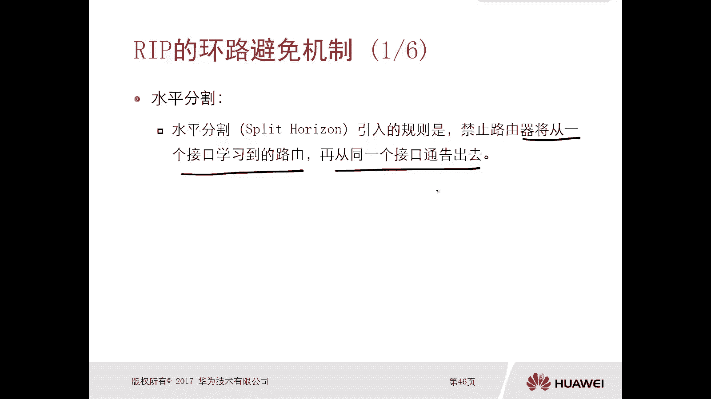
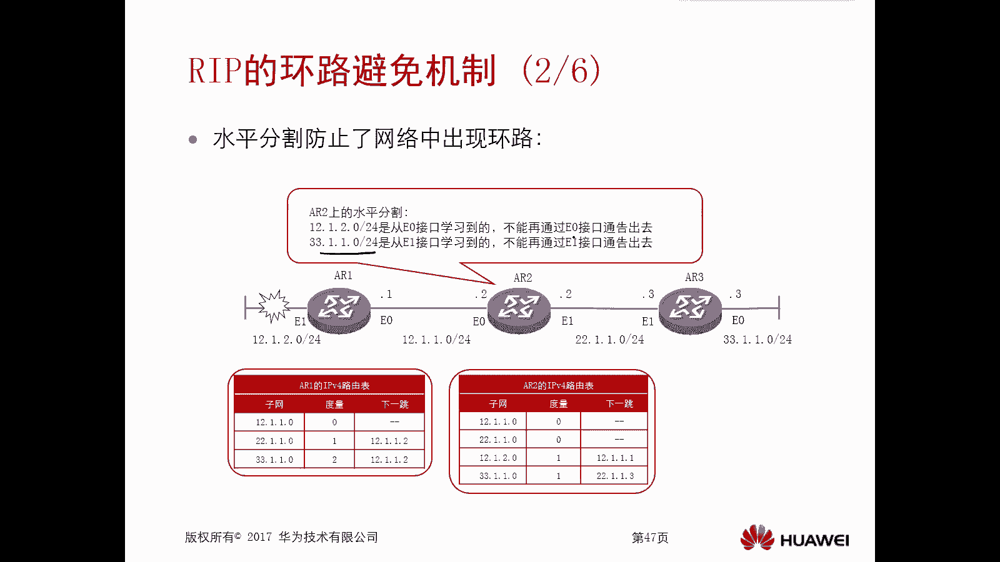
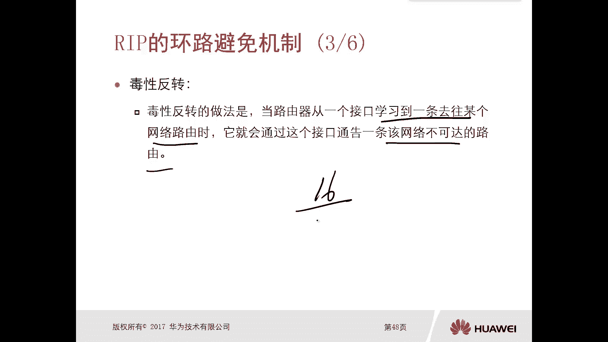
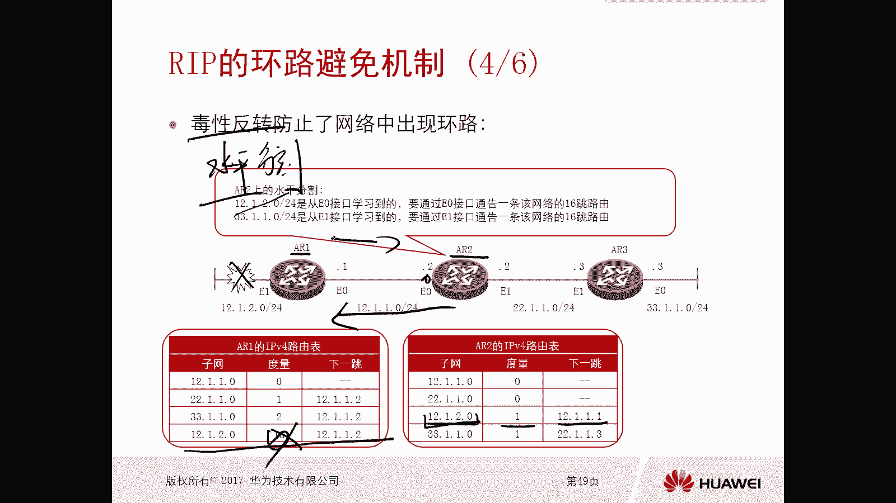
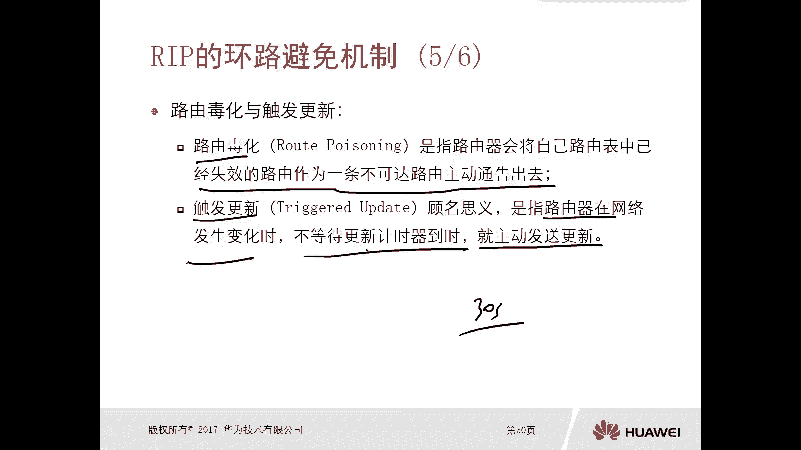
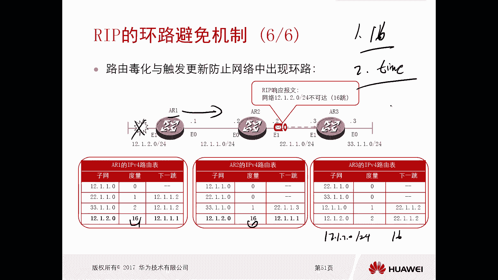

# 华为认证ICT学院HCIA/HCIP-Datacom教程：第2册-第6章-3：RIP的防环机制 🔄

在本节课中，我们将要学习RIP协议中至关重要的防环机制。RIP作为一种典型的距离矢量路由协议，其算法本身存在产生路由环路的风险。因此，协议在设计时引入了一系列机制来避免环路，确保网络的稳定性和可靠性。我们将逐一解析这些机制的工作原理。

## 水平分割 ✂️

上一节我们介绍了RIP协议的基本原理，本节中我们来看看其首要的防环机制——水平分割。水平分割的核心规则是：**禁止路由器将从某个接口学习到的路由信息，再从同一个接口通告出去**。

以下是水平分割的工作示例：
*   假设网络中有三台路由器AR1、AR2、AR3互联，初始状态下路由信息稳定。
*   当AR1的直连网段`10.1.2.0/24`出现故障时，AR1会从路由表中撤销该路由。
*   在未启用防环机制时，AR2可能会在周期性更新中，将原本从AR1学到的`10.1.2.0/24`路由（下一跳指向AR1）再通告回给AR1，导致AR1学习到错误的路由，形成环路。
*   启用水平分割后，由于AR2是从自己的`GE0/0/0`接口学习到`10.1.2.0/24`路由的，因此它**不会**再将这条路由从`GE0/0/0`接口通告出去。这样，AR1就不会从AR2那里重新学到这条已失效的路由，从而避免了环路。

在华为设备上，默认情况下，所有运行RIP的接口都启用了水平分割。

## 毒性逆转 ☠️

接下来我们看第二种防环机制——毒性逆转。毒性逆转的思路与水平分割恰好相反，但它能达到同样的防环目的。

以下是毒性逆转的工作原理：
*   当一台路由器从一个接口学习到一条路由后，它**仍然会**将这条路由从该接口回传给邻居。
*   关键区别在于，回传时它会将这条路由的度量值（跳数）标记为**16**。在RIP中，跳数为16即代表“不可达”。
*   因此，邻居路由器收到这条跳数为16的路由更新后，便知道该路径无效，不会将其用于数据转发。

**注意**：毒性逆转与水平分割是互斥的。如果在一个接口上启用了毒性逆转，水平分割将自动失效。默认情况下，接口启用的是水平分割。

## 路由毒化与触发更新 ⚡

第三种重要的防环机制结合了“路由毒化”和“触发更新”。这两种机制协同工作，能极大地加快网络收敛速度，防止环路产生。

以下是这两个概念的解释：
*   **路由毒化**：当路由器检测到某条直连路由失效时，它会**主动**将该路由的跳数设置为16，并通告给邻居。这相当于立即宣布“此路不通”。
*   **触发更新**：RIP默认每30秒发送一次周期性更新。触发更新机制规定，一旦路由表发生变化（如路由失效），路由器**不必等待**30秒的更新周期，而是**立即**发送包含变化信息的更新报文。

以下是两者结合的工作流程：
1.  如图，当AR1的`10.1.2.0/24`直连网段失效。
2.  AR1**立即（触发更新）** 向AR2发送更新，其中`10.1.2.0/24`的跳数被标记为16（路由毒化）。
3.  AR2收到后，更新自己的路由表，并**立即**向AR3触发更新，同样通告跳数为16的该路由。
4.  很快，全网所有路由器都知道了`10.1.2.0/24`网络不可达，并清除了相关路由条目。由于信息同步迅速，避免了因信息不一致而产生的环路。

## 其他辅助机制 ⏱️

除了上述核心机制，RIP还利用一些计时器和固有规则来辅助防环。

以下是相关的辅助机制：
*   **最大跳数限制**：RIP定义最大有效跳数为15，跳数16代表不可达。这从根本上限制了环路的传播范围。
*   **计时器机制**：
    *   **更新计时器（Update Timer）**：默认30秒，用于发送周期性路由更新。
    *   **老化计时器（Age Timer）**：默认180秒。如果一条路由在180秒内未收到更新，则将其标记为可能失效（跳数设为16）。
    *   **垃圾收集计时器（Garbage-Collect Timer）**：默认120秒。在将路由标记为16跳后，启动此计时器。在此时间内，路由器会继续通告这条毒化路由（跳数16），以确保所有邻居都收到该失效信息。计时器超时后，才从路由表中彻底删除该路由。

这些计时器共同作用，确保无效路由能被及时识别并清除，进一步巩固了网络的防环能力。

## 总结 📝

本节课中我们一起学习了RIP协议中多种有效的防环机制。**水平分割**通过禁止反向通告来预防环路；**毒性逆转**通过通告不可达路由来达到相同目的；**路由毒化与触发更新**相结合，能快速清除失效路由，加速全网收敛；此外，**最大跳数限制**和**更新、老化、垃圾收集计时器**等辅助机制也为网络的稳定运行提供了保障。这些机制共同构成了RIP协议稳定可靠的基础。