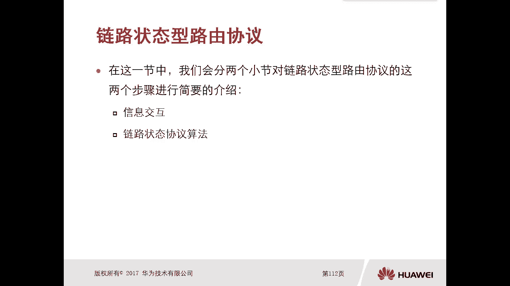
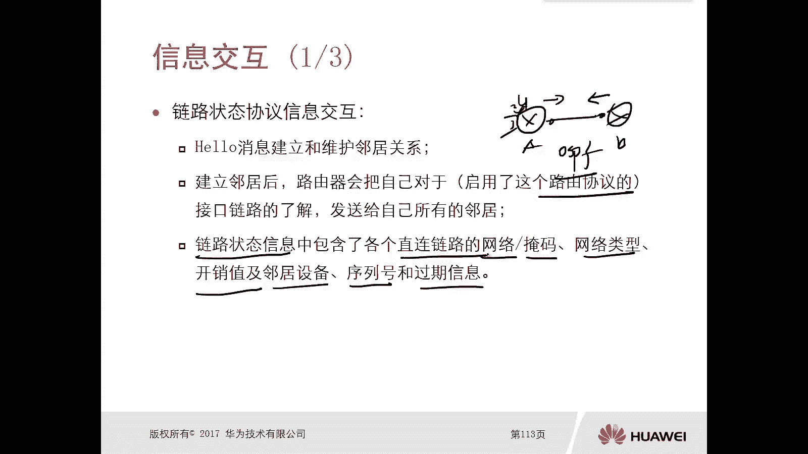
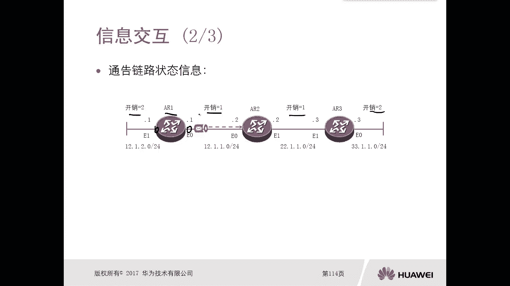
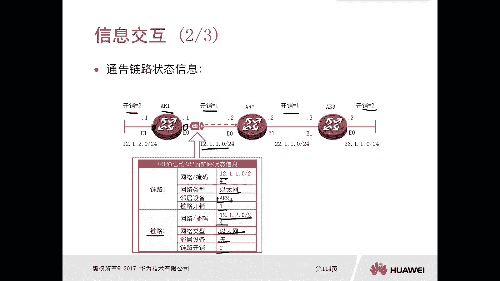
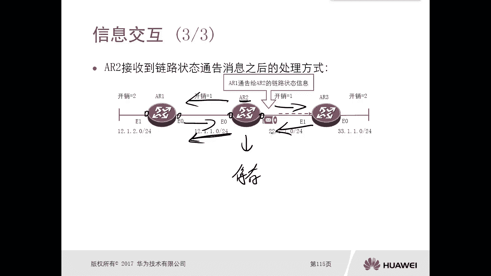
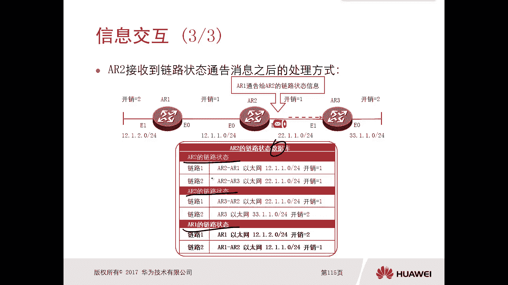
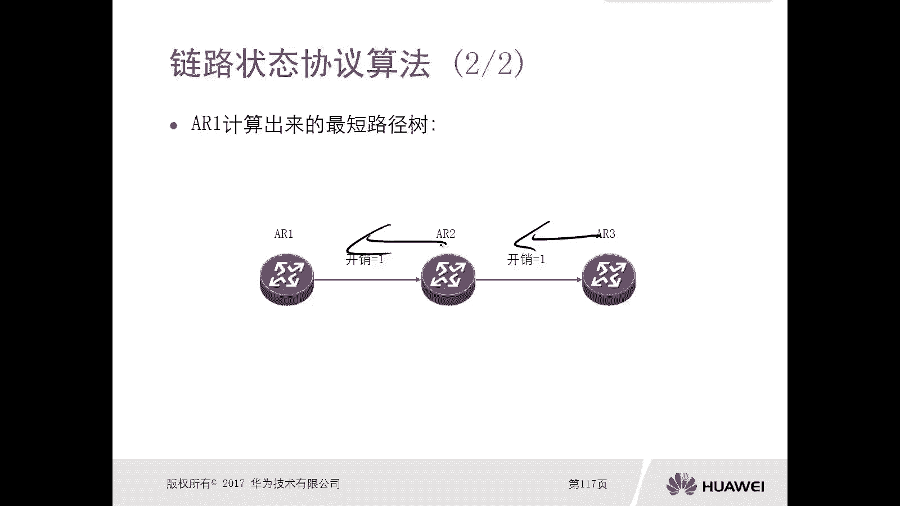
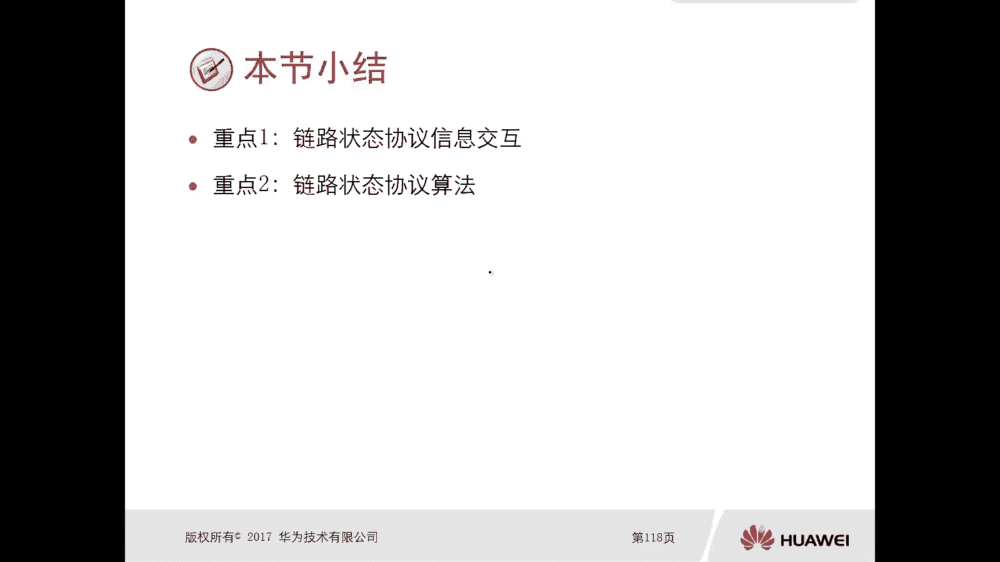

# 华为认证ICT学院HCIA/HCIP-Datacom教程：第2册-第6章-4：链路状态路由协议 📡



在本节课中，我们将要学习链路状态路由协议。我们将分为两个部分进行介绍：首先是链路状态协议的信息交互过程，然后是链路状态协议的核心算法。通过本节学习，你将理解链路状态协议如何工作，以及它与距离矢量协议的区别。

---

## 信息的交互过程

上一节我们介绍了距离矢量路由协议，本节中我们来看看链路状态路由协议是如何交互信息的。

配置链路状态路由协议（如OSPF）后，路由器首先会相互发送Hello报文。Hello报文用于发现并建立邻居关系，这是距离矢量协议中没有的概念。



建立邻居关系后，路由器会将自己启用了该路由协议的接口的链路状态信息，发送给所有邻居。链路状态信息包含直连链路的网络掩码、网络类型、开销值、邻居设备以及序列号和过期信息等。这与距离矢量协议仅传递路由信息（网络掩码和开销）不同，内容更为丰富。

以下是链路状态信息交互的步骤：
1.  **建立邻居**：通过Hello报文建立邻居关系。
2.  **通告链路状态**：每个路由器将自身的链路状态信息发送给邻居。
3.  **泛洪扩散**：收到链路状态信息的路由器，会将其原封不动地转发给其他邻居（除了信息来源的邻居）。
4.  **同步数据库**：最终，网络中的所有路由器都会拥有一份**完全相同**的、包含整个网络拓扑的链路状态数据库（LSDB）。

这个过程可以比喻为：每个路由器都绘制了自己周边的小地图，并通过邻居交换，最终所有路由器都拼凑出了一张完整的、相同的网络大地图。



---



## 链路状态协议的算法

上一节我们了解了链路状态信息如何收集和同步，本节中我们来看看路由器如何利用这些信息计算最佳路径。

当所有路由器都拥有完整的链路状态数据库（LSDB）后，每台路由器会以**自身为根节点**，独立运行**最短路径优先（SPF）算法**。该算法基于数据库中的拓扑和链路开销信息，计算出到达网络中所有目的地的最短路径树。



以下是SPF算法计算过程的简要说明：
1.  **初始化**：将自身节点放入最短路径树。
2.  **迭代计算**：考察与当前树中节点直接相连的链路，选择总开销最小的链路，将其连接的节点加入树中。
3.  **重复**：重复步骤2，直到所有节点都加入最短路径树。
4.  **生成路由**：根据最终的最短路径树，将最佳路径放入路由表。

例如，路由器A运行SPF算法后，能独立计算出到达网络X的最佳路径是 A -> B -> C -> X，而无需依赖邻居B告知“我到X的开销是多少”。这避免了距离矢量协议可能产生的环路和计数到无穷问题。



核心算法公式可以简化为：
```
最短路径 = SPF(链路状态数据库, 本路由器ID)
```

---

## 重点总结



本节课中我们一起学习了链路状态路由协议的核心机制。

*   **信息交互**：通过建立邻居、交互链路状态信息（LSA）、泛洪扩散，最终使所有路由器同步一个完整的链路状态数据库（LSDB）。
*   **路径计算**：每台路由器以自身为起点，基于LSDB独立运行SPF算法，计算出到达所有目的地的最优路径，从而生成路由表。



链路状态协议通过传递拓扑信息（而非路由），并依赖本地计算，实现了更快的收敛速度和更强的防环能力，适用于中大型网络。