# 华为认证ICT学院HCIA/HCIP-Datacom教程：P37：第2册-第7章-1-OSPF报文类型 📚

在本节课中，我们将要学习OSPF协议中至关重要的五种报文类型。理解这些报文的作用和交互过程，是掌握OSPF工作原理的基础。

## Hello报文 👋

上一节我们介绍了OSPF的基本概念，本节中我们来看看OSPF用于建立和维护邻居关系的Hello报文。

OSPF依靠Hello报文来建立和维护邻居关系。当两台路由器的互联接口运行OSPF后，它们会相互发送Hello包。第一个发送的就是Hello包。A发送Hello包，B看到A；B发送Hello包，A看到B。邻居关系建立成功后，仍需持续发送Hello包以维护该关系。

Hello报文的作用主要有两个：**建立邻居关系**和**维护邻居关系**。

以下是Hello报文封装格式中包含的关键信息：
*   **接口掩码**：发送接口的IP地址掩码信息。
*   **Hello时间间隔**：发送Hello报文的时间间隔。缺省值因网络类型而异，例如在以太网中为10秒。
*   **路由器优先级**：用于选举指定路由器（DR）和备份指定路由器（BDR）。
*   **路由器失效时间间隔**：在此时间内若未收到邻居的Hello包，则认为邻居失效。该时间通常是Hello间隔的4倍（例如，Hello间隔10秒，失效间隔40秒）。
*   **邻居路由器ID列表**：列出已建立邻居关系的路由器ID。

## 建立邻居关系的必要条件 🔗

由于使用Hello报文建立邻居关系，因此必要条件均与Hello报文内容相关。

以下是建立OSPF邻居关系必须满足的条件：
*   **接口掩码匹配**：在广播多路访问网络（如以太网）中，互联接口的掩码必须一致。
*   **Hello时间间隔一致**：两端路由器配置的Hello报文发送间隔必须相同。
*   **失效时间间隔一致**：两端路由器配置的邻居失效时间必须相同。
*   **认证类型和密钥一致**：如果启用了OSPF认证，两端的认证类型和密码必须配置相同。

## 数据库描述报文（DD） 📋

在通过Hello报文建立邻居关系后，路由器需要同步链路状态数据库。首先交互的是数据库描述报文。

DD报文的作用是交换自身链路状态数据库（LSDB）的摘要信息，即一个包含所有LSA头部的清单。这类似于一本书的目录，告知对方自己拥有哪些“章节”（LSA），而非传递完整的“章节”内容。

OSPF路由器通过对比对方发送的DD报文清单，进行查漏补缺，确定自己需要请求哪些完整的LSA信息。

以下是DD报文封装中包含的关键信息：
*   接口MTU、可选项、标记位、序列号等。
*   **各种LSA的头部信息**：注意，这里仅包含LSA头部，而非完整的LSA数据。

## 链路状态请求报文（LSR）与更新报文（LSU） 🔄

当路由器通过DD报文发现自身缺少某些LSA时，便会发起请求。

LSR报文的作用是：路由器在对比DD报文后，向邻居请求自己缺失的特定LSA。

LSU报文的作用是：当路由器收到邻居发来的LSR请求后，会将对方所请求的、完整的LSA封装在LSU报文中，发送给对方。

通过LSU报文，路由器获得了邻居的详细链路状态信息，结合自身信息，便能构建出全网的拓扑视图。

以下是LSU报文封装中包含的关键信息：
*   **LSA数量**：本次更新中包含的LSA条目数。
*   **完整的LSA信息**：包含类型、链路状态ID、通告路由器、序列号、校验和以及具体的网络前缀、掩码、开销等详细数据。

## 链路状态确认报文（LS ACK） ✅

为了保证链路状态信息可靠同步，OSPF设计了确认机制。

LS ACK报文的作用是：当路由器收到邻居发来的LSU报文后，需要对其中包含的每一个LSA进行确认。确认方式是使用这些LSA的头部信息进行回复。

以下是LS ACK报文封装中包含的关键信息：
*   **需要确认的LSA头部列表**：列出所确认LSA的头部信息。

## 五种报文交互流程总结 🧩

现在，让我们将这五种报文的交互流程串联起来：

1.  **Hello报文**：路由器A与B相互发送Hello包，在满足必要条件后，建立邻居关系。
2.  **DD报文**：建立邻居后，A与B相互发送DD报文，交换各自LSDB的摘要（目录）。
3.  **LSR报文**：双方对比DD报文后，发现自己缺失的LSA，于是相互发送LSR报文请求这些LSA。
4.  **LSU报文**：收到LSR请求后，A与B相互发送LSU报文，其中包含对方所请求的完整LSA数据。
5.  **LS ACK报文**：收到LSU报文后，A与B相互发送LS ACK报文，确认已收到相应的LSA。

经过这一系列交互，A和B的链路状态数据库达到同步，都拥有了全网的拓扑信息。

## 报文抓包实例分析 🔍

以下是一个实际的报文抓包示例，展示了这五种报文：

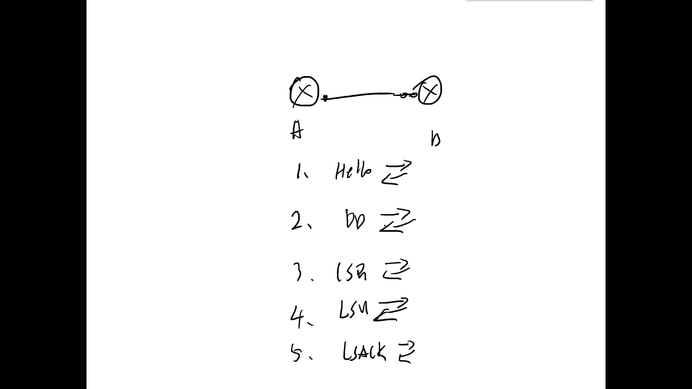

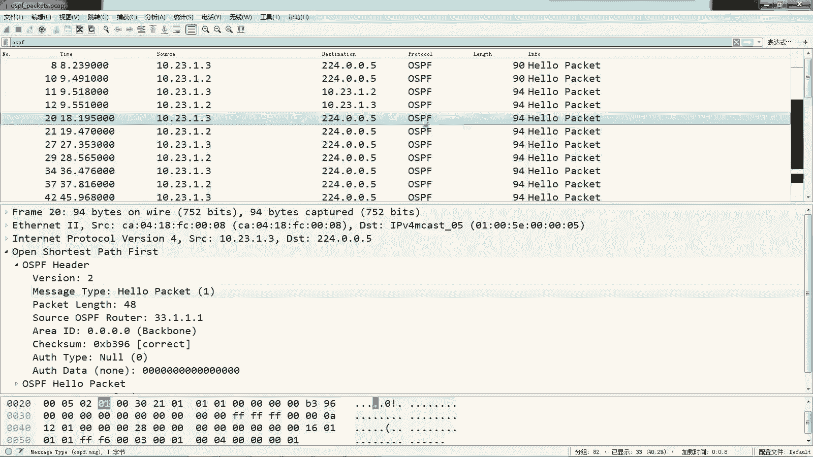

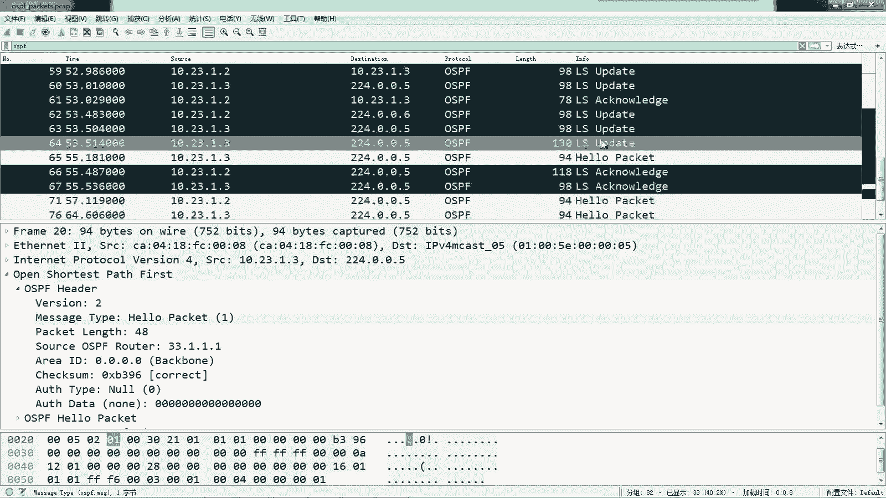

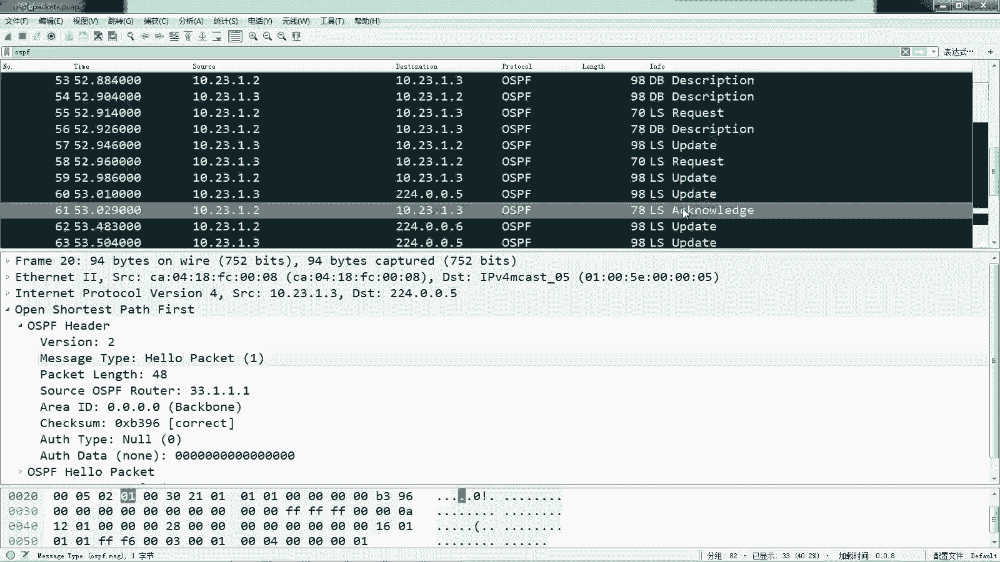

我们可以看到OSPF的Hello Packet、DD报文、LSR、LSU和LSACK。

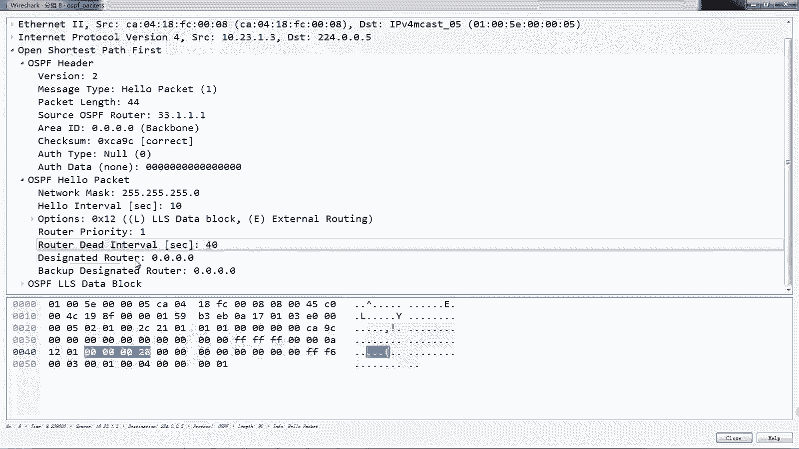

*   **Hello报文**：`Message Type`字段为`1`，数据部分包含掩码、Hello间隔、DR/BDR等信息。
    
    

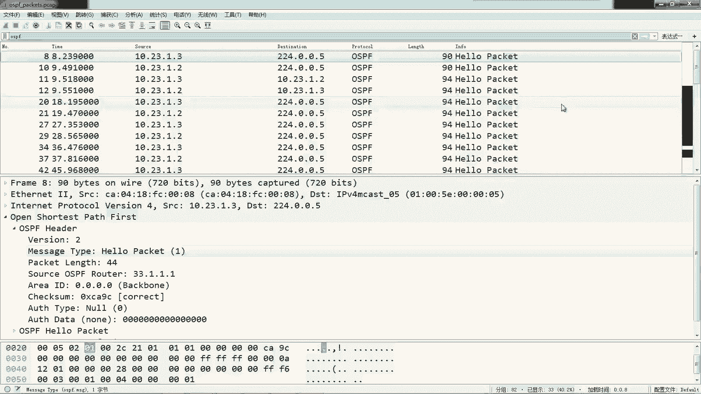

*   **DD报文**：`Message Type`字段为`2`，数据部分主要包含LSA的头部信息（如类型、链路状态ID、通告路由器等），这是一个“清单”。
    
    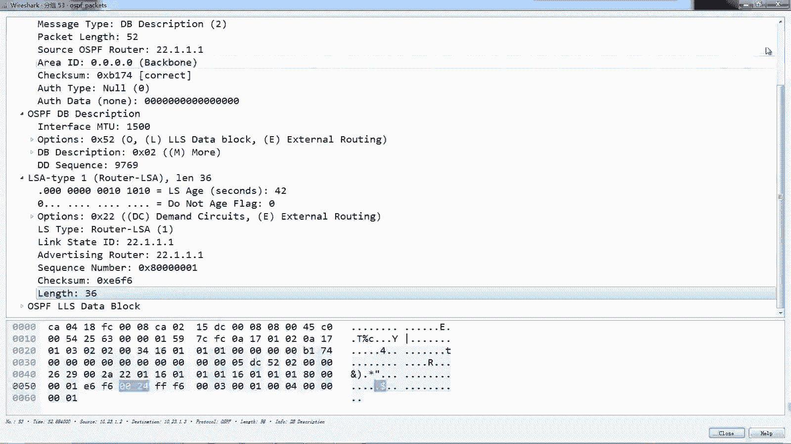

*   **LSR报文**：`Message Type`字段为`3`，数据部分指明请求何种LSA。
    
    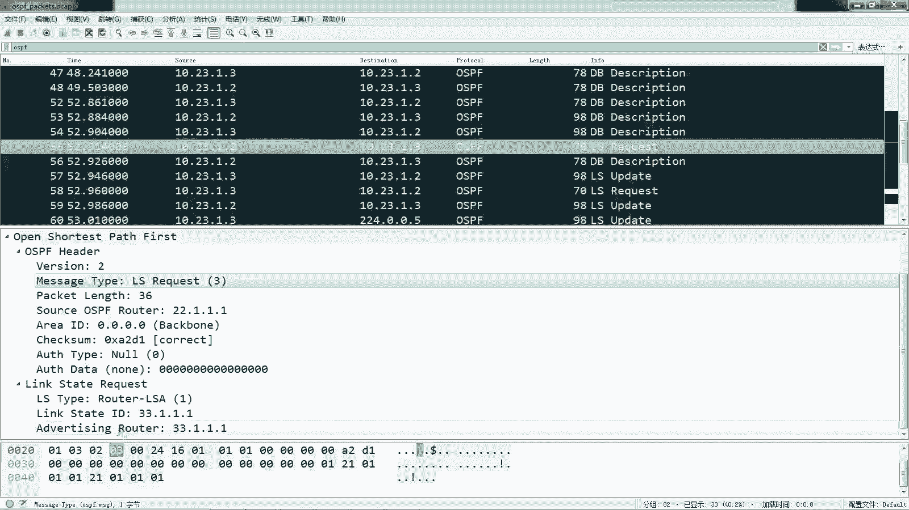

*   **LSU报文**：`Message Type`字段为`4`，数据部分包含**完整的LSA信息**，如网络前缀、掩码、开销值等。
    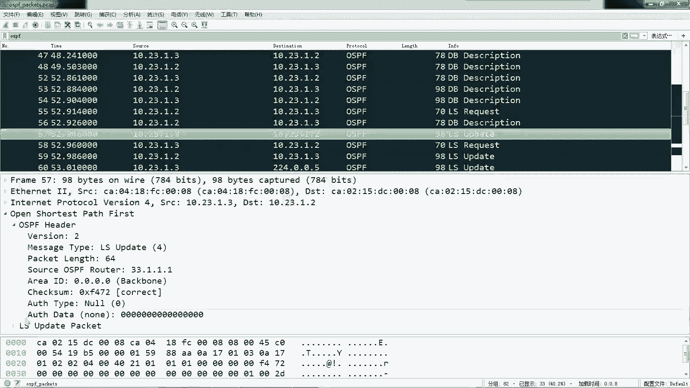
    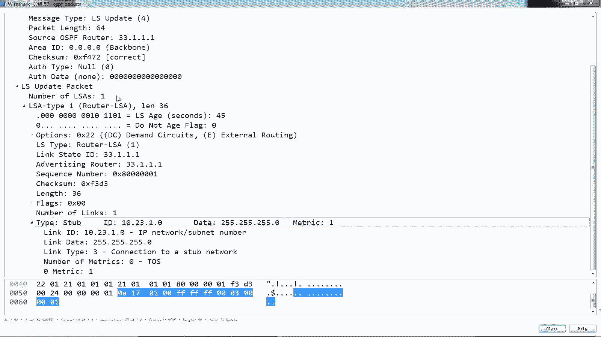

*   **LS ACK报文**：`Message Type`字段为`5`，数据部分包含所确认LSA的头部信息。
    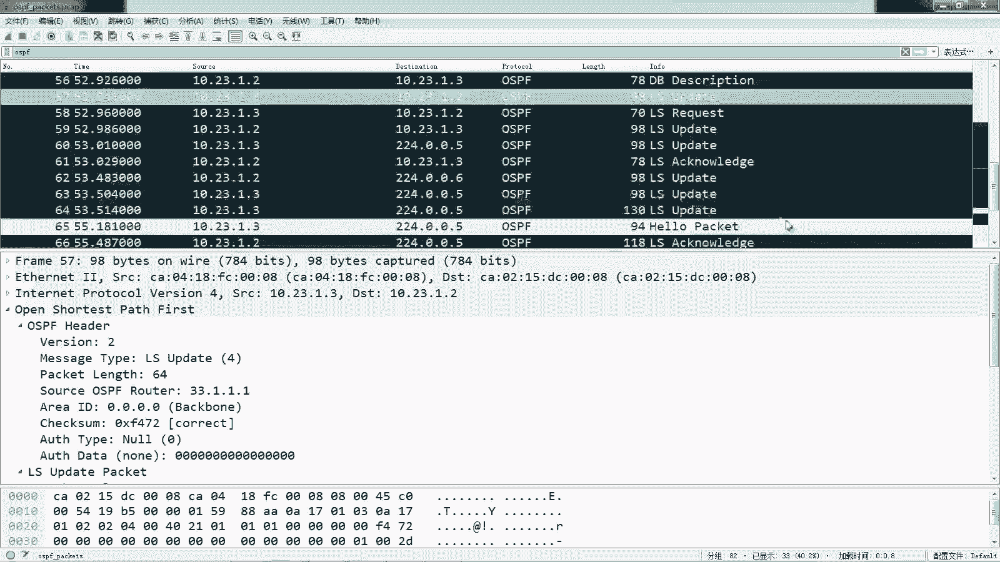
    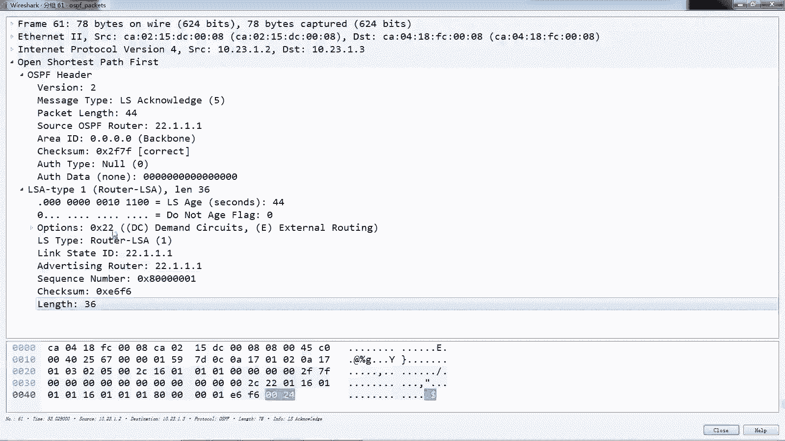

---

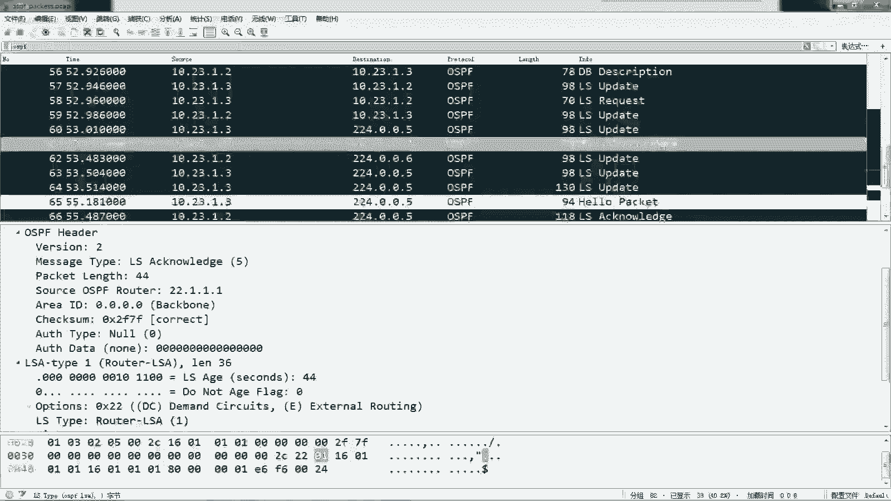

本节课中我们一起学习了OSPF的五种报文类型：Hello、DD、LSR、LSU和LS ACK。我们明确了每种报文的核心作用、交互顺序，并通过抓包实例观察了它们的实际结构。理解这个交互流程是掌握OSPF邻居建立和链路状态数据库同步机制的关键。