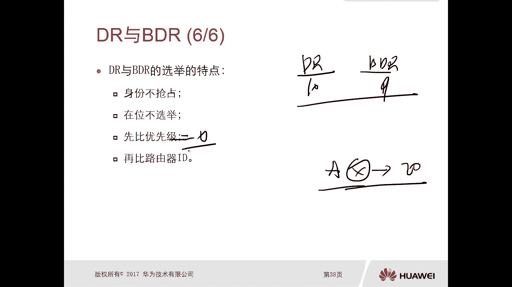

# 华为认证ICT学院HCIA/HCIP-Datacom教程：第2册-第7章-2：OSPF路由器ID及DR、BDR 🖧

在本节课中，我们将要学习OSPF协议中的两个核心概念：路由器ID（Router ID）以及指定路由器（DR）与备份指定路由器（BDR）。理解这些概念对于掌握OSPF在多路访问网络中的工作原理至关重要。

## 路由器ID（Router ID）🔢

上一节我们介绍了OSPF的基本概念，本节中我们来看看如何唯一标识网络中的OSPF路由器。路由器ID（Router ID，简称RID）是一个用于在OSPF网络中唯一标识一台路由器的32位标识符。

路由器ID的格式采用点分十进制表示，类似于IP地址，例如 `192.168.1.1`。但需要明确的是，**路由器ID本身并不是一个IP地址**，它只是一个格式与IP地址相同的标识符。

在OSPF链路状态算法中，每台路由器都会生成描述自身链路状态的链路状态通告（LSA）。为了区分不同路由器生成的LSA，就需要使用路由器ID来标识生成者。

路由器ID具有**非抢占性**。一旦路由器在OSPF进程启动时选定了一个RID（无论是手动配置还是自动选择），在进程不重启的情况下，这个RID将保持稳定，不会改变。

以下是路由器ID的选择规则：

*   **手动配置（最优）**：管理员可以在配置OSPF时直接指定路由器的RID。
*   **自动选择**：如果未手动配置，路由器将按以下顺序自动选择：
    1.  选择最大的环回接口（Loopback）IP地址。
    2.  如果没有环回接口，则选择最大的活动物理接口IP地址。

**强烈建议在部署OSPF时手动配置路由器ID**，以避免因进程重启导致RID变化，进而引发网络问题（例如OSPF虚链路中断）。

## 指定路由器（DR）与备份指定路由器（BDR）👑

在广播型（如以太网）或非广播多路访问（NBMA，如帧中继）网络这类多路访问网络中，如果所有路由器都两两建立完全的邻接关系，会导致链路状态信息泛洪效率低下，产生大量不必要的流量。为了解决这个问题，OSPF引入了DR和BDR机制。

DR和BDR是**接口级别的角色**，而非整台路由器的角色。一台路由器的不同接口可以扮演不同的角色（例如，一个接口是DR，另一个接口是BDR）。

以下是DR和BDR的主要职责：

*   **DR（指定路由器）**：负责与网络中所有其他路由器建立并维护完全的邻接关系。所有路由更新信息首先发送给DR，再由DR负责泛洪给网络中的其他路由器。
*   **BDR（备份指定路由器）**：作为DR的备份，也与所有路由器建立邻接关系。当DR失效时，BDR会自动晋升为新的DR，接替其工作。
*   **DR Other**：既不是DR也不是BDR的路由器。它们只与DR和BDR建立完全的邻接关系，彼此之间仅保持“邻居”关系，不直接交换链路状态数据库。

### DR/BDR的选举规则与特点

DR和BDR的选举基于两个因素：接口的OSPF优先级和路由器ID。

选举过程遵循以下原则：

1.  **比较优先级**：优先级范围是0-255，值越高，优先级越高。华为设备默认接口优先级为**1**。
2.  **比较路由器ID**：如果优先级相同，则比较路由器ID，RID值越大越优。

以下是DR/BDR选举的重要特点：

*   **非抢占性**：选举完成后，即使有更高优先级的新路由器加入网络，也不会抢占现有DR/BDR的角色。这保证了网络的稳定性。
*   **在位不重选**：已经当选为DR或BDR的路由器，在后续的选举中会维持其角色。
*   **优先级为0不参与选举**：将接口的OSPF优先级设置为**0**，意味着该接口放弃选举资格，永远不会成为DR或BDR。

### 信息更新流程示例

为了更直观地理解，我们可以通过一个比喻来描述更新流程：将DR视为“大当家”，BDR视为“二当家”，DR Other视为“小弟”。

1.  当某个“小弟”（DR Other）发现网络变化（如路由更新）时，它只会将这个消息报告给“大当家”（DR）和“二当家”（BDR）。
2.  “大当家”（DR）收到消息后，负责将这个消息广播给网络中的所有其他“小弟”（DR Other）。
3.  如果“大当家”（DR）失效，“二当家”（BDR）会自动接替成为新的“大当家”，并选举一个新的“二当家”，以此保证信息分发机制持续运行。

## 总结 📝

本节课中我们一起学习了OSPF中两个关键的管理性概念。

首先，我们了解了**路由器ID（RID）**，它是一个用于唯一标识OSPF路由器的32位标识符，格式类似IP地址但并非IP。我们学习了其非抢占特性以及手动配置（推荐）和自动选择的规则。

其次，我们深入探讨了在多路访问网络中**DR（指定路由器）和BDR（备份指定路由器）** 的作用与选举机制。它们通过优化邻接关系的建立，显著提高了链路状态信息泛洪的效率。我们掌握了其基于**优先级**和**路由器ID**的选举规则，并理解了**非抢占性**和**在位不重选**等重要特点。

理解路由器ID以及DR/BDR的选举和工作原理，是构建稳定、高效OSPF网络的基础。在接下来的学习中，这些概念将贯穿于OSPF邻居建立、数据库同步等更复杂的主题中。