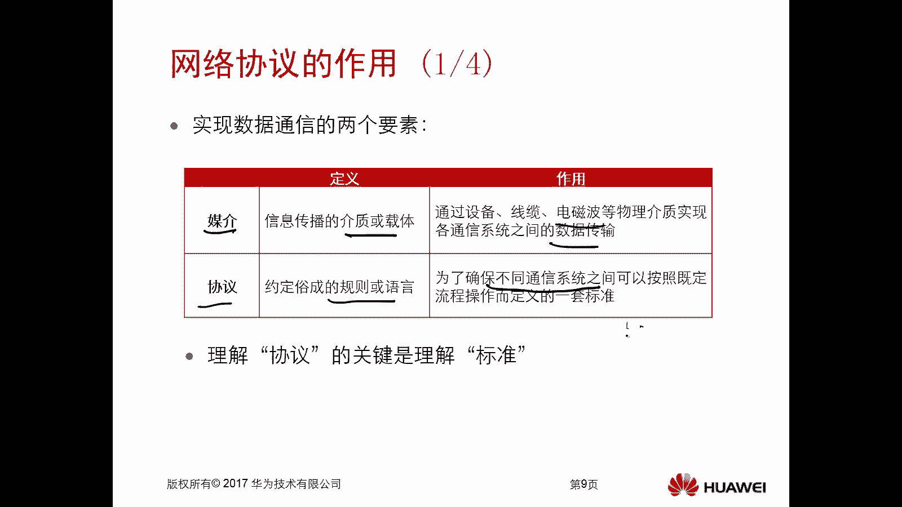
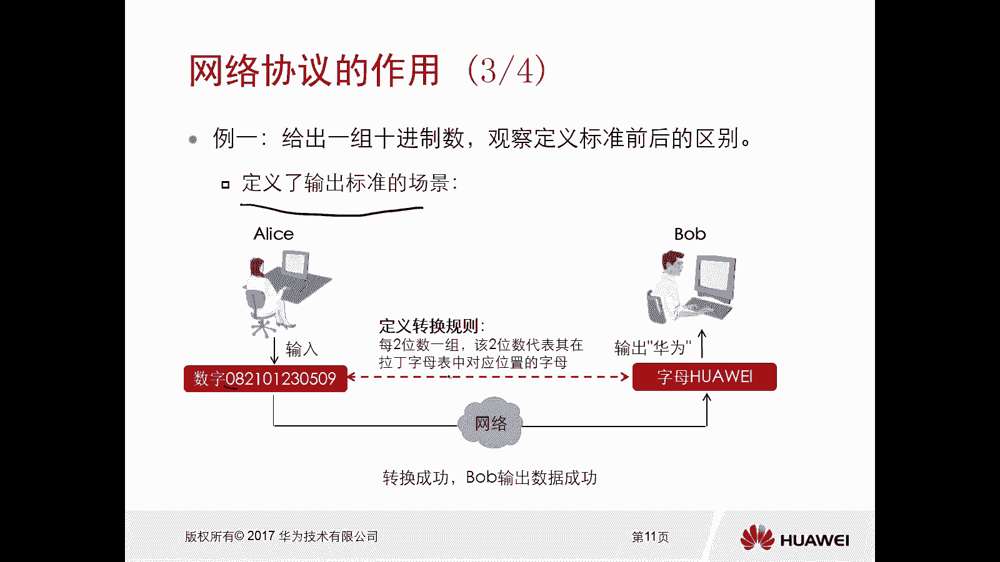
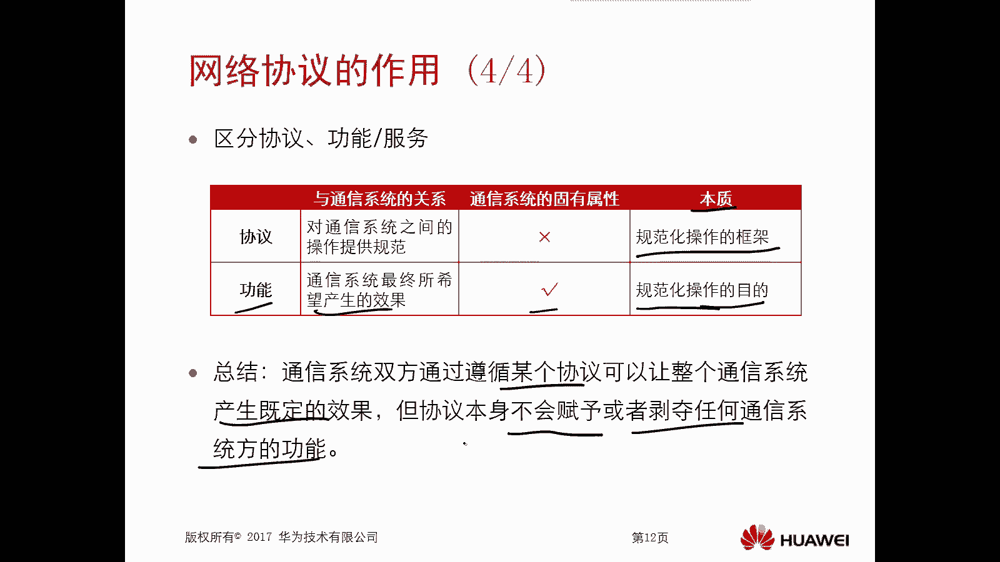
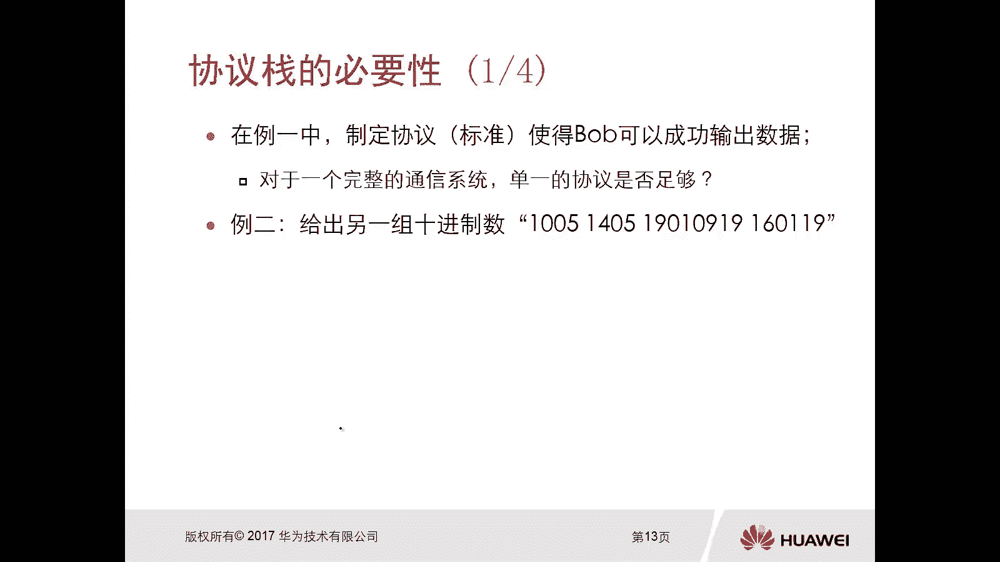
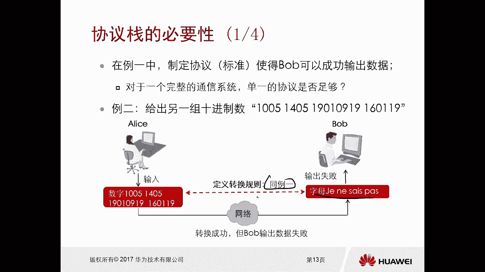
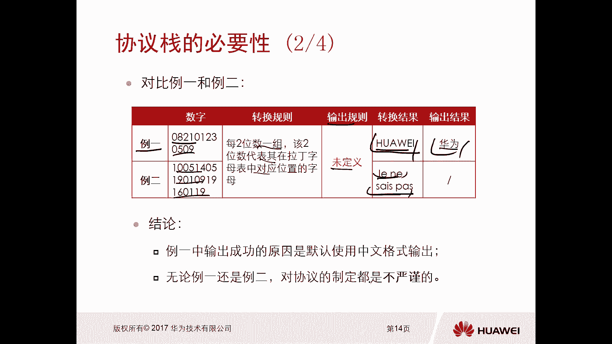
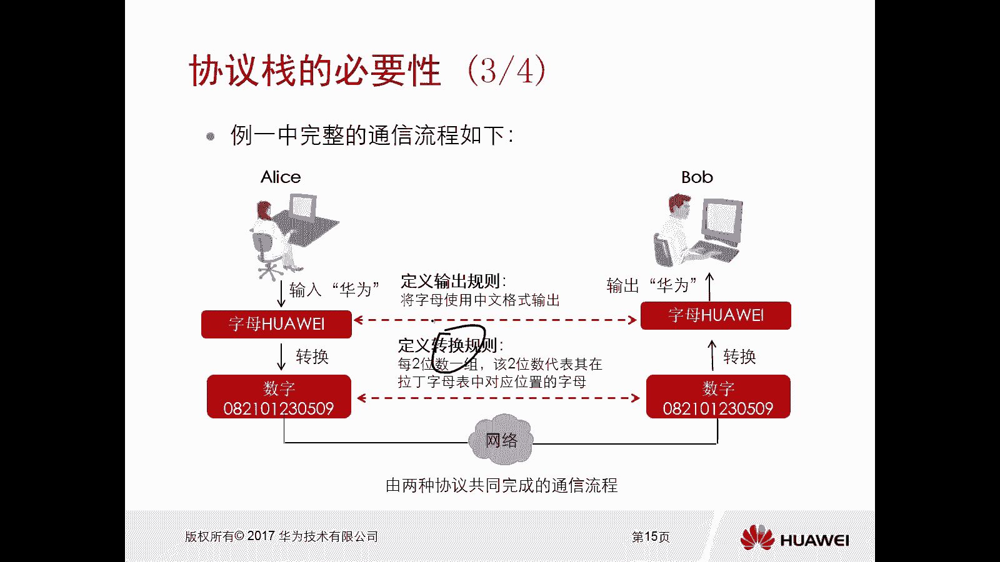
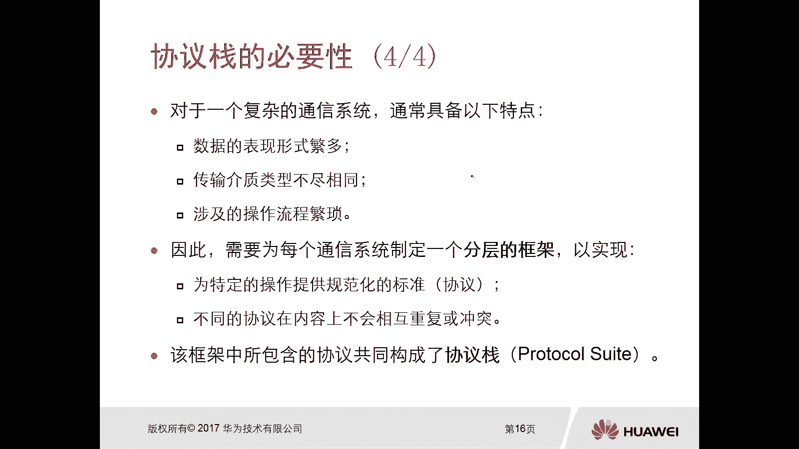

# 华为认证ICT学院HCIA/HCIP-Datacom教程：第1册-第3章-2：网络协议的作用和协议栈的必要性 📡

在本节课中，我们将要学习数据通信的两个核心要素：媒介与协议。我们将通过具体的例子，理解协议如何作为通信的“标准语言”来确保信息被正确传递，并探讨为什么在复杂的通信系统中，单一的协议是不够的，从而引出“协议栈”的概念。

## 媒介与协议的定义

上一节我们介绍了通信的通用规则，本节中我们来看看实现数据通信的两个具体要素。

**媒介**是信息传输的介质和载体。它的作用是通过物理介质实现不同通信系统之间的数据传输。

以下是常见的媒介类型：
*   **双绞线**：俗称网线。
*   **电话线**
*   **光纤**
*   **无线电磁波**

**协议**是约定俗成的规则或语言。它的作用是确保不同通信系统可以按照既定流程操作而定义的一套标准。

理解协议的关键在于理解“标准”。例如，两个使用不同语言的人无法直接交流，因为他们没有共同的语言规则（协议）。

## 协议的作用：一个通信示例

为了理解协议的作用，我们来看一个爱丽丝（Alice）与鲍勃（Bob）通信的例子。

### 场景一：无定义标准的通信
爱丽丝输入一组十进制数字（如：`08 21 23 05 18`），并通过网络媒介发送给鲍勃。由于没有定义任何转换规则（协议），鲍勃收到这串数字后，不知道如何解读，导致**输出失败**。

### 场景二：定义了输出标准的通信
爱丽丝输入相同的十进制数字。此次，通信双方**定义了转换规则（协议）**：每两位数为一组，该数字代表其在拉丁字母表中的位置（如08代表H，21代表U等）。

鲍勃收到数字后，按照此规则进行转换，得到字母“HUAWEI”。若进一步约定该输出为中文拼音，则可成功输出“华为”。因此，通信**输出成功**。

通过这个对比可知，协议为通信提供了可遵循的**规范化操作框架**，使得通信能产生既定效果（功能）。

## 单一协议的局限性

刚才的例子中，我们使用一个协议就使鲍勃成功输出了数据。但在真实的复杂通信系统中，单一协议往往是不够的。

考虑第二个例子：爱丽丝输入另一组更长的十进制数字，并**使用与例一相同的转换规则**。鲍勃转换后得到一串无意义的字母（如“XINXICHUANSHU”），因为双方并未定义这串字母的**输出规则**（例如，它是拼音、英文单词还是其他编码），导致再次**输出失败**。

对比两个例子可以发现，例一成功是因为**默认使用了中文格式**作为输出规则。但无论是例一还是例二，协议的制定都是不严谨的。

## 协议栈的必要性

实际上，例一中完整的通信流程包含多个步骤：
1.  将中文“华为”转换为拼音字母“HUAWEI”。（**协议A：内容表示规则**）
2.  将字母“HUAWEI”转换为对应的十进制数字。（**协议B：编码转换规则**）
3.  数字通过网络传输。
4.  鲍勃将数字按规则转换回字母“HUAWEI”。（**协议B**）
5.  鲍勃将字母“HUAWEI”按中文格式输出为“华为”。（**协议A**）

由此可见，一个完整的通信是由**多种协议协同工作**完成的。

复杂的通信系统通常具备以下特点：
*   **数据表现形式多样**：文本、图片、视频、语音等。
*   **传输介质类型不同**：网线、光纤、无线电波等。
*   **操作流程非常繁琐**。

因此，我们需要为通信系统制定一个**分层的框架**。每一层为特定的操作提供规范化的标准（即协议）。不同的协议在内容上互不重复和冲突，它们协同工作，共同构成了 **协议栈（Protocol Stack）**。

协议栈的本质是一系列协议的有序集合，它们像栈一样层层叠加，各司其职，共同保障复杂通信的顺利进行。

## 总结

本节课中我们一起学习了数据通信的基础。我们首先明确了**媒介**和**协议**这两个核心要素，并通过实例看到**协议作为标准**如何确保通信成功。进而，我们认识到对于复杂的通信，单一协议无法应对多样的数据和操作，从而引入了**协议栈**的概念——它通过分层和多种协议协作，为现代网络通信提供了坚实的基础框架。