# 华为认证ICT学院HCIA/HCIP-Datacom教程：P40：第3册-第2章-2-VRRP概述及工作原理

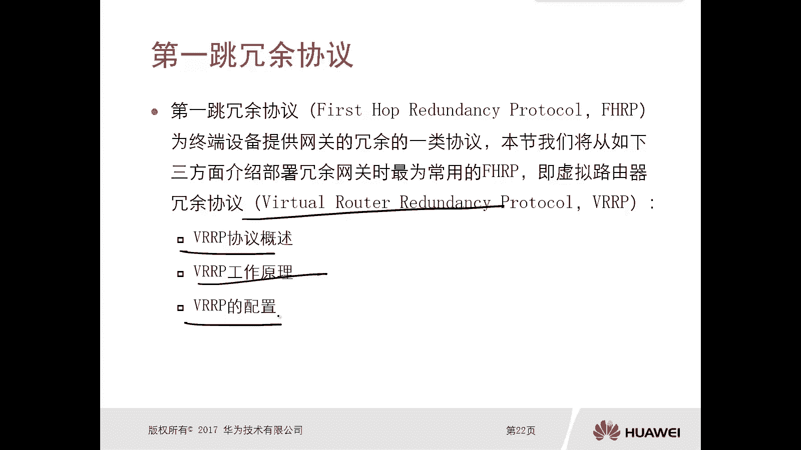

## 📚 概述
在本节课中，我们将要学习一种用于提升网络可靠性的技术——第一跳冗余协议（FHRP）。我们将重点介绍其中最常用的一种协议：虚拟路由器冗余协议（VRRP）。通过学习VRRP的概述、工作原理和基本概念，你将理解它如何为终端设备提供不间断的网关服务。

---

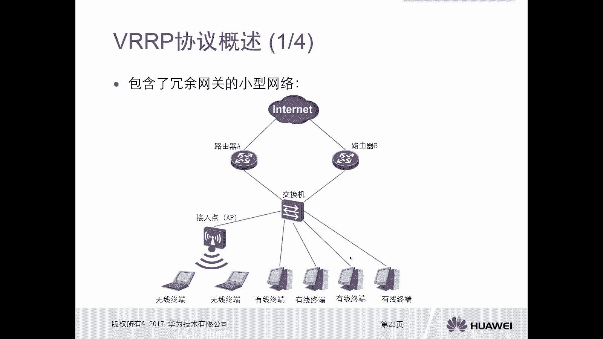

## 🔍 VRRP协议概述
上一节我们介绍了网络可靠性的重要性，本节中我们来看看VRRP协议是如何解决网关单点故障问题的。

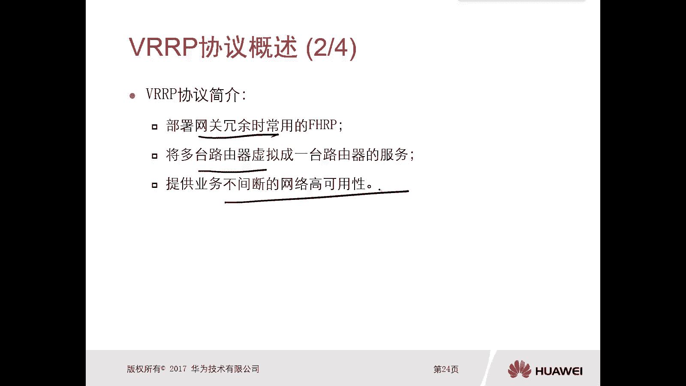

在小型网络中，为了确保终端能够不间断地访问外部网络，通常会部署两个出口网关路由器（例如路由器A和路由器B）。这样做的目的是避免单点故障。如果只有一台路由器，当该设备出现故障时，所有终端将无法访问外部网络。

然而，这种拓扑结构存在一个问题：终端在配置网关地址时，只能选择路由器A或路由器B中的一个。如果当前配置的网关出现故障，用户需要手动将网关地址修改为另一台设备，这非常不灵活且难以管理。

早期的解决方案是在终端上不配置网关，并在路由器上开启代理ARP功能。这样，无论数据包发送给哪台路由器，都可以被转发。但这种方案会导致终端产生大量的ARP表项，消耗终端资源。

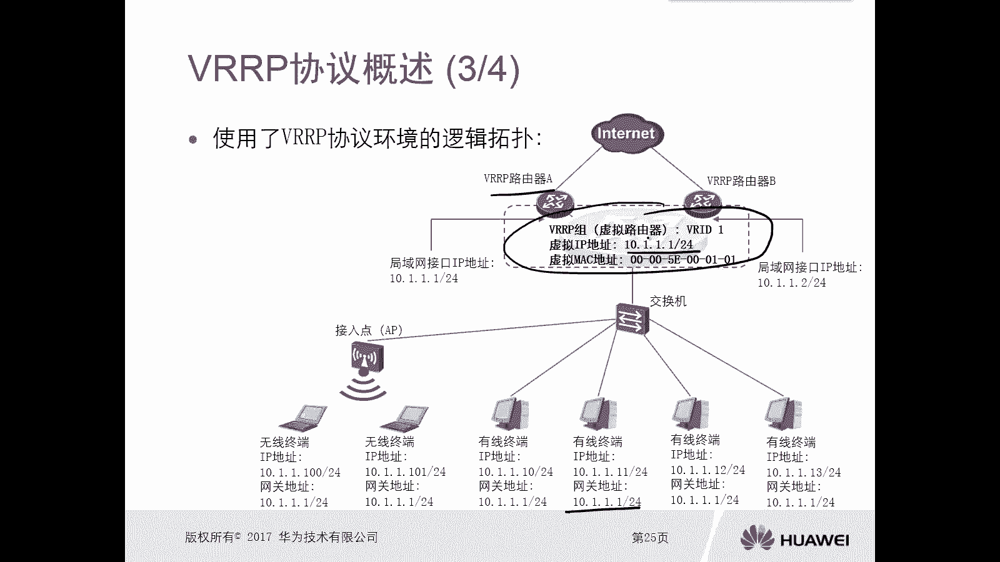

随着网络发展，专门用于网关冗余的协议应运而生，VRRP就是其中最常用的一种标准协议。VRRP将多台物理路由器虚拟成一台逻辑路由器，为终端提供一个统一的虚拟网关地址，从而实现业务不间断的高可靠性网络。

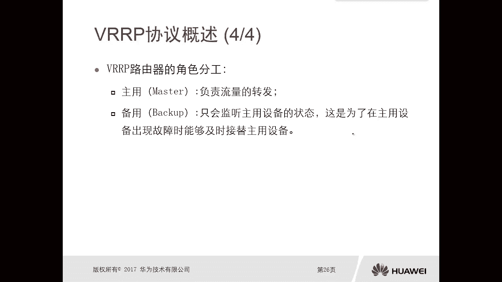

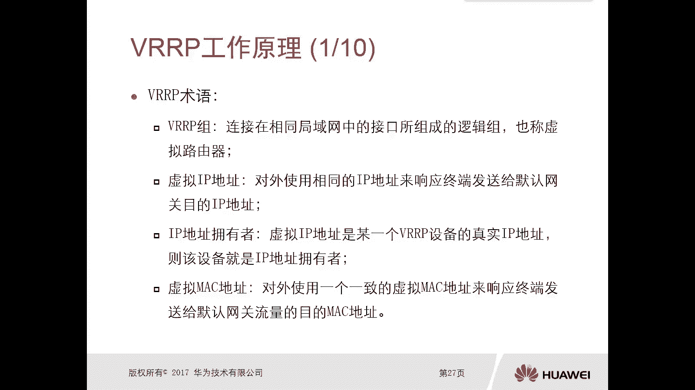

---

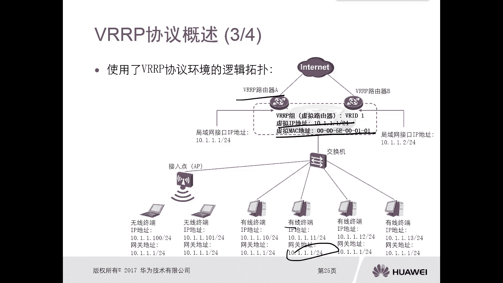

## 🧩 VRRP基本概念与工作原理
了解了VRRP的诞生背景，本节中我们来深入看看它的核心概念和工作机制。

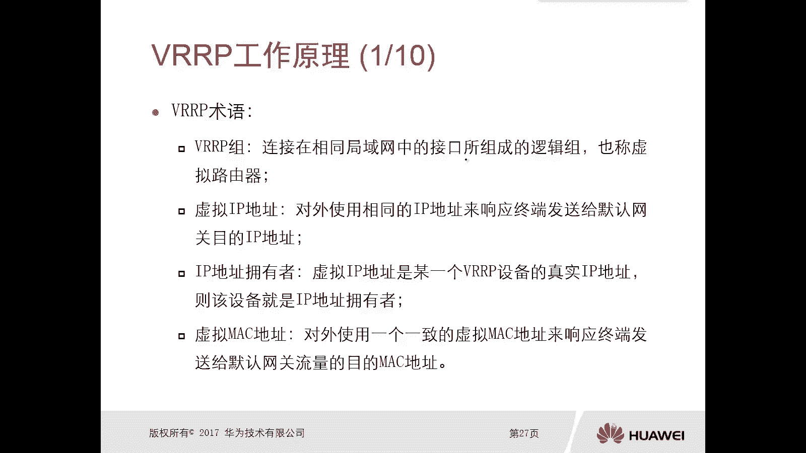

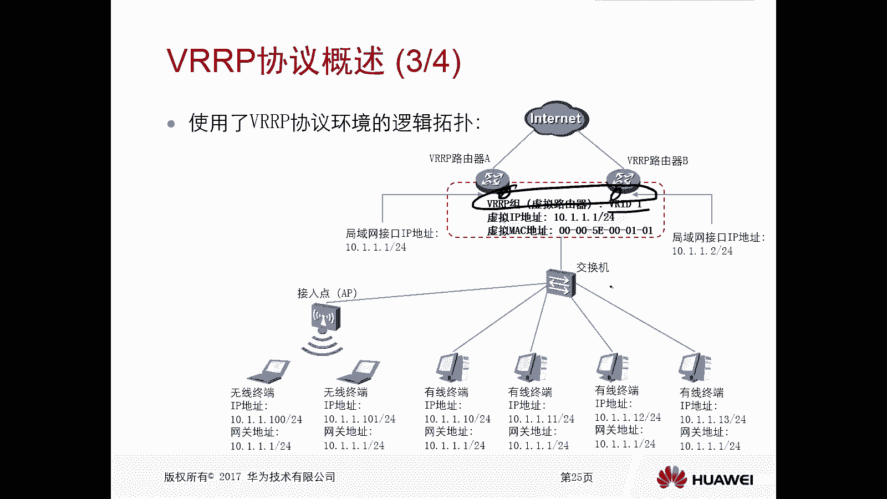

### 虚拟路由器与角色
在配置VRRP后，多台路由器（例如路由器A和B）会组成一个VRRP组，虚拟成一台“大路由器”。这台虚拟路由器拥有以下属性：
*   **虚拟路由器ID (VRID)**：用于标识不同的VRRP组。
*   **虚拟IP地址**：终端设备配置的网关地址。它可以与某台物理路由器的接口IP地址相同。
*   **虚拟MAC地址**：格式固定为 `0000-5e00-01{VRID}`（十六进制）。例如，VRID为1时，虚拟MAC是 `0000-5e00-0101`。

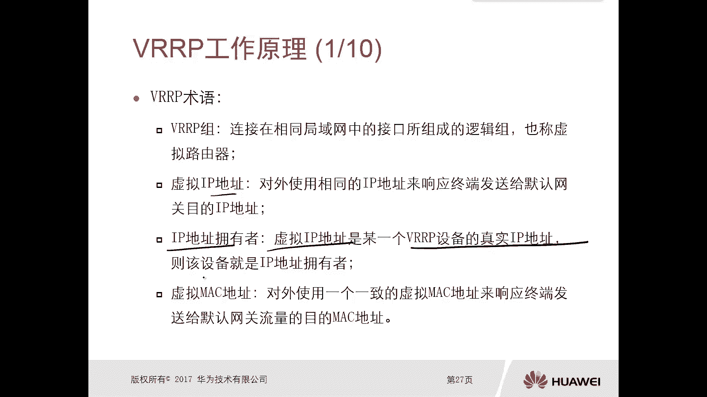

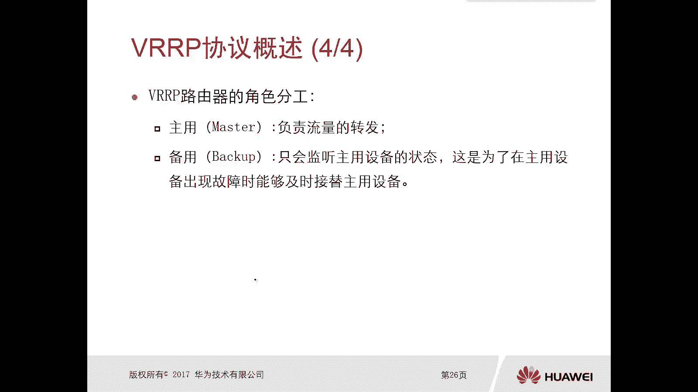

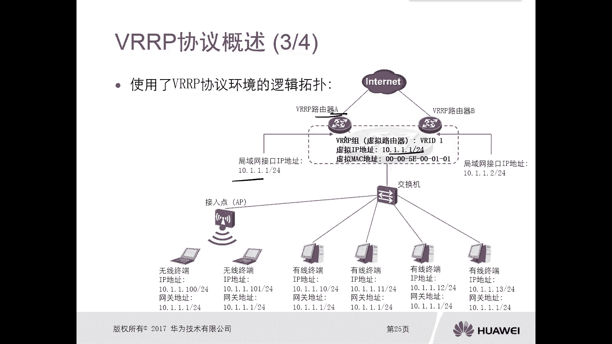

虚拟路由器内的物理设备有两种角色：
*   **主路由器 (Master)**：负责转发发送到虚拟IP地址的数据流量。
*   **备用路由器 (Backup)**：监听主路由器的状态，当主路由器故障时接替其工作。

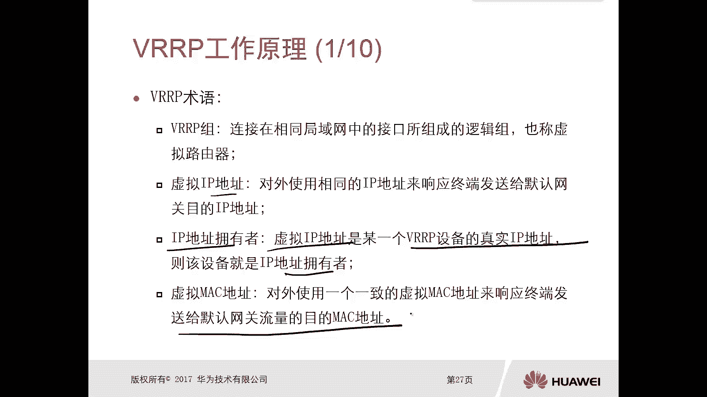

终端设备将网关设置为虚拟IP地址。当主路由器正常工作时，由它处理所有流量。如果主路由器故障，备用路由器会升级为主路由器，接替转发工作。由于虚拟IP和MAC地址没有变化，终端无需修改任何配置，实现了无缝切换。

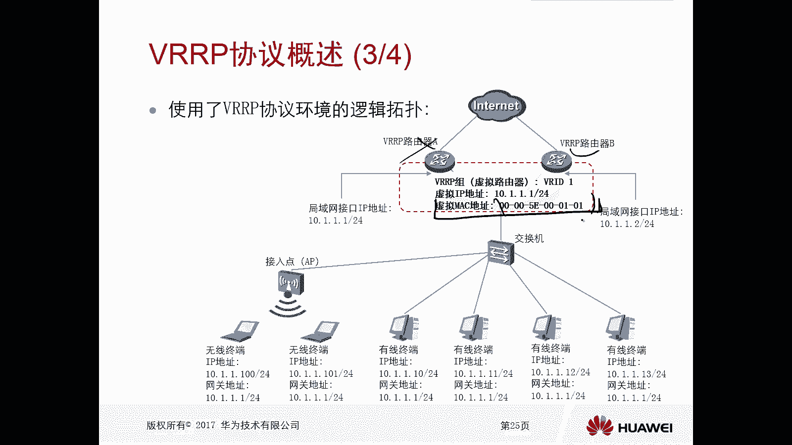

### 关键术语解析
以下是理解VRRP所需的核心术语：

*   **VRRP组**：连接在同一局域网、参与同一个VRRP虚拟化的路由器接口的逻辑集合。
*   **虚拟IP地址所有者**：如果虚拟IP地址与某台VRRP路由器的真实接口IP地址相同，则该路由器被称为此IP地址的“所有者”。所有者路由器在选举中拥有最高优先级（255）。
*   **优先级 (Priority)**：范围是0-255，默认值为100。优先级高的路由器更易成为Master。虚拟IP地址所有者的优先级自动为255。
*   **抢占模式 (Preemption)**：
    *   启用抢占时，优先级更高的路由器出现后，会立即抢占Master角色。
    *   禁用抢占时，即使有更高优先级的路由器加入，只要当前Master正常，就不会发生角色切换。
*   **通告间隔 (Advertisement Interval)**：Master路由器周期性发送VRRP通告报文的时间间隔，用于告知其他路由器自己处于正常工作状态。

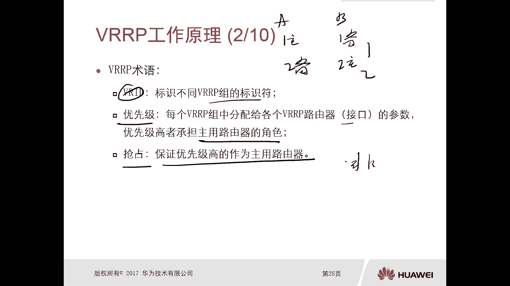

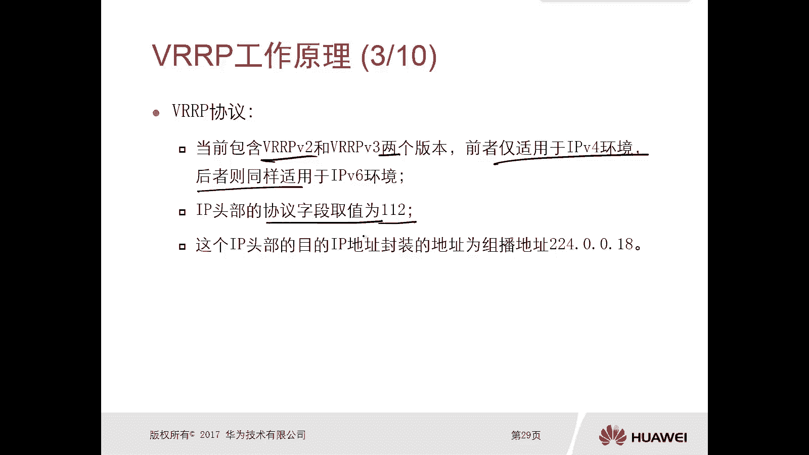

### 🖼️ 工作过程示例
让我们通过一个动态示例来理解VRRP的工作过程。

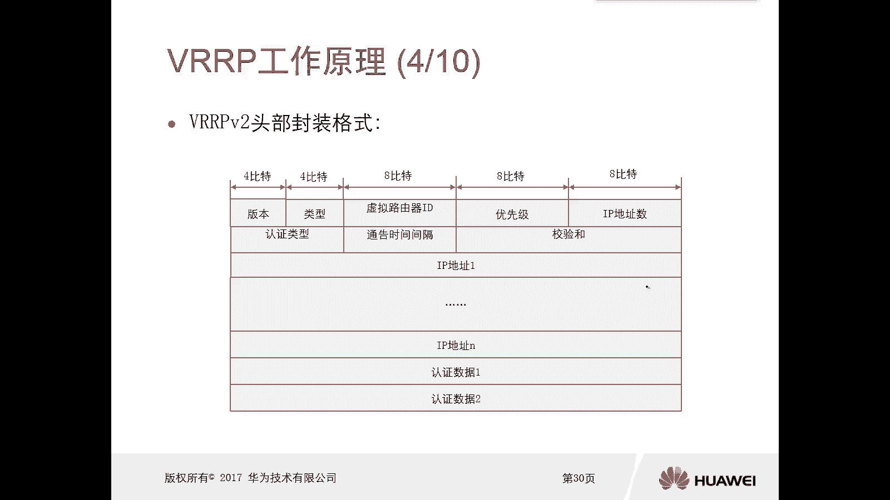

假设有三台路由器A、B、C，它们的接口IP地址分别是 `10.1.1.1/24`、`10.1.1.2/24`、`10.1.1.3/24`。我们配置一个VRRP组（VRID=1），虚拟IP地址为 `10.1.1.1`。

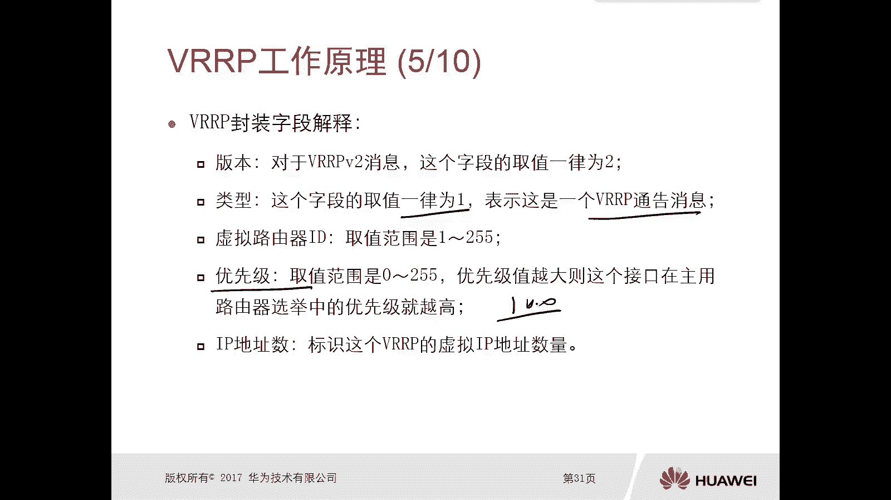

1.  **选举Master**：路由器A是虚拟IP地址 `10.1.1.1` 的所有者，因此其优先级为255，在选举中成为Master。路由器B和C成为Backup。
2.  **Master正常工作**：
    *   Master路由器（A）会周期性发送VRRP通告报文（目的IP：`224.0.0.18`），宣告自己存活。
    *   Master路由器（A）会发送**免费ARP**报文，在局域网内通告虚拟IP地址 `10.1.1.1` 对应的虚拟MAC地址 `0000-5e00-0101`。
    *   终端和交换机学习到该映射关系。此后，终端访问外网的数据包会被交换机转发给Master路由器A。
3.  **Master故障切换**：
    *   当Master路由器A故障时，将停止发送VRRP通告。
    *   Backup路由器（B和C）在等待一段时间（超时时间）后，收不到Master的通告，会触发新的选举。优先级较高的路由器B（假设优先级为105）成为新的Master。
    *   新的Master路由器B会做两件事：
        *   发送VRRP通告，宣告自己成为新的Master。
        *   发送免费ARP报文，刷新网络中（尤其是交换机）关于虚拟MAC地址的端口映射表。此后，数据流量将由新的Master路由器B转发。

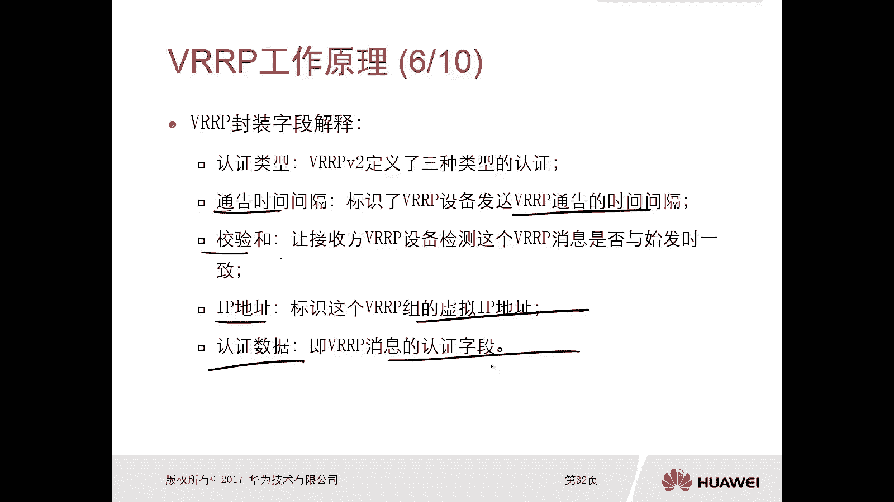

这个过程确保了网关服务的持续可用性，且对终端完全透明。

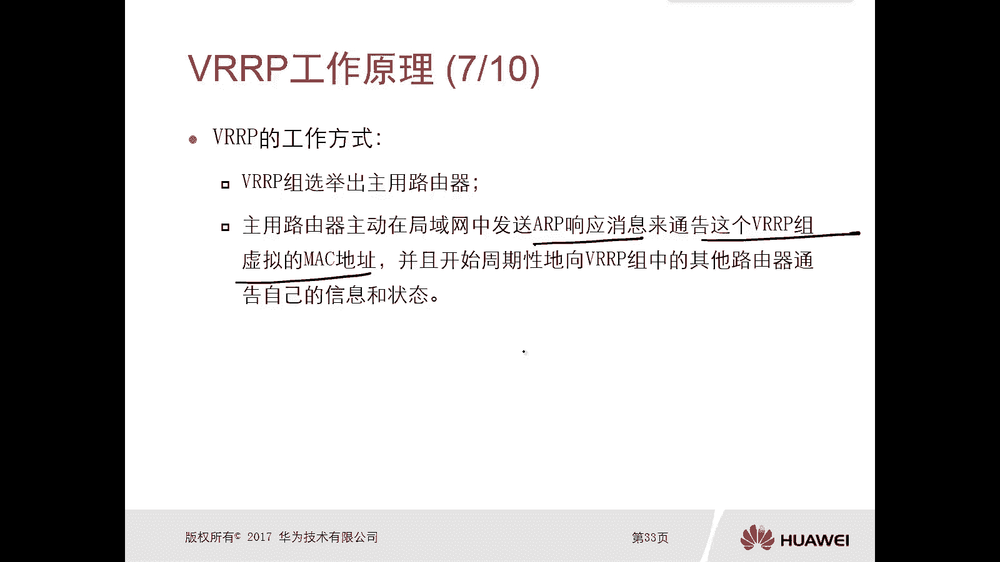

---

## 💻 VRRP报文格式简介（V2版本）
最后，我们简要了解一下VRRP的报文结构，这有助于深入理解其通信机制。

VRRP协议号是112。VRRP通告报文使用组播地址 `224.0.0.18` 进行发送。

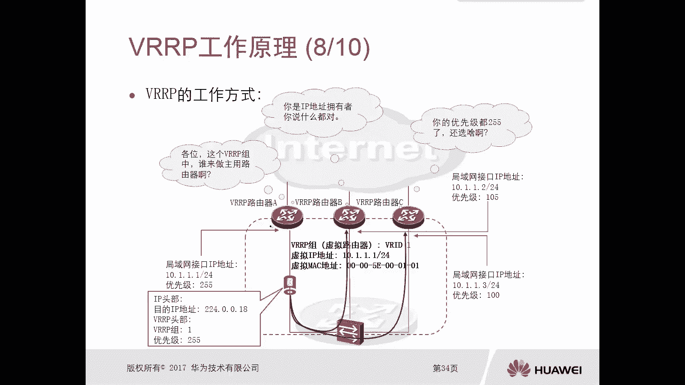

VRRPv2版本的报文头部格式包含以下关键字段：

| 字段 | 长度 | 描述 |
| :--- | :--- | :--- |
| 版本 | 4比特 | 对于VRRPv2，此值为 **2**。 |
| 类型 | 4比特 | 目前只有一种类型：**1**，表示VRRP通告报文。 |
| 虚拟路由器ID (VRID) | 8比特 | VRRP组的标识符，范围 **1-255**。 |
| 优先级 | 8比特 | 发送此报文路由器的优先级，范围 **0-255**。 |
| 认证类型 | 8比特 | 认证方式：0-无认证，1-简单明文认证，2-MD5认证。 |
| 通告间隔 | 8比特 | Master发送通告报文的时间间隔（单位：秒）。 |
| IP地址 | 可变 | VRRP组的虚拟IP地址。 |
| 认证数据 | 可变 | 根据认证类型填充的认证信息。 |

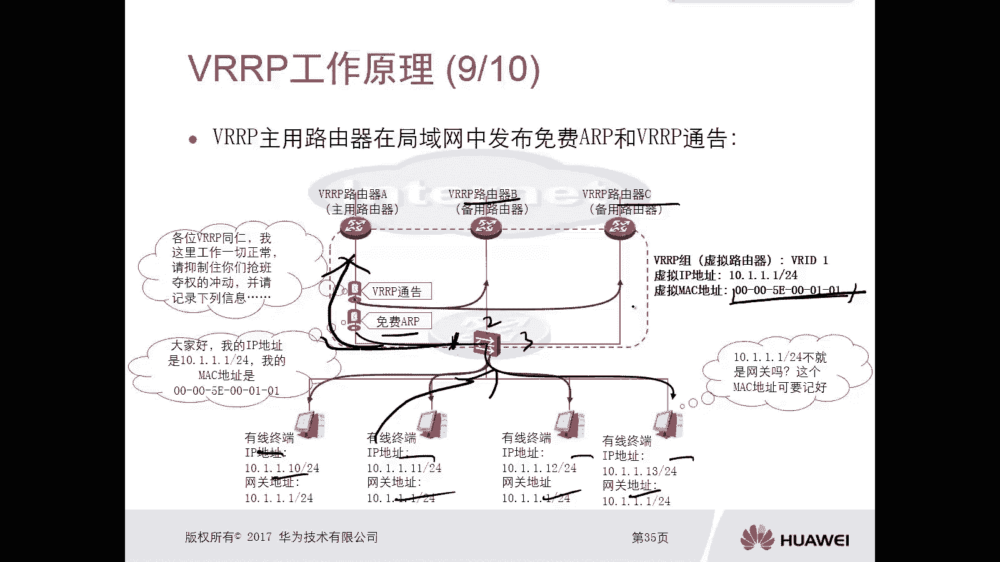

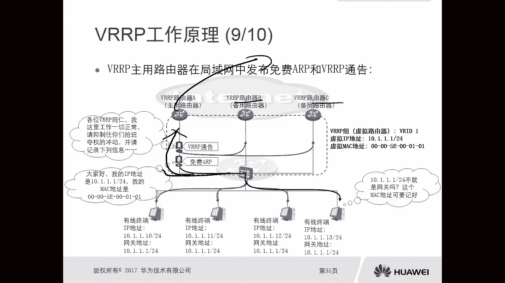

---

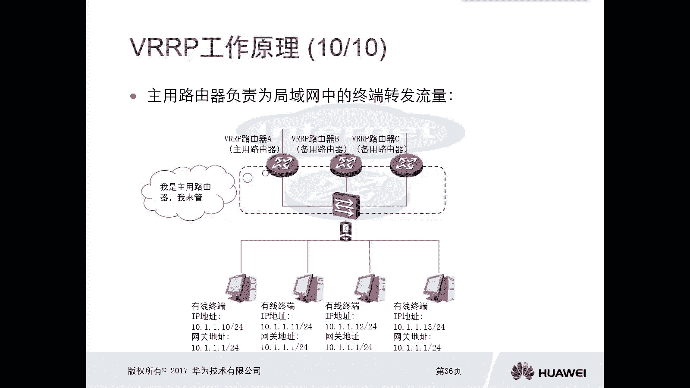

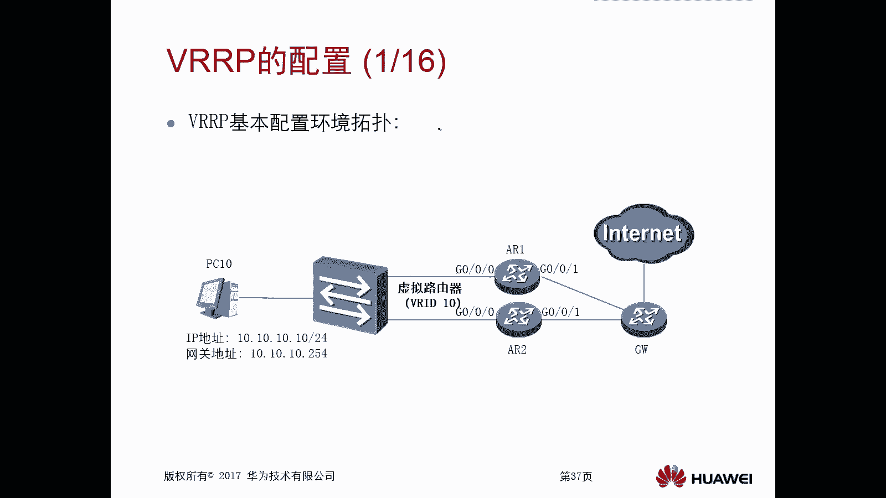

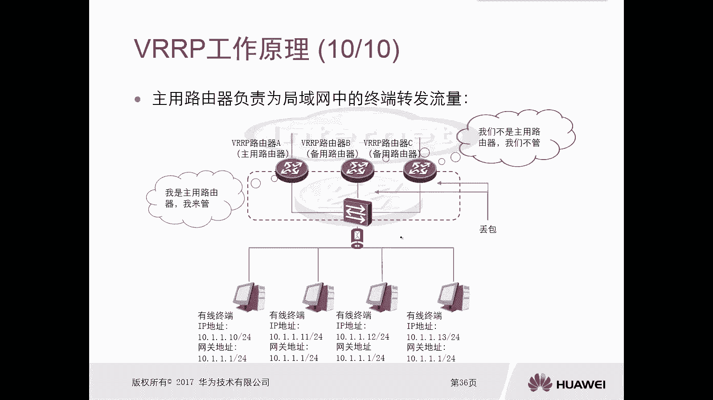

## ✅ 总结
本节课中我们一起学习了VRRP协议。我们从网关冗余的需求出发，了解了VRRP协议的诞生背景和核心目标：将多台路由器虚拟成一台，提供统一的、高可用的网关服务。

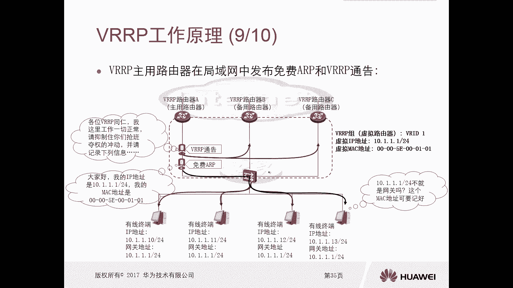

我们深入探讨了VRRP的基本概念，包括虚拟路由器、Master/Backup角色、优先级和抢占机制。通过一个动态的工作过程示例，我们清晰地看到了VRRP如何实现主备切换，从而保证网络业务不中断。最后，我们简要介绍了VRRPv2的报文格式。

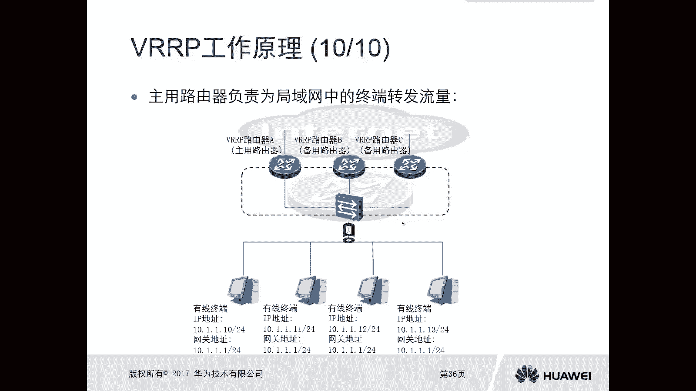

理解VRRP的工作原理是配置和排除相关网络故障的基础。在接下来的课程中，我们将学习如何在实际设备上配置VRRP。