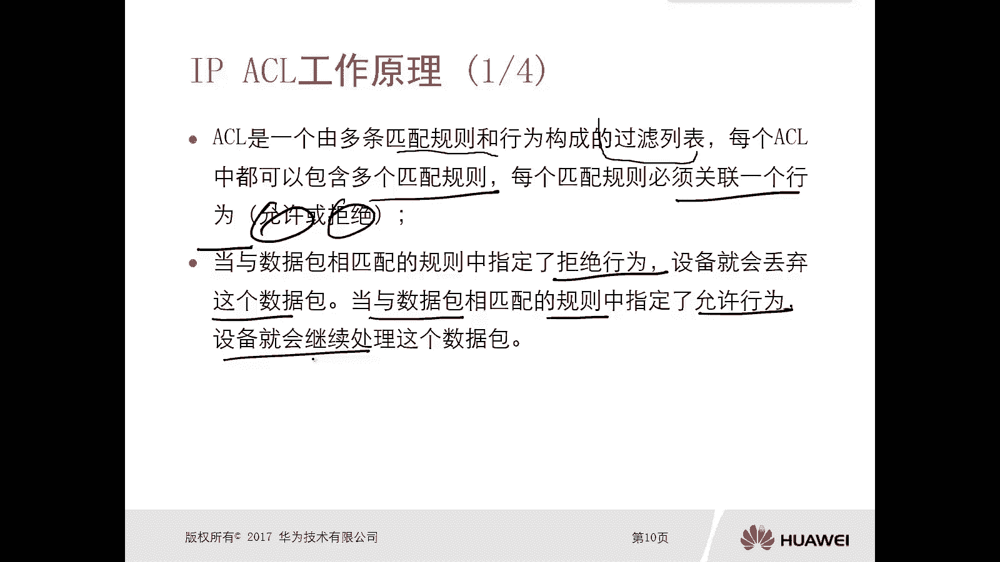
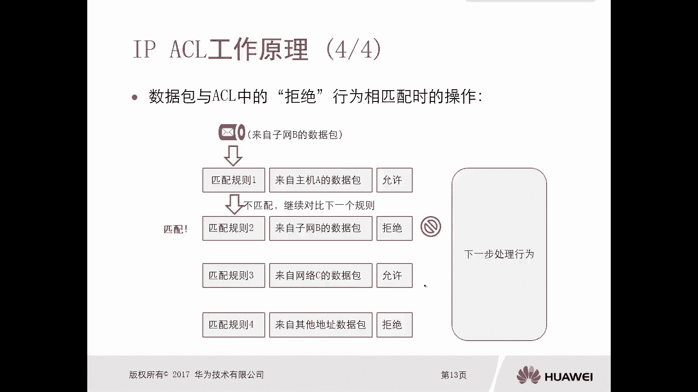
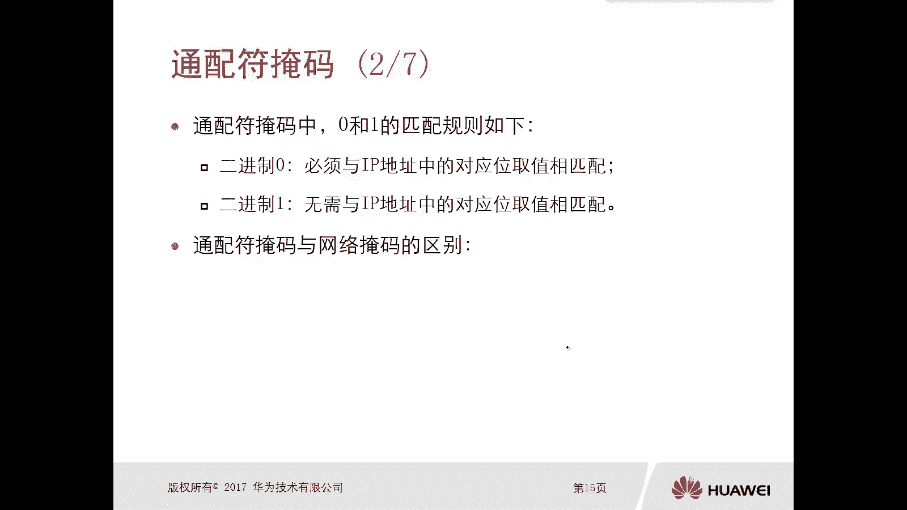
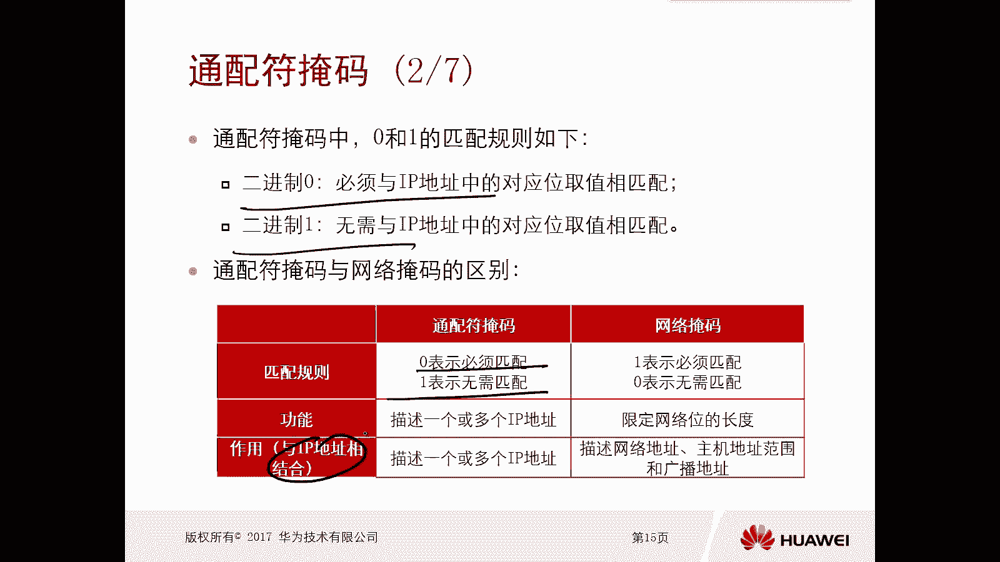
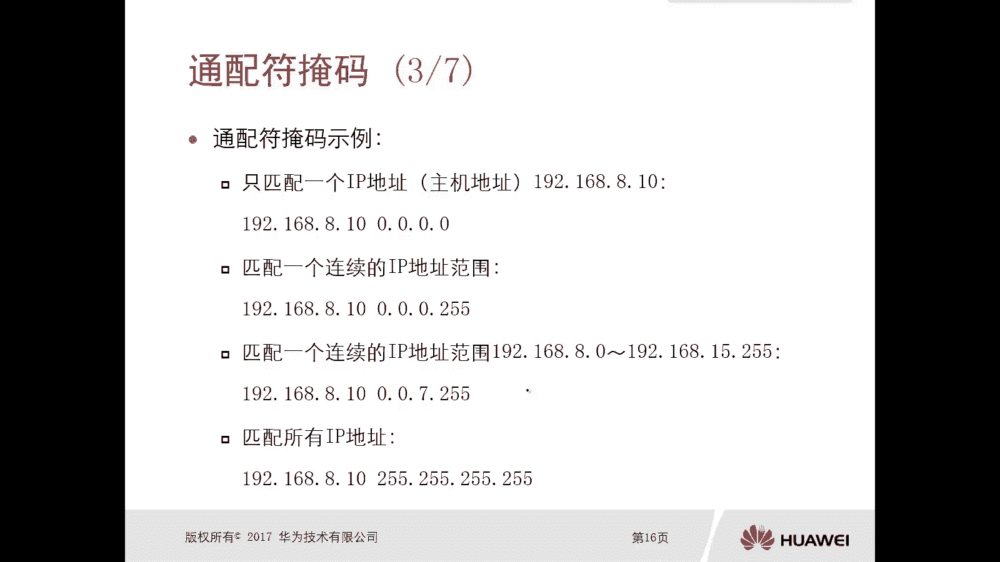
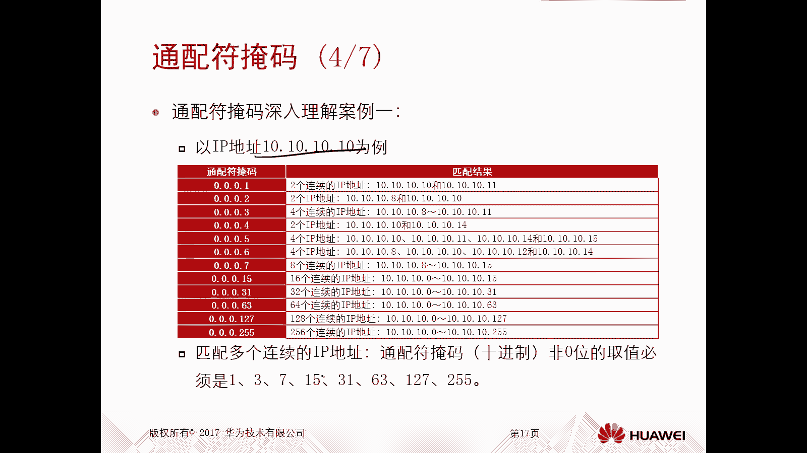
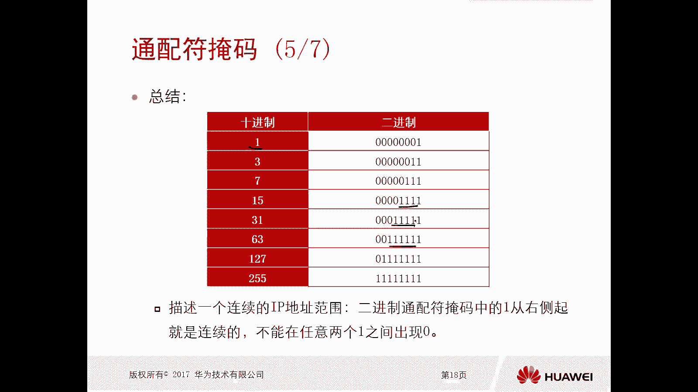
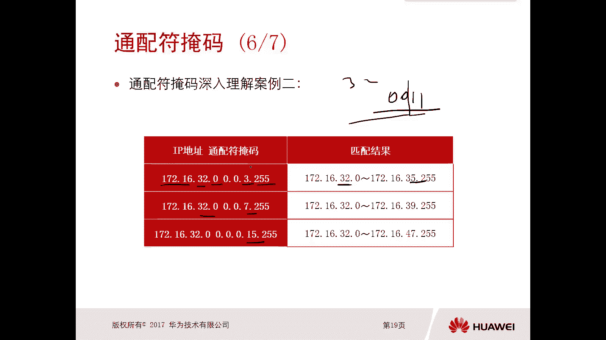
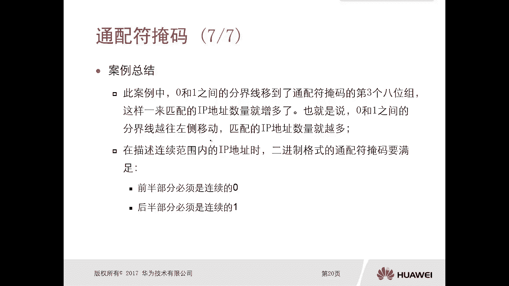

# 华为认证ICT学院HCIA/HCIP-Datacom教程：P42：第3册-第3章-1-ACL工作原理及通配符掩码 🔧

在本节课中，我们将要学习访问控制列表（ACL）的基本工作原理，以及一个关键概念——通配符掩码。理解这些是配置网络访问控制的基础。

## ACL工作原理 🧠

上一节我们介绍了ACL的基本概念，本节中我们来看看ACL具体是如何工作的。

ACL是由多条匹配规则和对应的行为构成的过滤列表。每个ACL可以包含多个规则，每个规则必须关联一个行为。ACL只有两种行为：**允许（permit）** 和 **拒绝（deny）**。

当数据包与ACL中的某条规则匹配时，设备将执行该规则指定的行为。如果行为是“拒绝”，设备将丢弃该数据包。如果行为是“允许”，设备则允许该数据包继续后续处理（如转发或路由）。

以下是ACL匹配流程的详细说明：

*   **规则匹配顺序**：ACL从上到下逐条检查规则。数据包会与规则一进行比对，如果不匹配，则继续比对规则二，依此类推。
*   **首次匹配原则**：一旦数据包匹配到某条规则，无论后续规则如何，匹配过程立即停止，并执行该匹配规则的行为。
*   **隐含拒绝**：通常，ACL末尾有一条看不见的规则，即“拒绝所有（deny any）”。如果数据包未能匹配任何显式配置的规则，它将被这条隐含规则拒绝。

为了更直观地理解，我们来看一个ACL工作示意图的例子。

假设一个ACL包含以下规则：
1.  规则一：来自主机A的数据包 → **允许**
2.  规则二：来自子网B的数据包 → **拒绝**
3.  规则三：来自网络C的数据包 → **允许**
4.  规则四：来自其他所有地址的数据包 → **拒绝**

当一个来自网络C的数据包到达时：
*   它与规则一（主机A）不匹配，继续。
*   它与规则二（子网B）不匹配，继续。
*   它与规则三（网络C）**匹配**。由于规则三的行为是“允许”，数据包被放行，匹配过程结束，不再检查规则四。

当一个来自子网B的数据包到达时：
*   它与规则一不匹配，继续。
*   它与规则二**匹配**。由于规则二的行为是“拒绝”，数据包被丢弃，匹配过程结束。

## 通配符掩码详解 🎯

理解了ACL如何工作后，我们需要知道如何精确地定义ACL要匹配的“范围”。这就是通配符掩码的作用。

通配符掩码用于在ACL规则中指定一个IP地址或一个IP地址范围。它有两种表现形式：点分十进制（如 `0.0.0.255`）和二进制。在配置ACL时，我们使用 **IP地址 + 通配符掩码** 的组合来定义匹配条件。

通配符掩码由32位二进制数组成，对应IP地址的32位。其核心规则如下：
*   二进制位为 **0**：表示“必须精确匹配”IP地址中对应的位。
*   二进制位为 **1**：表示“不关心”IP地址中对应的位，该位可以是0或1。

这与子网掩码恰好相反（子网掩码中1表示网络位，0表示主机位）。通配符掩码的作用是描述一个或多个IP地址，而非划分网络。

为了帮助理解，我们来看几个具体的例子。

以下是几种常见的通配符掩码应用场景：

*   **匹配单个IP地址**
    *   **需求**：只匹配主机 `192.168.8.10`。
    *   **配置**：`192.168.8.10 0.0.0.0`
    *   **解释**：通配符掩码全为0，意味着IP地址的每一位都必须精确匹配。通常可以简写为 `host 192.168.8.10`。

*   **匹配整个网段**
    *   **需求**：匹配 `192.168.8.0/24` 网段的所有主机（`192.168.8.1` 到 `192.168.8.254`）。
    *   **配置**：`192.168.8.0 0.0.0.255`
    *   **解释**：前三个八位组（`192.168.8`）必须精确匹配（对应掩码0），最后一个八位组可以是任意值（对应掩码255，二进制11111111）。

*   **匹配一个连续的地址范围**
    *   **需求**：匹配从 `192.168.8.0` 到 `192.168.15.255` 的范围。
    *   **分析**：IP地址 `192.168.8.0` 到 `192.168.15.255`，其第三个八位组从8（二进制00001000）到15（二进制00001111）。可以发现，前5位（00001）是固定的，后3位是变化的。
    *   **配置**：`192.168.8.0 0.0.7.255`
    *   **解释**：`7` 的二进制是 `00000111`。这意味着第三个八位组中，前5位（对应掩码0）必须匹配 `8`（00001），后3位（对应掩码1）任意。这样就能覆盖 `00001000`(8) 到 `00001111`(15) 的范围。

*   **匹配所有IP地址**
    *   **需求**：匹配任何IP地址。
    *   **配置**：`0.0.0.0 255.255.255.255`
    *   **解释**：通配符掩码全为1，表示不关心IP地址的任何位。通常可以简写为 `any`。

通过更多案例我们可以总结出规律：当需要匹配**连续的**IP地址范围时，二进制通配符掩码中，0和1的分界线必须是连续的，即格式为 `000...111`，不能是 `010...110`。因此，点分十进制中非零的数值通常是 `1, 3, 7, 15, 31, 63, 127, 255` 这类 `(2^n - 1)` 的数字。

让我们通过一个复杂点的例子来加深理解。

*   **案例**：ACL规则为 `172.16.32.0 0.0.3.255`，它匹配什么范围？
*   **分析**：
    *   `172.16` 必须精确匹配（掩码0.0）。
    *   第三个八位组掩码是 `3`（二进制00000011）。这意味着前6位必须匹配 `32`（二进制00100000），后2位任意。
    *   第四个八位组任意（掩码255）。
*   **计算**：第三个八位组从 `00100000`(32) 到 `00100011`(35)。
*   **结论**：该规则匹配 `172.16.32.0` 到 `172.16.35.255` 的IP地址范围。

我们可以得出一个重要结论：在通配符掩码中，0和1的分界线越向左移动（即0的位数越多），匹配的IP地址范围越精确、数量越少；分界线越向右移动（即1的位数越多），匹配的范围越宽泛、数量越多。

## 总结 📝

本节课中我们一起学习了ACL的核心机制。
1.  **ACL工作原理**：ACL通过从上到下的规则列表进行匹配，遵循“首次匹配”原则，执行“允许”或“拒绝”行为。
2.  **通配符掩码**：这是定义ACL匹配范围的关键工具。记住其核心：**0表示精确匹配，1表示任意**。通过将IP地址与通配符掩码结合，我们可以灵活地指定单个主机、整个网段或任意连续的IP地址范围。

掌握ACL工作原理和通配符掩码的计算，是进行精确流量控制和管理的基础。下一节我们将学习如何在实际设备上配置ACL。